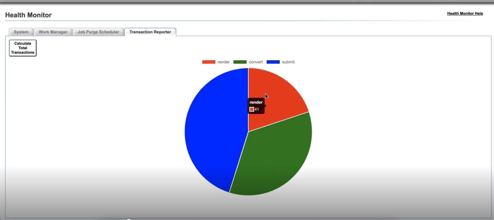

# Transaction reports overview for AEM forms on JEE{#transaction-reports-overview}

Transaction reports in AEM Forms on JEE let you keep a count of all transactions taken place on your AEM Forms deployment. The objective is to provide information about product usage and helps business stakeholders understand their digital processing volumes. Examples of a transaction include:

* Submission of a document
* Rendition of a document
* Conversion of a document from one file format to another 

For more information on what is considered a transaction, see [Billable APIs](../../forms/using/transaction-reports-billable-apis-jee.md). Transaction log helps you to gain information about the number of documents submitted, rendered, and converted.

Before you get the transaction reports, you enable transaction reporting, To enable transaction reporting:

1. Navigate to the `/adminui` on your Forms JEE Server, for example, `http://10.10.10.10:8080/adminui`.
1. Login with the default administrator and password.
1. Go to **Settings** > **Core System Settings** > **Configurations**.
1. Click checkbox to "Enable transaction reporting" and save the settings.

    

1. Restart the server.
1. Apart from the changes on server, on client side you would need to update the `adobe-livecycle-client.jar` in your project, if you are using the same.

>[!NOTE]
> By default the transaction recording is disabled.

<!--
* You can [enable transaction recording](../../forms/using/viewing-and-understanding-transaction-reports.md#setting-up-transaction-reports) from AEM Web Console. view transaction reports on author, processing, or publish instances. View transaction reports on author or processing instances for an aggregated sum of all transactions. View transaction reports on the publish instances for a count of all transactions that take place only on that publish instance from where the report is run.
-->

<!--Do not author content (Create adaptive forms, interactive communication, themes, and other authoring activities) and process documents (Use workflows, document services, and other processing activities) on the same AEM instance. Keep the transaction recording disabled for AEM Forms servers used to author content. Keep the transaction recording enabled for AEM Forms servers used to process documents.-->

## Transaction Report {#transaction-report}

When you enable transaction reporting, the information about the transaction counts becomes accessible through the transaction dashboard and a detailed transaction log are accessible via a log file relative to the server start context path. Both are explained below:

### Transaction report via dashboard {#transaction-report-dashboard}

It provides total number of transactions count for each type of transaction. For example, you get the information about total number of forms rendered, converted and submitted as shown in the image. To get the transaction report:

1. Navigate to the /adminui on your Forms JEE Server, for example: `http://10.10.10.10:8080/adminui`.
1. Login with the default administrator and password.
1. Click Health Monitor.
1. Navigate to **Transaction Reporter** tab, click **Calculate Total Transactions**.
1. You see that a pie chart shows the number of document - submitted, rendered, or converted, as shown in the image.



### Transaction report via log file {#transaction-report-logfile} 

It provides a detailed information about each transaction. To access transaction logs, follow the context path relative to server startup. Transactions are captured in a separate log file `transaction_log.log` by default. The **file path** is relative to the server start context. The default sample path for different servers are given below:

```
For Jboss Turnkey:
"<AEM_Forms_Installation>/jboss/bin/transaction_log.log"

For IBM Websphere: 
"<IBM_WAS_Profile_path>/transaction_log.log"

For Oracle Weblogic:
"<Weblogic_Domain_path>/transaction_log.log"

For Jboss Cluster:
"<Jboss home>/transaction_log.log"

```

Example of a sample transaction log:
`[2024-02-28 06:11:27] [INFO] TransactionRecord{service=‘GeneratePDFService’, operation=‘HtmlFileToPDF’, internalService=‘GeneratePDFService’, internalOperation=‘HtmlFileToPDF’, transactionOperationType=‘CONVERT’, transactionCount=1, elapsedTime=1906, transactionDate=Wed Feb 28 06:11:25 UTC 2024}`

### Transaction Record {#transaction-record-structure-jee}

The transaction log structure defines how each transaction is recorded through it various parameters such as service, operation, transaction type, and others, each are given in detail below, The transaction log is structured as follows:

```
TransactionRecord
{
    service='...', 
    operation='...', 
    internalService='...', 
    internalOperation='...', 
    transactionOperationType='...', 
    transactionCount=..., 
    elapsedTime=..., 
    transactionDate=...
}
```

* **service**: Name of the service.
* **operation**: Operation name.
* **internalService**: Name of the callee in case of an internal call, otherwise same as the service name.
* **internalOperation**: Name of the callee in case of an internal call, otherwise same as the operation name.
* **transactionOperationType**: Type of transaction (SUBMIT, RENDER, CONVERT).
* **transactionCount**: Total count of transaction.
* **elapsedTime**: Time between the call initiation and response received.
* **transactionDate**: Timestamp indicating when the service was invoked.

**Sample transaction log**:

```
[2024-02-14 14:23:25] [INFO] TransactionRecord
{
    service='BarcodedFormsService', 
    operation='decode', 
    internalService='BarcodedFormsService', 
    internalOperation='decode', 
    transactionOperationType='CONVERT', 
    transactionCount=1, 
    elapsedTime=47405, 
    transactionDate=Wed Feb 14 14:22:37 UTC 2024
}
```

## Transaction recording frequency {#transaction-recording-frequency}

Transaction persistence involves updating the total transaction count for SUBMIT, CONVERT, and RENDER operations on the server periodically:

* The transaction count is updated on the dashboard periodically, default is set to 1 minute. You can update the frequency by setting the system property at `"com.adobe.idp.dsc.transaction.recordFrequency"`

* In transaction logs, the update occurs instantly.

<!-- A transaction remains in the buffer for a specified period (Flush Buffer time + Reverse replication time). By default, it takes approximately 90 seconds for the transaction count to reflect in the transaction report.

Actions like submitting a PDF Form, using Agent UI to preview an interactive communication, or using non-standard form submission methods are not accounted as transactions. AEM Forms provides an API to record such transactions. Call the API from your custom implementations to record a transaction.

## Supported Topology {#supported-topology}

Transaction reports are available only on AEM Forms on OSGi environment. It supports author-publish, author-processing-publish, and only processing topologies. For example, topologies, see [Architecture and deployment topologies for AEM Forms](../../forms/using/transaction-reports-overview.md).

The transaction count is reverse replicated from publish instances to author or processing instances. An indicative author-publish topology is displayed below:


>[!NOTE]
>
>AEM Forms transaction reports does not support topologies that contain only publish instances.

### Guidelines for using transaction reports {#guidelines-for-using-transaction-reports}

* Disable transaction reports on all author instances as reports on author instances includes transactions registered during authoring activities.
* Enable the **Show transactions from publish only** option on the author instance to view cumulative transactions from all publish instances. You can also view transaction reports on each publish instance for actual transactions on that particular publish instance only.
* Do not use author instances to run workflows and process documents.
* Before using transaction reporting, if you are have a toplogy with publish servers, ensure that the reverse replication is enabled for all the publish instances.
* Transaction data is reverse-replicated from a publish instance to only corresponding author or processing instance. The author or processing instance cannot further replicate data to another instance. For example, if you have author-processing-publish topology, aggregated transaction data is replicated only to the processing instance.-->

## Related Articles {#related-articles}

* [Billable APIs on AEM Forms JEE](../../forms/using/transaction-reports-billable-apis-jee.md)
* [Record a transaction for custom implementations on AEM Forms JEE](/help/forms/using/record-transaction-custom-component-jee.md)
