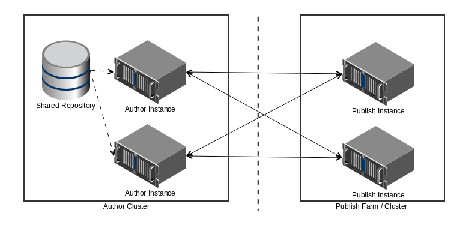

# Transaction Reports for AEM Forms on OSGi {#transaction-reports-overview}

<!--## Introduction {#introduction}

Transaction reports in AEM Forms let you keep a count of all transactions taken place since a specified date on your AEM Forms deployment. The objective is to provide information about product usage and help business stakeholders understand their digital processing volumes. Examples of a transaction include:

* Submission of an adaptive form, an HTML5 Form, or a form set
* Rendition of a print or a web version of an interactive communication
* Conversion of a document from one file format to another

For more information on what is considered a transaction, see [Billable APIs](../../forms/using/transaction-reports-billable-apis.md).-->

Transaction recording is disabled by default. You can [enable transaction recording](../../forms/using/viewing-and-understanding-transaction-reports.md#setting-up-transaction-reports) from AEM Web Console. You can view transaction reports on author, processing, or publish instances. View transaction reports on author or processing instances for an aggregated sum of all transactions. View transaction reports on the publish instances for a count of all transactions that take place only on that publish instance from where the report is run.

Do not author content (Create adaptive forms, interactive communication, themes, and other authoring activities) and process documents (Use workflows, document services, and other processing activities) on the same AEM instance. Keep the transaction recording disabled for AEM Forms servers used to author content. Keep the transaction recording enabled for AEM Forms servers used to process documents.

A transaction remains in the buffer for a specified period (Flush Buffer time + Reverse replication time). By default, it takes approximately 90 seconds for the transaction count to reflect in the transaction report.

Actions like submitting a PDF Form, using Agent UI to preview an interactive communication, or using non-standard form submission methods are not accounted as transactions. AEM Forms provides an API to record such transactions. Call the API from your custom implementations to record a transaction.

## Supported Topology {#supported-topology}

Transaction reports are available only on AEM Forms on OSGi environment. It supports author-publish, author-processing-publish, and only processing topologies. For example, topologies, see [Architecture and deployment topologies for AEM Forms](../../forms/using/transaction-reports-overview.md).

The transaction count is reverse replicated from publish instances to author or processing instances. An indicative author-publish topology is displayed below:

>[!NOTE]
>
>AEM Forms transaction reports does not support topologies that contain only publish instances.

### Guidelines for using transaction reports {#guidelines-for-using-transaction-reports}

* Disable transaction reports on all author instances as reports on author instances includes transactions registered during authoring activities.
* Enable the **Show transactions from publish only** option on the author instance to view cumulative transactions from all publish instances. You can also view transaction reports on each publish instance for actual transactions on that particular publish instance only.
* Do not use author instances to run workflows and process documents.
* Before using transaction reporting, if you are have a toplogy with publish servers, ensure that the reverse replication is enabled for all the publish instances.
* Transaction data is reverse-replicated from a publish instance to only corresponding author or processing instance. The author or processing instance cannot further replicate data to another instance. For example, if you have author-processing-publish topology, aggregated transaction data is replicated only to the processing instance.

## Related Articles {#related-articles}

* [Viewing and Understanding a Transaction Report for AEM Forms on OSGi](../../forms/using/viewing-and-understanding-transaction-reports.md)
* [Transaction Reports Billable APIs for AEM Forms on OSGi](../../forms/using/transaction-reports-billable-apis.md)
* [Record a transaction for custom implementations for AEM Forms on OSGi](/help/forms/using/record-transaction-custom-implementation.md)
