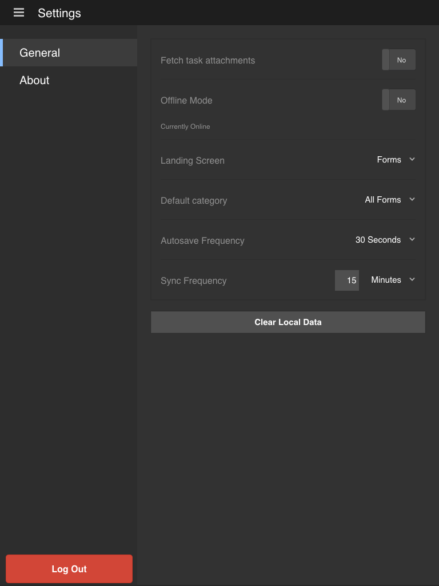

# Updating general settings{#updating-general-settings}

General settings of the AEM Forms app let you specify settings such as fetching attachments, offline mode, landing screen, default category, and autsave frequency.

## Updating the General settings in your app {#working-with-the-form}

When you synchronize your app with the AEM Forms server, all the forms and defined tasks are downloaded to your mobile device.

The out-of-the-box AEM Forms app solution does not download the attachments associated with each form when your app is synchronized.

In the General tab, change the download attachments, offline mode, landing screen, autosave, and synchronization settings. You can change the [Home screen](../../forms/using/home-screen.md) of your app.

**Navigate to the General tab on the Settings screen**

1. To go to the Setting screen, select the Menu button at the upper-left corner of the Home screen, and then Select **Settings**.
1. In the Settings screen, select the General tab.

   

   General Settings screen

   >[!NOTE]
   >
   >The options may display differently on different mobile devices.

### General settings {#general-settings}

You can make the following changes to the settings of your app.

* **Fetch task attachments**: To specify whether or not to download the associated attachments when each task is downloaded to your app.
* **Offline mode**: To enable or disable the offline service for AEM Forms app. See [Working in the offline mode](/help/forms/using/work-offline-mode.md) for details.
* **Landing screen**: To set the start location ([Home screen](../../forms/using/home-screen.md)) for the app.
  Available options:

  * Forms
  * Tasks
  * Favorites

* **Default category**: Lets you select the category of forms to show in the home screen. When you select All, you can see the all the forms in the home screen. Categories are populated based on the forms loaded in the app. Forms are available in the app based on the form settings specified in the AEM Forms server.

* **Autosave Frequency**: To set the frequency at which your [mobile app saves form data](../../forms/using/autosave-data-app.md) locally.
* **Synchronization Frequency**: To set the frequency at which your [mobile app is synchronized](../../forms/using/sync-app.md) with the AEM Forms server in the online mode.
**Clear Local Data**: Clear the database, including settings and local data for all users and file storage from the device.

>[!NOTE]
>
>Clearing the cache will immediately log you out of the app.
>
>However, you will be prompted to confirm the clear cache operation.
