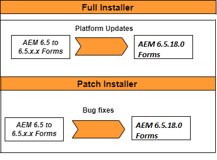

# Upgrade to AEM 6.5 Forms on JEE {#upgrade-to-aem-forms-jee}

AEM 6.5.12.0 Forms on JEE provides provides two types of installers: Full installer and Patch installer.

**Full installer**: You can use the [AEM 6.5.12.0 on JEE full installer](https://experienceleague.adobe.com/docs/experience-manager-release-information/aem-release-updates/forms-updates/aem-forms-releases.html) to set up fresh AEM Forms instances or perform upgrades from AEM 6.3 Forms on JEE, AEM 6.4 on JEE, and out-of-the-place upgrade from AEM 6.5.x.x Forms on JEE to AEM 6.5.12.0 Forms on JEE.

**Patch installer**: [AEM 6.5.12.0 on JEE patch installer](https://experienceleague.adobe.com/docs/experience-manager-release-information/aem-release-updates/forms-updates/aem-forms-releases.html) is for customers already using AEM 6.5.x.x versions. You can use the patch installer to upgrade to the latest version of AEM Forms.

The following table depicts senarios for using full and patch installer.

Perform the following procedure to use the full installer to upgrade existing AEM 6.3 Forms on JEE or AEM 6.4 Forms on JEE to AEM 6.5.12.0 Forms on JEE:

1. Download the AEM 6.5 Forms on JEE installer from the [Software Distribution](https://experience.adobe.com/#/downloads/content/software-distribution/en/aem.html). You require a valid Maintenance & Support contract to use the installer.
1. See [Upgrade checklist and planning](https://www.adobe.com/go/learn_aemforms_upgrade_checklist_65) to learn about the checks to perform to ensure a successful upgrade.
1. See [Prepare to upgrade to AEM Forms](https://www.adobe.com/go/learn_aemforms_prepareupgrade_65) to learn and perform the tasks that ensure the upgrade runs correctly with minimal server downtime.
1. Depending on your existing environment and application server, choose one of the following documents and follow the instructions.

    * [Upgrade from AEM 6.3 or AEM 6.4 Forms to AEM 6.5 Forms for JBoss](https://www.adobe.com/go/learn_aemforms_upgradeJBoss_65)
    * [Upgrade from AEM 6.3 or AEM 6.4 Forms to AEM 6.5 Forms for WebSphere](https://www.adobe.com/go/learn_aemforms_upgradeWebSphere_65)
    * [Upgrade from AEM 6.3 or AEM 6.4 Forms to AEM 6.5 Forms for JBoss Turnkey](https://www.adobe.com/go/learn_aemforms_upgradeTurnkey_65)

Direct upgrade from LiveCycle ES2, LiveCycle ES3, AEM 6.0 Forms, AEM 6.1 Forms, AEM 6.2 Forms to AEM 6.5 Forms is not available. You can perform an intermediate upgrade to one or more versions of LiveCycle or AEM Forms and then upgrade to AEM 6.5 Forms. For the list of intermediate versions and corresponding upgrade instructions, see [Choose an upgrade path](upgrade.md).
