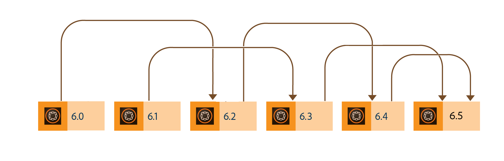
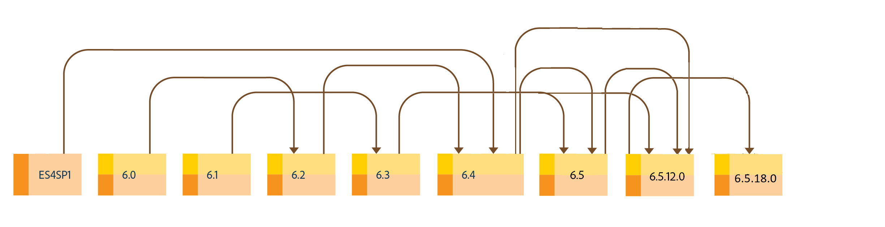

# Upgrade to AEM 6.5 Forms{#upgrade-to-aem-forms}

AEM 6.5 Forms includes several new features and enhancements that streamline the creation, management, and user experiences with forms and correspondences. To learn about all the new capabilities and enhancements of AEM 6.5 Forms, see [New features summary document](../../forms/using/whats-new.md).

You can upgrade your existing LiveCycle or AEM Forms installation to obtain new capabilities and enhancements offered in AEM 6.5 Forms while retaining existing data, processes, and assets intact. On upgrade, metadata and state of the processes are also preserved. You can choose an upgrade path to get started with upgrade.

The following diagram displays the available upgrade paths for AEM Forms on OSGi:

You can perform a direct upgrade from:

* AEM 6.3 Forms on OSGi
* AEM 6.4 Forms on OSGi

You can also perform a multi-hop upgrade from

* AEM 6.0 Forms on OSGi
* AEM 6.1 Forms on OSGi
* AEM 6.2 Forms on OSGi

The following diagram displays the available upgrade paths for AEM Forms on JEE:

You can perform a direct upgrade from:

* AEM 6.3 Forms on JEE
* AEM 6.4 Forms on JEE
* AEM 6.5.x.x Forms on JEE

You can also perform a multi-hop upgrade from

* LiveCycle ES2
* LiveCycle ES3
* LiveCycle ES4 SP1
* AEM 6.0 Forms on JEE
* AEM 6.1 Forms on JEE
* AEM 6.2 Forms on JEE

AEM 6.5.12.0 Forms on JEE provides provides two types of installers: [Full installer](https://experienceleague.adobe.com/docs/experience-manager-release-information/aem-release-updates/forms-updates/aem-forms-releases.html) and [Patch installer](https://experienceleague.adobe.com/docs/experience-manager-release-information/aem-release-updates/forms-updates/aem-forms-releases.html).

**Full installer**: You can use the full installer to set up fresh AEM Forms instances or perform upgrades from AEM 6.3 Forms on JEE, AEM 6.4 on JEE, and out-of-the-place upgrade from AEM 6.5.x.x Forms on JEE to AEM 6.5.12.0 Forms on JEE.

**Patch installer**: Patch installer is for customers already using AEM 6.5.x.x versions. You can use the patch installer to upgrade to the latest version of AEM Forms.

The following image depicts senarios for using full and patch installer.

<!--
[Work in Progress]

Migration involves moving only assets (PDF, XDP, images, adaptive forms, correspondence management assets) from one server to another - processes (LCA), settings, configurations, and a few other pieces of metadata are not migrated. Perform the following steps to migrate to AEM 6.3 Forms:

1. Set up a fresh environment of [AEM 6.3 Forms](https://adobe.com/go/learn_aemforms_documentation_63).
1. Move XDP or other compatible assets to the freshly set instance. For detailed instructions, see [Importing and exporting assets to AEM Forms](../../forms/using/import-export-forms-templates.md). 
1. Build the required services, if any.

   For example, if you are using AEM Forms on JEE Document Services, changes are required in the code to use document services available in AEM Forms on OSGi.

1. Perform post-installation activities:

    * **Run Migration Utility**

      The migration utility makes the adaptive forms and correspondence management assets of earlier versions compatible with AEM 6.3 forms. You can download the utility from AEM Software Distribution. For step-by-step information to configure and use the migration utility, see [migration utility](../../forms/using/migration-utility.md) documentation.

    * **Reconfigure Adobe Sign**

      If you had Adobe Sign configured in the previous version of AEM Forms, then reconfigure Adobe Sign from AEM Cloud services. For more details, see [Integrate Adobe Sign with AEM Forms](../../forms/using/adobe-sign-integration-adaptive-forms.md).

      Moreover, AEM 6.3 Forms release has introduced many new Adobe Sign features. For step-by-step information to use Adobe Sign, see [Using Adobe Sign in an adaptive form](../../forms/using/working-with-adobe-sign.md).

    * **Reconfigure analytics and reports**

      In AEM 6.3 Forms, traffic variable for source and success event for impression are not available. So, when you upgrade to AEM 6.3 Forms, AEM Forms stops sending data to Adobe Analytics server and analytics reports for adaptive forms are not available. Moreover, AEM 6.3 Forms introduces traffic variable for the version of form analytics and success event for the amount of time spent on a field. So, reconfigure analytics and reports for your AEM Forms environment. For detailed steps, see [Configuring analytics and reports](../../forms/using/configure-analytics-forms-documents.md).

      Methods to calculate average fill time for forms and average read time for have changed. So, when you upgrade to AEM 6.3 forms, older data (data from previous AEM Forms release) for these metrics is available only in Adobe Analytics. It is not visible in AEM Forms analytics reports. For these metrics, AEM Forms analytics reports display data which is captured after performing the upgrade.
      
      -->
