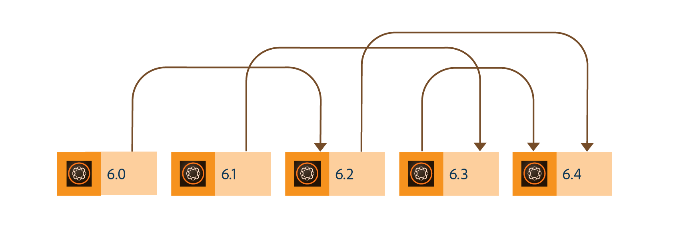
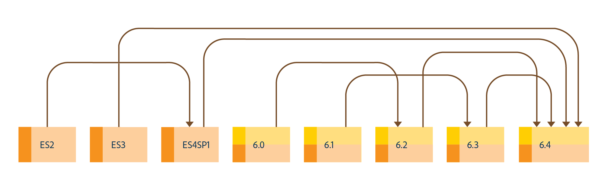

# Upgrade to AEM 6.4 Forms{#upgrade-to-aem-forms}

AEM 6.4 Forms includes several new features and enhancements that streamline the creation, management, and user experiences with forms and correspondences. To learn about all the new capabilities and enhancements of AEM 6.4 Forms, see [New features summary document](/help/forms/using/whats-new.md).

You can upgrade your existing LiveCycle or AEM Forms installation to obtain new capabilities and enhancements offered in AEM 6.4 Forms while retaining existing data, processes, and assets intact. On upgrade, metadata and state of the processes are also preserved. You can choose an upgrade path to get started with upgrade.

The following diagram displays the available upgrade paths for AEM Forms on OSGi:

You can perform a direct upgrade from:

* AEM 6.2 Forms on OSGi  
* AEM 6.3 Forms on OSGi

You can also perform a multi-hop upgrade from

* AEM 6.0 Forms on OSGi
* AEM 6.1 Forms on OSGi

The following diagram displays the available upgrade paths for AEM Forms on JEE:

You can perform a direct upgrade from:

* LiveCycle ES3  
* LiveCycle ES4 SP1  
* AEM 6.2 Forms on JEE  
* AEM 6.3 Forms on JEE

You can also perform a multi-hop upgrade from

* LiveCycle ES2  
* AEM 6.0 Forms on JEE   
* AEM 6.1 Forms on JEE