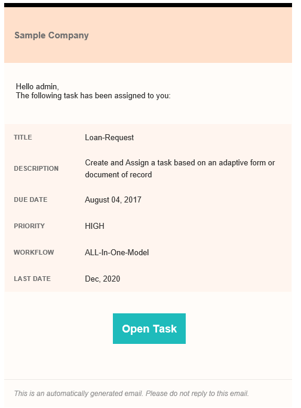

# Use custom email templates in an Assign Task step{#use-custom-email-templates-in-an-assign-task-step}

You can use the Assign Task step to create and assign tasks to a user or group. When a task is assigned to a user or group, an email notification is sent to the defined user or to each member of the defined group. A typical email notification contains link of the assigned task and information related to the task. The following image displays a sample email notification:

You can customize the appearance and use custom metadata in an email notification. AEM Forms provide an out of the box template for email notifications. You can customize the out of the box template or create a new template from scratch.

Email notification templates are based on [HTML email](https://en.wikipedia.org/wiki/HTML_email). These emails adapt to different email clients and screen sizes. Moreover, the styling of the email is defined within the template.

The following image displays a customized email notification: 

 

## Customize the existing template {#customize-the-existing-template}

Out of the box, AEM Forms provides a template for email notifications. The template provides title description, due date, priority, workflow name, and link of the assigned task. You can customize the template to change the appearance. Perform the following steps to customize the template:

1. Log in to CRXDE with administrator account.  

1. Navigate to /libs/fd/dashboard/templates/email.  

1. Open the htmlEmailTemplate.txt file. It contains the default template.  

1. Replace the content of htmlEmailTemplate.txt file with custom content.

   An email notification template is an [HTML email](https://en.wikipedia.org/wiki/HTML_email). You can replace the existing html code with your custom code to change the appearance of the template.

1. Save the file. Now, the customized template is ready for use.

## Create an email template {#create-an-email-template}

Out of the box, AEM Forms provides a template for email notifications. The template provides title description, due date, priority, workflow name, and link of the assigned task. You can also add a custom email template (your own template) for Assign task steps. Perform the following steps to add a custom email template:

1. Log in to CRXDE with administrator account.  

1. Navigate to /libs/fd/dashboard/templates/email.  

1. Create a .txt file. For example, EmailOnTaskAssign.txt.  

1. Add custom HTML code to the file.

   An email notification template is an [HTML email](https://en.wikipedia.org/wiki/HTML_email). You can add custom HTML code to the file to create a new template.

1. Save the file. The template is ready for use in Assign Task step.

## Use an email template in an Assign Task step {#use-an-email-template-in-an-assign-task-step}

Out of the box, Assign task step is configured to use the default template, htmlEmailTemplate.txt. You can choose to use a custom template. To change the template:

1. Open the Assign Task step.  

1. Navigate to Assignee &gt; HTML Email Template.  

1. Select the newly created HTML Email Template.  

1. Click OK. The template is changed.

An email notification also uses [metadata](../../forms/using/use-metadata-in-email-notifications.md). For example, due date, priority, workflow name, and more. You can also configure the template to use [custom metadata](../../forms/using/use-metadata-in-email-notifications.md#using-custom-metadata-in-an-email-notification).

<!--
<related-links>
<a href="../../forms/using/aem-forms-workflow.md" target="_blank">Forms-centric workflow on OSGi</a>
<a href="/sites/authoring/using/inbox.md" target="_blank">Manage Forms applications and tasks in AEM Inbox</a>
<a href="../../sites/developing/using/workflows-step-ref.md" target="_blank">Workflow Step Reference</a>
<a href="/forms/using/dynamically-select-a-user-or-group-for-aem-workflow.md" target="_blank">Dynamically choose a user or group for Assign Task and Adobe Sign steps</a>
<a href="/sites/developing/using/workflows-best-practices.md" target="_blank">AEM Workflow Best Practices</a>
<a href="../../forms/using/use-metadata-in-email-notifications.md" target="_blank">Use metadata in an email notification </a>
</related-links>
-->

