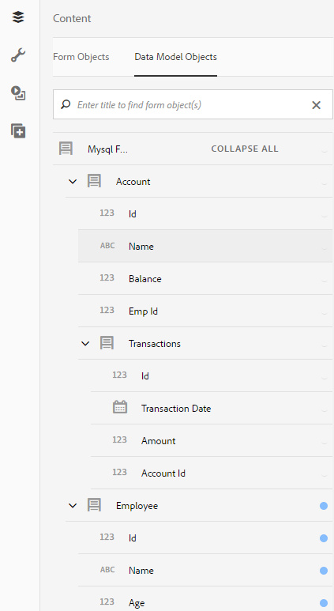
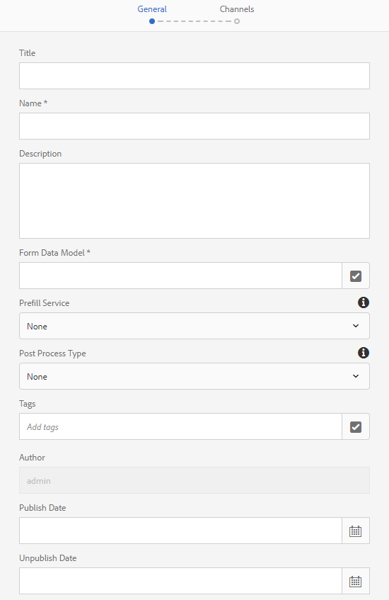
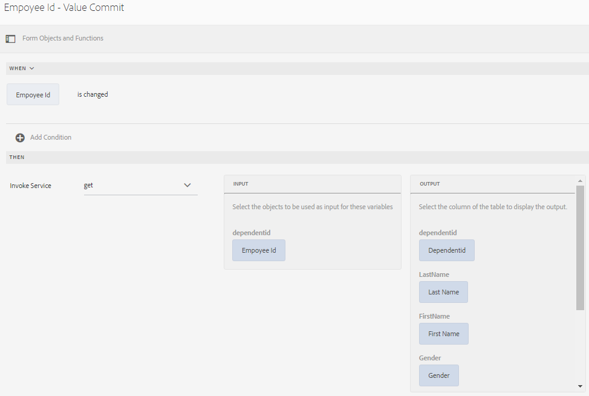

# Use form data model{#use-form-data-model}

| Version | Article link |
| -------- | ---------------------------- |
| AEM as a Cloud Service |    [Click here](https://experienceleague.adobe.com/docs/experience-manager-cloud-service/content/forms/integrate/use-form-data-model/using-form-data-model.html)                  |
| AEM 6.5     | This article         |

 

AEM Forms data integration lets you use disparate backend data sources to create a form data model that you can use as schema in various adaptive forms and interactive communications workflows. It requires configuring data sources and creating form data model based on data model objects and services available in data sources. For more information, see the following:

* [AEM Forms Data Integration](../../forms/using/data-integration.md)
* [Configure data sources](../../forms/using/configure-data-sources.md)
* [Create form data model](../../forms/using/create-form-data-models.md)
* [Work with form data model](../../forms/using/work-with-form-data-model.md)

A form data model is an extension of JSON schema that you can use to:

* [Create adaptive forms and fragments](#create-af)
* [Create interactive communications and building blocks like text, list, and condition fragments](#create-ic)
* [Preview interactive communications with sample data](#preview-ic)
* [Prefill adaptive forms and interactive communications](#prefill)
* [Write submitted adaptive form data back into data sources](#write-af)
* [Invoke services using adaptive form rules](#invoke-services)

## Create adaptive forms and fragments {#create-af}

You can create [adaptive forms](../../forms/using/creating-adaptive-form.md) and [adaptive form fragments](../../forms/using/adaptive-form-fragments.md) based on a form data model. Do the following to use a form data model when creating an adaptive form or adaptive form fragment:

1. In Form Model tab on Add Properties screen, select **[!UICONTROL Form Data Model]** in the **[!UICONTROL Select From]** drop-down list.

   

1. Select to expand **[!UICONTROL Select Form Data Model]**. All available form data models are listed.

   Select a from data model.

   

1. (**Adaptive form fragments only**) You can create an adaptive form fragment based on only one data model object in a form data model. Expand **[!UICONTROL Form Data Model Definitions]** drop-down. It lists all data model objects in the specified form data model. Select a data model object from the list.

   

Once the adaptive form or adaptive form fragment based on a form data model is created, form data model objects appear in the **[!UICONTROL Data Model Objects]** tab of the Content browser in adaptive form editor.

>[!NOTE]
>
>For an adaptive form fragment, only the data model object selected at the time of authoring and its associated data model objects appear in the Data Model Objects tab.

You can drag-drop data model objects onto the adaptive form or fragment to add form fields. The added form fields retain the metadata properties and binding with data model object properties. The binding ensures that the field values are updated in the corresponding data sources on form submission and prefilled when the form is rendered.

## Create interactive communications {#create-ic}

You can create an interactive communication based on a form data model that you can use to prefill interactive communication with data from configured data sources. In addition, the building blocks of an interactive communication, such as text, list, and condition document fragments can be based on a form data model.

You can choose a form data model when creating an interactive communication or a document fragment. The following image shows the General tab of the Create Interactive Communication dialog.

General tab of Create Interactive Communication dialog

For more information, see:

[Create an interactive communication](../../forms/using/create-interactive-communication.md)

[Text in Interactive Communications](/help/forms/using/texts-interactive-communications.md)

[Conditions in Interactive Communications](/help/forms/using/conditions-interactive-communications.md)

[List fragments](/help/forms/using/lists.md)

## Preview with sample data {#preview-ic}

Form data model editor lets you generate and edit sample data for data model objects in the form data model. You can use this data to preview and test interactive communications and adaptive forms. Generate the sample data before previewing as described in [Work with form data model](../../forms/using/work-with-form-data-model.md#sample).

To preview an interactive communication with sample form data model data:

1. On AEM author instance, navigate to **[!UICONTROL Forms > Forms & Documents]**.
1. Select an interactive communication and select **[!UICONTROL Preview]** in the toolbar to select **[!UICONTROL Web Channel]**, **[!UICONTROL Print Channel]**, or **[!UICONTROL Both Channels]** to preview the interactive communication.
1. In the Preview [*channel*] dialog, ensure that **[!UICONTROL Test Data of Form Data Model]** is selected and select **[!UICONTROL Preview]**.

The interactive communication opens with prefilled sample data.

Similarly, to preview an adaptive form with sample data, open the adaptive adaptive form in author mode and select **[!UICONTROL Preview]**.

## Prefill using form data model service {#prefill}

AEM Forms provides out-of-the-box Form Data Model Prefill Service that you can enable for adaptive forms and interactive communications based on form data model. The prefill service queries data sources for data model objects in the adaptive form and interactive communication and accordingly prefills data while rendering the form or the communication.

To enable the Form Data Model Prefill Service for an adaptive form, open the Adaptive Form Container properties and select **[!UICONTROL Form Data Model Prefill service]** from the **[!UICONTROL Prefill Service]** drop-down in the Basic accordion. Then, save the properties.

To configure form data model prefill service in an interactive communication, you can select Form Data Model Prefill Service in the Prefill Service drop-down while creating it or later by modifying the properties.

Edit Properties dialog for an interactive communication

## Write submitted adaptive form data into data sources {#write-af}

When a user submits a form based on a form data model, you can configure the form to write submitted data for a data model object to its data sources. To achieve this use case, AEM Forms provide [Form Data Model submit action](../../forms/using/configuring-submit-actions.md), available out-of-the-box only for adaptive forms based on a form data model. It writes submitted data for a data model object in its data source.

To configure the Form Data Model submit action, open Adaptive Form Container properties and select **[!UICONTROL Submit using Form Data Model]** from the Submit Action drop-down under the Submission accordion. Then, browse and select a data model object from the **[!UICONTROL Name of the data model object to submit]** drop-down. Save the properties.

On form submission, data for the configured data model object is written to the respective data source.

You can also submit form attachments to a data source using binary data model object property. Do the following to submit attachments to a JDBC data source:

1. Add a data model object that includes a binary property to the form data model.
1. In the adaptive form, drag-drop the **[!UICONTROL File Attachment]** component from the Components browser onto the adaptive form.
1. Select to select the added component and select  to open the Properties browser for the component.
1. In the Bind Reference field, select  and navigate to select the binary property you added in the form data model. Configure other properties, as appropriate.

   Select  to save the properties. The attachment field is now bound to the binary property of the form data model.

1. In the Submission section of the Adaptive Form Container properties, enable **[!UICONTROL Submit Form Attachments]**. It submits the attachment in the binary property field to the data source on form submission.

## Invoke services in adaptive forms using rules {#invoke-services}

In an adaptive form based on a form data model, you can [create rules](../../forms/using/rule-editor.md) to invoke services configured in the form data model. The **[!UICONTROL Invoke Services]** operation in a rule lists all available services in the form data model and lets you select input and output fields for the service. You can also use the **Set Value** rule type to invoke a form data model service and set the value of a field to the output returned by the service.

For example, the following rule invokes a get service that takes Employee Id as input and the values returned are populated in the corresponding Dependent Id, Last Name, First Name, and Gender fields in the form.

In addition, you can use the `guidelib.dataIntegrationUtils.executeOperation` API to write a JavaScript in the code editor for the rule editor. For API details, see [API to invoke form data model service](/help/forms/using/invoke-form-data-model-services.md).
