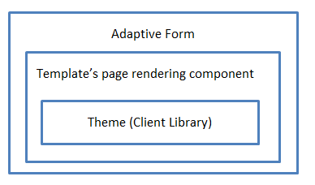
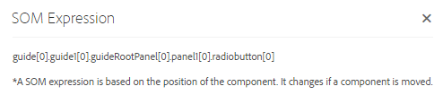

# Using SOM expressions in adaptive forms{#using-som-expressions-in-adaptive-forms}

Adaptive forms are modeled as AEM Page which is represented as JCR content structure in AEM repository. The key element of the content structure is guideContainer node. Below guideContainer, there is rootPanel which may contain nested panel and fields.

You can use a scripting object model (SOM) to reference values, properties, and methods within a particular document object model (DOM). A DOM organizes the memory objects and properties in a tree hierarchy. A SOM expression references Fields/Draw elements and panels.

The following image depicts a node structure that an adaptive form translates to when you add components to a form. For example, you can add a panel to the root panel and a radio button in the panel that is transformed to DOM at runtime. The SOM Expression for the radio-button field in adaptive form is specified as `guide[0].guide1[0].guideRootPanel[0].panel1[0].radiobutton[0]`.

DOM tree

A SOM expression for any element in an adaptive form is prefixed by `guide[0].guide1[0]`. The position of a component in the node structure hierarchy is used to derive its SOM expression.

DOM tree with two radio buttons

The SOM expression changes when you change the position of the radio-buttons in the adaptive form. In the authoring mode, you can view the SOM expression of a field or element within AEM Forms using the View SOM Expression option. The option appears on the panel and when you right-click the field or element. 

Extracting SOM Expressions in an Adaptive form

Within panels, you can access the feature from the panel toolbar. The feature facilitates scripting by adaptive form authors.

Extracting SOM Expressions using panel toolbar

Some APIs listed in [GuideBridge](https://helpx.adobe.com/aem-forms/6/javascript-api/GuideBridge.html) use the SOM expression of an element. For example, to bring focus to a particular field in an adaptive form, pass the corresponding SOM expression to the `getFocus`API in `guideBridge`.
