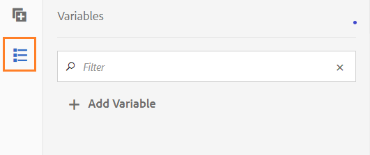

# Variables in AEM Forms workflows{#variables-in-aem-forms-workflows}

A variable in a workflow model is a way to store a value based on its data type. You can then use the name of the variable in any workflow step to retrieve the value stored in the variable. You can also use variable names to define expressions for taking routing decisions.

In AEM workflow models, you can:

* [Create a variable](../../forms/using/variable-in-aem-workflows.md#create-a-variable) of a data type based on the information type that you want to store in it.
* [Set a value for the variable](../../forms/using/variable-in-aem-workflows.md#set-a-variable) using the Set Variable workflow step.
* [Use the variable](../../forms/using/variable-in-aem-workflows.md#use-a-variable) in all AEM Forms Workflow steps to retrieve the stored value and in OR Split and Goto steps to define a routing expression.

The following video demonstrates how you can create, set, and use variables in AEM workflow models:

<!-- FUTURE ERROR: YouTube and mp4 videos are not supported -->

>[!VIDEO](https://helpx.adobe.com/content/dam/help/en/experience-manager/6-5/forms/using/variables_introduction_1_1.mp4)

Variables are an extension of the existing [MetaDataMap](https://helpx.adobe.com/experience-manager/6-5/sites/developing/using/reference-materials/javadoc/com/adobe/granite/workflow/metadata/MetaDataMap.html) interface. You can use [MetaDataMap](https://helpx.adobe.com/experience-manager/6-5/sites/developing/using/reference-materials/javadoc/com/adobe/granite/workflow/metadata/MetaDataMap.html) in ECMAScript to access metadata saved using variables.

## Create a variable {#create-a-variable}

You create variables using the Variables section available in the sidekick of the workflow model. AEM workflow variables support the following data types:

* **Primitive data types**: Long, Double, Boolean, Date, and String
* **Complex data types**: [Document](https://helpx.adobe.com/experience-manager/6-5/forms/javadocs/com/adobe/aemfd/docmanager/Document.html), [XML](https://docs.oracle.com/javase/8/docs/api/org/w3c/dom/Document.html), [JSON](https://static.javadoc.io/com.google.code.gson/gson/2.3/com/google/gson/JsonObject.html), and Form Data Model instance.

>[!NOTE]
>
>Workflows support only ISO8601 format for Date type variables.

You require [AEM Forms add-on package](https://helpx.adobe.com/aem-forms/kb/aem-forms-releases.html) for Document and Form Data Model data types.  Use ArrayList data type to create variable collections. You can create ArrayList variable for all primitive and complex data types. For example, create an ArrayList variable and select String as sub-type to store multiple string values using the variable.

Execute the following steps to create a variable:

1. On an AEM instance, navigate to Tools  &gt; Workflow &gt; Models.
1. Tap **[!UICONTROL Create]** and specify the title and an optional name for the workflow model. Select the model and tap **[!UICONTROL Edit]**.
1. Tap the variables icon available in the sidekick of the workflow model and tap **[!UICONTROL Add Variable]**.

   

1. On the Add Variable dialog, specify the name and select the type of the variable.
1. Select the data type from the **[!UICONTROL Type]** drop-down list and specify the following values:

    * Primitive data type - Specify an optional default value for the variable.
    * JSON or XML - Specify an optional JSON or XML schema path. The system validates the schema path while mapping and storing properties available in this schema to another variable.
    * Form Data Model - Specify a Form Data Model path.
    * ArrayList - Specify a sub-type for the collection.

1. Specify an optional description for the variable and tap  to save the changes. The variable displays in the list available in the left pane.

When you create variables, consider the following practices:

* Create as many variables as a workflow requires. However, to conserve database resources, use the minimum number of variables required, and reuse variables when possible.
* Variables are case-sensitive. Ensure that you reference variables using the same case in your workflow.
* Avoid using special characters in the name of variable

## Set a variable {#set-a-variable}

You can use the Set Variable step to set value of a variable and define the order in which the values are set. The variable is set in the order the variable mappings are listed in the set variable step.

Changes to variable values affect only the instance of the process in which the change occurs. For example, when a workflow is initiated and variable data changes, the changes affect only that instance of the workflow. The changes do not affect other instances of the workflow that were initiated previously or are initiated subsequently.

Depending on the data type of the variable, you can use the following options to set value of a variable:

* **Literal:** Use the option when you know the exact value to specify.

* **Expression:** Use the option when the value to use is calculated based on an expression. The expression is created in provided expression editor.

* **JSON Dot Notation:** Use the option to retrieve a value from a JSON or FDM type variable.
* **XPATH:** Use the option to retrieve a value from an XML type variable.

* **Relative to payload:** Use the option when the value to be saved to variable is available at a path relative to payload.

* **Absolute path:** Use the option when the value to be saved to variable is available at an absolute path.

You can also update specific elements of a JSON or XML type variable using JSON DOT Notation or XPATH notation.

### Add mapping between variables {#add-mapping-between-variables}

Execute the following steps to add mapping between variables:

1. On the workflow edit page, tap the Steps icon available in the sidekick of the workflow model.
1. Drag-and-drop the **Set Variable** step to the workflow editor, tap the step and select  (Configure).
1. On the Set Variable dialog, select **[!UICONTROL Mapping]** > **[!UICONTROL Add Mapping]**.
1. In the **Map Variable** section, select the variable to store data, select the mapping mode, and specify a value to store in the variable. The mapping modes vary based on the type of variable.
1. Map more variables to make a meaningful expression. Tap  to save the changes.

### Example 1: Query an XML variable to set value for a string variable {#example-query-an-xml-variable-to-set-value-for-a-string-variable}

Select a variable of XML type to store an XML file. Query the XML variable to set the value for a string variable for the property available in the XML file. Use **Specify XPATH for the XML variable** field to define the property to store in the string variable.

In this example, select a **formdata** XML variable to store the **cc-app.xml** file. Query the **formdata** variable to set the value for the **emailaddress** string variable to store the value for the **emailAddress** property available in the **cc-app.xml** file.

>[!VIDEO](https://helpx.adobe.com/content/dam/help/en/experience-manager/6-5/forms/using/set_variable_example1.mp4 "Set value of a variable")

### Example 2: Use an expression to store value based on other variables {#example2}

Use an expression to calculate the sum of the variables and store the result in a variable.

In this example, use the expression editor to define an expression to calculate the sum of **assetscost** and **balanceamount** variables and store the result in **totalvalue** variable.

<!-- FUTURE ERROR: YouTube and mp4 videos are not supported -->

>[!VIDEO](https://helpx.adobe.com/content/dam/help/en/experience-manager/6-5/forms/using/variables_expression.mp4)

## Use expression editor {#use-expression-editor}

You also use expressions to calculate value of a variable on the runtime. Variables provide an expression editor to define expressions.

Use the expression editor to:

* Set the value of variables using other workflow variables, numbers, or mathematical expressions.
* Use workflow variables, string, number, or an expression within a mathematical expression
* Add conditions to set values of variables.
* Add operators between conditions.


It is based on adaptive forms rule editor with following changes. Rule editor in variables:

* Does not support functions.
* Does not provide a UI to view summary of rules
* Does not have code editor.
* Does not support enabling and disabling value of an object.
* Does not support setting property of an object.
* Does not support calling a web service.

For more information, see [adaptive forms rule editor](../../forms/using/rule-editor.md).

## Use a variable {#use-a-variable}

You can use variables to retrieve inputs and output or save the result of a step. The workflow editor provides two types of workflow steps:

* Workflow steps with support for variables
* Workflow steps without support for variables

### Workflow steps with support for variables {#workflow-steps-with-support-for-variables}

The Go To step, OR Split step, and all AEM Forms Workflow steps support variables.

#### OR Split step {#or-split-step}

The OR Split creates a split in the workflow, after which only one branch is active. This step enables you to introduce conditional processing paths into your workflow. You add workflow steps to each branch as required.

You can define routing expression for a branch using a rule definition, ECMA script, or an external script.

You can use variables to define the routing expression using the expression editor. For more information on using routing expressions for the OR Split step, see [OR Split step](/help/sites-developing/workflows-step-ref.md#or-split).

In this example, before defining the routing expression, use [example 2](../../forms/using/variable-in-aem-workflows.md#example2) to set the value for the **totalvalue** variable. Branch 1 is active if the value of the **totalvalue** variable is greater than 50000. Similarly, you can define a rule to make the Branch 2 active if the value of the **totalvalue** variable is less than 50000.

<!-- FUTURE ERROR: YouTube and mp4 videos are not supported -->

>[!VIDEO](https://helpx.adobe.com/content/dam/help/en/experience-manager/6-5/forms/using/variables_orsplit_example.mp4)

Similarly, select an external script path or specify the ECMA script for routing expressions to evaluate the active branch. Tap **[!UICONTROL Rename Branch]** to specify an alternate name for the branch.

For more examples, see [Create a workflow model](../../forms/using/aem-forms-workflow.md#create-a-workflow-model).

#### Go To step {#go-to-step}

The **Goto Step** allows you to specify the next step in the workflow model to execute, dependent on the result of a routing expression.

Similar to the OR Split step, you can define routing expression for Goto step using a rule definition, ECMA script, or an external script.

You can use variables to define the routing expression using the expression editor. For more information on using routing expressions for the Goto step, see [Goto Step](/help/sites-developing/workflows-step-ref.md#goto-step).


In this example, the Goto step specifies the Review Credit Card Application as the next step if the value for the **actiontaken** variable is equal to **Need more info**.

For more examples on using rule definition in the Goto step, see [Simulating a For loop](/help/sites-developing/workflows-step-ref.md#simulateforloop).

#### Forms-workflow centric workflow steps {#forms-workflow-centric-workflow-steps}

All AEM Forms Workflow steps support variables. For more information, see [Forms-centric workflow on OSGi](../../forms/using/aem-forms-workflow-step-reference.md).

### Workflow steps without support for variables {#workflow-steps-without-support-for-variables}

You can use [MetaDataMap](https://helpx.adobe.com/experience-manager/6-5/sites/developing/using/reference-materials/javadoc/com/adobe/granite/workflow/metadata/MetaDataMap.html) interface to access variables in workflow steps that do not support variables.

#### Retrieve the variable value {#retrieve-the-variable-value}

Use the following APIs in the ECMA Script to retrieve values for existing variables based on the data type:

| Variable data type |API |
|---|---|
| Primitive (Long, Double, Boolean, Date, and String) |workItem.getWorkflowData().getMetaDataMap().get(variableName, type) |
| Document |Packages.com.adobe.aemfd.docmanager.Document doc = workItem.getWorkflowData().getMetaDataMap().get("docVar", Packages.com.adobe.aemfd.docmanager.Document.class); |
| XML |Packages.org.w3c.dom.Document xmlObject = workItem.getWorkflowData().getMetaDataMap().get(variableName, Packages.org.w3c.dom.Document.class); |
| Form Data Model |Packages.com.adobe.aem.dermis.api.FormDataModelInstance fdmObject = workItem.getWorkflowData().getMetaDataMap().get(variableName, Packages.com.adobe.aem.dermis.api.FormDataModelInstance.class); |
| JSON |Packages.com.google.gson.JsonObject jsonObject = workItem.getWorkflowData().getMetaDataMap().get(variableName, Packages.com.google.gson.JsonObject.class); |

You require [AEM Forms add-on package](https://helpx.adobe.com/aem-forms/kb/aem-forms-releases.html) for Document and Form Data Model variable data types.

**Example**

Retrieve the value of string data type using the following API:

```javascript
workItem.getWorkflowData().getMetaDataMap().get(accname, Packages.java.lang.String)
```

#### Update the variable value {#update-the-variable-value}

Use the following API in the ECMA Script to update the value of a variable:

```javascript
workItem.getWorkflowData().getMetaDataMap().put(variableName, value)
```

**Example**

```javascript
workItem.getWorkflowData().getMetaDataMap().put(salary, 50000)
```

updates the value for the **salary** variable to 50000.

### Set variables to invoke workflows {#apiinvokeworkflow}

You can use an API to set variables and pass them to invoke workflow instances.

[workflowSession.startWorkflow](https://helpx.adobe.com/experience-manager/6-5/sites/developing/using/reference-materials/javadoc/com/adobe/granite/workflow/WorkflowSession.html#startWorkflow-com.adobe.granite.workflow.model.WorkflowModel-com.adobe.granite.workflow.exec.WorkflowData-java.util.Map-) uses model, wfData, and metaData as arguments. Use MetaDataMap to set value for the variable.

In this API, the **variableName** variable is set to **value** using metaData.put(variableName, value);

```javascript
import com.adobe.granite.workflow.model.WorkflowModel;
import com.adobe.granite.workflow.metadata.MetaDataMap;
import com.adobe.aemfd.docmanager.Document;

/*Assume that you already have a workflowSession and modelId along with the payloadType and payload*/
WorkflowData wfData = workflowSession.newWorkflowData(payloadType, payload);
MetaDataMap metaData = wfData.getMetaDataMap();
metaData.put(variableName, value); //Create a variable "variableName" in your workflow model
WorkflowModel model = workflowSession.getModel(modelId);
workflowSession.startWorkflow(model, wfData, metaData);
```

**Example**

Initialize the **doc** document object to a path ("a/b/c") and set the value of the **docVar** variable to the path stored in the document object.

```javascript
import com.adobe.granite.workflow.WorkflowSession;
import com.adobe.granite.workflow.exec.WorkflowData;
import com.adobe.granite.workflow.model.WorkflowModel;
import com.adobe.granite.workflow.metadata.MetaDataMap;
import com.adobe.aemfd.docmanager.Document;

/*This example assumes that you already have a workflowSession and modelId along with the payloadType and payload */
WorkflowData wfData = workflowSession.newWorkflowData(payloadType, payload);
MetaDataMap metaData = wfData.getMetaDataMap();
Document doc = new Document("/a/b/c");// initialize a document object
metaData.put("docVar",doc); //Assuming that you have created a variable "docVar" of type Document in your workflow model
WorkflowModel model = workflowSession.getModel(modelId);
workflowSession.startWorkflow(model, wfData, metaData);
```

### Store sensitive user data outside JCR using workflow variables {#jcr-independent-persistance}

Data processed using Forms Workflow can contain sensitive user data, such as Personally Identifiable Information and Sensitive Personal Information. Businesses can choose to store the data, that is processed by various workflow steps (and passed using workflow variables), out of JCR storage into an external data store owned and managed by them. To know more about persisting workflow data in an external storage, see [Using workflow variables for customer owned datastores](/help/sites-administering/workflows-administering.md#using-workflow-variables-customer-datastore).
[!DNL Adobe Experience Manager] provides Workflow API [UserMetaDataPersistenceProvider](https://github.com/adobe/workflow-variable-externalizer) to store workflow variables in external Azure blob storages. For details about using the API, see [Use workflow variables to parameterize sensitive data and store in external data stores](/help/forms/using/aem-forms-workflow.md#externalize-wf-variables).

## Edit a variable {#edit-a-variable}

1. On the edit workflow page, tap the Variables icon available in the sidekick of the workflow model. The Variables section in the left pane displays all existing variables.
1. Tap the  (Edit) icon next to the variable name that you want to edit.
1. Edit the variable information and tap  to save the changes. You cannot edit the **[!UICONTROL Name]** and **[!UICONTROL Type]** fields for a variable.

## Delete a variable {#delete-a-variable}

Before deleting the variable, remove all the references of the variable from the workflow. Ensure that the variable is not used in the workflow.

Execute the following steps to delete a variable:

1. On the edit workflow page, tap the Variables icon available in the sidekick of the workflow model. The Variables section in the left pane displays all existing variables.
1. Tap the Delete icon next to the variable name that you want to delete.
1. Tap  to confirm and delete the variable.

## References {#references}

For more examples on using variables in AEM Forms Workflow steps, refer to [Variables in AEM workflows](https://helpx.adobe.com/experience-manager/kt/forms/using/authoring_variables_in_aem_forms-workflow1.html).
