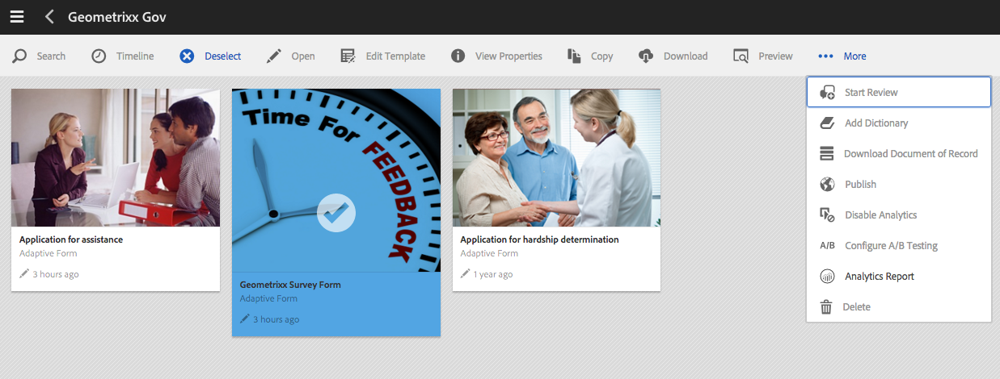
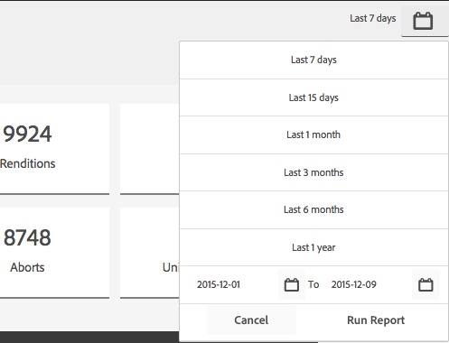
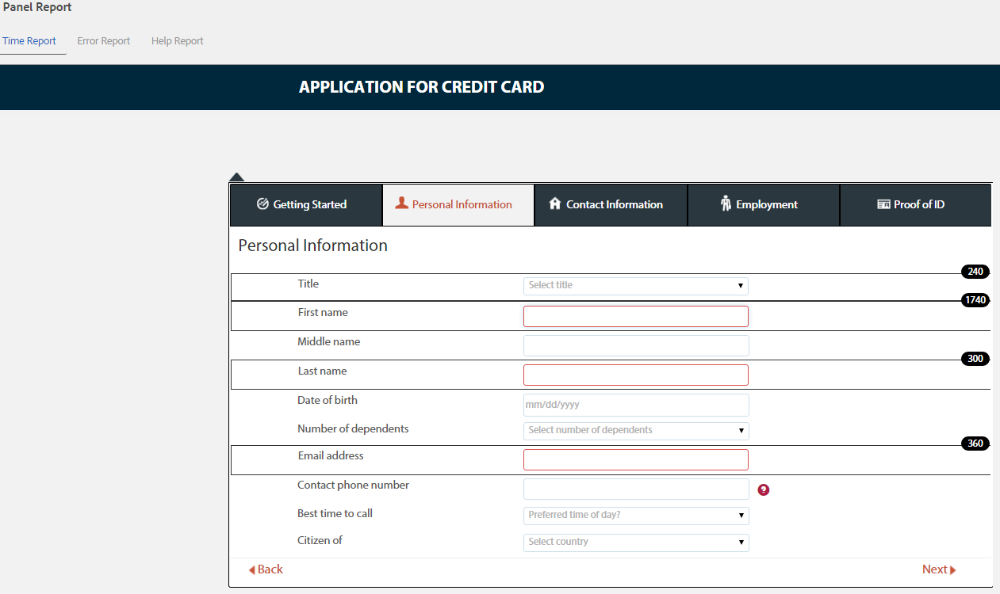
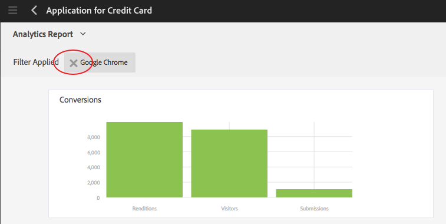

# View and understand AEM Forms analytics reports {#view-and-understand-aem-forms-analytics-reports}

Adobe Experience Manager Forms integrates with Adobe Analytics that lets you capture and track performance metrics for your published forms and documents. The objective behind analyzing these metrics is to make informed decisions based on data about the changes required to make forms or document more usable.

## Setting up analytics {#setting-up-analytics}

The analytics feature in AEM Forms is available as part of the AEM Forms add-on package. For information about installing the add-on package, see [Installing and configuring AEM Forms](../../forms/using/installing-configuring-aem-forms-osgi.md).

In addition to the add-on package, you need an Adobe Analytics account. For information about the solution, see [Adobe Analytics](https://www.adobe.com/solutions/digital-analytics.html).

Once you have the AEM Forms add-on package and an Adobe Analytics account, integrate Adobe Analytics account with AEM Forms and enable tracking on your forms or documents as described in [Configure analytics and reports](../../forms/using/configure-analytics-forms-documents.md).

### How user interaction information is recorded {#how-user-interaction-information-is-recorded}

When a user interacts with the form, the interactions are recorded and sent to Analytics server. Following list indicates server calls for various user activities:

* 2 calls per field per visit
* 1 for panel visit
* 1 for save
* 2 for submit
* 2 for save
* 1 for help
* 1 for each validation error
* 1 for Form rendition + 1 for default panel visit + 1 for default first field visit
* 2 for Form abandon

>[!NOTE]
>
>This list is not exhaustive.

### Viewing analytics reports {#summary-report}

Perform the following steps to view analytics reports:

1. Log in to the AEM portal at `https://[hostname]:'port'`
1. Click **Forms &gt; Forms & Documents**.
1. Select the form for which you want to view the analytics reports.
1. Select **More &gt; Analytics Reports**.

**A.** Analytics Report command

AEM Forms displays analytics reports for the form and for each panel in the form, as shown below.

**A.** Conversions **B.** Form-level summary **C.** Panel-level summary **D.** Browsers of visitors - filter **E.** OS of visitors - filter **F.** Language of visitors - filter

By default, the analytics report for the last seven days is displayed. You can view reports for the last 15 days, last one month, and so on, or specify a date range.

>[!NOTE]
>
>The options such as Last 7 days and Last 15 days do not include data for the day you are generating the analytics report. To include the present day's data, you need to specify the date range including the present day and then run the report.

### Conversions graph for adaptive and HTML5 forms {#conversions-graph-for-adaptive-and-html-forms}

The form-level conversions graph gives you an insight into how the form is performing on the following key performance indicators (KPIs):

* **Renditions**: The number of times a form is opened
* **Visitors**: The number of visitors to the form
* **Submissions**: Number of times the form is submitted

### Analytics report for adaptive and HTML5 forms {#analytics-report-for-adaptive-and-html-forms}

The form-level summary section gives you an insight into how the form is performing on the following key performance indicators (KPIs):

* **Average fill time**: Average time spent in filling the form. When users spend time on the form but do not submit, that time is not included in this calculation.
* **Renditions**: Number of times the form has been rendered or opened
* **Drafts**: Number of times the form has been saved as draft
* **Submissions**: Number of times the form has been submitted
* **Abort**: Number of times users started filling the form and then left without completing the form
* **Unique Visitors**: Number of times the form i ``s rendered by unique visitors. For more information on unique visitors, see [Unique Visitors, Visits, and customer behavior](https://helpx.adobe.com/analytics/kb/unique-visitors-visitor-behavior.html).

### Panel report {#bottom-summary-report}

The panel-level summary section provides the following information about each panel in the form:

* **Average Fill Time**: Average time spent on the panel, whether the form is submitted or not
* **Errors Encountered**: Average number of errors encountered by the users on the fields in a panel. Errors Encountered is arrived at by dividing total errors in a field by number of renditions of the form.
* **Help Accessed**: Average number of times users accessed the in-context help for the fields in the panel. Help Accessed is arrived at by dividing total number of times Help is accessed for a field by number of renditions of form.

#### Detailed panel report {#detailed-panel-report}

You can also view details for each panel by clicking a panel's name in Panel Report.

The detailed report shows values for all fields in the panel.

Panel Report has three tabs:

* **Time Report**(Default): Displays the time, in number of seconds, spent on filling up each of the fields in the panel
* **Error Report**: Displays the number of errors encountered by users while filling up the fields
* **Help Report**: Number of times help for a particular field was accessed

You can navigate between the panels, if multiple panels are available.

### Filters: Browser, OS, and Language {#filters-browser-os-and-language}

The Browser Distribution, OS Distribution, and Language Distribution tables display the renditions, visitors, and submissions as per browsers, OS, and Language of form users. These tables display maximum five entries, by default. You can click Show More to display more entries and click Show Less to come back to the regular five or less entries.

To filter the analytics data further, you can click an entry in any of the tables. For example, if you click Google Chrome in the Browser Distribution table, the report is rendered again with data relevant to Google Chrome browser as following:

If you view the panel report after applying a filter, the panel report data is also displayed according to the applied filter.

Once a filter is applied:

* The distribution tables become read-only, as only one filter can be applied at a time.
* The applied filter's table disappears.
* You can click the Close button (highlighted below) to remove the applied filter.

### A/B Testing {#a-b-testing}

If you have A/B testing enabled and set up for the form, the report page has a drop-down you can use to display the A/B testing report. A/B testing report displays the comparative performance of two versions of the form as you have set up.

For more information on A/B testing, see [Create and manage A/B test for adaptive forms](../../forms/using/ab-testing-adaptive-forms.md).
