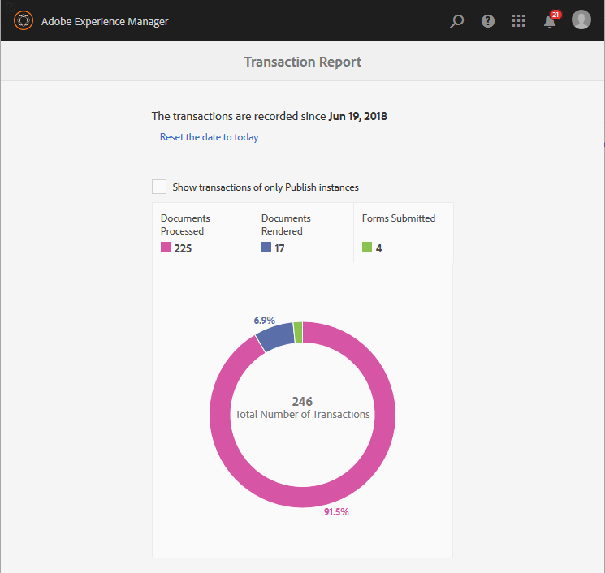

# Viewing and Understanding Transaction Reports for AEM Forms on OSGi{#viewing-and-understanding-transaction-reports}

Transaction reports lets you capture and track the number of submitted forms, processed documents, and rendered documents. The objective behind tracking these transactions is to make an informed decision about the product usage and rebalancing investments in hardware and software. For more information, see [AEM Forms Transaction Reports Overview](../../forms/using/transaction-reports-overview.md).

## Setting up transaction reports  {#setting-up-transaction-reports}

Transaction reports feature is available as part of the AEM forms add-on package. For information about installing the add-on package on all the author and publish instances, see [Installing and configuring AEM forms](/help/forms/using/installing-configuring-aem-forms-osgi.md). Once you have the AEM forms add-on package installed, do the following:

* Enable reverse replication on all the publish instances
* Enable transaction reports
* Provide rights to view a transaction report
* (Optional) Configure Transaction Flush Period and Outboxes 

>[!NOTE]
>
>* AEM Forms transaction reports do not support topologies that contain only publish instances.
>* Before using transaction reporting, ensure that the reverse replication is enabled for all the publish instances.
>* Transaction data is reverse-replicated from a publish instance to only corresponding author or processing instance. The author or processing instance cannot further replicate data to another instance.
>

### Enable reverse replication on all the publish instances {#enable-reverse-replication-on-all-the-publish-instances}

Transaction reports use reverse replication to consolidate count of transactions from publish instances to author instances. Set up the reverse replication on all the publish instances. For detailed instructions to setup reverse replication, see [replication](/help/sites-deploying/replication.md).

### Enable transaction reports {#enable-transaction-reports}

Transaction reports are disabled by default. You can enable the reports from AEM Web Console. to Enable transaction reports in an AEM Forms environment, perform the following steps on all the author and publish instances:

1. Log in to an AEM instance as an administrator. Go to **Tools** &gt; **Operations** &gt; **Web Console**.
1. Locate and open the **Forms Transaction Reporting** service.
1. Select the Record Transactions check box. Click **Save**.

   Repeat step 1-3 on all the author and publish instances.

### Provide rights to view a transaction report {#provide-rights-to-view-a-transaction-report}

Only members of the fd-administrator group can view transaction reports. To allow a user to view transaction reports, make users member of the fd-administrator group. For instructions about making a user a member of an AEM group, see [User, Group and Access Rights Administration](/help/sites-administering/user-group-ac-admin.md).

### (Optional) Configure Transaction Flush Period and Outboxes {#optional-configure-transaction-flush-period-and-outboxes}

Transactions are cached in memory before being stored in the repository. The process is followed to ensure that there are no frequent writes to the repository. By default, the caching period (Transaction Flush Period) is set to 60 seconds. You can change the default period to suit your environment. Perform the following steps to change the default caching period:

1. Log in to author instances as an administrator. Go to **Tools** &gt; **Operations** &gt; **Web Console**.
1. Locate and open the **Forms Transaction Repository Storage Provider** service.
1. Specify the number of seconds in the **Transaction Flush Period** field. Click **Save**.

Reverse replication copies transaction data to the default outbox of the author instances. You can place transaction data in a custom outbox. Perform the following steps to specify a custom outbox:

1. Log in to author instances as an administrator. Go to **Tools** &gt; **Operations** &gt; **Web Console**.
1. Locate and open the **Forms Transaction Repository Storage Provider** service.
1. Specify the name of the custom outbox the **Outboxes** field. Click **Save**. An outbox with the specified name is created on all the author instances.

## Viewing the transaction report {#viewing-the-transaction-report}

You can view transaction reports on author or publish instances. The transaction report on the author instance provides an aggregated sum of all the transactions that take place on the configured author and publish instances. The transaction report on the publish instance provides a count of transactions that take place only on the underlying publish instance. Perform the following steps to view the report:

1. Log in to the AEM Forms server at `https://[hostname]:'port'`.
1. Navigate to **Tools** &gt; **Forms **&gt;** View Transaction Report**.

## Understanding the report {#understanding-the-report}

AEM Forms displays transaction reports since the configured date, as shown in a summary report below:

* Use the **Reset the date to today** options to reset transaction records. When you reset the date to today, all previous transaction records are lost. When you reset the date on an author instance, the change does not affect transaction reports on the Publish instances and conversely.
* Use the **Show transactions of only Publish instances** to view all the transactions that occurred only on the configured publish instance or publish farm.
* Use the categories: **Document Processed**, **Documents Rendered**, and **Forms Submitted** to view corresponding transactions. For the type of transactions accounted in these categories, see [Billable Transaction Reports APIs](../../forms/using/transaction-reports-billable-apis.md).

## View transaction reporting logs {#view-transaction-reporting-logs}

Transaction reporting places all the information displayed in the report and some additional information in the logs. The information provided in the logs is helpful for the advanced users. For example, logs divide transactions into multiple granular categories in comparison to three consolidated categories displayed in the report. The logs are available in the `error.log` file at the `/crx-repository/logs/` directory. The logs are available even if you do not enable the transaction reports from AEM Web Console.

## Related Articles {#related-articles}

* [Transaction Reports Overview for AEM Forms on OSGi](../../forms/using/transaction-reports-overview.md)
* [Transaction Reports Billable APIs for AEM Forms on OSGi](../../forms/using/transaction-reports-billable-apis.md)
* [Record a transaction for custom implementations for AEM Forms on OSGi](/help/forms/using/record-transaction-custom-implementation.md)
