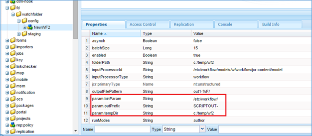
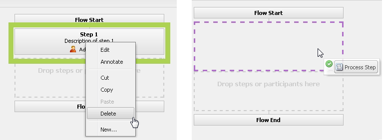
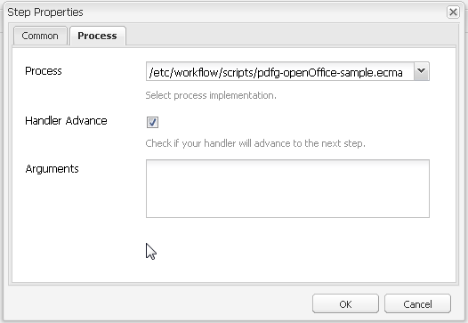

# Watched folder in AEM Forms{#watched-folder-in-aem-forms}

An administrator can configure a network folder, known as a Watched Folder, so that when a user places a file (such as a PDF file) in the Watched Folder a pre-configured workflow, service, or script operation is started to process the added file. After the service performs the specified operation, it saves the result file in a specified output folder. For more information about workflow, service, and script, see [Various methods for processing files](#variousmethodsforprocessingfiles).

## Create a Watched Folder {#create-a-watched-folder}

You can use one of the following methods to create a Watched Folder on the file system:

* While configuring the properties of a Watched Folder configuration node, type the full path of the parent directory in the folderPath property and append the name of the Watched Folder to be created, as shown in the following example: `C:/MyPDFs/MyWatchedFolder`
  The `MyWatchedFolder`folder does not exist, AEM Forms attempts to create the folder at the specified path.

* Create a folder on the file system prior to configuring a Watched Folder endpoint, and then provide the full path in the folderPath property. For detailed information about the folderPath property, see [Watched Folder properties](#watchedfolderproperties).

>[!NOTE]
>
>In a clustered environment, the folder used as a Watched Folder must be accessible, writable, and shared on the file system or network. Each application server instance of the cluster must have access to the same shared folder. On Windows, create a mapped network drive on all the servers and specify the path of the mapped network drive in folderPath property.

## Create Watched Folder configuration node {#create-watched-folder-configuration-node}

To configure a Watched Folder, create a Watched Folder configuration node. Perform the following steps to create the configuration node:

1. Login to CRX-DE lite as an administrator and navigate to the /etc/fd/watchfolder/config folder.

1. Create a node of type `nt:unstructured`. For example, watchedfolder

   >[!NOTE]
   >
   >The Watched Folder node name cannot include spaces and special characters.

1. Add the following properties to the node:

    * `folderPath`
    * `inputProcessorType`
    * `inputProcessorId`
    * `outputFilePattern`

   For complete list of supported properties, see [Watched Folder properties](#watchedfolderproperties).

1. Click **Save All**. After the node is created and the properties are saved. The `input`, `result`, `failure`, `preserve`, and `stage`folders are created at the path specified in the `folderPath` property.

   The scan-job starts scanning the Watched Folder at a defined time-interval.

## Watched Folder properties {#watchedfolderproperties}

You can configure the following properties for a Watched Folder.

* **folderPath (String)**: The path of the folder to be scanned at a defined time-intervals. For a clustered environment, the folder must be at a shared location with all servers having full access to the server. It is a mandatory property.
* **inputProcessorType (String)**: The type of the process to start. You can specify workflow, script, or service. It is a mandatory property.
* **inputProcessorId (String)**: The behavior of the inputProcessorId property is based on the value specified for the inputProcessorType property. It is a mandatory property. The following list details all the possible values of the inputProcessorType property and corresponding requisite for the inputProcessorType property:

  * For workflow, specify the workflow model to be executed. For example, /etc/workflow/models/&lt;workflow_name&gt;/jcr:content/model
  * For script, specify JCR path of the script to be executed. For example, /etc/fd/watchfolder/test/testScript.ecma
  * For service, specify the filter used for locating an OSGi service. The service is registered as an implementation of com.adobe.aemfd.watchfolder.service.api.ContentProcessor Interface.

* **runModes (String)**: A comma-separated list of allowed run-modes for workflow execution. A few examples are:

  * author

  * publish

  * author, publish

  * publish, author

>[!NOTE]
>
>If the server hosting the Watched Folder does not have any of the specified run-mode, then the Watched Folder always activates regardless of the run-modes on the server.

* **outputFilePattern (String)**: Pattern of the output file. You can specify a folder or file pattern. If a folder pattern is specified, then the output files have names as described in workflows. If a file pattern is specified, the output files have names as described in file pattern. [File and folder pattern](../../forms/using/watched-folder-in-aem-forms.md#p-file-and-folder-patterns-p) can also specify a directory structure for the output files. It is a mandatory property.

* **stageFileExpirationDuration (Long, default -1)**: The number of seconds to wait before an input file/folder which has already been picked up for processing should be treated as having timed out and marked as a failure. This expiration mechanism only activates when the value for this property is a positive number.

>[!NOTE]
>
>Even when an input is marked as having timed out using this mechanism, it may still be processing in the background but just taking more time than expected. If the input contents were consumed before the timeout mechanism kicked in, the processing may even proceed to completion later and the output be dumped into the results folder. If the contents were not consumed before the timeout, it is very likely that the processing will error out later on trying to consume the contents, and this error will also be logged in the failure folder for the same input. On the other hand, if the processing for the input never activated due to an intermittent job/workflow misfire (which is the scenario the expiration mechanism aims to address), then neither of these two eventualities will occur. Hence, for any entries in the failure folder which were marked as failures due to a timeout (look for messages of the form "File not processed after a significant amount of time, marking as failure!" in the failure log), it is advisable to scan the result folder (and also the failure folder itself for another entry for the same input) to check whether any of the eventualities described previously actually occurred.

* **deleteExpiredStageFileOnlyWhenThrottled (Boolean, default true):** Whether the expiration mechanism should activate only when the watch-folder is throttled. The mechanism is more relevant for throttled watch-folders since a small number of files which are lingering around in an unprocessed state (owing to intermittent job/workflow misfires) have the potential to choke processing for the entire batch when throttling is enabled. If this property is kept as true (the default), the expiration mechanism will not activate for watch-folders which are not throttled. If the property is kept as false, the mechanism will always activate as long as the stageFileExpirationDuration property is a positive number.

* **pollInterval (Long)**: The interval in seconds for scanning the Watched Folder for input. Unless the Throttle setting is enabled, poll Interval should be longer than the time to process an average job; otherwise, the system may become overloaded. The default value is 5. See the description for Batch Size for additional information. The value of the pollinterval must be greater than or equal to one.
* **excludeFilePattern (String)**: A semi-colon (;) delimited list of patterns that a Watched Folder uses to determine which files and folders to scan and pick up. Any file or folder with this pattern is not scanned for processing. This setting is useful when the input is a folder with multiple files. The contents of the folder can be copied into a folder with a name that are picked up by the Watched Folder. This prevents the Watched Folder from picking up a folder for processing before the folder is completely copied into the input folder. The default value is null.
  You can use [file patterns](../../forms/using/watched-folder-in-aem-forms.md#p-file-and-folder-patterns-p) to exclude:

  * Files with specific filename extensions; for example, &#42;.dat, &#42;.xml, .pdf, &#42;.&#42;
  * Files with specific names; for example, data&#42; would exclude files and folders named data1, data2, and so on.
  * Files with composite expressions in the name and extension, as in these examples:

    * Data[0-9][0-9][0-9].[dD][aA]'port'
    * &#42;.[dD][Aa]'port'
    * &#42;.[Xx][Mm][Ll]

For more information about file patterns, see [About file patterns](../../forms/using/watched-folder-in-aem-forms.md#p-file-and-folder-patterns-p).

* **includeFilePattern (String)**: A semi-colon (;) delimited list of patterns that the Watched Folder uses to determine which folders and files to scan and pick up. For example, if the IncludeFilePattern is input&#42;, all files and folders that match input&#42; are picked up. This includes files and folders named input1, input2, and so on. The default value is &#42; and indicates all files and folders. You can use file patterns to include:

  * Files with specific filename extensions; for example, &#42;.dat, &#42;.xml, .pdf, &#42;.&#42;
  * Files with specific names; for example, data.&#42; would include files and folders named data1, data2, and so on.

* Files with composite expressions in the name and extension, as in these examples:

  * Data[0-9][0-9][0-9].[dD][aA]'port'

    * &#42;.[dD][Aa]'port'
    * &#42;.[Xx][Mm][Ll]

For more information about file patterns, see [About file patterns](../../forms/using/watched-folder-in-aem-forms.md#p-file-and-folder-patterns-p)

* **waitTime (Long)**: The time, in milliseconds, to wait before you scan a folder or file after it is created. For example, if the wait time is 3,600,000 milliseconds (one hour) and the file was created one minute ago, this file will be picked up after 59 or more minutes have passed. The default value is 0. This setting is useful to ensure that a file or folder is completely copied to the input folder. For example, if you have a large file to process and the file takes ten minutes to download, set the wait time to 10&#42;60 &#42;1000 milliseconds. This prevents the Watched Folder from scanning the file if it is not ten minutes old.
* **purgeDuration (Long)**: Files and folders in the result folder are purged when they are older than this value. This value is measured in days. This setting is useful in ensuring that the result folder does not become full. A value of -1 days indicates to never delete the results folder. The default value is -1.
* **resultFolderName (String)**: The folder where the saved results are stored. If the results do not appear in this folder, check the failure folder. Read-only files are not processed and are saved in the failure folder. This value can be an absolute or relative path with the following file patterns:

  * %F = filename prefix
  * %E = filename extension
  * %Y = year (full)
  * %y = year (last two digits)
  * %M = month
  * %D = day of month
  * %d = day of year
  * %H = hour (24-hour clock)
  * %h = hour (12-hour clock)
  * %m = minute
  * %s = second
  * %l = millisecond
  * %R = random number (between 0&ndash;9)
  * %P = process or job id

  For example, if it is 8 PM on July 17, 2009 and you specify C:/Test/WF0/failure/%Y/%M/%D/%H/, the result folder is C:/Test/WF0/failure/2009/07/17/20

  If the path is not absolute but relative, the folder is created inside the Watched Folder. The default value is result/%Y/%M/%D/, which is the Result folder inside the Watched Folder. For more information about file patterns, see [About file patterns](../../forms/using/watched-folder-in-aem-forms.md#p-file-and-folder-patterns-p).

>[!NOTE]
>
>The smaller the size of the result folders, the better Watched Folder perform. For example, if the estimated load for the Watched Folder is 1000 files every hour, try a pattern like result/%Y%M%D%H so that a new subfolder is created every hour. If the load is smaller (for example, 1000 files per day), you could use a pattern like result/%Y%M%D.

* **failureFolderName (String)**: The folder where failure files are saved. This location is always relative to the Watched Folder. You can use file patterns, as described for Result Folder. Read-only files are not processed and are saved in the failure folder. The default value is failure/%Y/%M/%D/.
* **preserveFolderName (String):** The location where files are stored after successful processing. The path can be an absolute, a relative, or a null directory path. You can use file patterns, as described for Result Folder. The default value is preserve/%Y/%M/%D/.
* **batchSize (Long)**: The number of files or folders to be picked up per scan. Use to prevent an overload on the system; scanning too many files at one time can cause a crash. The default value is 2.

  The Poll Interval and Batch Size settings determine how many files Watched Folder picks up in every scan. Watched Folder uses a Quartz thread pool to scan the input folder. The thread pool is shared with other services. If the scan interval is small, the threads scan the input folder often. If files are dropped frequently into the Watched Folder, then you should keep the scan interval small. If files are dropped infrequently, use a larger scan interval so that the other services can use the threads.

  If there is a large volume of files being dropped, make the batch size large. For example, if the service started by the Watched Folder endpoint can process 700 files per minute, and users drop files into the input folder at the same rate, then setting the Batch Size to 350 and the Poll Interval to 30 seconds help Watched Folder performance without incurring the cost of scanning the Watched Folder too often.

  When files are dropped into the Watched Folder, it lists the files in the input, which can reduce performance if scanning is happening every second. Increasing the scan interval can improve performance. If the volume of files being dropped is small, adjust the Batch Size and Poll Interval accordingly. For example, if 10 files are dropped every second, try setting the pollInterval to 1 second and the Batch Size to 10

* **throttleOn (Boolean)**: When this option is selected, it limits the number of Watched Folder jobs that AEM Forms processes at any given time. The maximum number of jobs is determined by the Batch Size value. The defaut value is true. (See [About throttling](../../forms/using/watched-folder-in-aem-forms.md#p-about-throttling-p).)

* **overwriteDuplicateFilename (Boolean)**: When set to True, files in the results folder and preserve folder are overwritten. When set to False, files and folders with a numeric index suffix are used for the name. The default value is False.
* **preserveOnFailure (Boolean)**: Preserve input files if there is failure to run the operation on a service. The default value is true.
* **inputFilePattern (String)**: Specifies the pattern of the input files for a Watched Folder. Creates a allowlist of the files.
* **asynch (Boolean)**: Identifies the invocation type as asynchronous or synchronous. The default value is true (asynchronous). The file processing is a resource consuming task, keep the value of the asynch flag to true to prevent choking the main thread of the scan job. In a clustered environment, it is critical to keep the flag true to enable load-balancing for the files being processed across the available servers. If the flag is false, the scan job attempts to perform processing for each top-level file/folder sequentially within its own thread. Do not set the flag to false without a specific reason, such as, workflow-based processing on a single-server setup.

>[!NOTE]
>
>By design, the workflows are asynchronous. Even If you set the value to false, the workflows are launched in the asynchronous mode.

* **enabled (Boolean)**: Deactivates and activates scanning for a Watched Folder. Set enabled to true, to start scanning the Watched Folder. The default value is true.
* **payloadMapperFilter:** When a folder is configured as watched folder, a folder structure is created within the watched folder. The structure has folders to provide inputs, receive outputs (results), save data for failures, preserve data for long-lived processes, and save data for various stages. The folder structure of a Watched Folder can serve as a payload of Forms-centric workflows. A payload mapper lets you define structure of a payload which uses a Watched Folder for input, output, and processing. For example, if you use the default mapper, it maps content of Watched Folder with [payload]\input and [payload]\output folder. Two out-of-the-box payload mapper implementations are available. If you do not have [a custom implementation](../../forms/using/watched-folder-in-aem-forms.md#creating-a-custom-payload-mapper-filter), use one of out-of-the-box implementation:

  * **Default mapper:** Use the default payload mapper to keep input and output contents of the watched folders in separate input and output folders in the payload. Also, in payload path of a workflow, use [payload]/input/ and [payload]/output paths to retrive and save content.

  * **Simple File-based payload mapper:** Use the Simple File-based payload mapper to keep input and output contents directly in the payload folder. It does not create any extra hierarchy, like default mapper.

### Custom configuration parameters {#custom-configuration-parameters}

Along with the above listed Watched Folder configuration properties, you can also specify custom configuration parameters. The custom parameters are passed to the file processing code. It enables the code to change its behavior based on the value of the parameter. To specify a parameter:

1. Log in to CRXDE-Lite and navigate to the Watched Folder configuration node.
1. Add a property param.&lt;property_name&gt; to the Watched Folder configuration node. The type of the property can only be Boolean, Date, Decimal, Double, Long and String. You can specify single and multi-value properties.

>[!NOTE]
>
>If the data type of the property is Double, then specify a decimal point in the value of such properties. For all the properties, where data type is Double and no decimal point is specified in the value, the type is converted to Long.

These properties are passed as an immutable map of type Map&lt;String, Object&gt; to the processing code. The processing code can be an ECMAScript, Workflow, or a Service. The values provided for the properties are available as key-value pairs in the map. Key is the name of the property and value is the value of the property. For more information about custom configuration parameters, see the following image:



A sample watch-folder configuration node with mandatory properties, a few optional properties, a few configuration parameters.

#### Mutable variables for workflows {#mutable-variables-for-workflows}

You can create mutable variables for workflow-based file processing methods. These variables serve as containers for the data flowing between the steps of a workflow. To create such variables:

1. Log in to CRXDE-Lite and navigate to the Watched Folder configuration node.

1. Add a property workflow.var.&lt;variable_name&gt; to the Watched Folder configuration node.

   The type of the property can only be Boolean, Date, Decimal, Double, Long and String. Multi-valued properties are also supported. For multi-valued properties, the value available for the workflow step is an array of specified type.

   >[!NOTE]
   >
   >If the data type of the property is Double, then specify a decimal point in the value of such properties. For all the properties, where data type is Double and no decimal point is specified in the value, the type is converted to Long.

>[!NOTE]
>
>JCR specification mandates a default value for the properties. The default values are available to the steps of a workflow for processing. So, specify proper default values.


## Various methods for processing files {#variousmethodsforprocessingfiles}

You can start a workflow, service, or script to process the documents places in a watch folder.

### Using a Service to process files of a Watched Folder &nbsp; {#using-a-service-to-process-files-of-a-watched-folder-nbsp}

A Service is a custom implementation of the `com.adobe.aemfd.watchfolder.service.api.ContentProcessor` interface. It is registered with OSGi along with a few custom properties. The custom properties of the implementation make it unique and help in identifying the implementation.

#### Custom implementation of the ContentProcessor interface {#custom-implementation-of-the-contentprocessor-interface}

The custom implementation accepts a processing context (an object of type com.adobe.aemfd.watchfolder.service.api.ProcessorContext), reads input documents and configuration parameters from the context, processes the inputs, and adds the output back to the
context. The ProcessorContext has the following APIs:

* **getWatchFolderId**: Returns the ID of the Watched Folder.
* **getInputMap**: Returns a map of type Map. The keys of the map are the filename of input file and a document object containing the contents of the file. Use the getinputMap API to read the input files.
* **getConfigParameters**: Returns an immutable map of type Map. The map contains
  the configuration parameters of a Watched Folder.

* **setResult**: The ContentProcessor implementation
  uses the API to write the output document to the result folder. You can provide a name for the output file to the setResult API. The API might choose to use or ignore the provided file depending upon the output folder/file pattern specified. If a folder pattern is specified, then the output files have names as described in workflows. If a file pattern is specified, the output files have names as described in file pattern.

For example, the following code is a custom implementation of the ContentProcessor interface with a custom foo=bar property.

```java
@Component(metatype = true, immediate = true, label = "WF Test Service", description = "WF Test Service")
@Service(value = {OutputWriter.class, ContentProcessor.class})
@Property(name = "foo", value = "bar")
public class OutputWriter implements ContentProcessor {

```

While [configuring a Watched Folder](../../forms/using/watched-folder-in-aem-forms.md#p-create-watched-folder-configuration-node-p), if you specify the inputProcessorId property as (foo=bar) and the inputProcessorType property as Service, then the above mentioned Service (custom implementation) is used to process the input files of the Watched Folder.

The following example is also a custom implementation of the ContentProcessor interface. In the example, the Service accepts input files, copies the files to a temporary location, and returns a document object with the content of the file. The contents of the document object are saved to the result folder. The physical path of the result folder is configured in the [Watched Folder configuration node](../../forms/using/watched-folder-in-aem-forms.md#p-create-watched-folder-configuration-node-p).

```java
@Component(immediate = true)
@Service(value = ContentProcessor.class)
@Property(name = "serviceSelector", value = "testProcessor1")
public class TestContentProcessor1 implements ContentProcessor {
    @Override
    public void processInputs(ProcessorContext context) throws Exception {
        Map.Entry<String, Document> e = context.getInputMap().entrySet().iterator().next();
        File f = new File((String) context.getConfigParameters().get("tempDir"),
                context.getConfigParameters().get("outPrefix") + e.getKey());
        e.getValue().copyToFile(f);
        context.setResult(f.getName(), new Document(f, true));
    }
}

```

### Using Scripts to process files of a Watched Folder {#using-scripts-to-process-files-of-a-watched-folder}

Scripts are the ECMAScript complaint custom code written to processes documents placed in the Watched Folder. A script is represented as a JCR node. Apart from the standard ECMAScript variables (log, sling and more), the Script has a variable processorContext. The variable is of type ProcessorContext. The ProcessorContext has the following APIs:

* **getWatchFolderId**: Returns the ID of the Watched Folder.
* **getInputMap**: Returns a map of type Map. The keys of the map are the filename of input file and a document object containing the contents of the file. Use the getinputMap API to read the input files.
* **getConfigParameters**: Returns an immutable map of type Map. The map contains the configuration parameters of a Watched Folder.
* **setResult**: The ContentProcessor implementation uses the API to write the output document to the result folder. You can provide a name for the output file to the setResult API. The API might choose to use or ignore the provided file depending upon the output folder/file pattern specified. If a folder pattern is specified, then the output files have names as described in workflows. If a file pattern is specified, the output files have names as described in file pattern.

The following code is an example ECMAScript. It accepts input files, copies the files to a temporary location, and returns a document object with the content of the file. The contents of the document object are saved to the result folder. The physical path of the result folder is configured in the [Watched Folder configuration node](../../forms/using/watched-folder-in-aem-forms.md#p-create-watched-folder-configuration-node-p).

>[!NOTE]
>
>The output folder and filename prefix are decided based on the Watched Folder configuration parameters.

```java
var inputMap = processorContext.getInputMap();
var params = processorContext.getConfigParameters();
var entry = inputMap.entrySet().iterator().next();
var tempFile = new Packages.java.io.File(params.get("tempDir"), params.get("outPrefix") + entry.getKey());
entry.getValue().copyToFile(tempFile);
processorContext.setResult(tempFile.getName(), new Packages.com.adobe.aemfd.docmanager.Document(tempFile, true));

```

#### Location of scripts and security considerations {#location-of-scripts-and-security-considerations}

By default, a container folder (/etc/fd/watchfolder/scripts) is provided where customers can place their scripts, and the default service-user used by the watch-folder framework has the necessary permissions for reading scripts from this location.

If you plan to place your scripts at a custom location, it is likely that the default service-user might not have read permissions over the custom location. For such scenario, perform the following steps to provide necessary permissions to the custom location:

1. Create a system user programmatically or via the console https://'[server]:[port]'/crx/explorer. You can also use an existing system user. It is important to work with system users here instead of normal users.
1. Provide read permissions to the newly created or existing system user on the custom location where the scripts are stored. You can have multiple custom locations. Provide atleast read permissions to all the custom locations.
1. In the Felix configuration console (/system/console/configMgr), locate the service user mapping for the watch-folders. This mapping looks like 'Mapping: adobe-aemds-core-watch-folder=...'.
1. Click the mapping. For the entry 'adobe-aemds-core-watch-folder:scripts=fd-service', change fd-service to the ID of the custom system user. Click Save.

Now, you can use configured custom location to save the scripts.

### Using a Workflow to process files of a Watched Folder {#using-a-workflow-to-process-files-of-a-watched-folder}

Workflows enable you to automate Experience Manager activities. Workflows consist of a series of steps that are executed in a specific order. Each step performs a distinct activity such as activating a page or sending an email message. Workflows can interact with assets in the repository, user accounts, and Experience Manager services. Therefore, workflows can coordinate complicated.

* Before creating a Workflow, consider the following points:
* The output of a step must be available to all the subsequent steps.
  The steps must be able to update (or even delete) existing outputs generated by the previous steps.
* The mutable variables are used to flow the custom dynamic data between the steps.

Perform the following steps to process files using workflows:

1. Create an implementation of the `com.adobe.aemfd.watchfolder.workflow.api.WorkflowContextProcessor` interface. It is similar to the implementation created for a Service.

   >[!NOTE]
   >
   >You can create the complete implementation entirely in ECMAScript.

1. In a step of Workflow, locate the OSGi service of type com.adobe.aemfd.watchfolder.workflow.api.WorkflowContextService, and call the execute() method of the service with the following arguments.

    * Your custom implementation of WorkflowContextProcessor interface
    * workItem
    * workflowSession
    * metadata

If you use the Java programming language to implement the workflow, the AEM workflow engine provides value for workItem, workflowSession, and metadata variables. These variables are passed as arguments to the execute() method of your custom WorkflowProcess implementation.

If you use ECMAScript to implement the workflow, the AEM workflow engine provides value for graniteWorkItem, graniteWorkflowSession, and metadata variables. These variables are passed as arguments to the WorkflowContextService.execute() method.

The argument to processWorkflowContext() is an object of type com.adobe.aemfd.watchfolder.workflow.api.WorkflowContext. The WorkflowContext interface has following APIs to facilitate the workflow-specific considerations mentioned above:

* getWorkItem: Returns the value of the WorkItem variable. The variables is passed to the WorkflowContextService.execute() method.
* getWorkflowSession: Returns the value of the WorkflowSession variable. The variables is passed to the WorkflowContextService.execute() method.
* getMetadata: Returns the value of the Metadata variable.. The variables is passed to the WorkflowContextService.execute() method.
* getCommittedVariables: Returns a read-only object map representing variables set by previous steps. If a variable is not modified in any of previous steps, the default value specified during configuring the Watched Folder is returned.
* getCommittedResults: Returns a read-only Document map. The map represents the output files that are generated by the previous steps.
* setVariable: The WorkflowContextProcessor implementation uses the variable to manipulate the variables which represent the custom dynamic data which flows between the steps. The name and type of the variables is identical to the name of the variables specified during [configuring the Watched Folder](../../forms/using/watched-folder-in-aem-forms.md#p-configure-the-watched-folder-p). To change value of a variable, call the setVariable API with a non-null value. To remove a variable, call setVariable() with a null value.

The following ProcessorContext APIs are also available:

* getWatchFolderId: Returns the ID of the Watched Folder.
* getInputMap: Returns a map of type Map&lt;String, Document&gt;. The keys of the map are the filename of input file and a document object containing the contents of the file. Use the getinputMap API to read the input files.
* getConfigParameters: Returns an immutable map of type Map&lt;String, Object&gt;. The map contains the configuration parameters of a Watched Folder.
* setResult: The ContentProcessor implementation uses the API to write the output document the result folder. You can provide a name for the output file to the setResult API. The API might choose to use or ignore the provided file depending upon the output folder/file pattern specified. If a folder pattern is specified, then the output files have names as described in workflows. If a file pattern is specified, the output files have names as described in file pattern

Consideration for the setResult API, when used in workflows:

* To add a new output document which contributes to the overall workflow output, call the setResult API with a filename which has not been used as the output filename by any previous step.
* To update an output generated by a previous step, call the setResult API with a filename already used by a previous step.
* To delete an output generated by a previous step, call setResult with a file-name already used by a previous step and null as the contents.

>[!NOTE]
>
>Calling setResult API with null contents in any other scenario would result in an error.

The following example is implemented as a workflow step. In the example, the ECMAscript uses a variable stepCount to track the number of times a step is called in the current workflow instance.
The name of the output folder is a combination of current step number, original file name, and the prefix specified in the outPrefix parameter.

The ECMAScript gets a reference of the workflow context service and creates an implementation of the WorkflowContextProcessor interface. The WorkflowContextProcessor implementation accepts input files, copies the file to a temporary location, and returns a document representing the copied file. Based on the value of the Boolean variable purgePrevious, the current step deletes the output generated last time by the same step when the step was started in the current workflow instance. In the end, the wfSvc.execute method is invoked to execute the WorkflowContextProcessor implementation. The contents of the output document are saved to the result folder at the physical path mentioned in the Watched Folder configuration node.

```javascript
log.error("Watch-folder workflow script called for step: " + graniteWorkItem.getNode().getTitle());
var wfSvc = sling.getService(Packages.com.adobe.aemfd.watchfolder.workflow.api.WorkflowContextService);
// Custom WorkflowContextProcessor implementation which defines the processWorkflowContext() method purely in JS
var impl = { processWorkflowContext: function (wfContext) {
    var wfId = wfContext.getWatchFolderId();
    var inputMap = wfContext.getInputMap();
    var paramMap = wfContext.getConfigParameters();
    var preResults = wfContext.getCommittedResults();
    var preVars = wfContext.getCommittedVariables();
    log.info("WF ID: " + wfId); // workflowId of type String
    log.info("Inputs: " + inputMap); // Input map of type Map<String, Document>
    log.info("Params: " + paramMap); // Config params of type Map<String, Object>
    log.info("Old results: " + preResults);
    log.info("Old variables: " + preVars);
    var currStepNumber = new Packages.java.lang.Long(new Packages.java.lang.Long(preVars.get("stepCount")).longValue() + 1);
    log.info("Current step number: " + currStepNumber);
    wfContext.setVariable("stepCount", currStepNumber);
    var entry = inputMap.entrySet().iterator().next();
    var tempFile = new Packages.java.io.File(paramMap.get("tempDir"), paramMap.get("outPrefix") + "STEP-" + currStepNumber + "-" + entry.getKey());
    entry.getValue().copyToFile(tempFile);
    var fName = tempFile.getName();
    var outDoc = new Packages.com.adobe.aemfd.docmanager.Document(tempFile, true);
    wfContext.setResult(tempFile.getName(), outDoc);
    var prevStepOutName = paramMap.get("outPrefix") + "STEP-" + (currStepNumber - 1) + "-" + entry.getKey();
    if (preResults.containsKey(prevStepOutName) && paramMap.get("purgePrevious").booleanValue()) {
        log.info("Purging previous step output " + prevStepOutName);
        wfContext.setResult(prevStepOutName, null);
    }
} }
wfSvc.execute(impl, graniteWorkItem, graniteWorkflowSession, metaData);
log.info("Exiting workflow script!")

```

### Create Payload Mapper Filter to map structure of a watched folder to the payload of a workflow {#create-payload-mapper-filter-to-map-structure-of-a-watched-folder-to-the-payload-of-a-workflow}

When you create a watched folder, it creates a folder structure within the folder being watched. The folder structure has stage, result, preserve, input, and failure folders. The folder structure can serve as input payload to the workflow and accept output from a workflow. It can also list failure points, if any.

If structure of a payload is different from the structure of the watched folder, you can write custom scripts to map structure of the watched folder to the payload. Such a script is called payload mapper filter. Out of the box, AEM Forms provides a payload mapper filter to map structure of the watched folder to a payload.

#### Creating a custom Payload Mapper Filter {#creating-a-custom-payload-mapper-filter}

1. Download [Adobe Client SDK](https://repo1.maven.org/maven2/com/adobe/aemfd/aemfd-client-sdk/).
1. Setup the client SDK in the build path of the maven-based project. To get started, you can download and open the following maven-based project in the IDE of your choice.
1. Edit the payload mapper filter code available in sample bundle to suit your requirement.
1. Use maven to create a bundle of the custom Payload Mapper Filter.
1. Use [AEM bundles console](https://localhost:4502/system/console/bundles) to install the bundle.

   Now, custom Payload Mapper Filter is listed in AEM Watched Folder UI. You can use it with your workflow.

   The following example code implements a simple file-based mapper for the files saved relative to a payload. You can use it to get started.

   ```java
   package com.adobe.aemfd.watchfolder.workflow;
   import com.adobe.aemfd.docmanager.Document;
   import com.adobe.aemfd.watchfolder.workflow.api.payload.PayloadMapper;
   import com.adobe.aemfd.watchfolder.workflow.api.payload.WorkflowExecutionContext;
   import com.adobe.aemfd.watchfolder.workflow.api.payload.WorkflowInitializationContext;
   import com.adobe.aemfd.watchfolder.workflow.api.payload.WorkflowVariable;
   import com.adobe.granite.workflow.exec.Workflow;
   import org.apache.felix.scr.annotations.Component;
   import org.apache.felix.scr.annotations.Service;
   import org.apache.sling.api.resource.ResourceResolver;
   import javax.jcr.Binary;
   import javax.jcr.Node;
   import java.util.Collection;
   import java.util.HashMap;
   import java.util.Map;
   @Component(immediate = true)
   @Service(value = PayloadMapper.class)
   public class SimpleFileBasedPayloadMapper implements PayloadMapper {
   @Override
   public Node createPayload(WorkflowInitializationContext wfInitCtxt, Node stagingFolder, String uniquePayloadName,
   Map<String, Binary> inputs, Collection<WorkflowVariable> variableDefs) throws Exception {
   Node dirNode = stagingFolder.addNode(uniquePayloadName, "sling:Folder");
   for (Map.Entry<String, Binary> bins: inputs.entrySet()) {
   Node fileNode = dirNode.addNode(bins.getKey(), "nt:file");
   Node resNode = fileNode.addNode ("jcr:content", "nt:resource");
   resNode.setProperty("jcr:data", bins.getValue());
   }
   return dirNode;
   }
   @Override
   public Map<String, Document> getInputs(WorkflowInitializationContext wfInitCtxt, WorkflowExecutionContext wfExecCtxt,
   Node payload, ResourceResolver resourceResolver) throws Exception {
   return null; //To change body of implemented methods use File | Settings | File Templates.
   }
   @Override
   public void setOutput(WorkflowInitializationContext wfInitCtxt, WorkflowExecutionContext wfExecCtxt, Node payload,
   String fileName, Binary contents, int outputMode) throws Exception {
   //To change body of implemented methods use File | Settings | File Templates.
   }
   @Override
   public Map<String, Document> getIntermediateOutputs(WorkflowInitializationContext wfInitCtxt,
   WorkflowExecutionContext wfExecCtxt, Node payload,
   ResourceResolver resourceResolver) throws Exception {
   return null; //To change body of implemented methods use File | Settings | File Templates.
   }
   @Override
   public Map<String, Document> getFinalOutputs(WorkflowInitializationContext wfInitCtxt, Workflow workflow, Node payload,
   ResourceResolver resourceResolver) throws Exception {
   Map<String, Object> params = wfInitCtxt.getConfigParameters();
   Map<String, Document> result = new HashMap<String, Document>();
   for (Map.Entry<String, Object> me: params.entrySet()) {
   String key = me.getKey();
   if (key.startsWith("pm.outfile.")) {
   String fName = (String) me.getValue();
   Document d = new Document(payload.getPath() + "/" + fName, resourceResolver);
   result.put(fName, d);
   }
   }
   return result;
   }
   @Override
   public void setVariable(WorkflowInitializationContext wfInitCtxt, WorkflowExecutionContext wfExecCtxt, Node payload,
   WorkflowVariable variable) throws Exception {
   //To change body of implemented methods use File | Settings | File Templates.
   }
   @Override
   public Map<String, Object> getVariables(WorkflowInitializationContext wfInitCtxt, WorkflowExecutionContext wfExecCtxt,
   Node payload) throws Exception {
   return null; //To change body of implemented methods use File | Settings | File Templates.
   }
   }
   ```

## How users interact with a Watched Folder {#how-users-interact-with-a-watched-folder}

For a Watched Folder endpoint, users can start file processing operations by copying or dragging input files or folders from their desktops to a Watched Folder. The files are processed in the order of arrival.

For Watched Folder endpoints, if a job requires only one input file, the user can copy that file to the root of the Watched Folder.

If the job contains more than one input file, the user must create a folder outside the Watched Folder hierarchy that contains all required files. This new folder should include the input files (and optionally a DDX file if necessary by the process). After the job folder has been constructed, the user copies it into the Watched Folder's input folder.

>[!NOTE]
>
>Ensure that the application server has deleted access to the files in the Watched Folder. If AEM Forms cannot delete the files from the input folder after they are scanned, the associated process will be started indefinitely.

## Additional information about the Watched Folders {#additional-information-about-the-watched-folders}

### About Throttling {#about-throttling}

When throttling is enabled for a watch folder endpoint, it limits the number of Watched Folder jobs that are processed at any given time. The maximum number of jobs is determined by the Batch Size value, also configurable in the Watched Folder endpoint. When the throttling limit is reached, incoming documents in the input directory of the Watched Folder is not polled. The document also remains in the input directory until other Watched Folder jobs are completed and another poll attempt is made. For synchronous processing, all jobs processed in a single poll are counted toward the throttling limit, even though the jobs are processed consecutively in a single thread.

>[!NOTE]
>
>Throttling does not scale with a cluster. When throttling is enabled, the cluster as a whole will not process more than the number of jobs specified in the Batch Size at any given time. This limit is cluster-wide, and not specific to each node in the cluster. For example, with a Batch Size of 2, the throttling limit could be reached with a single node processing two jobs, and no other nodes would poll the input directory until one of the jobs is completed.

#### How throttling works {#how-throttling-works}

Watched Folder scans the input folder at each pollInterval, picks up the number of files specified in the Batch Size, and invokes the target service for each of these files. For example, if the Batch Size is four, at each scan, Watched Folder picks up four files, creates four invocation requests, and invokes the target service. Before these requests are completed, if Watched Folder is invoked, it again starts four jobs regardless of whether the previous four jobs are completed or not.

Throttling prevents Watched Folder from invoking new jobs when the previous jobs are not completed. Watched Folder detect jobs in progress and process new jobs based on the batch size minus jobs in progress. For example, in the second invocation, if the number of jobs completed is only three and one job is still in progress, Watched Folder invokes only three more jobs.

* Watched Folder relies on the number of files present in the stage folder to find out how many jobs are in progress. If files remain unprocessed in the stage folder, Watched Folder does not invoke any more jobs. For example, if the batch size is four and three jobs are stalled, Watched Folder invokes only one job in subsequent invocations. There are multiple scenarios that can cause files to remain unprocessed in the stage folder. When jobs are stalled, the administrator can terminate the process on the Process Management administration page so that Watched Folder moves the files out of the stage folder.
* If the AEM Forms server goes down before Watched Folder invokes the jobs, the administrator can move the files out of the stage folder. For information, see [Failure points and recovery](../../forms/using/watched-folder-in-aem-forms.md#p-failure-points-and-recoveryfailure-points-and-recovery-p).
* If the AEM Forms server is running but Watched Folder is not running when the Job Manager service calls back, which occurs when services do not start in the ordered sequence, the administrator can move the files out of the stage folder. For information, see [Failure points and recovery](../../forms/using/watched-folder-in-aem-forms.md#p-failure-points-and-recoveryfailure-points-and-recovery-p).

### Failure points and recoveryFailure points and recovery {#failure-points-and-recoveryfailure-points-and-recovery}

At each poll event, Watched Folder locks the input folder, moves the files that match the include file pattern to the stage folder, and then unlocks the input folder. Locking is needed so that two threads do not pick up the same set of files and process them twice. The chances of this happening increase with a small pollInterval and a large batch size. After files are moved to the stage folder, the input folder is unlocked so that other threads can scan the folder. This step helps provide high throughput because other threads can scan while one thread is processing the files.

After files are moved to the stage folder, invocation requests are created for each file and the target service is invoked. There may be cases where Watched Folder cannot recover the files in the stage folder:

* If the server goes down before Watched Folder can create the invocation request, the files in the stage folder remain in the stage folder and are not recovered.

* If Watched Folder has successfully created the invocation request for each of the files in the stage folder and the server crashes, there are two behaviors based on the invocation type:

  * **Synchronous**: If Watched Folder is configured to invoke the service synchronously, all the files in the stage folder remain unprocessed in the stage folder.
  * **Asynchronous**: In this case, Watched Folder relies on the Job Manager service. If the Job Manager Service calls back Watched Folder, the files in the stage folder are moved to the preserve or failure folder based on the results of the invocation. If the Job Manager service does not call back Watched Folder, the files will remain unprocessed in the stage folder. This situation happens when Watched Folder is not running when the Job Manager calls back.

#### Recover unprocessed source files in the stage folder {#recover-unprocessed-source-files-in-the-stage-folder}

When Watched Folder cannot process the source files in the stage folder, you can recover the unprocessed files.

1. Restart the application server or node.

1. Stop Watched Folder from processing new input files. If you skip this step, it will be much harder to determine which files are unprocessed in the stage folder. To prevent Watched Folder from processing new input files, do one of the following tasks:

    * Change the includeFilePattern property for the Watched Folder to something that will not match any of the new input files (for example, enter NOMATCH).
    * Suspend the process that is creating new input files.

   Wait until AEM Forms recovers and processes all files. The majority of the files should be recovered and any new input files processed correctly. The length of time you wait for Watched Folder to recover and process the files will depend on the length of the operation to invoke and the number of files to recover.

1. Determine which files cannot be processed. If you waited an appropriate amount of time and completed the previous step, and there are still unprocessed files left in the stage folder, go to the next step.

   >[!NOTE]
   >
   >You can look at the date and time stamp of the files in the stage directory. Depending on the number of files and normal processing time, you can determine which files are old enough to be considered stuck.

1. Copy the unprocessed files from the stage directory to the input directory.

1. If you prevented Watched Folder from processing new input files in step 2, change the Include File Pattern to its previous value or re-enable the process that you disabled.

### Chain Watched Folders together {#chain-watched-folders-together}

Watched Folders can be chained together so that a result document of one Watched Folder is the input document of the next Watched Folder. Each Watched Folder can invoke a different service. By configuring Watched Folders in this manner, multiple services can be invoked. For example, one Watched Folder could convert PDF files to Adobe PostScript&reg; and a second Watched Folder could convert the PostScript files to PDF/A format. To do this, simply set the result folder of the Watched Folder defined by your first endpoint to point to the input folder of the Watched Folder defined by your second endpoint.

Output from the first conversion would go to \path\result. Input for the second conversion would be \path\result, and output from the second conversion would go to \path\result\result (or the directory you define in the Result Folder box for the second conversion).

### File and folder patterns {#file-and-folder-patterns}

Administrators can specify the type of file that can invoke a service. Multiple file patterns can be established for each Watched Folder. A file pattern can be one of the following file properties:

* Files with specific file name extensions; for example, &#42;.dat, &#42;.xml, .pdf, &#42;.&#42;
* Files with specific names; for example, data.&#42;
* Files with composite expressions in the name and extension, as in these examples:

  * Data[0-9][0-9][0-9].[dD][aA]'port'
  * &#42;.[dD][Aa]'port'
  * &#42;.[Xx][Mm][Ll]

* The administrator can define the file pattern of the output folder in which to store the results. For the output folders (result, preserve, and failure), the administrator can specify any of these file patterns:
* %Y = year (full)
* %y = year (last two digits)
* %M = month,
* %D = day of month,
* %d = day of year,
* %h = hour,
* %m = minute,
* %s = second,
* %R = random number between 0&ndash;9
* %J = Job name

For example, the path to the result folder may be C:\Adobe\Adobe LiveCycle ES4\BarcodedForms\%y\%m\%d.

Output parameter mappings can also specify additional patterns, such as these:

* %F = Source Filename
* %E = Source Filename Extension

If the output parameter mapping pattern ends with "File.separator" (which is the path separator), a folder is created and the content is copied into that folder. If the pattern does not end with "File.separator", the content (result file or folder) is created with that name.

## Using PDF Generator with a Watched Folder {#using-pdf-generator-with-a-watched-folder}

You can configure a Watched Folder to initiate a workflow, service, or a script to process the input files. In the following section, we will configure a Watched Folder to initiate an ECMAScript. The ECMAScript would use PDF Generator to convert Microsoft Word (.docx) documents to PDF documents.

Perform the following steps to configure a Watched Folder with PDF Generator:

1. [Create an ECMAScript](../../forms/using/watched-folder-in-aem-forms.md#p-create-an-ecmascript-p)
1. [Create a Workflow](../../forms/using/watched-folder-in-aem-forms.md#p-create-a-workflow-p)
1. [Configure the Watched Folder](../../forms/using/watched-folder-in-aem-forms.md#p-configure-the-watched-folder-p)

### Create an ECMAScript {#create-an-ecmascript}

The ECMAScript would use PDF Generator's createPDF API to convert Microsoft Word (.docx) documents to PDF documents. Perform the following steps to create the script:

1. Open CRXDE lite in a browser window. The URL is https://'[server]:[port]'/crx/de.

1. Navigate to /etc/workflow/scripts and create a folder named PDFG.

1. In the PDFG folder, create a file named pdfg-openOffice-sample.ecma, and add the following code to the file:

   ```javascript
   var wfSvc = sling.getService(Packages.com.adobe.aemfd.watchfolder.workflow.api.WorkflowContextService);
   // Custom ContentProcessor implementation which defines the processInputs() method purely in JS
   var impl = { processWorkflowContext: function (wrkfContext) {

     //  var logger = Packages.org.slf4j.LoggerFactory.getLogger("cmb-mergeandprint-sample.ecma");
                   var inputMap=wrkfContext.getInputMap();

                   var distiller = sling.getService(com.adobe.pdfg.service.api.DistillerService);
                   var generatePDF = sling.getService(com.adobe.pdfg.service.api.GeneratePDFService);
                   var pdfgConfig = sling.getService(com.adobe.pdfg.service.api.PDFGConfigService);
       var result = new Packages.java.util.HashMap();
       var entry = inputMap.entrySet().iterator().next();
       var pdfgOut = generatePDF.createPDF(entry.getValue(), ".docx", "Standard OpenOffice", "Standard", "No Security", null, null);
                   var convertedDoc = pdfgOut.get("ConvertedDoc");
   //   logger.info("SuccessFully saved the document to Ouput Node");
       wrkfContext.setResult(entry.getKey().substring(0, entry.getKey().lastIndexOf('.'))+".pdf",convertedDoc); // Ownership flag set to true for auto temp-file deletion.

   } }

   wfSvc.execute(impl, graniteWorkItem, graniteWorkflowSession, metaData);

   ```

1. Save and close the file.

### Create a Workflow {#create-a-workflow}

1. Open AEM Workflow UI in a browser window.
   <https://[servername>]:'port'/workflow

1. In the Models view, click **New**. In the New Workflow dialog, specify **Title**, and click **OK**.

   

1. Select the newly created workflow and click **Edit**. The workflow opens in a new window.

1. Delete the default workflow step. Drag-and-drop the Process Step from the Sidekick to the Workflow.

   

1. Right-click the Process Step and select **Edit**. The Step Properties window appears.

1. In the Process tab, select the ECMAScript. For example, the pdfg-openOffice-sample.ecma script created in [Create an ECMAScript](#p-create-an-ecmascript-p). Enable the **Handler Advance** option and click **OK**.

   

### Configure the Watched Folder {#configure-the-watched-folder}

1. Open CRXDE lite in a browser window. https://'[server]:[port]'/crx/de/

1. Navigate to the /etc/fd/watchfolder/config/ folder and create a node of type nt:unstructured.

   

1. Add the following properties to the node:

    * folderPath (String): The path of the folder to be scanned at a defined time-intervals. The folder must be at a shared location with all servers having full access to the server.
      inputProcessorType (String): The type of the process to start. In this tutorial, specify workflow.

    * inputProcessorId (String): The behavior of the inputProcessorId property is based on the value specified for the inputProcessorType property. In this example, the value of the inputProcessorType property is workflow. So, for the inputProcessorId property specify the following path of the PDFG workflow: /etc/workflow/models/pdfg/jcr:content/model

    * outputFilePattern (String): Pattern of the output file. You can specify a folder or file pattern. If a folder pattern is specified, then the output files have names as described in workflows. If a file pattern is specified, the output files have names as described in file pattern.

   Apart from the mandatory properties mentioned above, Watched Folders also support a few optional properties. For complete list and description of optional properties, see [Watched Folder properties](#watchedfolderproperties).

## Known issues {#watched-folder-known-issues}

On starting AEM 6.5 Forms on JEE, files start getting processed before JBoss completely starts and files fail to process. To avoid it, before starting JBoss, clear out all the Watched Folders.
