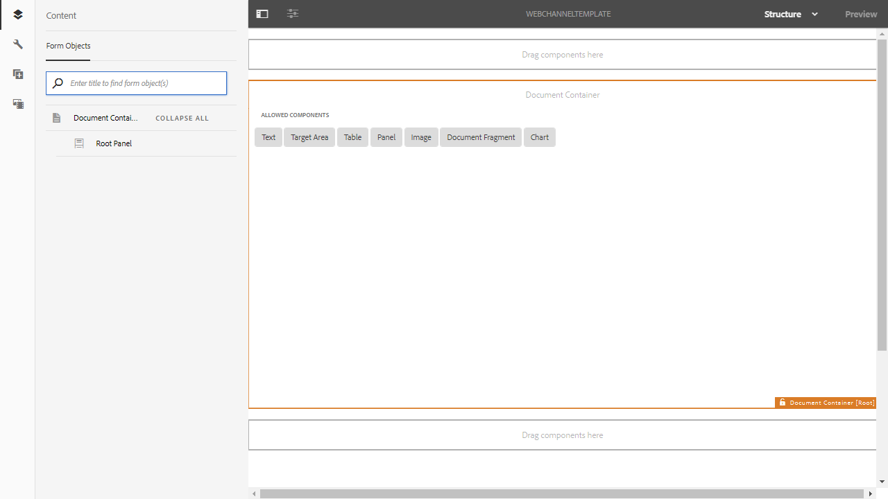
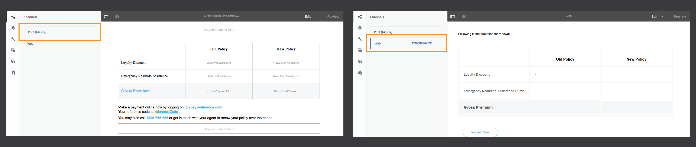

# Print channel and web channel {#print-channel-and-web-channel}

Importing print channel templates and creating and enabling web channel templates

Interactive Communications can be delivered through two channels: print and web. The print channel is used to create PDFs and paper communications, such as a printed letter as a reminder for insurance premium payment, while the web channel is used to deliver online experiences, such as a credit card statement on a website.

Interactive Communication authors can reuse assets such as document fragments and images to create both print and web versions of Interactive Communication.

One of the prerequisites for [Creating an Interactive Communication](/help/forms/using/create-interactive-communication.md) is to have the templates for print and/or web channel available on the server. While template authors create the web channel template in AEM itself, the print channel template XDP is created in Adobe Forms Designer and uploaded to the server.

## Print channel {#printchannel}

Print channel of an Interactive Communication uses XFA form template, XDP. An XDP is designed in Adobe Forms Designer. For more information on creating print channel templates, see [Layout Design](/help/forms/using/layout-design-details.md). To use a print channel template in your Interactive Communication, you need to upload the template to the AEM Forms server.

### Upload Interactive Communication print channel template {#upload-interactive-communication-print-channel-template}

To upload the template, you need to be a member of the forms-user group. Use the following steps to upload the print channel template (XDP) to AEM Forms:

1. Select **[!UICONTROL Forms]** > **[!UICONTROL Forms & Documents]**.  

1. Tap **[!UICONTROL Create]** > **[!UICONTROL File Upload]**.

   Navigate and select the appropriate print channel template (XDP) and tap **[!UICONTROL Open]**.

## Web channel {#web-channel}

Template Authors and Administrators can create, edit, and enable web templates. To allow other users to author web templates, you need to give them rights. For more information, see [User, Group and Access Rights Administration](/help/sites-administering/user-group-ac-admin.md).

### Authoring Web Channel Template {#authoring-web-channel-template}

To create a web channel template, you need to first create a Template folder. Once you create a web template inside a template folder, you need to enable the template to allow the forms users to create web channel of an Interactive Communication based on the template.

To author a web channel template Complete the following steps:

1. Create a Template folder to keep your Interactive Communication web templates, if you do not already have one. For more information, see Template Folders in [Page Templates - Editable](/help/sites-developing/page-templates-editable.md).

    1. Tap **[!UICONTROL Tools]**  > **[!UICONTROL Configuration Browser]**. **[!UICONTROL]**
    1. In the Configuration Browser page, tap **[!UICONTROL Create]**. 
    1. In the Create Configuration dialog, specify a title for the folder, check **[!UICONTROL Editable Templates]**, and tap **[!UICONTROL Create]**.

       The Folder is created and listed in the Configuration Browser page.

1. Navigate to the appropriate template folder and create a web template.

    1. Navigate to the appropriate template folder by selecting **[!UICONTROL Tools]** > **[!UICONTROL Templates > Folder]**.
    1. Tap **[!UICONTROL Create]**.
    1. Select **[!UICONTROL Interactive Communication - Web Channel]** and tap **[!UICONTROL Next]**. 
    1. Enter a Template title and description and then tap **[!UICONTROL Create]**.

       The template is created and a dialog appears. 
    
    1. Tap **[!UICONTROL Open]** to open the template you have created in the Template editor.

       The Template Editor appears. 
    
           
    
       When creating or editing a template, there are various aspects that a Template Author can define. Creating or editing a template is similar to page authoring. For more information, see Editing Templates - Template Authors in [Creating Page Templates](/help/sites-authoring/templates.md).

1. To allow usage of this template for Interactive Communication creation, enable the template.

    1. Tap **[!UICONTROL Tools]**  > **[!UICONTROL Templates]**.
    1. Navigate to the appropriate template, select it, and tap **[!UICONTROL Enable]** and in the alert message, tap **[!UICONTROL Enable]**.

       The template is enabled and its status is displayed as Enabled. Now you can proceed to creating an Interactive Communication where you can use the newly created web channel template.

### Print channel as master for web channel {#print-channel-as-master-for-web-channel}

While authoring an Interactive Communication, authors can select this option to create the web channel in sync with the print channel. Using print channel as master for web channel ensures the content, inheritance, and data binding of the web channel is derived from the print channel and the changes made in the print channel could be reflected in the web channel. The Interactive Communication authors are, however, allowed to break the inheritance for specific components in the web channel, as required.

