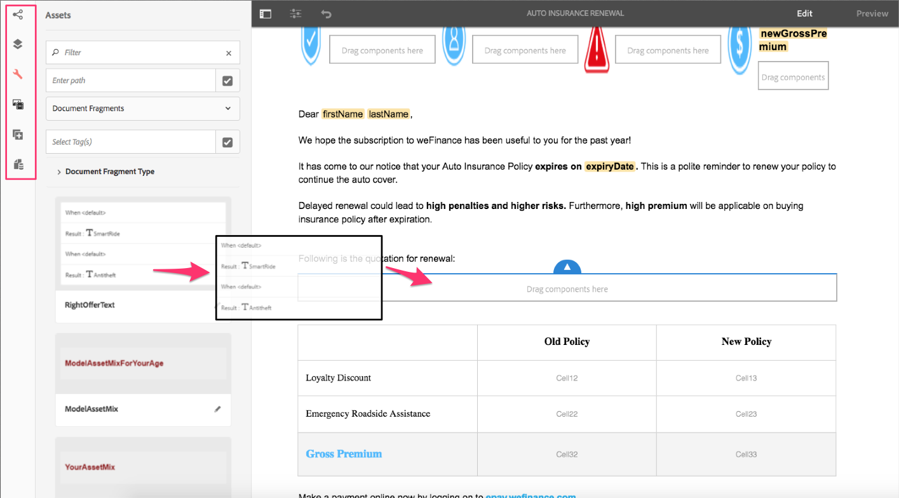
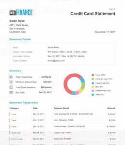
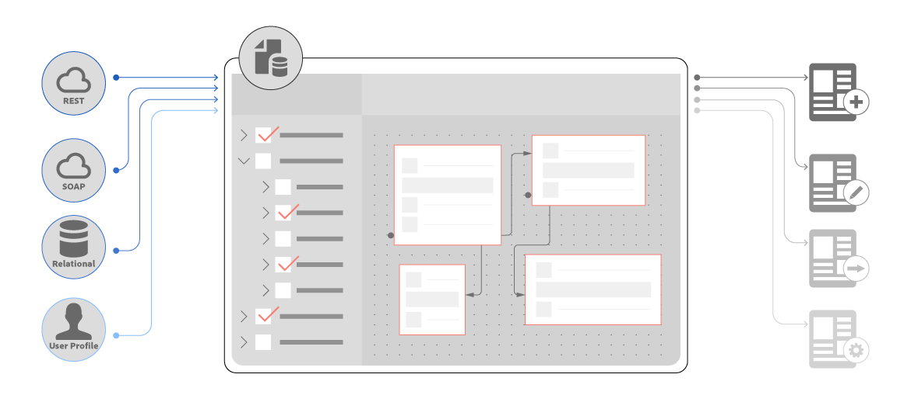

# New features summary | AEM 6.4 Forms {#new-features-summary-aem-forms}

Summary of new features and enhancements in AEM 6.4 Forms.

AEM Forms includes several new features and enhancements that further streamline creation, management, and user experiences with adaptive forms and interactive communications.

Read on for quick introduction to new features and enhancements. Visit documentation for resources offering details. Also, see AEM 6.4 Forms [release notes](/help/release-notes/forms.md). For complete AEM 6.4 Forms documentation, visit [AEM 6.4 Forms User Guide](/help/forms/home.md).

## Interactive Communications {#interactive-communications}

Interactive Communications centralizes and manages the creation, assembly, and delivery of secure, personalized, and interactive correspondences such as business correspondence, letters, documents, statements, benefit notices, wealth management prospectus, marketing mails, bills, and welcome kits.

Interactive Communications uses the same underlying technology, processes, and components as that of adaptive forms, to create responsive multi-channel communications, much like responsive adaptive forms.

Interactive communication offers significant advantages:

* Provides OOTB integration with Form Data Model to enable easy and streamlined access to back end databases and other CRM systems such as MS Dynamics
* Provides an integrated authoring interface for print and web channels  
* Provides drag-and-drop based authoring interface, similar to Adaptive Forms authoring, for both print and web channels.

Interactive communication is the default and recommended approach to create customer communications. To continue using the letters in AEM 6.3 Forms and AEM 6.2 Forms, you need to install a compatibility package.

### Multi-channel interactive communication authoring {#multi-channel-interactive-communication-authoring}

Using interactive communication, you can author and edit both print and web documents from a single document editor. By utilizing the same document fragments to build renditions of both the channels, you can eliminate effort duplication. 
    

For more information, see [Interactive Communications Overview](/help/forms/using/interactive-communications-overview.md).

### WYSIWYG Document Editor {#wysiwyg-document-editor}

The WYSIWYG drag-and-drop document editor is business friendly. The intuitive interface, drag-and-drop functionality, standard components, data models, and integrated repository for assets facilitate quick and easy authoring of interactive communication.

To create an Interactive communication or edit an existing one, business users can use the following building blocks: Channels, Content, Properties, Assets, Components, and Data Sources.

For more information, see [Introduction to authoring Interactive Communication](/help/forms/using/introduction-interactive-communication-authoring.md).

### Auto generate web version from print content in interactive communication {#auto-generate-web-version-from-print-content-in-interactive-communication}

Authors can auto generate web document content from print documents to author, preview, and edit both print and web documents in the same editor. Interactive communication authors can create once and publish to all channels. Interactive communication authors can use the same document fragments in the print and web channel to prevent duplication of effort.

For more information, see [Print channel and web channel](/help/forms/using/web-channel-print-channel.md).

### Use themes to style web channel of interactive communication {#use-themes-to-style-web-channel-of-interactive-communication}

Interactive communication supports themes. You can create themes and apply them to your interactive communication. A theme contains styling details for components and panels. You can reuse a theme on different interactive communications to give them common and consistent appearance and branding.

AEM Forms includes an out of the box theme for Interactive Communications. Using a theme, you can also customize how an interactive communication looks on a device.

For more information, see [Themes in AEM Forms](/help/forms/using/themes.md).

### Enhanced Agent interface {#enhanced-agent-interface}

The Agent user interface now supports print and web preview of the interactive communication. From the same Agent user interface, you can choose to edit print channel and preview web channel of your multi-channel interactive communication. Fields, variables, FDM elements, and document fragments in the print channel can be configured to be modified by the agent in the Agent user interface. Form data model support allows you to generate previews with prefilled sample data.

For more information, see [Prepare and send Interactive Communication using the Agent UI](/help/forms/using/prepare-send-interactive-communication.md).

### Present information in charts {#present-information-in-charts}

Interactive communication supports charts in web and the print channel for richer communications. Using charts such as pie, donut, bar, and column, you can condense and visually present large amounts of information for easy interpretation and analysis. 

 

For more information, see [Using charts in Interactive Communications](/help/forms/using/chart-component-interactive-communications.md).

### Out-of-the-box data connectors to prefill documents {#out-of-the-box-data-connectors-to-prefill-documents}

Interactive communication provides data integration with business tools to connect with multiple business systems including CRM Systems and personalize data into documents. 

For more information, see [Use form data model](/help/forms/using/using-form-data-model.md).

### Enhanced document fragment editor {#enhanced-document-fragment-editor}

You can now use FDM elements and rules within document fragments of interactive communication.

* Support for form data model elements 
* Show or hide an asset/text fragment using rules
* Validate value of an element/variable
* Execute functions to compute value of a mathematical expression

For more information, see:

* [Texts in Interactive Communications](/help/forms/using/texts-interactive-communications.md)
* [Conditions in Interactive Communications](/help/forms/using/conditions-interactive-communications.md)

### Compatibility package for existing assets {#compatibility-package-for-existing-assets}

By default, letter assets from the previous versions of AEM Forms are not supported in this release. If you intend to continue using the letters from AEM 6.3 Forms and AEM 6.2 Forms, you need to install Compatibility package.

## Data Integration {#data-integration}

[AEM Forms data integration](/help/forms/using/data-integration.md) lets you configure disparate data sources; such as databases, RESTful or SOAP-based web services, and OData services; to create a form data model that you can use to bind data, prefill, and invoke services in adaptive forms and documents.

There are several new features and enhancements in data integration in this release.

### Create form data model without data source {#create-form-data-model-without-data-source}

Business users and form authors can now create a form data model including its entities and properties without configuring a data source, and can be used to author adaptive forms and documents. You can bind the form data model to data sources later. It eliminates dependencies on data sources to author forms and documents using form data model.

Similarly, you can create entities and child properties in an existing form data model and bind them to corresponding entities and properties in a data source later.

For more information, see [Create form data model](/help/forms/using/create-form-data-models.md).

### Create computed properties {#create-computed-properties}

Forms authors and developers can create computed properties in form data model. They enable you to compute a value for the property by creating rules or logic on data available in configured data sources. A rule is an expression that is evaluated when the data loads in the form data model or the values of the properties in the expression change. For example, a computed property called Installments computes the monthly amount to be paid for a loan based on the interest rate specified in the data source and the loan amount and tenure specified by the user in the form.

A computed property resides locally in a form data model and does not exist in a data source. You can use computed properties in adaptive forms and interactive communications.

For more information, see [Work with form data model](/help/forms/using/work-with-form-data-model.md).

### Preview forms and documents with sample data {#preview-forms-and-documents-with-sample-data}

Form data model lets you generate sample data for properties of all entities in a form data model. The generated data corresponds to the data types configured for the properties. When you preview an adaptive form or document associated with the form data model, it renders with prefilled sample data.

The sample data is a set of random values that change every time you generate it. However, you can edit and save the sample data that persists even if you regenerate it. For example, if you edit and save the sample data for First Name and Last Name properties and later add another property or entity in the form data model and regenerate the sample data, the First Name and Last Name properties will show the saved values while the values for other properties are regenerated.

For details, see [Use form data model](/help/forms/using/using-form-data-model.md).

### Refresh data source definitions {#refresh-data-source-definitions}

Any update in data source entities or properties does not automatically reflect in associated form data models. Form data model editor now features  (Refresh Data Source Definitions) that invalidates the server cache and fetches updated schema from the data source to immediately reflect in the form data model.

### Configure data sources using Touch user interface {#configure-data-sources-using-touch-user-interface}

With this release, the cloud services configuration for data sources is available in Touch user interface. Also, the location to configure cloud services has changed to **[!UICONTROL Tools > Cloud Services > Data Sources]**. See [Configure data sources](/help/forms/using/configure-data-sources.md).

## Adaptive Forms {#adaptive-forms}

 

### Improve performance of adaptive forms with enhanced lazy loading {#improve-performance-of-adaptive-forms-with-enhanced-lazy-loading}

The lazy loading functionality in adaptive forms defers initialization of form fragments until they are needed. It improves the performance of large forms by minimizing the time required to render a form resulting in better user experience.

There are several enhancements to the lazy loading feature in this release:

* File attachment and Terms and conditions components are supported in form fragments with lazy loading enabled.
* Adaptive form fragments with lazy loading enabled are supported in repeatable panels.
* Adaptive forms with lazy loading enabled fragments are supported in AEM Forms app.

## Forms-Centric AEM Workflows {#forms-centric-aem-workflows}

With Forms-Centric AEM Workflows capability, you can rapidly build and deploy workflows for various tasks on the OSGi stack. You are no longer required to install the Process Management capability available on JEE stack, simplifying deployment and eliminating application server and infrastructure costs. For more information, see [Forms-centric workflows on OSGi](/help/forms/using/aem-forms-workflow.md).

Following are the enhancements in Forms-Centric AEM Workflows:·

* Workflow model editor is available in Touch user interface. It helps you reduce the time required to create form-centric AEM Workflows.
* Workflow step to send emails. For example, you can use the email step to send a document of record on completion of a workflow.
* Workflow step to use form data model services in a workflow model. This step allows you to invoke data integration services without writing any custom code. For example, you can invoke a GET service to obtain employee details from a database archives without writing any custom code.

## AEM Forms App {#aem-forms-app}

AEM Forms app allows field workers to synchronize their mobile devices with an AEM Forms server and work on their forms. The application works seamlessly when the device is offline by saving data locally on the device and synchronizing the data with the server when the device is back online. For more information, see [AEM Forms app](/help/forms/using/aem-forms-app.md).

Following are the improvements in AEM Forms app:

* Adaptive forms with lazy loading enabled fragments are supported in AEM Forms app.
* Adaptive forms with form data model are supported in AEM Forms app.

## Document Security {#document-security}

Using document security, you can safely distribute any information that you have saved in a supported format. Document security ensures that only authorized users can use your documents. The following are the major changes in document security:

* Document security provides a [Portable Protection Library (PPL)](/help/forms/using/document-security-offerings.md) to protect a document locally, without sending the document to AEM Forms server. Only security credentials and policy details travel over the network to AEM Forms server. AEM 6.4 Forms has introduced Portable Protection Library (PPL) in an OSGi bundle format. Now, you can directly install the PPL library on an AEM Forms server and use the capabilities of AEM and PPL in conjunction with each other.
* Document security C++ SDK and C++ PPL library can be compiled with Microsoft Visual Studio 2013. The previously supported version was Microsoft Visual Studio 2010.

## Supported Platforms {#supported-platforms}

AEM Forms can be set up using any combination of supported operating systems, application servers, databases, database drivers, JDK, LDAP servers, and email servers. The following are the major changes in supported platforms:

<table> 
 <tbody> 
  <tr> 
   <td>Component</td> 
   <td>Support Added</td> 
   <td>Support Removed</td> 
  </tr> 
  <tr> 
   <td>Operating systems</td> 
   <td> 
    <ul> 
     <li>Microsoft Windows Server 2016</li> 
     <li>Oracle Linux 7 Update 3</li> 
    </ul> </td> 
   <td> 
    <ul> 
     <li>IBM AIX 7.2 [1]  </li> 
     <li>Solaris 11 [1]</li> 
    </ul> </td> 
  </tr> 
  <tr> 
   <td>Application servers  </td> 
   <td> 
    <ul> 
     <li>Red Hat JBoss EAP 7</li> 
    </ul> </td> 
   <td> 
    <ul> 
     <li>IBM Weblogic 12.1.3</li> 
     <li>IBM WebSphere 8.5.5</li> 
     <li>Red Hat JBoss EAP 6</li> 
    </ul> </td> 
  </tr> 
  <tr> 
   <td>Databases</td> 
   <td> 
    <ul> 
     <li>Microsoft SQL Server 2016</li> 
     <li>MySQL 5.7.19 and later</li> 
     <li>IBM DB2 11.1</li> 
     <li>Oracle Multitenant architecture</li> 
    </ul> </td> 
   <td> 
    <ul> 
     <li>Microsoft SQL Server 2012  </li> 
     <li>Microsoft SQL Server 2014</li> 
     <li>MySQL 5.5</li> 
     <li>IBM DB2 10.5  </li> 
    </ul> </td> 
  </tr> 
  <tr> 
   <td>LDAP servers</td> 
   <td> 
    <ul> 
     <li>Microsoft Active Directory 2016</li> 
     <li>IBM Tivoli Directory Server 6.4</li> 
    </ul> </td> 
   <td> 
    <ul> 
     <li>Microsoft Active Directory 2008</li> 
     <li>IBM Tivoli Directory Server 6.3</li> 
     <li>Oracle Directory Server Enterprise Edition 7.0</li> 
    </ul> </td> 
  </tr> 
  <tr> 
   <td>Email servers</td> 
   <td> 
    <ul> 
     <li>Microsoft Office 365</li> 
    </ul> </td> 
   <td> 
    <ul> 
     <li>Novell Groupwise 7</li> 
    </ul> </td> 
  </tr> 
  <tr> 
   <td>Connectors</td> 
   <td> 
    <ul> 
     <li>Connector for Microsoft Sharepoint 2016</li> 
     <li>Connector for EMC Documentum 7.3</li> 
    </ul> </td> 
   <td> 
    <ul> 
     <li>Connector for Microsoft Sharepoint 2007</li> 
     <li>Connector for Microsoft Sharepoint 2010</li> 
     <li>Connector for IBM Filenet 5.0</li> 
     <li>Connector for EMC Documentum 6.7</li> 
    </ul> </td> 
  </tr> 
  <tr> 
   <td>Browsers</td> 
   <td> 
    <ul> 
     <li>Apple Safari 11.x on macOS</li> 
     <li>Apple Safari 11.x on iOS</li> 
    </ul> </td> 
   <td> 
    <ul> 
     <li>Blackberry browser for Blackberry Z30 and Q10 devices</li> 
    </ul> </td> 
  </tr> 
  <tr> 
   <td>AEM Forms app  </td> 
   <td> 
    <ul> 
     <li>Android 4.4 or higher</li> 
     <li>Apple iOS 10 or higher</li> 
    </ul> </td> 
   <td> </td> 
  </tr> 
 </tbody> 
</table>

1. AIX and Solaris operating systems are available only for upgrade customers.
