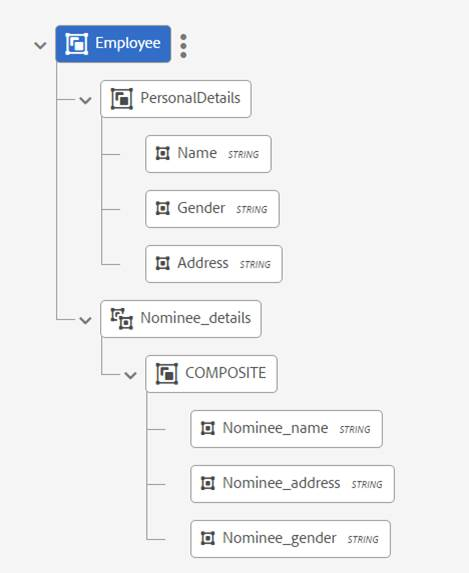
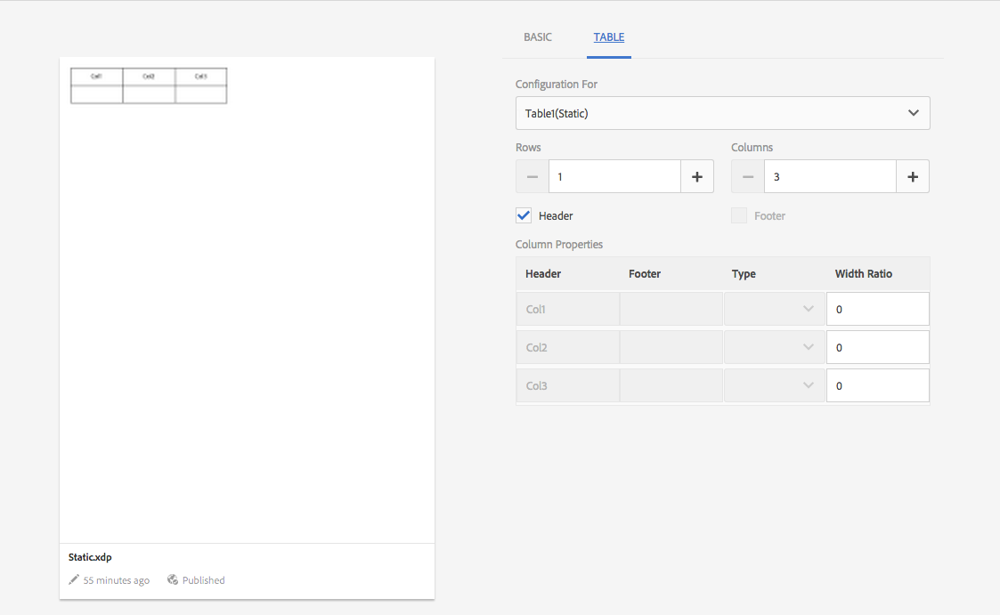

# DO NOT PUBLISH Layout Fragments {#do-not-publish-layout-fragments}

## Layout Fragments {#layoutfragments}

A layout fragment is based on XDPs created in Designer. For creating layout fragments, you need to create the XDPs and [upload them to AEM Forms](/help/forms/using/import-export-forms-templates.md).

One or more layout fragments can form parts of a letter and define the graphical layout of those parts. A layout fragment can contain typical form fields, such as Address and Reference Number, and empty subforms that denote target areas. In addition, layout fragments allow you to create tables and insert them in letters.

A common use case is to locate reusable layout patterns in Letters and create layout fragments for them. For example, the salutation, address, and subject part of the letter, which appears in the same order multiple letters. Another example could be a table similar number of rows and columns used in multiple letters.

You can create a layout fragment based on an existing XDP. A layout fragment can either be made up of fields and target areas or one or more tables. The tables in a layout can be static or dynamic. An XDP is created in Designer and [uploaded to AEM Forms](/help/forms/using/import-export-forms-templates.md). An XDP can form the structure either of a layout fragment or of a letter. More information on [Layout Design](/help/forms/using/layout-design-details.md).

Using fragments that are bound to target areas allows the letter to be changed at the time of authoring. Layout fragment with different dimensions can be created and the appropriate fragment can be bound to the target area. Layout fragments also allow you to customize some of the table properties:

1. You can increase the row and column count.
1. You can specify the header and footer text for more rows and columns.
1. You can define the ratio of table column width. At runtime table columns are resized according to the defined ratio and available space. Sum of the width ratio must be 100. Otherwise it is not applicable.
1. If a table is a place holder (contains only single blank cell), you can define the type (target area/field) of new columns. 
1. You can hide header and footer rows.

Before performing this procedure, create an XFA fragment using Designer. The fragment can contain tables for organizing fields and target areas. Designer allows creation of two types of tables: static and dynamic. Static tables contain a fixed number of rows. Static tables can contain target areas and fields. These target area and fields cannot be bound to repeating DDEs. A dynamic table can have a single row also. The data bound to table cells determines the number of rows for dynamic tables. A dynamic table can contain only fields. DDEs can be repeating or non-repeating.

Consider the following points when designing tables:

1. Tables can be customized at the time of layout fragment creation. However customize option is enabled only when table's parent subform is flowed.
1. For dynamic tables all the fields, repeatable row and table use "use name" binding for data to merge properly.
1. For dynamic tables, all the repeating DDEs bound to the table fields are part of same hierarchy. For non-repeating DDEs, there is no such restriction.
1. At the time of merging layout fragment into parent target area tables are resized according to available space, however resizing takes place only when layout fragment does not contain any target area or field directly inside top- level subform. Target area and fields inside table are permitted.
1. You can create place holder tables. Place holder tables have only a single blank cell.

* For placeholder tables, you can customize following properties at the time of fragment creation.

    * row count
    * column count
    * header and footer for each column
    * type (target area/field) of each columns
    * width ratio for each column

* For a non-placeholder table, you can customize following properties:

    * row count
    * column count
    * header and footer for additional column
    * width ratio for each column

You can nest fragments in a letter. This implies that you can add a fragment within a fragment. The Correspondence Management solution supports up to four levels of nesting within a letter: **Letter**-&gt;**Fragment**-&gt;**Fragment**-&gt;**Fragment**-&gt;**Fragment.**

For a detailed example of using static and dynamic tables in layout fragments, see [Example with sample files: using static and dynamic tables in a letter](#examplewithsamplefiles).

### Creating a layout fragment {#creating-a-layout-fragment}

1. Select **Create** &gt; **Layout Fragment**.
1. Correspondence Management displays the available XDPs. Select the XDP on which you want to base your layout fragment and tap **Next**.
1. Specify the following information for the layout:

    * **Title (Optional):** Enter the title for the layout fragment. Title needs not be unique and can have special characters and non-english characters. Layout fragments are referred by their titles (when available) such as in thumbnails and asset properties.
    * **Name:** The unique name for the layout fragment. No two assets (text, condition, or list) in any state can exist with the same name. In the Name field, you can enter only English language characters, numbers, and hyphens. The Name field is automatically populated based on the Title field. The special characters, spaces, numbers, and non-English characters entered in the Title field are replaced with hyphens in the Name field. Although the value in the Title field is automatically copied to the Name, you can edit the value. This name appears in the list in the Manage Assets user interface.
    * **Description (Optional)**: Description that appears in the list in the Manage Assets user interface.
    * **Tags (Optional)**: Optionally, select the tags to apply to the condition. You can also type in a new tag’s name and create it.

1. Tap the **Table **tab and specify the following information for the layout:

    * **Configuration for**: Select the table being configured. As a suffix to the table name in the dropdown is (Static) if the table is a static one or (Dynamic) if the table is a dynamic table. Static tables contain a fixed number of rows. Static tables can contain target areas and fields. These target area and fields cannot be bound to repeating DDEs. The data bound to table cells determines the number of rows for dynamic tables.
    
    * **Rows**: Select the number of rows for the layout. The configured row count must be greater than or equal to the original row count.
    * **Columns**: select the number of columns for the layout. The configured column count must be greater than or equal to the original column count.

   For each column following details are required:

    * **Header**: text to show for the header
    * **Footer**: text to show for the footer
    * **Type**: type of additional column. Field or Target Area. Type is enabled for static place holder tables. Type can be defined at column level and not at cell level. All the cells in an extended column would be of the same type. For a dynamic table, all the columns are of Field type. For non-placeholder tables, you cannot define the type of additional columns. In this case, type of additional cells in extended column is same as the type of last column in that row; and type of cell in additional row is same as type of last cell in that column.
    * **Width ratio:** ratio of the table column widths.

   For a detailed example of using static and dynamic tables in layout fragments, see [Example with sample files: using static and dynamic tables in a letter](#main-pars-header-28).  

1. Tap **Save**.

### Upload an XDP to Correspondence Management {#upload-an-xdp-to-correspondence-management}

For instructions on uploading/importing an XDP to Correspondence Management, see [Importing and exporting assets to AEM Forms](/help/forms/using/import-export-forms-templates.md).

### Best practices/tips and tricks {#best-practices-tips-and-tricks}

#### Set the default subform binding {#set-the-default-subform-binding}

When creating target areas in Designer, it helps to set the default binding for all new subforms to "none".

To set the default binding:

1. In Designer, tap **Tools** &gt; **Options** &gt; **Data Bindings** &gt; **Subform Binding**.

1. In the Default Binding for New Subforms list, select **No Data Binding**.

This ensures that subforms inserted using the Insert &gt; Subform command or by drag-and-drop from the Object Palette has a binding of "none" by default. This means that by default, any new subform is a target area unless you add content to it, change its binding setting, or name the subform with an "_int" suffix.

#### Section 508-compliance {#section-compliance}

If the finished letter created in the Create Correspondence user interface is used for filling in a later workflow. Follow these recommendations related to Section 508 when creating the layout. Otherwise, the letter PDF is for display, and you can disregard these recommendations:

* All target area subforms and all fields in a layout have a tab order.
* Fields with captions are 508-compliant by default. The field’s /field/assist/speak@priority attribute is set to "custom" by default, which means that, unless custom screen reader text is supplied, the screen reader reads the field’s caption.
* Fields without captions specify a tool tip and indicate that screen readers read the tool tip by setting

`/field/assist/speak@priority="toolTip"` and specifying tool tip text in `/field/assist/toolTip`.

#### Date formats in Designer and Asset Configuration Manager {#date-formats-in-designer-and-asset-configuration-manager}

While designing a layout in Designer, ensure that the formats for date fields match the date formats specified in Data Display Formats in [Correspondence Management Configuration Properties](/help/forms/using/cm-configuration-properties.md). For more information, see “Formatting field values and using patterns” in Designer Help.

#### Capturing date ranges {#capturing-date-ranges}

When dealing with a combination of dates, such as startDate - endDate, use a single subform to ensure correct alignment in the finished letter, and to minimize the number of fields.

#### Setting form-level binding {#setting-form-level-binding}

When a layout contains many fields and target areas that are mapped to single XML elements, use form-level binding and create a separate node for each element. Fields that are bound at the form level are ignored when mapping data in Correspondence Management.

#### Do not use subform target areas in a master page {#do-not-use-subform-target-areas-in-a-master-page}

Subform targets areas in a master page are not visible in the Manage Assets user interface and data cannot be mapped to them.

#### Choosing appropriate positions and types for target areas {#choosing-appropriate-positions-and-types-for-target-areas}

When designing the layout, take care when choosing subforms. If the layout contains a single subform, it can be a flowed type. After you position fields in the subform, you can wrap it in another subform so that the wrapped subform is also flowed and the layout will not be disturbed.

#### Placing fields on master pages {#placing-fields-on-master-pages}

Note the following when you place a field on a master page:

* Set the binding of master page fields to Use global data
* Do not place the field directly under the root PageArea of the master page.
* Wrap the field in a named subform and ensure that the binding of the named subform is set to Use name.

## Creating tables using layout fragments {#creating-tables-using-layout-fragments}

Many letter templates contain tables. Tables can be static, such as a table of terms and conditions, where each row represents one condition and each part is shown in a separate column. Tables can also be dynamic such as account information, which contains information such as customer name, account id, transaction number, and transaction amount.

* **Static Tables**: Tables are sometimes created with rows having a different number of columns, such as for a table of terms & conditions. Where each row represents one condition and each condition can have different subparts. Each part is shown in a separate column.
* **Dynamic Tables**: Layout fragments provide capability of binding a dynamic table's fields to collection DDEs. At the time of letter generation table rows are generated according to the size of collection DDEs.

>[!NOTE]
>
>Use Text Draw elements for creating table headers/footers in the layout fragment template (XDP). Use Text Fields for creating cells in table body rows in layout fragment template.

The DD has a collection element Nominee_details which has a composite element with three primitive elements: Nominee_name, Nominee_address, and Nominee_gender.  
The dynamic XDP also has the same headers. So you can map the dynamic XDP fields with the above mentioned fields of DD.

### Example with sample files: Using Static and Dynamic tables in a letter {#examplewithsamplefiles}

This example shows how you can create a dynamic and a static table, bind the dynamic table to DDEs, and then create a letter that includes these two tables. While working with this example, you can either create files from scratch or use the input files given in the steps.

1. Create a Data Dictionary (DD) that you want to use in the example, as represented in the graphic.

   Then select DD and export sample data. The XML file you get contains Employee data and three instances for Nominee_details (by default 3 instances are downloaded. You can add or delete according to your requirement). Update the values and then import test data in DD. The CMP file is the package and it has the DD in it. So, import the DD to Correspondence Management.

   For more information on working with Data Dictionary and test data, see [Data Dictionary](/help/forms/using/data-dictionary.md#p-working-with-test-data-p).

   

   [Get File](assets/exportpackage_1431709897770.cmp.zip)

1. In Designer, create two XDPs (layout fragments): a dynamic table and a static table. For both the layouts:

    * Add subform to the table column. Ensure that you change the layout of table’s parent subform to flowed and remove the bindings of the subform in table.
    * Add a subform to the table cell. Ensure that you change the layout of table’s parent subform to flowed and remove the bindings of the subform in table.

   Or, use the static and dynamic XDPs attached with this step.  

   For more information on working with Layout Fragments, see [Layout Fragments](#layoutfragments).  
   For more information on designing layouts, see [Designer Help](https://help.adobe.com/en_US/AEMForms/6.1/DesignerHelp/ ).

   [Get File](assets/static.xdp.zip)

   [Get File](assets/dynamic.xdp.zip)

1. Upload the XDPs to AEM Forms. 
1. Create a layout fragment based on the dynamic XDP. The Table tab of the properties displays that the table is dynamic (Configuration For field). The number of rows (1) and columns (3) are derived from the XDP/Layout Fragment.

   This layout's fields are later bound to the imported DD and in the letter, the number of rows are dynamically created based on the number of records in the test data file (the XML data file attached with the DD). 

   

   Click to open full-sized image

1. Create a layout fragment based on the static XDP. The Table tab of the properties displays that the table is static (Configuration For field). The number of rows (1) and columns (3) are derived from the XDP/Layout Fragment.

   You can change the number of columns and rows here. According to what you choose in this screen, the number of rows and columns of a static table remain fixed in the letter that is created with this layout.
   

1. Create a letter using both the layout fragments in it. When you insert the dynamic XDP in the letter, set the binding of its fields to the Data Dictionary's collection elements.

   For more information on creating Letters and Letter templates, see [Create Letter](/help/forms/using/create-letter.md).

1. Save the letter and preview it. When you preview the letter, the values from the Data Dictionary show in the letter. For the dynamic table, there are three rows. This is because the test data has three records for these rows.

   For the static table, there are as many rows and columns as you specified while creating the layout fragment.

   

   For the dynamic table, the three rows appear according to the number of records in the test data file. This happened because while adding the layout to the letter, you created a binding between the dynamic table's fields and the data dictionary's collection elements. The Name, Address, and Gender values are populated from the test data file you used.

   

