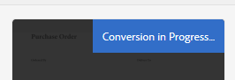

# Use Automated Forms Conversion service {#use-automated-forms-conversion-service}

Run the Automated Forms Conversion service to convert PDF forms to adaptive forms

AEM Forms Automated Forms Conversion service, powered by Adobe Sensei, automatically converts your PDF forms to device-friendly and responsive adaptive forms. Whether you are using non-interactive PDF forms, Acroforms, or XFA-based PDF forms, the Automated Forms Conversion service can easily convert these forms into adaptive forms. For information about the capabilities, conversion workflow, and onboarding information see [Automated Forms Conversion](/help/forms/using/wip/introduction-to-automated-form-conversion-service.md) service.

## Pre-requisites {#pre-requisites}

* [Configure the conversion service](/help/forms/using/wip/configure-the-automated-forms-conversion-service.md)  

* Prepare the [templates](/help/forms/using/template-editor.md) to be applied to converted forms
* Prepare the [themes](/help/forms/using/themes.md) to be applied to converted forms

## Start the conversion process {#start-the-conversion-process}

After you connect your AEM instance with AEM Forms Conversion Service, you can convert your print forms to adaptive forms. Perform the following steps in the listed order to convert the forms:

* [Upload PDF forms to your AEM Forms server](/help/forms/using/wip/convert-existing-forms-to-adaptive-forms.md#upload-pdf-forms-to-your-aem-forms-server)
* [Run the conversion](/help/forms/using/wip/convert-existing-forms-to-adaptive-forms.md#run-the-conversion)
* [Review and correct the converted forms](#review-and-correct-the-converted-forms)

### Upload PDF forms to your AEM Forms server {#upload-pdf-forms-to-your-aem-forms-server}

The conversion service converts PDF forms available on your AEM Forms instance to adaptive forms. You can upload all the PDF forms at once or in a phased manner, as required. The source folder should not have more than 15 forms and 50 pages in total. The size of source folder should not exceed 10 MB. Do not keep forms in a sub-folder of the source folder. Perform the following steps to upload the forms to be converted to a folder on your AEM Forms instance:

1. Log in to the AEM Forms instance.   

1. Tap **[!UICONTROL Adobe Experience Manager]**  > **[!UICONTROL Navigation]**  **[!UICONTROL]**> **[!UICONTROL Forms]** > **[!UICONTROL Forms & Documents]**.
1. Tap **[!UICONTROL Create]**> **[!UICONTROL Folder]**. Specify **Title** and **Name** of the folder. Tap **[!UICONTROL Create]**. A folder is created.
1. Tap to open the newly created folder.
1. Tap **[!UICONTROL Create]**> **[!UICONTROL File Upload]**. Select the forms to upload, click **[!UICONTROL Open]**, and click **[!UICONTROL Upload]**. The forms are uploaded.

### Run the conversion {#run-the-conversion}

After you have uploaded the forms and configured the service, perform the following steps to start the conversion:

1. On your AEM Forms instance, tap **[!UICONTROL Adobe Experience Manager]**  > **[!UICONTROL Navigation]**  **[!UICONTROL]**> **[!UICONTROL Forms]** > **[!UICONTROL Forms & Documents]**.
1. Select the folder containing PDF forms (forms to be converted) and tap **[!UICONTROL  **Start Automated Forms Conversion**]**. The **[!UICONTROL Conversion Settings]** dialog appears.

   

1. In the **[!UICONTROL General]** tab of the Conversion Settings dialog:

    * Select a **[!UICONTROL Cloud Configuration]**. Template and Theme options are automatically filled on selecting the configuration. You can specify a different template or a theme, if required.
    * Select the **[!UICONTROL Extract Fragment]** option to allow the conversion service to identify, extract, and download form fragments for converted forms.
    * Specify the location of **[!UICONTROL Existing Fragments]**, if required. Conversion service uses the Form Fragments available at the specified location in converted forms, wherever applicable.

   >[!NOTE]
   >
   >You can use only **Extract Fragment** or **Existing Fragments** at a time. You cannot use both the options simultaneously.

1. In the **Output** tab of Conversion Settings dialog, specify the location to save converted forms (adaptive forms), adaptive form schema, form fragments, and form fragments schemas.
1. Tap **[!UICONTROL Start Conversion]**. The Conversion is started. The **[!UICONTROL Conversion in Progress]** logo is displayed until the conversion is in progress. The logo is removed after the conversion is complete. You can periodically refresh the folder to check the conversion status. A status email is also sent on the [configured email address](/help/forms/using/wip/configure-the-automated-forms-conversion-service.md#main-pars-header-242943920) on completion of conversion.

   On a successful conversion, the converted adaptive form and related schema are downloaded to the folder specified in the **[!UICONTROL Output]** tab of the conversion dialog. Form fragments and corresponding schema are downloaded only if the **[!UICONTROL Extract Fragment]** option is selected before starting the conversion.

   

   >[!NOTE]
   >
   >When a secured PDF is provided, the conversion fails. On a failed conversion, the Conversion failed logo is displayed if all the input forms fail to convert or the Partially failed logo is displayed when only a few of all the input forms fail to convert. A status email is also sent on the [configured email address](/help/forms/using/wip/configure-the-automated-forms-conversion-service.md#main-pars-header-242943920). An error is also logged to the error.log file.

## Review and correct the converted forms {#review-and-correct-the-converted-forms}

Real world forms have complex data capture requirements. Once the automated conversion is complete, customers can review the conversion quality of the form and make necessary updates to the form. AEM Forms provides a [review and correct](/help/forms/using/wip/review-correct-ui-edited.md) editor to make required changes. It allows you to improve automated identification of form fields and convert identified fields from one type to another. For example, you can help identify two-column layout of a form and change a field automatically identified as radio button to multiple choices field.

## Previous {#previous}

[Configure the Automated Forms Conversion service](/help/forms/using/wip/configure-the-automated-forms-conversion-service.md)

## Next {#next}

[Review and correct converted forms](/help/forms/using/wip/review-correct-ui-edited.md)
