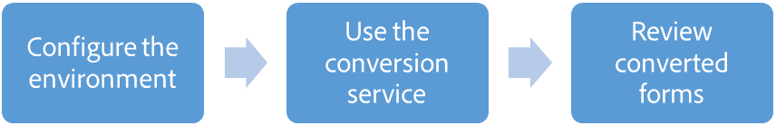

# Automated Forms Conversion service {#automated-forms-conversion-service}

Speed up the conversion of print forms to adaptive forms

Automated Forms Conversion service helps accelerate digitization and modernization of data capture experience through automated conversion of legacy print forms to adaptive forms. The service, powered by Adobe Sensei, automatically converts your PDF forms to device-friendly and responsive adaptive forms. While leveraging the existing investments in PDF Forms, the service also applies appropriate validations to adaptive form fields during conversion. The service helps:

* Save manual effort required to convert legacy forms to adaptive forms
* Generate reusable adaptive form fragments
* Generate Document of Record during conversion
* Apply patterns and appropriate validations during conversion
* Enables Adobe Analytics during conversion

The service supports PDF forms created with any version of AEM Forms or Adobe LiveCycle, going all the way back to AEM 6.0 Forms and Adobe LiveCycle ES3. The service also supports forms created with Adobe Acrobat.

## Supported languages and PDF forms {#supported-languages-and-pdf-forms}

Automated Forms Conversion service converts only English-languag forms to adaptive forms. You can translate converted adaptive forms to another language using [AEM translation workflow](/help/forms/using/using-aem-translation-workflow-to-localize-adaptive-forms.md).

Conversion service supports non-interactive PDF forms, Acroforms, and XFA-based forms. Acroforms, and XFA-based forms has a limited support.

## Conversion workflow  {#conversion-workflow}

Automated Forms Conversion service runs on Adobe Cloud. You connect your AEM instance to the service, upload legacy forms to your AEM instance, specify configurations, and start the conversion. The complete conversion process is as listed below:

1. **Set up the environment**: Before starting the conversion, connect your AEM Forms instance to the conversion service running on Adobe I/O, prepare templates, prepare themes, customize meta-model, and configure email service:

    1. Install [AEM Forms add-on package](/help/forms/using/installing-configuring-aem-forms-osgi.md) and [Conversion Manager package](/help/forms/using/wip/configure-the-automated-forms-conversion-service.md#download-and-install-conversion-manager-package): Install AEM Forms add-on package to avail AEM Forms capabilities and Conversion Manager package to avail conversion service capabilities.  
    
    1. Create an adaptive form theme: A theme provides a unique appearance and style to an adaptive form. You can apply out of the box themes provided with adaptive forms or [create custom themes](/help/forms/using/themes.md) of your own.
    1. Create an adaptive form template: A template contains a set of adaptive form components common for a set of forms. For example, identical header, footer, and logo for the forms of an organization. You can use the [template editor](/help/forms/using/template-editor.md) to create a template.   
    
    1. Customize meta-model: Meta-model defines mapping for all the adaptive form components. For example, a legacy form field with keywords phone, telephone, mobile phone, work phone, home phone, telephone number, telephone no, and phone number are all mapped to the adaptive form’s telephone component. It also allows the service to pre-configure validations, rules, data patterns, help text, and accessibility properties of adaptive form components. [Extend the default meta-model](/help/forms/using/wip/extending-the-default-meta-model.md) to add organization-specific mapping and validations.
    1. Configure email notifications: [Configure email-service](/help/forms/using/wip/configure-the-automated-forms-conversion-service.md#configure-email-notification) to receive the status of conversion.  
    
    1. Configure cloud services: Create a [cloud service configuration](/help/forms/using/wip/configure-the-automated-forms-conversion-service.md#configure-the-cloud-service) to connect your AEM instance to the conversion service. It also allows you to specify a template, theme, and form fragments for conversion.

1. **Use the conversion service**: Use the conversion service to convert legacy PDF forms available on your AEM Forms instance to adaptive forms. To convert the forms:

    1. [Upload legacy forms](/help/forms/using/wip/convert-existing-forms-to-adaptive-forms.md): Upload the forms to be converted to a folder on your AEM Forms instance. The conversion is run on all the legacy forms available in the folder.  
    
    1. [Start the conversion](/help/forms/using/wip/convert-existing-forms-to-adaptive-forms.md#run-the-conversion): Select the folder containing the legacy forms and start the conversion. On the dialog box, select a cloud service configuration, specify output location, and click start conversion. Legacy forms are uploaded to Adobe Cloud for conversion.

   On successful conversion, an adaptive form and its schema are generated and downloaded to your AEM Forms instance. Adaptive forms fragments its schemas are also generated, if applicable.

1. **Review converted forms**: Your forms can have complex data capture requirements. Once automated conversion is complete, you can use the [Review and Correct editor](/help/forms/using/wip/review-correct-ui-edited.md) to review converted form and make necessary updates and generate an enhanced output closer to desired experience. After making required changes, resend the forms to the conversion service.

   Conversion of a PDF form to an adaptive form might take some time based on the load on the Adobe I/O servers. When the conversion is complete, an email notification is sent to configured email address.

## Previous {#previous}

* [Prerelease Program](/help/forms/using/wip/aem-forms-automated-forms-conversion-service-beta.md)

## Next {#next}

[Configure the Automated Forms Conversion service](/help/forms/using/wip/configure-the-automated-forms-conversion-service.md)
