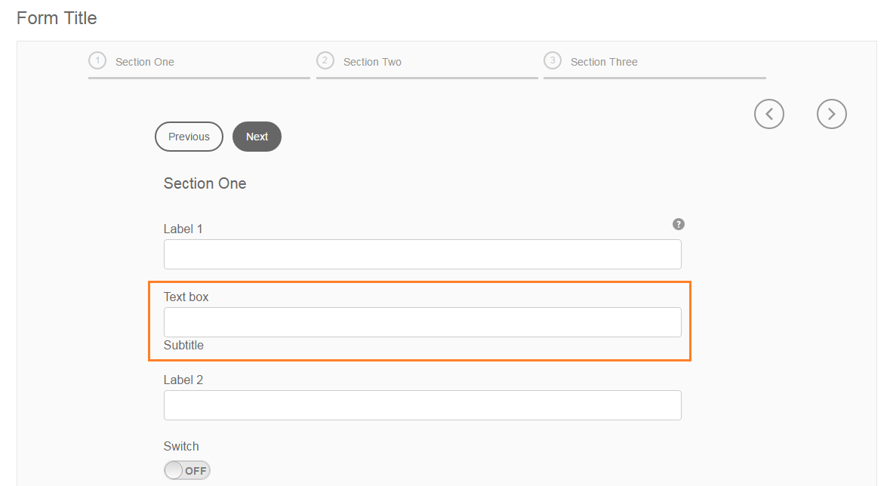
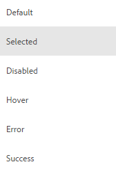

# DO NOT PUBLISH - New states in Theme Editor {#do-not-publish-new-states-in-theme-editor}

An AEM Forms component contains states that let you define its behavior when a user interacts with it in the rendered form. Standard states are focus, disabled, hover, error, and success. These states correspond to [UI element states in CSS](https://www.w3.org/TR/2001/CR-css3-selectors-20011113/#UIstates). When you open the structure of a component, you can find these states in the cq:styleConfig node. For example, in the text box component, states fall under c `q:styleConfig > items > field > items > widgetAndText > states`. Similarly, you can specify states when you create your component or customize a component.

When you create or customize a component, it is stored in the `/apps` folder in CRXDE. Perform the following steps to add states for the new component.

1. Open CRXDE in your browser.  
   URL: `https://<server>:<port>/crx/de/index.jsp`
1. Navigate to `/apps/<path-to-your-component>`.  
   For example, a text-box component is customized to include a label below the text box, called subTitle. In this example, a subTitle node is created under `cq:styleConfig`.

   

1. Add states in the node that you want to style in the theme editor.  
   In this example, Selected state is added instead of focus. Other standard states are added as-is.
1. To enable styling of the states for the widget in the customized component, create `cq:themeConfig` node and overlay the widget using it. The `cq:themeConfig` node lets theme editor use custom states you add in the component instead of inheriting states from the default component.

   In this example, `cq:themeConfig` node is created as shown in the screenshot below.

   

   The properties of the footer node are specified as:  

    

1. In CRXDE, click **[!UICONTROL Save All]** above the address bar.

To verify that you can style the component with new states, edit a theme in which your custom component is included as a selector.

In the example theme below, the custom component is available as selector for styling. 

When you click the selector, the State drop-down in sidebar lists the custom states. In the example, Selected state is the added custom state that is available in the State drop-down. 

The states that you add in Theme Editor are available for inline styling also. If you add your custom component in your form, and switch to Style layer, you can see the states you added for your component when you select it. 
