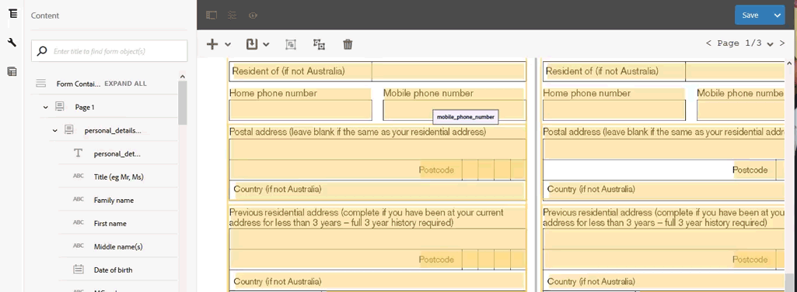
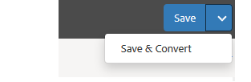
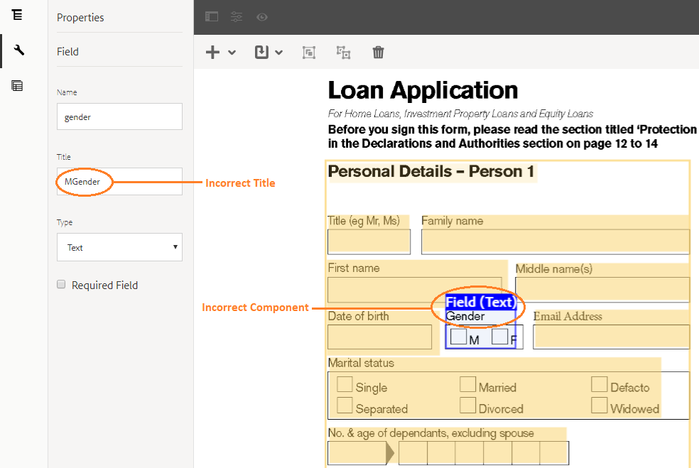

# Review and correct converted forms {#review-and-correct-converted-forms}

Review and correct the adaptive forms converted by the Automated Forms Conversion service.

AEM Forms Automated Forms Conversion service identifies fields, content, and layout of input PDF document and converts the PDF document to an adaptive form. The output adaptive form can have a few missing or improperly converted fields. You can use the Review and Correct editor to make improvements to identified fields and regenerate the adaptive form to get an output closer to the desired experience. After the first conversion, you can open the input PDF document in the editor to:

* View all the fields and contents identified during the conversion  
* Identify the fields and content missed during conversion  
* Verify the type of a field and change type of fields, if required  
* Change layout of the form  
* Remove wrongly identified fields

After making the required changes, resend the PDF forms to conversion service. On a successful conversion, updated assets including the adaptive form, schema, and fragments are downloaded to your AEM Forms instance. You can repeat the process until the desired experience is achieved. 

## Welcome to Review and Correct editor {#welcome-to-review-and-correct-editor}

The Review and Correct editor provides an easy to use interface. It has the following components:

* Toolbar: The toolbar is on the top of the editor. It displays tools to add, modify, group, ungroup, and delete fields.
* Content browser: It displays all the identified fields. Every field is converted to an adaptive form component.   
* Properties browser: It displays the properties of a selected field. You can also modify the properties.  
* PDF form: The editor displays the source PDF document and overlays it with identified fields. You can use the tools from the toolbar to modify the fields.   
* Save button: The **[!UICONTROL Save]**button is on the upper-right corner of the editor. You can also use arrow next to the Save button to view the option to send the form for conversion.  

* Filter button: The filter button  is on the top of the editor. It allows you to filter the fields to display only texts, fields, choice Groups, panels, or all the components.   

* Open Adaptive Form Editor option: The Open Adaptive Form Editor option appears on tapping the  icon. Open the adaptive forms editor after making all the necessary changes in Review and Correct editor.

**A.** Content Browser **B.** Properties Browser **C.** **D.** Toolbar **E.** Open Adaptive Form Editor option **F.** Filter button **G.** Save button **H.** PDF form overlayed with identified fields

After the first successful conversion, the conversion service overlays the source PDF document with identified fields and components. These fields or components are of type: Text, Field, Panel, and Choice Group:

* Text: Plain text in the source PDF document. For example, the Loan Application text in the image displayed above.
* Field: Combination of text or icon label associated with a value or input box. For example, the First field name in above image. It has text label and an input box. A field supports text, numeric, date, email, telephone number, signature, currency, and password data types.  
* Panel: Logical collection of content and components. For example, Personal Details of Person 1 and Person 2 panels in above image.   
* Choice group: Combination of text associated with multiple choice options: check box, dropdown, and radio button. For example, Marital status and Existing customer in above image.

The Review and Correct editor allows you to add, change, or remove fields or components from the source PDF document. It also allows you to set properties of a component. You can use the properties browser to set properties.  

## Start reviewing a conversion {#start-reviewing-a-conversion}

After the first successful conversion, the conversion service overlays the source PDF document with identified fields and components. You can make improvements to identified fields and regenerate the adaptive form to get an output closer to the desired experience. You can start reviewing a conversion only after first successful conversion.

### Before you start {#before-you-start}

* Review and Correct editor does not support fragments. Do not use the editor to review conversions that had the **Extract Fragment** option enabled during conversions. You can use the [adaptive form editor](/help/forms/using/wip/review-correct-ui-edited.md#open-adaptive-forms-editor) for such conversions.  

* Review and Correct editor does not support tables. So, the tables are not displayed in the editor. You can use [adaptive form editor](/help/forms/using/wip/review-correct-ui-edited.md#open-adaptive-forms-editor) to fix table-related issues.
* Review and Correct editor does not have undo action. Use the Save button only for permanently saving the changes.

### Start the review {#start-the-review}

To start reviewing conversions, select the source PDF document used for conversion and select and tap **Review Conversions**. The Review and Correct editor opens in a new tab. You can start reviewing conversions. Perform the following basic checks before start fixing any other issue:

1. **Check type of all the fields**: The conversion service can assign a wrong type to a field. For example, type text is assigned instead of type telephone to the mobile phone field. You can hover on a field to find the type of the field.

   To change type of a field, select the field, open the properties browser, select a value from the **[!UICONTROL Type]** drop-down, and tap **[!UICONTROL Save]**. The type is changed.

   

1. **Remove extra panels**: The conversion service can generate extra panels. For example, an extra subpanel is included in parent panel, empty space is converted to a panel, a check-box is converted to a panel. Review the boundaries of all the panels and remove extra panels. You can use the filter button or content browser to view all the panels.

   You can delete or ungroup a panel to remove it. On using the delete option, the child fields or components of the panel are also deleted:

    * To delete a panel, select the panel, and tap the delete  icon in the toolbar. On the confirmation dialog, tap **Confirm**. The panel is deleted and child fields of the deleted panel are adjusted to parent field. Tap **Save **to save the changes.  
    
    * To ungroup a panel, select the panel, and tap the ungroup icon in the toolbar. Tap **Save **to save the changes.

1. **Create logical groups of text**: Validate the identified texts for completeness and correctness. Also check, the texts are logically placed in correct panels or groups. For example, in a multicolumn layout, the texts of one logical group and placed in another group.

    * To review completeness and correctness of the text, use the filter button to view only text, click each text, and validate. Fix the spelling, typos, or grammar issues, if any.

    * To add text to the form, tap the + button, tap **[!UICONTROL Text]**. Draw the box, open the properties browser, and type the text to add to the Content box.

After making required changes, tap the **[!UICONTROL Save & Convert]** button to resend the PDF forms to conversion service. Each field is converted to a corresponding adaptive field component. After conversion, the updated assets including the adaptive form, schema, and fragments are downloaded to your AEM Forms instance. Depending on the complexity of the form, the service can take some time to complete the conversion.

After performing the basic checks, you can review the form to fix issues specific to your organization. These issues can be related to adding missing fields, changing layout, fixing tables in adaptive form editor, and more. You can view the [Use the Review and Correct editor tools](/help/forms/using/wip/review-correct-ui-edited.md#use-the-review-and-correct-editor-tools) section to learn about all the tools the editor provides to fix such issues.

You can also work on recognizing identical issues which occur in almost all of your forms and report such patterns to Adobe. Use the Review and Correct editor until the desired experience is achieved.

## Use the Review and Correct editor tools {#use-the-review-and-correct-editor-tools}

With Review and Correct editor, you can:

* [Add a component to the form](/help/forms/using/wip/review-correct-ui-edited.md#add-a-component-to-the-form)  

* [Change type a component](/help/forms/using/wip/review-correct-ui-edited.md#change-type-a-component)  

* [Create or remove a panel](/help/forms/using/wip/review-correct-ui-edited.md#create-or-remove-a-panel)
* [Delete a panel or component](/help/forms/using/wip/review-correct-ui-edited.md#delete-a-panel-or-component)
* [Set properties of a component](/help/forms/using/wip/review-correct-ui-edited.md#set-properties-of-a-component)
* [Send a form for conversion](/help/forms/using/wip/review-correct-ui-edited.md#send-a-form-for-conversion)  

* [Open adaptive forms editor](/help/forms/using/wip/review-correct-ui-edited.md#open-adaptive-forms-editor)

### Add a component to the form {#add-a-component-to-the-form}

The conversion service might not identify some components of the print form. For example, in a **Date of birth** component of a form is not identified during the conversion. You can use the **+** tool to help identify such components. The tool allows you to add text, field, choice group, and panel components. 

To add a component to the form, tap **+ **and tap **Field**. Draw a box covering label and input box of the field. For example, the above example image uses the field component to add the** Date of Birth** label and value box below it to the form. When you draw the box, the conversion service identifies the type of the field. You can change the type of field from properties browser, if required. After creating the component, open the properties browser, and set the properties of the component.

Tap **Save** button to save the modifications or use the **[!UICONTROL Save & Convert]**button to resend the PDF forms to conversion service.

### Change type a component {#change-type-a-component}

The conversion service can create some fields of incorrect type. For example, in the following image, the **Gender** field is incorrectly identified as a **Text** field. Also, the content of the label is incorrect. The field should be a choice field type and the label should be Gender. To change the type of a component and correct its label:

Select the field to convert, tap  and tap a field type. The field is converted to selected field type. A field can be converted only to types listed in the following table. A panel component can only be ungrouped, not transformed. 

| **Component** |**Converts to** |
|---|---|
| Text |Field or Choice Group |
| Field |Text or Choice Group |
| Choice Group |Text or Panel |

Once converted, open the properties browser, specify label, and specify other required properties. Tap **Save** button to save the modifications or use the Save & Convert button to resend the PDF forms to conversion service.

### Create or remove a panel {#create-or-remove-a-panel}

The conversion service aggregates related components and content of print forms to a panel. For example, the form can have an address panel with fields such as, name, plot no, area, city, state, ZIP code, and country. These fields are grouped in a panel. A form can have multiple panels.

The conversion service can create panels that have components with no relationship to other or leaves a relative component out of the panel. You can use the group or ungroup tools to fix such panels:

* To remove a panel, select the panel, and tap ungroup . The panel is removed and the child components of the panel are merged to parent component. You can also use the [delete component](/help/forms/using/wip/review-correct-ui-edited.md#delete-a-panel-or-component) option to delete a panel and its children.  

* To create a panel, use the Ctrl key (on Windows or Linux) or Control key (on Mac) to select related components, and tap  to create a panel. Open the properties browser to specify properties of the panel.

Tap **Save** button to save the modifications or use the **Save & Convert** button to resend the PDF forms to conversion service. 

### Delete a panel or component {#delete-a-panel-or-component}

The conversion service can identify some incorrect panels or components. Most of these components of these panels are non-related. You can delete such panels or component.

To delete a panel or a component, select a panel or a component, and tap the delete  icon. On the confirmation dialog box tap **[!UICONTROL Confirm]**. The selected panel or component is deleted. On deleting a panel, all the children of the panel are also deleted. You can use the Ctrl key (on Windows or Linux) or Control key (on Mac) to select multiple components or panels.

### Set properties of a component {#set-properties-of-a-component}

Every component of the form has a set of properties like name, title, type. To set the properties of a component, select the component, and tap properties browser. Properties of the selected component are displayed. Change or set the properties.

Tap **Save** button to save the modifications or use the **Save & Convert** button to resend the PDF forms to conversion service.

### Send a form for conversion {#send-a-form-for-conversion}

Once you have made all the required changes in Review and Correct editor, you can resend the form for conversion. To send the form for conversion, tap **[!UICONTROL Save & Convert]**. The **[!UICONTROL Sent for conversion label]**is applied to the folder containing the source document and the updated source form is uploaded to conversion service running on Adobe I/O.

Depending on the complexity of the form, the conversion service can take some time to convert the form. After the conversion is complete the converted adaptive form and related assets is downloaded to your machine. You can review the form in the editor after the conversion is complete and open the adaptive form in [adaptive form editor](/help/forms/using/wip/review-correct-ui-edited.md#open-adaptive-forms-editor) for the final set of fixes, if required.

If you resend a form for conversion after updating the form in adaptive form editor, all the changes made in adaptive form are lost.

### Open adaptive forms editor {#open-adaptive-forms-editor}

There can be instances where you require adaptive forms editor to make the changes like, applying a different theme to the form or fixing tables. Once you have made all the required changes in Review and Correct editor and converted the form, you can open your form in adaptive forms editor to make the final set of changes.

To open the form with adaptive forms editor, tap the  icon, and tap **Open Adaptive Form Editor**. The form opens in adaptive form editor.

## Previous {#previous}

[Use Automated Forms Conversion service](/help/forms/using/wip/convert-existing-forms-to-adaptive-forms.md)
