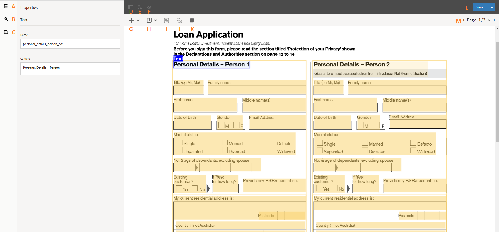
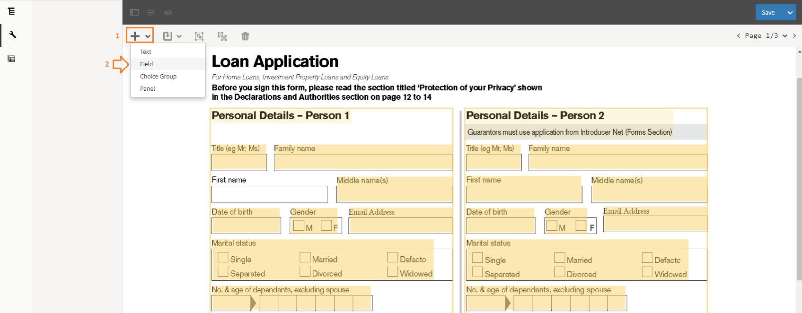
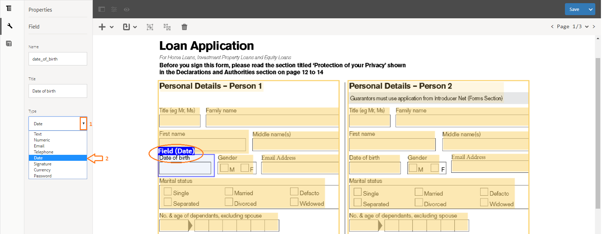
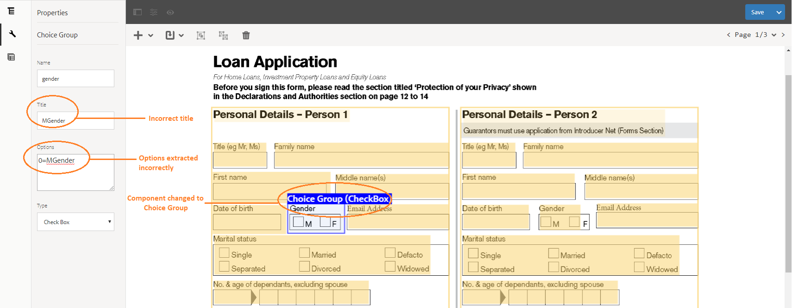
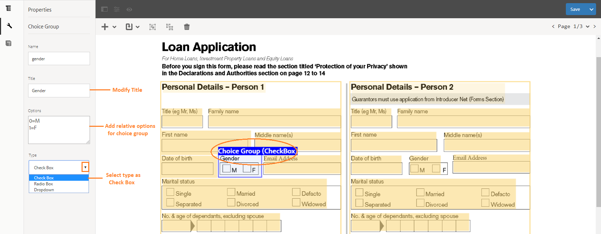
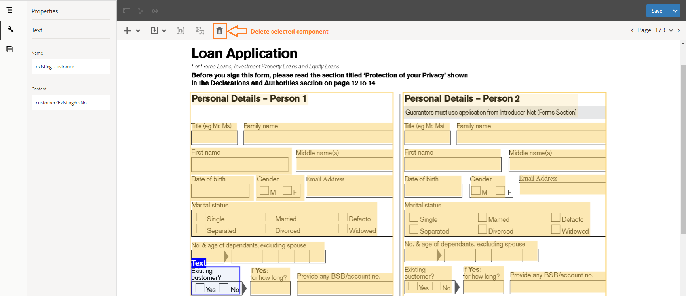
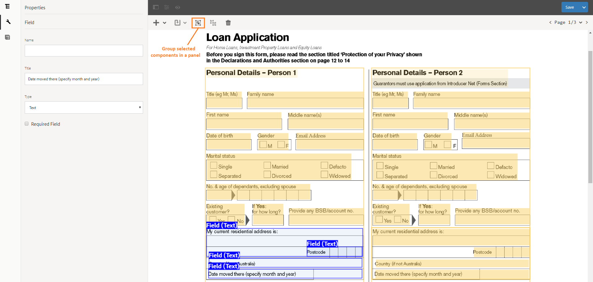
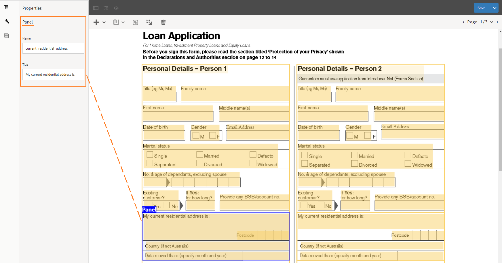

# Review and Correct Converted Adaptive Forms {#review-and-correct-converted-adaptive-forms}

Review and correct the adaptive forms converted by the Automated Forms Conversion service.

Automated Forms Conversion service by AEM Forms allows you to convert the legacy forms into device-friendly adaptive forms. You can configure the conversion service, run the conversions, review, and correct the conversion results from within your AEM instance. The conversion takes place in real time and generates the following assets for each print form:

* An adaptive form
* An adaptive form schema
* Adaptive form fragments
* Fragment schemas

Before you get into the Review and Correct feature, it is recommended to go through the following articles to understand the Automated Forms Conversion service and related information.

* [Automated Forms Conversion service](introduction-to-automated-form-conversion-service.md)
* [Configure the Automated Forms Conversion service](configure-the-automated-forms-conversion-service.md)
* [Convert existing forms to adaptive forms](convert-existing-forms-to-adaptive-forms.md)
* Supported forms for conversion (Link TBD)
* FAQs (Link TBD)

Once the adaptive form is generated, you can review the conversion quality and make the required changes to the fields and extracted content in the Review and Correct UI within your AEM instance. After making the required changes, you can call the Automated Forms Conversion service for reconversion from the Review and Correct UI. Once the reconversion is complete, the updated assets including the adaptive form, schema, and fragments are reflected in the AEM instance. In case any form component is not properly converted, there is an option in the Review and Correct UI to open the converted form in adaptive form editor and make the required changes.

**Advantages of Review and Correct UI**

* Easy to use interface.
* Review and correct the conversion results from same UI.
* Filter the conversions based on components.
* Call the Automated Forms Conversion service for reconversion and view the modified results at runtime.
* Open form in adaptive form editor for more corrections, if necessary.

## Supported components and field types {#supported-components-and-field-types}

Automated Forms Conversion service supports the following components and field types:

* **Text** - It refers to plain text in the PDF.
* **Field** - It refers to a combination of text associated with a value depending upon the field type. For example, **first name** is a field of **text** field type.  
  The following predefined data types (regex) are supported for a field:  
  * Text  
  * Numeric  
  * Date  
  * Email  
  * Telephone Number  
  * Signature  
  * Currency  
  * Password  

* **Panel** - It refers to an aggregation of related content and components.
* **Choice Group** - It refers to a combination of text associated with multiple choice options (check box, dropdown, and radio button). For example, gender or marital status.

## Steps to access Review and Correct UI {#steps-to-access-review-and-correct-ui}

**To access the Review and Correct UI:**

1. Log in to the AEM Forms instance.
1. Tap **Adobe Experience Manager** &gt; **Navigation** &gt;  **Forms** &gt; **Forms & Documents**.
1. Tap the folder which contains the converted form.
1. Select the PDF form and tap **[!UICONTROL Review Conversions]**. The Review and Correct UI opens in a new tab.

**A.** Content view of the converted print form **B.** Properties of the selected component **C.** Fragments in the converted PDF **D.** Hide/Unhide the left menu **E.** Switch to adaptive form editor **F.** Filter data based on the components **G.** Add new component **H.** Transform existing component **I.** Group the related components into a panel **J.** Ungroup selected panel **K.** Delete selected component **L.** Save changes and update corrections

## Apply Corrections to the conversion results {#apply-corrections-to-the-conversion-results}

Once the adaptive form is generated, you can review and make corrections to the print form. Once the corrections are applied, you can call the Automated Forms Conversion service for reconversion and view the modifications in the Review and Correct UI.

You can perform the following operations on the converted print form and modify the relative properties:

1. [Add new component](/help/forms/using/wip/review-correct-ui.md#add-new-component)
1. [Transform existing component](/help/forms/using/wip/review-correct-ui.md#transform-component)
1. [Ungroup and group components](/help/forms/using/wip/review-correct-ui.md#ungroup-and-group-components)
1. [Delete component](/help/forms/using/wip/review-correct-ui.md#delete-component)

### Add new component {#add-new-component}

You can add a new component if the conversion service is unable to identify a component in the print form. Before you add a new component, identify the component and its field type. For example, in the following illustration the highlighted section **Date of birth** is not identified during the conversion and does not reflect any conversion result on the Review and Correct UI.

You can see from the illustration that the section **Date of birth** is a **date** field type.

**To add a new component:**

1. Tap **[!UICONTROL Add]** dropdown > **[!UICONTROL Field]**.

   

1. To define coordinates of the component, draw an overlay.

   To draw the overlay, tap and drag the pointer over the component and again tap the pointer to define the end point of the overlay.

1. The Automated Forms Conversion service reflects the extraction results of the overlay in the **[!UICONTROL Properties]** view. You can verify the accuracy of the extraction and can modify the properties of the field in the **Properties** view (if necessary). The properties differ for different components.

   

   In this example, the **[!UICONTROL Title]** content is extracted correctly but the field type is identified incorrectly as **Text** that requires to be changed to **Date** type.

   **To modify the properties:**

   In **[!UICONTROL **Properties**]** view, select **[!UICONTROL Type]** as **[!UICONTROL Date]** from the dropdown. The change of field type is reflected on the print form.

   

1. Tap **[!UICONTROL Save]** button to save the modifications in your AEM instance. You can call the Automated Forms Conversion service to begin reconversion once all the modifications are applied. See [Call Automated Forms Conversion service for reconversion](/help/forms/using/wip/review-correct-ui.md#call-automated-forms-conversion-service-for-reconversion) for details.

### Transform component {#transform-component}

You can change an existing component if the conversion service is unable to correctly identify the component and its content. The following table depicts the transformations supported among the components:

| **Component** |**Transformed To** |
|---|---|
| **Text** |Field and Choice Group |
| **Field** |Text and Choice Group |
| **Choice Group** |Text and Panel |

>[!NOTE]
>
>A panel can only be ungrouped, not transformed.

In the following illustration, the highlighted section **Gender** is incorrectly identified as a **Text** field type. Also, the **Title** content of the field not extracted correctly.

You can see from the illustration that the section **Gender** is a multiple-choice attribute of **Check Box** field type. And the **Title** property also requires modification.

**To transform a component and its relative content and properties:**

1. Tap **[!UICONTROL Change]** to dropdown > **[!UICONTROL Choice Group]**.

   

1. The Automated Forms Conversion service reflects the component and property changes on the Review and Correct UI. You can verify the accuracy of the changes and can modify the properties of the component in the **Properties** view (if necessary). The properties differ for different components.

   

   In this example, the component is transformed to **Choice Group** of **Check Box** field type. But the **Title** property and options of the **Choice Group** are note extracted correctly.

   **To modify the properties:**

   In **[!UICONTROL Properties]** view, modify the **[!UICONTROL Title]** and add **[!UICONTROL Options]** for the **Gender** component.

   

1. Tap **[!UICONTROL Save]** button to save the modifications in your AEM instance. You can call the Automated Forms Conversion service to begin reconversion once all the modifications are applied. See [Call Automated Forms Conversion service for reconversion](/help/forms/using/wip/review-correct-ui.md#call-automated-forms-conversion-service-for-reconversion) for details.

### Delete component {#delete-component}

There is a possibility that the transformation results for a component are not as per the expectations and require numerous manual interventions. For example, a component and its content both are not extracted correctly. In such cases, it is recommended to **delete** the component and [add new component](/help/forms/using/wip/review-correct-ui.md#add-new-component) to redefine the properties.

**To delete an existing component:**

1. Select the component and tap **[!UICONTROL Delete]** button.

   

1. To delete the component, confirm the request.

### Ungroup and group components {#ungroup-and-group-components}

The Automated Forms Conversion service identifies the related components and content of the print form and aggregates them into a parent component referred to as **Panel**. There can be multiple panels based on the relationships identified by the conversion service within an adaptive form. For example, an address comprises multiple components such as, address field, pin code field, and country field. These components are grouped and reflected together in the adaptive form as a panel.

During conversion, multiple panels are created and there is a possibility that a panel may contain an unwanted component that has no relationship with other components of the panel, or a relative component is not grouped in the panel. The Automated Forms Conversion service provides an option on the Review and Correct UI to ungroup the panel, which results in unbinding the child components of the panel. You can then manually select the related components and group them back into the correct panel definition.

In the following illustration, the highlighted panel **Current_Residential_Address** does not contain **Date_Moved** which is a relative component of the address. 

To merge the relative component within the panel, you must ungroup the panel and then select all the relative components to group them into the correct panel definition.

**To ungroup and group the relative component:**

1. Select the panel and tap **[!UICONTROL Ungroup]** button. The panel definition, child components relationship, and the panel properties are deleted.

   

1. Press **Ctrl** key and tap all the relative components.

   To create a panel, tap **Group** button.

   

1. A new panel **Current_Residential_Address** is created, and the properties view reflects the panel definition.

   

1. Tap **[!UICONTROL **Save**]**button to save the modifications in your AEM instance. You can call the Automated Forms Conversion service to begin reconversion once all the modifications are applied. See [Call Automated Forms Conversion service for reconversion](/help/forms/using/wip/review-correct-ui.md#call-automated-forms-conversion-service-for-reconversion) for details.

## Call Automated Forms Conversion service for reconversion {#call-automated-forms-conversion-service-for-reconversion}

Once you have completed the review and modified the conversion results, you can call the Automated Forms Conversion service to begin reconversion from the Review and Correct UI.

To send the updated PDF for reconversion, tap **[!UICONTROL Save & Convert]** from the dropdown as shown in the following illustration. The folder status changes to **Sent for conversion**.

The conversion service updates the adaptive form, schema, and data fragments based on the modifications applied. It may take some time to reflect the modifications. You can validate the modifications on the Review and Correct UI after reconversion process is complete.

## Launch adaptive form editor from Review and Correct UI {#launch-adaptive-form-editor-from-review-and-correct-ui}

### Application UI not working properly, loading blank tab with no data when trigger **open adaptive form editor**. {#application-ui-not-working-properly-loading-blank-tab-with-no-data-when-trigger-open-adaptive-form-editor}

#### Link to existing article - **Introduction to authoring adaptive form** {#link-to-existing-article-introduction-to-authoring-adaptive-form}

## Limitations {#limitations}

Currently, the Automated Forms Conversion service does not support data fragments and multicolumn tables. There is a possibility that the service may fail to perform conversions in case there exist any data fragments in the input print form. For multicolumn tables, the quality and accuracy of conversion may not meet the user expectations.

These corrections can be applied from the adaptive form editor. The Automated Forms Conversion service allows you to continue with your corrections and launch the adaptive form editor from within the Review and Correct UI. See [Launch adaptive form editor for corrections](/help/forms/using/wip/review-correct-ui.md#launch-adaptive-form-editor-from-review-and-correct-ui) for details.
