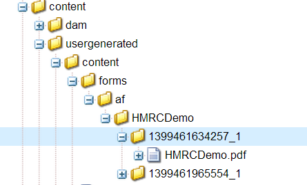
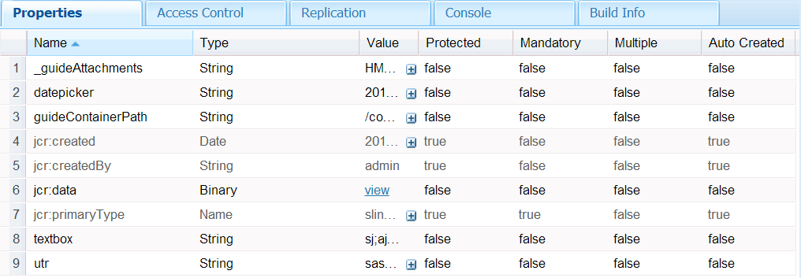
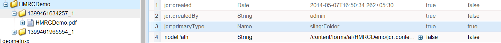

# DO NOT PUBLISH - Submitting and storing content in JCR repository {#do-not-publish-submitting-and-storing-content-in-jcr-repository}

Adaptive forms provides several out-of-the-box submit actions for submitting form data to different endpoints or workflows. This article discusses how you can use the Store content (deprecated) submit action to store form data in JCR repository. Also, it discusses how Store PDF (deprecated) submit action works.

>[!NOTE]
>
>In a production environment, it is recommended not to store submitted form data in AEM repository. Submit actions such as Store Content (deprecated), Store PDF (deprecated), and Forms Portal store form data in AEM repository. These submit actions are meant only for demonstration purposes. Instead in a production environment, you must write a custom submit action that stores forms data in a more secure storage like your enterprise database. For more information, see [Writing custom Submit action for adaptive forms](/help/forms/using/custom-submit-action-form.md).

## Storing content in the JCR repository {#storing-content-in-the-jcr-repository}

Store content (deprecated) action is one of the submit actions that can be used for storing form data in the JCR repository. When Store content (deprecated) action is configured on an Adaptive Form, the form field values are stored as properties on the JCR node at the configured store content path on form submission. The data is also captured in the XML that gets stored as `jcr:data` property on the node.

In case of an XFA- or XSD-based Adaptive Form, only the unbound fields are stored as properties on the node. The file attachments in the Adaptive Form are stored as children nodes. A child node is created for each file attachment component and the files are stored under the corresponding child component nodes.

Once the data is stored, the user is redirected to the configured Thank you page. If the Thank you page is not configured, the user is redirected to the out-of-the-box Thank you Page. The path to the newly created node is passed as a URL parameter in the Thank you Page. 

**Figure:** *Node Structure of submitted form data* 

**Figure:** *Node Properties*

### Configuring store content path {#configuring-store-content-path}

The Store content (deprecated) submit action requires you to configure the store content path, which refers to the node in the repository where data needs to be stored. You can configure it in the **Start of Adaptive Form** dialog, at the top of an adaptive form.

**Figure:** *Configuration for Store content path submit action*

#### Specifications of store content path {#specifications-of-store-content-path}

Consider the following when configuring the store content path:

* The user submitting data should have `add_node` permission on the parent folder specified as the store content path. Here, the parent folder in the example used in this article is `/content/usergenerated/content/forms/af/HMRCDemo`. The `HMRCDemo` folder should have the `addChildNodes` permission. This permission can also be inherited from any ancestor node of the parent folder.

* If the path ends with `/`, a unique node is created under the configured store content path and the data is stored on that unique node.  
  If the path does not end with `/`, the data is stored on the node at the configured path. No unique node is generated.  

* The node to which the store content path refers to, should be of the type `sling:folder`. For example, in this example, `HMRCDemo` is of the type `sling:folder`.

**Figure:** *Store path node*

**Figure:** *ACL for store path node*

>[!NOTE]
>
>If there are multiple publish nodes linked to the same author node as publish far and are not clustered, the data submitted on one publish node will not be available on another publish node. In such cases, you need to configure Reverse Replication Agent associated with the Author instance. It ensures publishing the submitted nodes to all the publish instances linked to the author instance. For more information on configuring the Reverse Application Agent, see [https://dev.day.com/docs/en/cq/current/deploying/replication.html](https://docs.adobe.com/docs/en/cq/current/deploying/replication.html)

## Store PDF (deprecated) submit action {#store-pdf-deprecated-submit-action}

The Store PDF (deprecated) submit action is available as part of the AEM Forms add-on package and applies only to XFA-based adaptive forms. In addition to storing the data on the node, the Store PDF (deprecated) submit action merges the form data with the XDP to generate and store a PDF at the configured store content path. If the form is configured to use Adobe Document Cloud eSign services for signing the PDF, the signed PDF is stored in the configured node as a child node.
