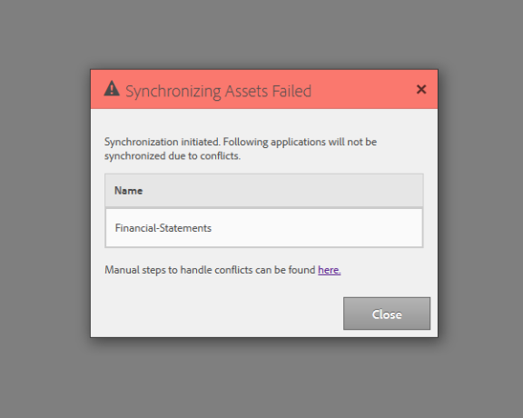

# DO NOT PUBLISH - Synchronize AEM Forms on JEE assets  {#do-not-publish-synchronize-aem-forms-on-jee-assets}

You can use AEM Forms management user interface to create new forms. However, your existing forms included in an application (.lca) or the shadow root of previous version of AEM Forms (/content/dam/formsanddocument) might not be available in AEM Forms management user interface and Workbench.

You can use **manual** or **automatic** synchronization to sync assets between AEM Forms management user interface and Workbench.

## Automatic asset synchronization  {#automatic-asset-synchronization}

When a user uploads an asset to a Forms Workflow folder via AEM Forms management user interface, then the asset is automatically synchronized with the corresponding Workbench application and vice- versa. Also, when a LiveCycle application (.lca) is uploaded to workbench, it is synced to AEM Forms management user interface.

It ensures all the assets that are added via either AEM Forms management user interface or Workbench Processes are available in AEM Forms user interface and crx-repository assets selection option of Workbench.

### Change interval of the synchronization scheduler {#change-interval-of-the-synchronization-scheduler}

By default, the synchronization scheduler runs after every 3 minutes. You can perform the following steps to change the interval of the synchronization scheduler:

1. Log in to AEM Configuration Manager. The URL of Configuration Manager is `https://[Server]:[Port]/lc/system/console/configMgr.Step text`
1. Locate and open **FormsManager AddOn Configuration**.
1. Change the value of the **Synchronization Scheduler Frequency** option. The unit of the frequency is minutes. To configure the scheduler to run after every 60 minutes, change the value to 60.

## Manual or on-demand asset synchronization {#manual-or-on-demand-asset-synchronization}

On-demand asset synchronization is a manual process of forcefully syncing the assets. If there are any issues with the default synchronization process, you can use the on-demand asset synchronization feature to manually synchronize the assets.

The assets available in the Workbench have more priority over the assets available in AEM Forms user interface. For example, when the name of a 'Forms Workflow' folder in AEM Forms management user interface is identical to an application in Workbench then the contents of Forms management UI folder are replaced with the content of Workbench folder.

Perform the following steps to manually sync the assets:

1. Log in to AEM Forms. On the top-left corner, tap **Adobe Experience Manager** &gt; **Forms** &gt;  **Forms & Documents**.
1. Tap **Create** and select **Files from Workbench**.   
   The synchronization process starts synchronizing assets between AEM Forms user interface and Workbench.

## Troubleshoot asset migration {#troubleshoot-asset-migration}

If an asset with the identical name already exists in AEM forms UI or the network connectivity is disturbed, the default synchronization process fails to synchronize the assets. These issues can happen during post-upgrade asset migration and while synchronizing assets:

* Post upgrade asset migration is an automated process which migrates assets available in the shadow root of previous version of AEM Forms (/content/dam/formsanddocument) to the current version of AEM Forms. If AEM Forms Management User Interface and location /content/dam/formsanddocuments contains an application with the identical name, then the dialog box displayed below appears. To resolve the issue, delete or rename the conflicting application and run the [on-demand asset synchronization](#manual-or-on-demand-asset-synchronization) to manually synchronize the assets.

* If a folder with the identical name already exists in AEM Forms management user interface and in Workbench, then delete or rename the conflicting folder in LiveCycle Workbench or AEM Forms management user interface. After deleting or renaming the folder, run the [on-demand asset synchronization](#manual-or-on-demand-asset-synchronization) to manually synchronize the assets.

