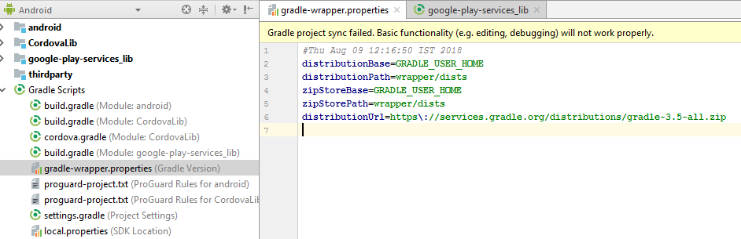

# DO NOT PUBLISH Troubleshoot AEM Forms Android app build issues {#do-not-publish-troubleshoot-aem-forms-android-app-build-issues}

This article describes the error messages that might be displayed while building AEM Forms Android app and the steps to resolve them.

The error messages described in this article are:

* [Unsupported version of Gradle](/help/forms/using/wip/troubleshoot-aem-forms-android-app-build-issues.md#unsupported-version-of-gradle)
* [Gradle and Android Gradle plug-in compatibility issues](/help/forms/using/wip/troubleshoot-aem-forms-android-app-build-issues.md#gradle-and-android-gradle-plug-in-compatibility-issues)

## Unsupported version of Gradle {#unsupported-version-of-gradle}

**Error Message:** The project is using an unsupported version of Gradle.

The error message is displayed when you are using an unsupported version of Gradle and you select **Build APK** option from the **Build** menu on the Android Studio user interface.

**Resolution:** Click **Fix Gradle wrapper and re-import project** to resolve the issue.

 

## Gradle and Android Gradle plug-in compatibility issues {#gradle-and-android-gradle-plug-in-compatibility-issues}

**Error Message:** The versions of the Android Gradle plugin and Gradle are not compatible.

The error message is displayed when you select **Build APK** option from the **Build** menu on the Android Studio user interface. 

**Resolution:** Open **gradle-wrapper.properties** and edit **distributionUrl**.

For example, the Android Studio console recommends downgrading the Gradle version to 3.5. Edit the version in **distributionUrl **of** gradle-wrapper.properties** file.

Select **Build** &gt; **Build APK **to resolve the error and generate the .apk file. 

