# Work with form data model{#work-with-form-data-model}

| Version | Article link |
| -------- | ---------------------------- |
| AEM as a Cloud Service |    [Click here](https://experienceleague.adobe.com/docs/experience-manager-cloud-service/content/forms/integrate/use-form-data-model/work-with-form-data-model.html)                  |
| AEM 6.5     | This article         |

 

Form data model editor provides an intuitive user interface and tools for editing and configuring a form data model. Using the editor, you can add and configure data model objects, properties, and services from associated data sources in the form data model. In addition, it lets you create data model objects and properties without data sources and bind them with respective data model objects and properties later. You can also generate and edit sample data for data model object properties that you can use to prefill adaptive forms and interactive communications while previewing. You can test data model objects and services configured in a form data model to ensure it is properly integrated with data sources.

If you are new to Forms data integration and have not configured a data source or created a form data model, see the following topics:

* [AEM Forms Data Integration](/help/forms/using/data-integration.md)
* [Configure data sources](/help/forms/using/configure-data-sources.md)
* [Create form data model](/help/forms/using/create-form-data-models.md)

Read on for details about various tasks and configurations you can perform using the form data model editor.

>[!NOTE]
>
>You must be a member of both **fdm-author** and **forms-user** groups to be able to create and work with form data model. Contact your AEM administrator to become a member of the groups.

## Add data model objects and services {#add-data-model-objects-and-services}

If you created a form data model with data sources, you can use the form data model editor to add data model objects and services, configure their properties, build associations between data model objects, and test the form data model and services.

You can add data model objects and services from available data sources in the form data model. While added data model objects appear in the Model tab, added services appear in the Services tab.

To add data model objects and services:

1. Log into the AEM author instance, navigate to **[!UICONTROL Forms > Data Integrations]**, and open the form data model in which you want to add data model objects.
1. In the Data Sources pane, expand data sources to view available data model objects and services.
1. Select data model objects and services you want to add to the form data model and select **[!UICONTROL Add Selected]**.

   

   Selected data model objects and services

   >[!NOTE]
   >
   > If your Forms Data Model contains an object that is a reserved keyword for your relational database, it can lead to data addition, updation, or retrieval issues. So, avoid using such objects in your Form Data Model.

   The Model tab displays a graphical representation of all data model objects and their properties added to the form data model. Each data model object is represented by a box in the form data model.

   

   Model tab displays added data model objects

   >[!NOTE]
   >
   >You can hold and drag data model object boxes around to organize them in the content area. All data model objects added in the form data model are grayed out in the Data Sources pane.

   The Services tab lists added services.

   

   Services tab displays data model services

   >[!NOTE]
   >
   >In addition to data model objects and services, OData service metadata document includes navigation properties that define association between two data model objects. For more information, see [Working with navigation properties of OData services](#work-with-navigation-properties-of-odata-services).

1. Select **[!UICONTROL Save]** to save the form model object.

   >[!NOTE]
   >
   >You can invoke services that you configured in the Services tab of a form data model using the adaptive form rules. The configured services are available in the Invoke services action of the rule editor For more information about using these services in adaptive form rules, see Invoke Services and Set Value Of rules in [rule editor](/help/forms/using/rule-editor.md).

## Create data model objects and child properties {#create-data-model-objects-and-child-properties}

### Create data model objects {#create-data-model-objects}

While you can add data model objects from configured data sources, you can also create data model objects or entities without data sources. It is helpful especially if you have not configured data sources in the form data model.

To create a data model object without data sources:

1. Log into the AEM author instance, navigate to **[!UICONTROL Forms > Data Integrations]**, and open the form data model in which you want to create a data model object or entity.
1. Select **[!UICONTROL Create Entity]**.
1. In the Create data Model dialog, specify a name for the data model object and select **[!UICONTROL Add]**. A data model object is added to the form data model. The newly added data model object is not bound to a data source and does not have any properties as shown in the following image. 

   

Next, you can add child properties in unbound data model objects.

### Add child properties {#child-properties}

Form data model editor lets you create child properties in a data model object. The property when created is not bound to any property in a data source. You can later bind the child property with another property in the containing data model object.

To create a child property:

1. In a form data model, select a data model object and select **[!UICONTROL Create Child Property]**. 
1. In the **[!UICONTROL Create Child Property]** dialog, specify a name and data type for the property in the **[!UICONTROL Name]** and **[!UICONTROL Type]** fields, respectively. You can optionally specify a title and description for the property.
1. Enable Computed if the property is a computed property. The value of a computed property is evaluated based on a rule or an expression. For more information, see [Edit properties](#edit-properties).
1. If the data model object is bound to a data source, the added child property is automatically bound to the property of the parent data model object with the same name and data type.

   To manually bind a child property with a data model object property, select the browse icon next to the **[!UICONTROL Bind Reference]** field. The **[!UICONTROL Select Object]** dialog lists all properties from the parent data model object. Select a property to bind with and select the tick icon. Note that you can only select a property of the same data type as the child property.

1. Select **[!UICONTROL Done]** to save the child property and select **[!UICONTROL Save]** to save the form data model.. The child property is now added to the data model object.

After you have created data model objects and properties, you can continue to create adaptive forms and interactive communications based on the form data model. Later, when you have data sources available and configured, you can bind the form data model with data sources. The binding will automatically get updated in associated adaptive forms and interactive communications. For more information about creating adaptive forms and interactive communications using form data model, see [Use form data model](/help/forms/using/using-form-data-model.md).

### Bind data model objects and properties {#bind-data-model-objects-and-properties}

When the data sources you want to integrate with the form data model are available, you can add them to the form data model as described in [Update data sources](/help/forms/using/create-form-data-models.md#update). Then, do the following to bind the unbound data model objects and properties:

1. In the form data model, select the unbound data source that you want to bind with a data source.
1. Select **[!UICONTROL Edit Properties]**. 
1. In the **[!UICONTROL Edit Properties]** pane, select the browse icon next to the **[!UICONTROL Binding]** field. It opens the **[!UICONTROL Select Object]** dialog that lists data sources added in the form data model.

   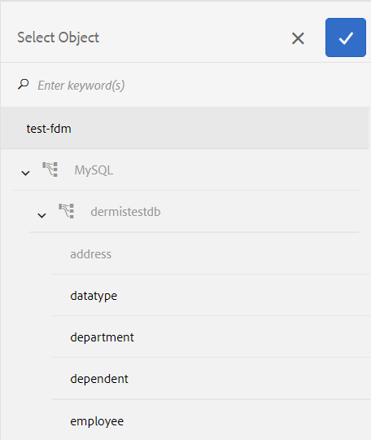

1. Expand the data sources tree and select a data model object to bind with and select the tick icon.
1. Select **[!UICONTROL Done]** to save the properties and then select **[!UICONTROL Save]** to save the form data model. The data model object is now bound with a data source. Notice the data model object is no longer marked Unbound. 

   

## Configure services {#configure-services}

To read and write data for a data model object, do the following to configure read and write services:

1. Select the check box at the top of a data model object to select it and select **[!UICONTROL Edit Properties]**.

   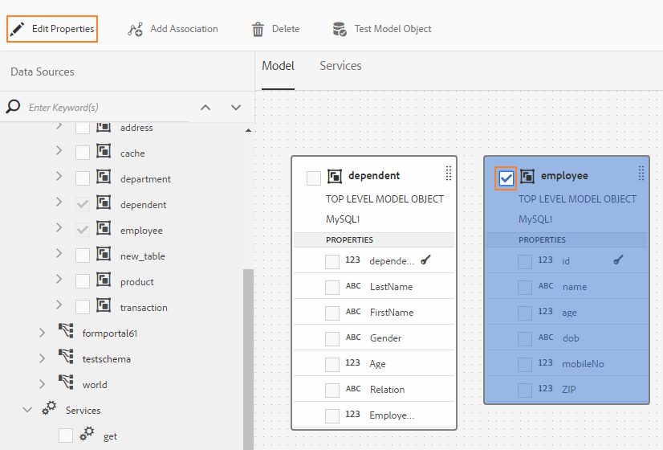

   Edit properties to configure read and write services for a data model object

   The Edit Properties dialog opens.

   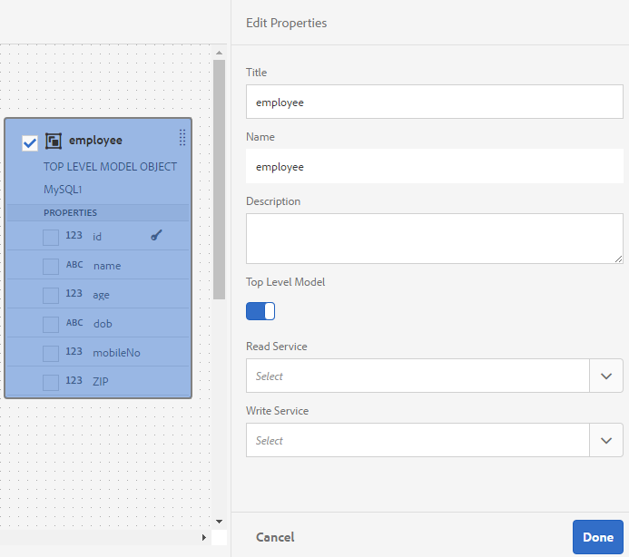

   Edit Properties dialog

   >[!NOTE]
   >
   >In addition to data model objects and services, OData service metadata document includes navigation properties that define association between two data model objects. When you add an OData service datasource to a Form Data Model, there is a service available in Form Data Model for all navigation properties in a data model object. You can use this service to read the navigation properties of the corresponding data model object. 
   >
   >
   >For more information using the service, see [Working with navigation properties of OData services](#work-with-navigation-properties-of-odata-services).

1. Toggle **[!UICONTROL Top Level Object]** to specify if the data model object is a top-level model object.

   Data model objects configured in a form data model are available for use in the Data Model Objects tab in the Content browser of an adaptive form based on the form data model. When you add association between two data model objects, the data model object you are associating with is nested under the data model object you are associating from in the Data Model Objects tab. If the nested data model is a top-level object, it will also appear separately in the Data Model Objects tab. Therefore, you will see two entries of it, one inside and another outside the nested hierarchy, which might confuse form authors. To make the associated data model object appear only in the nested hierarchy, disable the Top Level Object property. 

1. Select Read and Write services for the selected data model objects. The arguments for the services appear.

   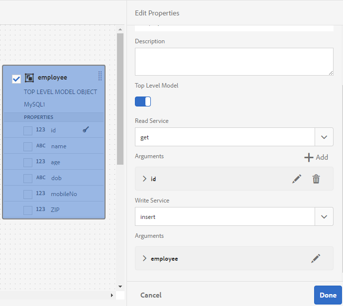

   Read and write services configured for employee data source

1. Select  for the read service argument to [bind the argument to a User Profile Attribute, Request Attribute, or Literal value](#bindargument) and specify the binding value.
1. Select **[!UICONTROL Done]** to save the argument, **[!UICONTROL Done]** to save the properties, and then **[!UICONTROL Save]** to save the form data model.

### Bind Read service arguments {#bindargument}

Bind Read service argument to a User Profile Attribute, Request Attribute, or Literal value based on a binding value. The value is passed to the service as an argument to fetch details associated with the specified value from the data source.

#### Literal value {#literal-value}

Select **[!UICONTROL Literal]** from the **[!UICONTROL Binding To]** drop-down menu and enter a value in the **[!UICONTROL Binding Value]** field. The details associated with the value are retrieved from the data source. Use this option to retrieve details associated with a static value.

In this example, the details associated with **4367655678**, as the value for the `mobilenum` argument, are retrieved from the data source. The associated details if you pass the value for a mobile number argument can include properties such as customer name, customer address, and city. 

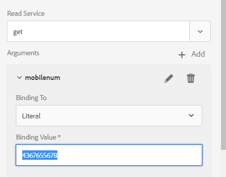 

#### User Profile Attribute {#user-profile-attribute}

Select **[!UICONTROL User Profile Attribute]** from the **[!UICONTROL Binding To]** drop-down menu and enter the attribute name in the **[!UICONTROL Binding Value]** field. The details of the user logged in to the AEM instance are retrieved from the data source based on the attribute name.

The attribute name specified in the **[!UICONTROL Binding Value]** field must include the complete binding path until the attribute name for the user. Open the following URL to access the user details on CRXDE:

`https://[server-name]:[port]/crx/de/index.jsp#/home/users/`

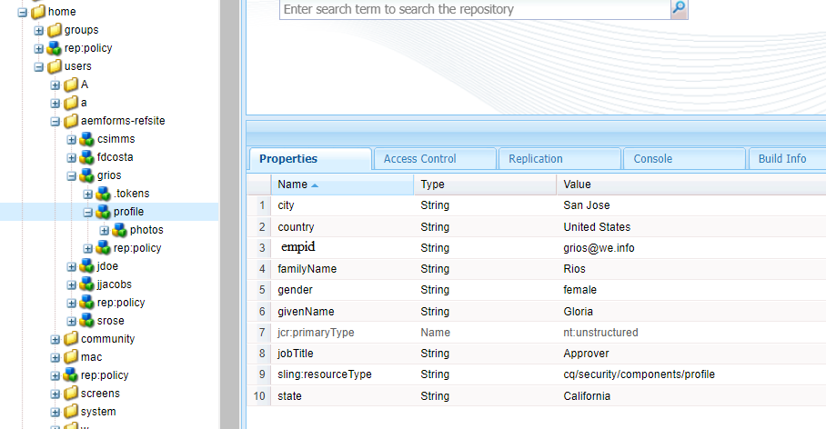

In this example, specify `profile.empid` in the **[!UICONTROL Binding Value]** field for the `grios` user.


The `id` argument takes the value of the `empid` attribute of the user profile and pass it as an argument to the Read service. It reads and return values of associated properties from the employee data model object for the `empid` associated with the logged in user.

#### Request Attribute {#request-attribute}

Use the request attribute to retrieve the associated properties from the data source.

1. Select **[!UICONTROL Request Attribute]** from the **[!UICONTROL Binding To]** drop-down menu and enter the attribute name in the **[!UICONTROL Binding Value]** field.

1. Create an [overlay](../../../help/sites-developing/overlays.md) for the head.jsp. To create the overlay, open CRX DE and copy the `https://<server-name>:<port number>/crx/de/index.jsp#/libs/fd/af/components/page2/afStaticTemplatePage/head.jsp` file to `https://<server-name>:<port number>/crx/de/index.jsp#/apps/fd/af/components/page2/afStaticTemplatePage/head.jsp`  

   >[!NOTE]
   >
   >* If you use a static template, overlay the head.jsp at:
   >  `/libs/fd/af/components/page2/afStaticTemplatePage/head.jsp`
   >* If you use an editable template, overlay the aftemplatedpage.jsp at:
   >  `/libs/fd/af/components/page2/aftemplatedpage/aftemplatedpage.jsp`

1. Set [!DNL paramMap] for the request attribute. For example, include the following code in the .jsp file in the apps folder:

   ``` javascript 

   <%Map paraMap = new HashMap();
    paraMap.put("<request_attribute>",request.getParameter("<request_attribute>"));
    request.setAttribute("paramMap",paraMap);

   ```

   For example, use the below code to retrieve value of petid from data source:


   ``` javascript

   <%Map paraMap = new HashMap();
   paraMap.put("petId",request.getParameter("petId"));
   request.setAttribute("paramMap",paraMap);%>
   
   ```  

The details are retrieved from the data source based on the attribute name specified in the request.

For example, specifying attribute as `petid=100` in the request retrieves properties associated to the attribute value from the data source.

## Add associations {#add-associations}

Typically, there are associations built between data model objects in a data source. The association can be one-to-one or one-to-many. For example, there can be multiple dependents associated with an employee. It is referred to as one-to-many association and depicted by `1:n` on the line connecting associated data model objects. However, if an association returns a unique employee name for a given employee ID, it is referred to as one-to-one association.

When you add associated data model objects in a data source to a form data model, their associations are retained and displayed as connected by arrow lines. You can add associations between data model objects across disparate data sources in a form data model.

>[!NOTE]
>
>Predefined associations in a JDBC data source are not retained in the form data model. Create them manually.

To add an association:

1. Select the check box at the top of a data model object to select it and select **[!UICONTROL Add Association]**. The Add Association dialog opens.

   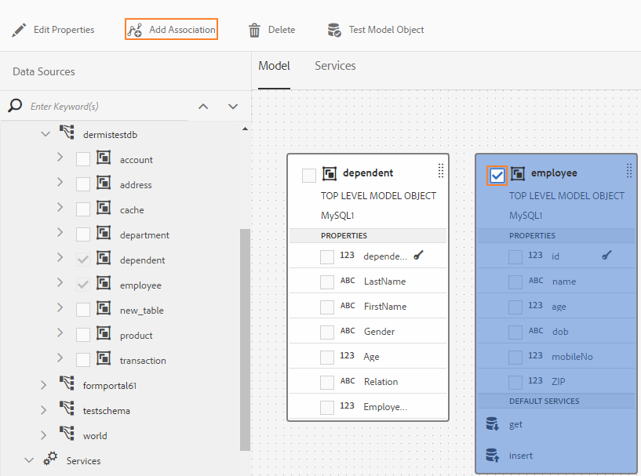

   >[!NOTE]
   >
   >In addition to data model objects and services, OData service metadata document includes navigation properties that define association between two data model objects. You can use these navigation properties when adding associations in Form Data Model. For more information, see [Working with navigation properties of OData services](#work-with-navigation-properties-of-odata-services).

   The Add Association dialog opens.

   

   Add Association dialog

1. In the Add Association pane:

    * Specify a title for the association.
    * Select the association type — One to One or One to Many.
    * Select the data model object to associate with.
    * Select the read service to read data from the selected model object. The read service argument appears. Edit to change the argument, if necessary, and bind it to the property of the data model object to associate.

   In the following example, the default argument for the read service of the Dependents data model object is `dependentid`.

   

   Default argument for Dependents read service is dependentid

   However, the argument must be a common property between the associating data model object, which in this example is `Employeeid`. Therefore, the `Employeeid` argument must be bound to the `id` property of the Employee data model object to fetch the associated dependents details from the Dependents data model object.

   

   Updated argument and binding

   Select **[!UICONTROL Done]** to save the argument.

1. Select **[!UICONTROL Done]** to save the association and then **[!UICONTROL Save]** to save the form data model.
1. Repeat the steps to create more associations as required.

>[!NOTE]
>
>The added association appears in the data model object box with the specified title and a line connecting the associated data model objects.
>
>You can edit an association by selecting the checkbox against it and select **[!UICONTROL Edit Association]**.

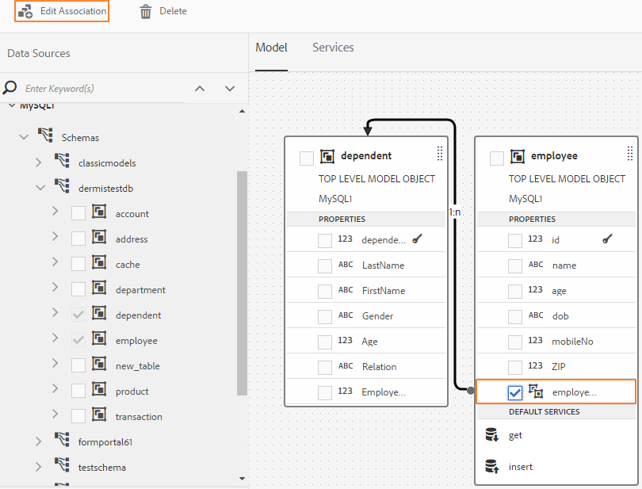 

## Edit properties {#properties}

You can edit properties of data model objects, their properties, and services added in the form data model.

To edit properties:

1. Select the check box next to a data model object, a property, or a service in the form data model.
1. Select **[!UICONTROL Edit Properties]**. The **[!UICONTROL Edit Properties]** pane for the selected model object, property, or service opens.

    * **Data model object**: Specify the read and write services and edit arguments.
    * **Property**: Specify the type, sub-type, and format for the property. You can also specify if the selected property is the primary key for the data model object.
    * **Service**: Specify the input model object, output type, and arguments for the service. For a Get service, you can specify if it is expected to return an array.

   

   Edit Properties dialog for a get service

1. Select **[!UICONTROL Done]** to save properties and then **[!UICONTROL Save]** to save the form data model.

### Create computed properties {#computed}

A computed property is the one whose value is computed based on a rule or an expression. Using a rule, you can set the value of a computed property to a literal string, a number, result of a mathematical expression, or the value of another property in the form data model.

For example, you can create a computed property **FullName** whose value is a result of concatenation the existing **FirstName** and **LastName** properties. To do so:

1. Create a property with the name `FullName` whose data type is String.
1. Enable **[!UICONTROL Computed]** and select **[!UICONTROL Done]** to create the property.

   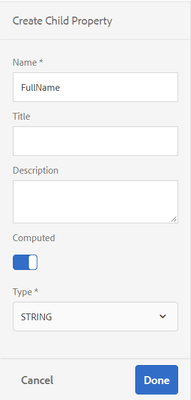

   The FullName computed property gets created. Notice the icon next to the property to depict a computed property.

   

1. Select the FullName property and select **[!UICONTROL Edit Rule]**. A rule editor window opens.
1. In the rule editor window, select **[!UICONTROL Create]**. A **[!UICONTROL Set Value]** rule window opens.

   From the Select Option drop-down, select **[!UICONTROL Mathematical Expression]**. Other available options are **[!UICONTROL Form Data Model Object]** and **[!UICONTROL String]**.

1. In the mathematical expression, Select **[!UICONTROL FirstName]** and **[!UICONTROL LastName]** in first and second objects, respectively. Select **[!UICONTROL plus]** as the operator.

   Select **[!UICONTROL Done]** and then select **[!UICONTROL Close]** to close the rule editor window. The rule looks similar to the following.

   

1. On the form data model, select **[!UICONTROL Save]**. The computed property is configured.

## Work with navigation properties of OData services {#work-with-navigation-properties-of-odata-services}

In OData services, navigation properties are used to define associations between two data model objects. These properties are defined on an entity type or a complex type. For example, in the following extract from the metadata file of the sample [TripPin](https://www.odata.org/blog/trippin-new-odata-v4-sample-service/) OData sample services, the person entity contains three navigation properties - Friends, BestFriend, and Trips.

For more information about navigation properties, see [OData documentation](https://docs.oasis-open.org/odata/odata/v4.0/errata03/os/complete/part3-csdl/odata-v4.0-errata03-os-part3-csdl-complete.html#_Toc453752536).

```xml
<edmx:Edmx xmlns:edmx="https://docs.oasis-open.org/odata/ns/edmx" Version="4.0">
<script/>
<edmx:DataServices>
<Schema xmlns="https://docs.oasis-open.org/odata/ns/edm" Namespace="Microsoft.OData.Service.Sample.TrippinInMemory.Models">
<EntityType Name="Person">
<Key>
<PropertyRef Name="UserName"/>
</Key>
<Property Name="UserName" Type="Edm.String" Nullable="false"/>
<Property Name="FirstName" Type="Edm.String" Nullable="false"/>
<Property Name="LastName" Type="Edm.String"/>
<Property Name="MiddleName" Type="Edm.String"/>
<Property Name="Gender" Type="Microsoft.OData.Service.Sample.TrippinInMemory.Models.PersonGender" Nullable="false"/>
<Property Name="Age" Type="Edm.Int64"/>
<Property Name="Emails" Type="Collection(Edm.String)"/>
<Property Name="AddressInfo" Type="Collection(Microsoft.OData.Service.Sample.TrippinInMemory.Models.Location)"/>
<Property Name="HomeAddress" Type="Microsoft.OData.Service.Sample.TrippinInMemory.Models.Location"/>
<Property Name="FavoriteFeature" Type="Microsoft.OData.Service.Sample.TrippinInMemory.Models.Feature" Nullable="false"/>
<Property Name="Features" Type="Collection(Microsoft.OData.Service.Sample.TrippinInMemory.Models.Feature)" Nullable="false"/>
<NavigationProperty Name="Friends" Type="Collection(Microsoft.OData.Service.Sample.TrippinInMemory.Models.Person)"/>
<NavigationProperty Name="BestFriend" Type="Microsoft.OData.Service.Sample.TrippinInMemory.Models.Person"/>
<NavigationProperty Name="Trips" Type="Collection(Microsoft.OData.Service.Sample.TrippinInMemory.Models.Trip)"/>
</EntityType>
```

When you configure an OData service in a Form Data Model, all navigation properties in an entity container are made available through a service in the Form Data Model. In this example of TripPin OData service, the three navigation properties in the `Person` entity container can be read using one `GET LINK` service in the Form Data Model.

The following highlights the `GET LINK of Person /People` service in the Form Data Model, which is a combined service for the three navigation properties in the `Person` entity of the TripPin OData service. 


Once you add the `GET LINK` service to the Services tab in the Form Data Model, you can edit the properties to choose the output model object and the navigation property to use in the service. For example, the following `GET LINK of Person /People` service in the following example uses Trip as the output model object and the navigation property as Trips.


>[!NOTE]
>
>The values available in the **Default Value** field of the **NavigationPropertyName** argument depend on the state of the **Return array?** toggle button. When it is enabled, it shows navigation properties of Collection type.

In this example, you can also choose the output model object as Person and navigation property argument as Friends or BestFriend (depending on whether **Return array?** is enabled or disabled).

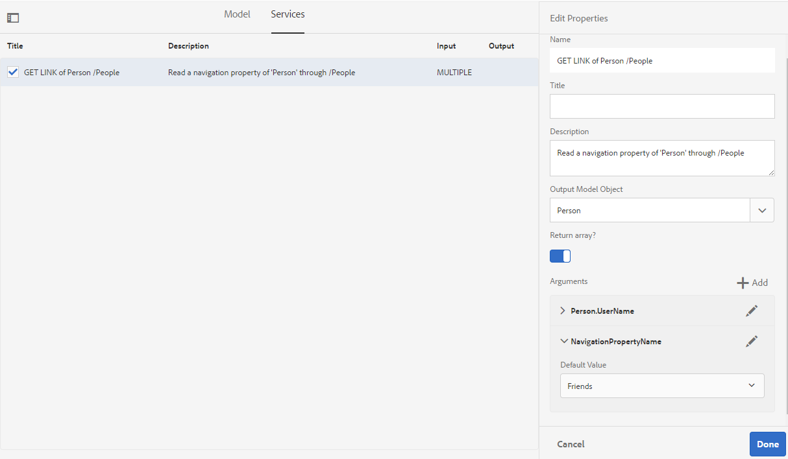

Similarly, you can choose a `GET LINK` service and configure its navigation properties when adding associations in the Form Data Model. However, to be able to select a navigation property, ensure that the **[!UICONTROL Binding To field]** is set to **Literal**.

 

## Generate and edit sample data {#sample}

Form data model editor lets you generate sample data for all data model object properties, including computed properties, in a form data model. It is a set of random values that comply with the data type configured for each property. You can also edit and save data, which is retained even if you regenerate the sample data.

Do the following to generate and edit sample data:

1. Open a form data model and select **[!UICONTROL Edit Sample Data]**. It generates and displays the sample data in Edit Sample Data window.

   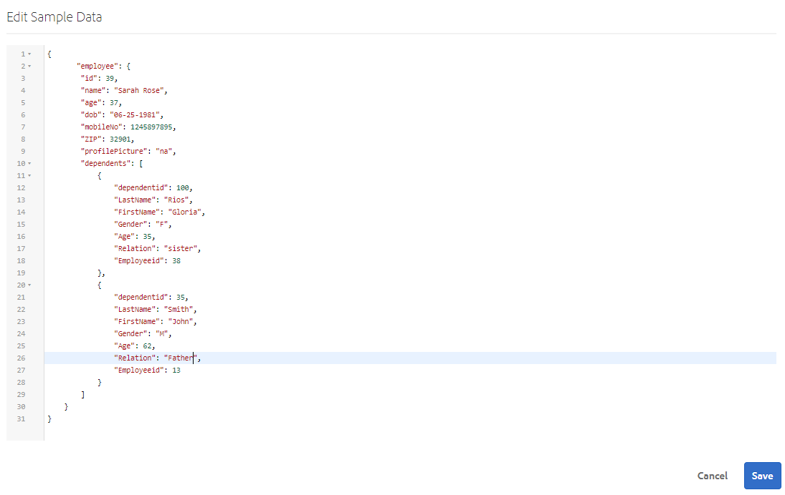

1. In **[!UICONTROL Edit Sample Data]** window, edit data, as required, and select **[!UICONTROL Save]**.

Next, you can use the sample data to prefill and test interactive communications based on the form data model. For more information, see [Use form data model](/help/forms/using/using-form-data-model.md).

## Test data model objects and services {#test-data-model-objects-and-services}

Your form data model is configured but before putting it in use, you may want to test if the configured data model objects and services are working as expected. To test data model objects and services:

1. Select a data model object or a service in the form data model and select **[!UICONTROL Test Model Object]** or **[!UICONTROL Test Service]**, respectively.

   The Test Form Data Model window opens.

   

1. In the Test Form Data Model window, select the data model object or service to test from the Input pane.  

1. Specify an argument value in the test code and select **[!UICONTROL Test]**. A successful test returns the output in the Output pane.

   

Similarly, you can test other data model objects and services in the form data model.

## Automated validation of input data {#automated-validation-of-input-data}

The form data model validates data received as input while invoking DermisBridge API (based on validation criteria available in form data model). The validation is based on the `ValidationOptions` flag set in the query object that is used to invoke the API.

The flag can be set to any of the following values:

* **FULL**: FDM performs the validation based on all constraints
* **OFF**: No validation
* **BASIC**: FDM performs the validation based on 'required' and 'nullable' constraints

If no value is set for the `ValidationOptions`flag, **BASIC** validation is performed on the input data.

The following is an example of setting the validation flag to **FULL**:

```java
operationOptions.setValidationOptions(ValidationOptions.FULL);
```

>[!NOTE]
>
>The value that you provide for an attribute in the input data must match the data type defined for the attribute in the metadata document.   
>If the value does not match the data type defined for the attribute, the DermisBridge API displays an exception irrespective of the value of the `ValidationOptions` flag. If the log level is set to Debug, an error is logged to the **error.log** file.

The form data model validates input data based on a list of data type constraints. The list of constraints for input data can vary based on the data source.

The following table lists the constraints for input data based on the data source:

<table>
 <tbody> 
  <tr> 
   <td>Constraints</td> 
   <td>Description</td> 
   <td>Input data source</td> 
  </tr> 
  <tr> 
   <td>required</td> 
   <td>If true, the parameter must be included in the input data.</td> 
   <td>Swagger, WSDL, and database</td> 
  </tr> 
  <tr> 
   <td>nullable</td> 
   <td>If true, the value for the parameter can be set to Null in the input data.</td> 
   <td>WSDL, Odata, and database</td> 
  </tr> 
  <tr> 
   <td>maximum</td> 
   <td>Specifies the upper bound for numeric values. The maximum value specified as the upper bound can also be assigned to the parameter in the input data.</td> 
   <td>Swagger and WSDL</td> 
  </tr> 
  <tr> 
   <td>minimum</td> 
   <td>Specifies the lower bound for numeric values. The minimum value specified as the lower bound can also be assigned to the parameter in the input data.</td> 
   <td>Swagger and WSDL</td> 
  </tr> 
  <tr> 
   <td>exclusiveMaximum</td> 
   <td>Specifies the upper bound for numeric values. The maximum value specified as the upper bound must not be assigned to the parameter in the input data.</td> 
   <td>Swagger and WSDL</td> 
  </tr> 
  <tr> 
   <td>exclusiveMinimum</td> 
   <td>Specifies the lower bound for numeric values. The minimum value specified as the lower bound must not be assigned to the parameter in the input data.</td> 
   <td>Swagger and WSDL</td> 
  </tr> 
  <tr> 
   <td>minLength</td> 
   <td>Specifies the lower bound for the number of characters included in a string. The minimum value specified as the lower bound can also be assigned to the parameter in the input data.</td> 
   <td>Swagger and WSDL</td> 
  </tr> 
  <tr> 
   <td>maxLength</td> 
   <td>Specifies the upper bound for the number of characters included in a string. The maximum value specified as the upper bound can also be assigned to the parameter in the input data.</td> 
   <td>Swagger, WSDL, Odata, and database</td> 
  </tr> 
  <tr> 
   <td>pattern</td> 
   <td>Specifies a fixed sequence of characters. The input string is validated successfully only if the characters conform to specified pattern.</td> 
   <td>Swagger</td> 
  </tr> 
  <tr> 
   <td>minItems</td> 
   <td>Specifies the minimum number of items in an array. The minimum value specified as the lower bound can also be assigned to the parameter in the input data.</td> 
   <td>Swagger and WSDL</td> 
  </tr> 
  <tr> 
   <td>maxItems</td> 
   <td>Specifies the maximum number of items in an array. The maximum value specified as the upper bound can also be assigned to the parameter in the input data.</td> 
   <td>Swagger and WSDL</td> 
  </tr> 
  <tr> 
   <td>uniqueItems</td> 
   <td>If true, all elements of the array must be unique in the input data.</td> 
   <td>Swagger</td> 
  </tr> 
  <tr> 
   <td>enum (string)<br /> <br /> </td> 
   <td>Restricts the value of a parameter in the input data to a fixed set of string values. It must be an array with at least one element, where each element is unique.</td> 
   <td>Swagger, WSDL, and Odata</td> 
  </tr> 
  <tr> 
   <td>enum (number)<br /> <br /> </td> 
   <td>Restricts the value of a parameter in the input data to a fixed set of numeric values. It must be an array with at least one element, where each element is unique.</td> 
   <td>WSDL</td> 
  </tr> 
 </tbody> 
</table>

In this example, the input data is validated based on maximum, minimum, and required constraints defined in the Swagger file. The input data meets the validation criteria only if Order Id is present and its value is between 1 and 10.

```json
   parameters: [
   {
   name: "orderId",
   in: "path",
   description: "ID of pet that needs to be fetched",
   required: true,
   type: "integer",
   maximum: 10,
   minimum: 1,
   format: "int64"
   }
   ]
```

An exception is displayed if the input data does not meet the validation criteria. If the log level is set to **Debug**, an error is logged to the **error.log** file. For example,

```verilog
21.01.2019 17:26:37.411 *ERROR* com.adobe.aem.dermis.core.validation.JsonSchemaValidator {"errorCode":"AEM-FDM-001-044","errorMessage":"Input validations failed during operation execution.","violations":{"/orderId":["numeric instance is greater than the required maximum (maximum: 10, found: 16)"]}}
```

## Next steps {#next-steps}

You have a working form data model that is now ready for use in adaptive forms and interactive communications workflows. For more information, see [Use form data model](/help/forms/using/using-form-data-model.md).
