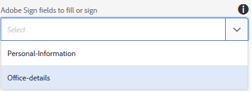
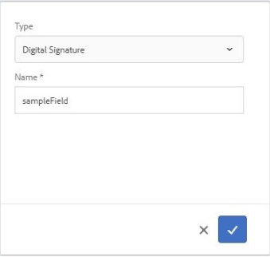

# Using Adobe Sign in an adaptive form {#using-adobe-sign-in-an-adaptive-form}

Enable e-signature (Adobe Sign) workflows for an adaptive form to automate signing workflows, simplify single and multi-signature processes, and to electronically sign forms from mobile devices. 

Adobe Sign enables e-signature workflows for adaptive forms. E-Signatures improve workflows to process documents for legal, sales, payroll, human resource management, and more areas.

In a typical Adobe Sign and adaptive forms scenario, a user fills an adaptive form to apply for a service. For example, a mortgage and credit-card application requires legal Signatures from all the borrowers and co-applicants. To enable electronic-signature workflows for similar scenarios, you can integrate Adobe Sign with AEM Forms. A few more examples are, you can use Adobe Sign to:

* Close deals from any device with fully automated proposal, quote, and contract processes.
* Finish Human Resource processes faster and give your employees the digital experiences.
* Cut contract cycle times and onboard your vendors faster. 
* Create digital workflows that automate common processes.

Adobe Sign integration with AEM Forms supports:

* Single and multiple-user signing workflows
* Sequential and simultaneous signing workflows 
* In-form and out-of-form signing experiences
* Signing forms as an anonymous or logged-in user
* Dynamic signing processes (integration with AEM Forms workflow)
* Authentication through a knowledge base, phone, and social profiles

## Prerequisites {#prerequisites}

Before using Adobe Sign in an adaptive form:

* Ensure AEM Forms cloud service is configured to use Adobe Sign. For details, see [Integrate Adobe Sign with AEM Forms](/help/forms/using/adobe-sign-integration-adaptive-forms.md).
* Keep the list of signers ready. You require at least an email address for every signer.

## Configure Adobe Sign for an adaptive form {#configure-adobe-sign-for-an-adaptive-form}

Perform the following steps to configure Adobe Sign for an adaptive form:

1. [Edit adaptive form properties for Adobe sign](/help/forms/using/working-with-adobe-sign.md#main-pars-header-46741052)
1. [Add Adobe Sign fields to an adaptive form](/help/forms/using/working-with-adobe-sign.md#main-pars-header-868561487)
1. [Enable Adobe Sign for an adaptive form](/help/forms/using/working-with-adobe-sign.md#main-pars-header-1414119828)
1. [Select Adobe Sign Cloud Service for an adaptive form](/help/forms/using/working-with-adobe-sign.md#main-pars-header-473098029)  

1. [Add Adobe Sign Signers to an adaptive form](/help/forms/using/working-with-adobe-sign.md#main-pars-header-1374317451)
1. [Select Submit Action for an adaptive form](/help/forms/using/working-with-adobe-sign.md#main-pars-header)

 

### Edit adaptive form properties for Adobe Sign {#enableadobesign}

Configure adaptive form properties for Adobe Sign for an existing or a new adaptive form.

[Create an adaptive form for Adobe Sign](/help/forms/using/working-with-adobe-sign.md#create-an-adaptive-form-for-adobe-sign) describes the steps to create a basic adaptive form. See [Creating an adaptive form](/help/forms/using/creating-adaptive-form.md) for other options available while creating an adaptive form.

#### Create an adaptive form for Adobe Sign {#create-an-adaptive-form-for-adobe-sign}

Perform the following steps to create an adaptive form for Adobe Sign:

1. Navigate to **[!UICONTROL Adobe Experience Manager]** > **[!UICONTROL Forms]** > **[!UICONTROL Forms & Documents]**. 
1. Tap **[!UICONTROL Create]** and select **[!UICONTROL Adaptive Form]**. A list of templates appear. Select the template and tap **[!UICONTROL Next]**.
1. In the **[!UICONTROL Basic]** tab:

    1. Specify the **Name** and **Title** for the adaptive form.
    1. Select the [configuration container](/help/forms/using/adobe-sign-integration-adaptive-forms.md#configure-adobe-sign-with-aem-forms) created while configuring Adobe Sign with AEM Forms.

1. In the **[!UICONTROL Form Model]** tab, select one of the following options:

    * Select the [!UICONTROL Associate form template as the Document of Record template]** option and select a Document of Record template. If you use a form template based adaptive form, then the documents sent for signing display only those fields which are based on the associated form template. It does not display all the fields of the adaptive form. 
    * Select the **[!UICONTROL Generate Document of Record]** option. If you use a Document of Record option enabled adaptive form, then the document sent for signing displays all the fields of the adaptive form.

1. Tap **[!UICONTROL Create.]** A sign-enabled adaptive form is created, which can be used to add Adobe Sign fields.

#### Edit an adaptive form for Adobe Sign {#editafsign}

Perform the following steps to use Adobe Sign in an existing adaptive form:

1. Navigate to **[!UICONTROL Adobe Experience Manager]** > **[!UICONTROL **Forms**]**> **[!UICONTROL Forms & Documents]**. 
1. Select the adaptive form and tap **[!UICONTROL Properties]**.
1. In the **[!UICONTROL Basic]** tab, select the [configuration container](/help/forms/using/adobe-sign-integration-adaptive-forms.md#configure-adobe-sign-with-aem-forms) created while configuring Adobe Sign with AEM Forms.
1. In the **[!UICONTROL Form Mode]**l tab, select one of the following options:

    * Select the **[!UICONTROL Associate form template as the Document of Record template]** option and select a Document of Record template. If you use a form template based adaptive form, then the documents sent for signing display only those fields which are based on the associated form template. It does not display all the fields of the adaptive form.
    * Select the **[!UICONTROL Generate Document of Record]** option. If you use a Document of Record option enabled adaptive form, then the document sent for signing displays all the fields of the adaptive form.

1. Tap **[!UICONTROL Save & Close]**. The adaptive form is enabled for Adobe Sign.

### Add Adobe Sign fields to an adaptive form {#addadobesignfieldstoanadaptiveform}

Adobe Sign has various fields that can be placed on an adaptive form. These fields accept various types of data such as signatures, initials, company, or title and help collect extra information during signing, along with the signatures. You can use the Adobe Sign Block component to place Adobe Sign fields at various locations in an adaptive form.

Perform the following steps to add fields to an adaptive form and customize various options related to these fields:

1. Drag-and-drop **Adobe Sign Block** component from the component browser to the adaptive form. The Adobe Sign Block component has all the supported Adobe Sign fields. By default, it adds a **Signature **field to the adaptive form.

   

   By default, the Adobe Sign Block is not visible in the published adaptive form. It is visible only in the signing documents. You can change the visibility of Adobe Sign Block from the properties of the Adobe Sign Block component.

   >[!NOTE]
   >
   >* Using Adobe Sign block is not mandatory to use Adobe Sign in an adaptive form. If you do not use Adobe Sign block and add fields for the signers, then the default signature field is displayed at the bottom of the signing documents. 
   >* Use Adobe Sign block only for those adptive forms which automatically generate Document of Record. If you are using a custom XDP for generating Document of Record or a form template based adaptive form, Adobe Sign block is not required. 

1. Select the **Adobe Sign Block** component and tap the **Edit**  icon. It displays options to add fields and format appearance of a field. 

   

   **A.** Select and add Adobe Sign fields. **B.** Expand the Adobe Sign block to full screen view

1. Tap the **Adobe Sign Field**  icon. It displays options to select and add Adobe Sign fields.

   Expand the **Type** drop-down field to select a Adobe Sign field and tap the Done  icon to add the selected field to Adobe Sign block. The **Type** drop-down field includes Signature, Signer info, and Data field types. Adobe Sign integration with AEM Forms support fields listed in the Type drop-down box only. For detailed information about Adobe Sign fields, see [Adobe Sign documentation](https://helpx.adobe.com/sign/help/field-types.html).

   

   It is mandatory to provide a unique name for a field. You can also select the required option to mark a field mandatory. In addition to the **Name** and **Required** option, some Adobe Sign field have more options. For example, mask and multi-line. Moreover, specify a unique names for each Adobe Sign field whether the fields reside in same or different Adobe Sign blocks.

### Enable Adobe Sign for an adaptive form {#enableadobsignforanadaptiveform}

Out of the box, Adobe Sign is not enabled for an adaptive form. Perform the following steps to enable it:

1. In the Content browser, tap **Form Container**, and tap the **Configure**  icon. It opens properties browser and displays Adaptive Form container properties.
1. In the properties browser, expand the **Electronic Signature** accordion, and select the **Enable Adobe Sign** option. It enables Adobe Sign for an adaptive form.

### Select Adobe Sign Cloud Service and signing order {#selectadobesigncloudserviceforanadaptiveform}

You can configure multiple Adobe Sign services for an instance of AEM Forms. It is advisable to have a seperate set of services for each function (Human Resource, Finance, and more). It make tracking and reporting of signed documents easier. For example, An bank has multiple departments. You can have a separate configuration for each department for better tracking of the documents.

A document can also have multiple signers. For example, a credit-card application can have mutiple applicants. A bank requires signatures of all the applicants before starting processing application. For multi-signer scenarios, you can select to sign the document in sequential or simultaneous order.

Perform the following steps to select a cloud service and order of signing:

1. In the Content browser, tap **Form Container**, and tap the **Configure**  icon. It opens properties browser and displays Adaptive Form container properties.
1. In the properties browser, expand the **Electronic Signature** accordion, and select the **Enable Adobe Sign** option. It enables Adobe Sign for an adaptive form.
1. Select a cloud service from the already configured list of Adobe Sign Cloud Services.

   If the **Adobe Sign Cloud Service** list is empty, follow the [Configure Adobe Sign with AEM Forms](/help/forms/using/adobe-sign-integration-adaptive-forms.md) artilce to configure the service. 

1. Select the signing order from the **Signers can Sign** dialog box. Adobe Sign singers can sign an adaptive form **Sequentially** - one after another signer, or **Simultaneously** - in any order.

   In sequential order, one signer receives the form for signing, at a time. After a signer completes signing the document, then the form is sent to the next signer, and so on.

   In simultaneous order, multiple signers can sign a form at a time.

1. [Add Signers to an adaptive form](/help/forms/using/working-with-adobe-sign.md#main-pars-header-1374317451) and tap the Done icon to save the changes.

### Add Signers to an adaptive form {#addsignerstoanadaptiveform}

You can have only one signer or multiple signers for an adaptive form. When you add a signer, you can also configure authentication details for the signer. You can also select if the form filler and singer are the same person. Perform the following steps to add and provide various details about a signer:

1. In the Content browser, tap **Form Container**, and tap the **Configure**  icon. It opens properties browser with Adaptive Form container properties.
1. In the properties browser, expand the **Electronic Signature** accordion, and select the **Enable Adobe Sign** option. It enables Adobe Sign for an adaptive form.
1. Tap **Add Signer** under **Signer Configuration.** It adds a signer to the adaptive form. You can add multiple Adobe Sign signers to an adaptive form. 
1. 

   Click the **Edit**  icon to specify the following information about the signer:

    * **Title:** Specify a title to uniquely identify a signer. 
    * **Is the signer and the person filling the form same?:** Select **Yes**, if form filler and first signer are the same person. If the option is set to **No,** then do not use the signature step component in the adaptive form. If the form contains a Signature Step component, then the field is automaticallly set to Yes. 
    * **Signer Email address:** Specify email address of the signer. Signer receives to be signed documents/form on the specified email address. You can choose to use an email address provided in a form field, in AEM user profile of the logged-in user, or manually enter an email address. It is a mandatory step. Also note, if you have configured only one signer, ensure that the email address of the signer is not identical to Adobe Sign account used to configure AEM cloud services.
    * **Signer Authentication Method:** Specify the method to authenticate a user before opening a form for signing. You can choose between phone, knowledge base, and social identity-based authentication.

   >[!NOTE]
   >
   >* By default, the social identity-based authentication provides an option to authenticate using Facebook, Google, and LinkedIn. You can contact Adobe Sign support to enable other social authentication providers.

    * **Adobe Sign fields to fill or sign:** Select Adobe Sign fields for the signer. An adaptive form can have multiple Adobe Sign fields. You can choose to enable specific fields for a signer. The field displays all the available Adobe Sign Blocks. When you select a block, all the fields of the block are selected. You can use the X icon to deselect a field.

    

    The above image has two example Adobe Sign Blocks: Personal-Information and Office-details

    Tap the Done  icon. The signer is added and configured.

### Select Submit Action for an adaptive form {#selectsubmitactionforanadaptiveform}

After you, add Adobe Sign fields to an adaptive form, enable Adobe Sign from form container, select Adobe Sign Cloud Service, and add Adobe Sign Signers, select an appropriate submit action for the adaptive form. For detailed information about adaptive forms submit actions, see [Configuring the Submit action](/help/forms/using/configuring-submit-actions.md).

Also, an Adobe Sign enabled adaptive form is submitted only after all the signers sign the form. You can find partially signed form in Pending Sign section of forms portal. Adobe Sign Configuration Service keeps polling Adobe Sign server at [regular intervals](/help/forms/using/adobe-sign-integration-adaptive-forms.md) to verify the status of signatures. If all the signers complete signing the form, the submit action service is started and the form is submitted. If you are using a custom submit action and the form uses Adobe Sign, update your custom submit action to use the submit action service.

>[!NOTE]
>
>Data of the adaptive form is stored temporarily on Forms Portal. It is recommended to use [custom storage for Forms Portal](/help/forms/using/configuring-draft-submission-storage.md). It ensures that the PII (personally identifiable information) data is not stored on AEM servers.

Your form signing experience is ready. You can preview the form to verify the signing experience. On the published form, Adobe Sign Block fields are displayed when a signer receives the form for signing through an email. This experience is also known as out-of-form signing experience. You can also configure an in-form signing experience for the first signer, for detailed steps see [Create in-form signing experience](/help/forms/using/working-with-adobe-sign.md#create-in-form-signing-experience).

## Configure cloud signatures for an adaptive form {#configure-cloud-signatures-for-an-adaptive-form}

Cloud-based digital signatures or remote signatures are a new generation of digital signatures that work across desktop, mobile, and the web — and meet the highest levels of compliance and assurance for signer authentication. You can sign an adaptive form with cloud-based digital signatures.

After [editing adaptive form properties for Adobe sign](/help/forms/using/working-with-adobe-sign.md#main-pars-header-46741052), perform the following steps to add cloud signature field to an adaptive form:

1. Drag-and-drop **Adobe Sign Block** component from the component browser to the adaptive form. The Adobe Sign Block component has all the supported Adobe Sign fields. By default, it adds a **Signature** field to the adaptive form.

   

1. Select the **Adobe Sign Block** component and tap the **Edit**  icon. It displays options to add fields and format appearance of a field. 

   

   **A.** Select and add Adobe Sign fields. **B.** Expand the Adobe Sign block to full screen view

1. Tap the **Adobe Sign Field**  icon. It displays options to select and add Adobe Sign fields.

   Expand the **Type** drop-down field to select **Digital Signature** and tap the Done  icon to add the selected field to Adobe Sign block.

   

   It is mandatory to provide a unique name for a field.

   Apply digital signatures to the adaptive form using:

    * Cloud signatures: Sign with a [digital ID](https://helpx.adobe.com/sign/kb/digital-certificate-providers.html) hosted by a trust service provider.
    * Adobe Acrobat or Reader: Download and open the document with Adobe Acrobat or Reader to sign using a smart card, USB token, or file-based digital ID.

   After adding the cloud signature field to the adaptive form, perform the following steps to complete the configuration process:

    * [Enable Adobe Sign for an adaptive form](/help/forms/using/working-with-adobe-sign.md#main-pars-header-1414119828)
    * [Select Adobe Sign Cloud Service for an adaptive form](/help/forms/using/working-with-adobe-sign.md#main-pars-header-473098029) 
    * [Add Adobe Sign Signers to an adaptive form](/help/forms/using/working-with-adobe-sign.md#main-pars-header-1374317451)
    * [Select Submit Action for an adaptive form](/help/forms/using/working-with-adobe-sign.md#main-pars-header)

## Create in-form signing experience {#create-in-form-signing-experience}

A user can also sign an adaptive form while filling-up the form. This experience is also known as in-form signing experience. The in-form signing experience is available only for the first singer in a multiple signer environment. Perform the following steps to create an in-form signing experience for an adaptive form:

1. [Add and configure the Signature Step component](/help/forms/using/working-with-adobe-sign.md#main-pars-header-1414119828).
1. [Add the Summary Step component](/help/forms/using/working-with-adobe-sign.md#main-pars-header-473098029).

 

### Add and configure the Signature Step component {#add-and-configure-the-signature-step-component}

Use the Signature Step component to provide an area to electronically sign the filled form. When the section containing the Signature Step component is rendered, it displays a signable PDF version of the filled-up form. The Signature Step component takes up full width available for the form. It is recommended to not have any other component on the section containing the Signature Step component.

Perform the following steps to configure the Signature Step component:

1. Drag-and-drop the **Signature Step** component from the Components browser to the form.
1. Select the newly added Signature step component and tap the **Configure**  icon. It opens properties browser and displays Signature step properties. Configure the following properties:

    * **Element Name**: Specify the name of the component. 
    * **Title:** Specify the unique title of the component.
    * **Template message:** Specify the message to be displayed while the signature PDF is being loaded. Adobe Sign services take some time to prepare and load signature PDF.
    * **Signing Service:** Select the **Adobe Sign** option.
    * **Use legacy E-sign component**: If you are using the respective adaptive form in [AEM Forms Workspace](/help/forms/using/introduction-html-workspace.md), AEM Forms app, or the underlying adaptive form has legacy e-sign component, select the **Use legacy E-sign component** option. 
    * **Configuration**: Select a configuration (Adobe Sign Cloud Service). The drop-down box is available only if the **Use legacy E-sign component** option is enabled.

   Tap the Done  icon to save the changes.

   

   >[!NOTE]
   >
   >* When you drag-and-drop the **[!UICONTROL Signature Step]** component to the form, the **[!UICONTROL Is the signer and the person filling the form same?]** option is automatically set to **Yes**. It is required to keep the form working.
   >* Adobe Sign enabled adaptive forms do not support using Submit button on the section or panel using the Signature Step component. You can add a summary step after the Signature step for the manual submission or an automatic submission is triggered after the interval set using the [Adobe Sign Configuration Service](/help/forms/using/adobe-sign-integration-adaptive-forms.md#configure-adobe-sign-scheduler-to-sync-the-signing-status).

### Configure the thank you page or summary step component {#configure-the-thank-you-page-or-summary-step-component}

The **Summary Step** component automatically submits the form, populates the information inside the customized Summary page, and displays the summary of the submitted form. It also gets the required information in the return map. The Summary Step component takes up full width available for the form. It is recommended to not have any other component on the section containing the Summary Step component.

Now, the in form signing experience is ready. You can preview the form to verify the signing experience.

## Frequently asked questions {#frequently-asked-questions}

**Ans:** No, AEM Forms does not support using an adaptive form that embeds an Adobe Sign enabled adaptive form for signing

**Ans:** Adaptive form created using the advanced template is configured to use Adobe Sign. To resolve the error, create and select an Adobe Sign cloud configuration and configure an Adobe Sign signer for the adaptive form.

**Ans:** Yes, you can use text tags in a text component to add Adobe Sign fields to a [Document of Record](/help/forms/using/generate-document-of-record-for-non-xfa-based-adaptive-forms.md) (Auto generated document of record option only) enabled adaptive form. To learn about the procedure and rules to create a text tag, see [Adobe Sign Documentation](https://helpx.adobe.com/sign/help/text-tags.html). Also note, Adaptive forms has a limited support for text tags. You can use the text tags to create only those fields that [Adobe Sign Block](/help/forms/using/working-with-adobe-sign.md#main-pars-header-1373840282) supports.

**Ans:** You can use both the components simultaneously in a form. Here are a few recommendations for using these components:

**Adobe Sign Block:** You can use the Adobe Sign Block to add Adobe Sign fields anywhere on the adaptive form. It also helps to assign specific fields to signers. When an adaptive form is previewed or published Adobe Sign Block is not visible, by default. These blocks are enabled only in the signing document. In the signing document, only the fields assigned to a signer are enabled. Adobe Sign block can be used with first and subsequent signers.

**Signature step component:** You can use the signature step component to create in-form signing experience. It allows only the first signer to sign while the form is being filled. When the section containing the Signature Step component is rendered, it displays a signable PDF version of the form. It is generally the last or penultimate section followed by summary component of a form.  

