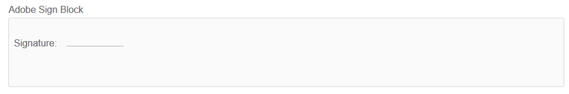
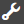
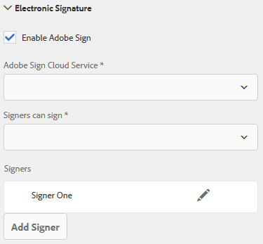
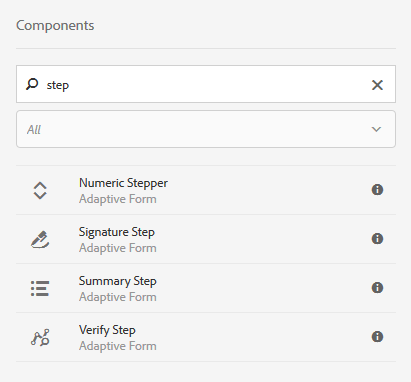
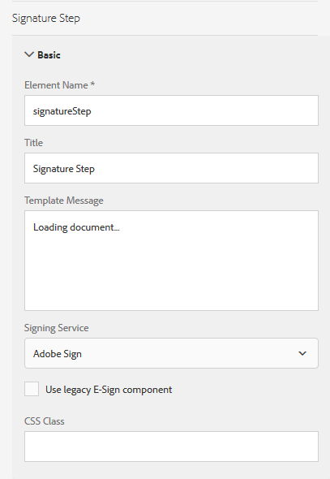

# Using [!DNL Adobe Sign] in an adaptive form{#using-adobe-sign-in-an-adaptive-form}

[!DNL Adobe Sign] enables e-signature workflows for adaptive forms. E-Signatures improve workflows to process documents for legal, sales, payroll, human resource management, and more areas.

In a typical [!DNL Adobe Sign] and adaptive forms scenario, a user fills an adaptive form to apply for a service. For example, a mortgage and credit-card application requires legal Signatures from all the borrowers and co-applicants. To enable electronic-signature workflows for similar scenarios, you can integrate [!DNL Adobe Sign] with AEM [!DNL Forms]. A few more examples are, you can use [!DNL Adobe Sign] to:

* Close deals from any device with fully automated proposal, quote, and contract processes.
* Finish Human Resource processes faster and give your employees the digital experiences.
* Cut contract cycle times and onboard your vendors faster.
* Create digital workflows that automate common processes.

[!DNL Adobe Sign] integration with AEM [!DNL Forms] supports:

* Single and multiple-user signing workflows
* Sequential and simultaneous signing workflows
* In-form and out-of-form signing experiences
* Signing forms as an anonymous or logged-in user
* Dynamic signing processes (integration with AEM [!DNL Forms] workflow)
* Authentication through a knowledge base, phone, and social profiles

Learn the [best practices of using Adobe Sign with adaptive forms](https://medium.com/adobetech/using-adobe-sign-to-e-sign-an-adaptive-form-heres-the-best-way-to-do-it-dc3e15f9b684) to create better signing experiences.

## Prerequisites {#prerequisites}

Before using [!DNL Adobe Sign] in an adaptive form:

* Ensure AEM [!DNL Forms] cloud service is configured to use [!DNL Adobe Sign]. For details, see [Integrate Adobe Sign with AEM Forms](../../forms/using/adobe-sign-integration-adaptive-forms.md).
* Keep the list of signers ready. You require at least an email address for every signer.

## Configure [!DNL Adobe Sign] for an adaptive form {#configure-adobe-sign-for-an-adaptive-form}

Perform the following steps to configure [!DNL Adobe Sign] for an adaptive form:

1. [Edit adaptive form properties for Adobe sign](../../forms/using/working-with-adobe-sign.md#enableadobesign)
1. [Add Adobe Sign fields to an adaptive form](../../forms/using/working-with-adobe-sign.md#addadobesignfieldstoanadaptiveform)
1. [Enable Adobe Sign for an adaptive form](../../forms/using/working-with-adobe-sign.md#enableadobsignforanadaptiveform)
1. [Select Adobe Sign Cloud Service for an adaptive form](../../forms/using/working-with-adobe-sign.md#selectadobesigncloudserviceforanadaptiveform)

1. [Add Adobe Sign Signers to an adaptive form](../../forms/using/working-with-adobe-sign.md#addsignerstoanadaptiveform)
1. [Select Submit Action for an adaptive form](../../forms/using/working-with-adobe-sign.md#selectsubmitactionforanadaptiveform)

### Edit adaptive form properties for [!DNL Adobe Sign] {#enableadobesign}

Configure adaptive form properties for [!DNL Adobe Sign] for an existing or a new adaptive form.

[Create an adaptive form for Adobe Sign](../../forms/using/working-with-adobe-sign.md#create-an-adaptive-form-for-adobe-sign) describes the steps to create a basic adaptive form. See [Creating an adaptive form](../../forms/using/creating-adaptive-form.md) for other options available while creating a adaptive form.

#### Create an adaptive form for [!DNL Adobe Sign] {#create-an-adaptive-form-for-adobe-sign}

Perform the following steps to create a sign-enabled adaptive form:

1. Navigate to **[!UICONTROL Adobe Experience Manager]** > **[!UICONTROL Forms]** > **[!UICONTROL Forms & Documents]**.
1. Tap **[!UICONTROL Create]** and select **[!UICONTROL Adaptive Form]**. A list of templates appear. Select the template and tap **[!UICONTROL Next]**.
1. In the **[!UICONTROL Basic]** tab:

    1. Specify the **[!UICONTROL Name]** and **[!UICONTROL Title]** for the adaptive form.

    1. Select the [configuration container](../../forms/using/adobe-sign-integration-adaptive-forms.md#configure-adobe-sign-with-aem-forms) created while configuring [!DNL Adobe Sign] with AEM [!DNL Forms].

       >[!NOTE]
       >
       >The **[!UICONTROL Adobe Sign Cloud Service]** dropdown list displays the cloud services that are configured in the configuration container that you select in this field. The **[!UICONTROL Adobe Sign Cloud Service]** dropdown list is available in the **[!UICONTROL Electronic Signature]** section of the adaptive form properties when you select the **[!UICONTROL Enable Adobe Sign]** option.

1. In the **[!UICONTROL Form Model]** tab, select one of the following options:

    * Select the **[!UICONTROL Associate form template as the Document of Record template]** option and select a Document of Record template. If you use a form template based adaptive form, then the documents sent for signing display only those fields which are based on the associated form template. It does not display all the fields of the adaptive form.

    * Select the **[!UICONTROL Generate Document of Record]** option. If you use a Document of Record option enabled adaptive form, then the document sent for signing displays all the fields of the adaptive form.

1. Tap **[!UICONTROL Create.]** A sign-enabled adaptive form is created, which can be used to add [!DNL Adobe Sign] fields.

#### Edit an adaptive form for [!DNL Adobe Sign] {#editafsign}

Perform the following steps to use [!DNL Adobe Sign] in an existing adaptive form:

1. Navigate to **[!UICONTROL Adobe Experience Manager]** > **[!UICONTROL Forms]** > **[!UICONTROL Forms & Documents]**.
1. Select the adaptive form and tap **[!UICONTROL Properties]**.
1. In the **[!UICONTROL Basic]** tab, select the [configuration container](../../forms/using/adobe-sign-integration-adaptive-forms.md#configure-adobe-sign-with-aem-forms) created while configuring [!DNL Adobe Sign] with AEM [!DNL Forms].
1. In the **[!UICONTROL Form Model]** tab, select one of the following options:

    * Select the **[!UICONTROL Associate form template as the Document of Record template]** option and select a Document of Record template. If you use a form template based adaptive form, then the documents sent for signing display only those fields which are based on the associated form template. It does not display all the fields of the adaptive form.

    * Select the **[!UICONTROL Generate Document of Record]** option. If you use a Document of Record option enabled adaptive form, then the document sent for signing displays all the fields of the adaptive form.

1. Tap **[!UICONTROL Save & Close]**. The adaptive form is enabled for [!DNL Adobe Sign].

### Add Adobe Sign fields to an adaptive form {#addadobesignfieldstoanadaptiveform}

[!DNL Adobe Sign] has various fields that can be placed on an adaptive form. These fields accept various types of data such as signatures, initials, company, or title and help collect extra information during signing, along with the signatures. You can use the [!DNL Adobe Sign] Block component to place [!DNL Adobe Sign] fields at various locations in an adaptive form.

Perform the following steps to add fields to an adaptive form and customize various options related to these fields:

1. Drag-and-drop **[!UICONTROL Adobe Sign Block]** component from the component browser to the adaptive form. The [!DNL Adobe Sign] Block component has all the supported [!DNL Adobe Sign] fields. By default, it adds a **Signature** field to the adaptive form.

   

   By default, the [!DNL Adobe Sign] Block is not visible in the published adaptive form. It is visible only in the signing documents. You can change the visibility of [!DNL Adobe Sign] Block from the properties of the [!DNL Adobe Sign] Block component.

   >[!NOTE]
   >
   >    * Using [!DNL Adobe Sign] block is not mandatory to use [!DNL Adobe Sign] in an adaptive form. If you do not use [!DNL Adobe Sign] block and add fields for the signers, then the default signature field is displayed at the bottom of the signing documents.
   >    * Use [!DNL Adobe Sign] block only for those adaptive forms which automatically generate Document of Record. If you are using a custom XDP for generating Document of Record or a form template based adaptive form, [!DNL Adobe Sign] block is not supported.
   >
   >

1. Select the **[!UICONTROL Adobe Sign Block]** component and tap the **Edit**  icon. It displays options to add fields and format appearance of a field.

   

   **A.** Select and add [!DNL Adobe Sign] fields. **B.** Expand the [!DNL Adobe Sign] block to full screen view

1. Tap the **[!UICONTROL Adobe Sign] Field**  icon. It displays options to select and add [!DNL Adobe Sign] fields.

   Expand the **[!UICONTROL Type]** drop-down field to select a [!DNL Adobe Sign] field and tap the Done  icon to add the selected field to [!DNL Adobe Sign] block. The **[!UICONTROL Type]** drop-down field includes Signature, Signer info, and Data field types. [!DNL Adobe Sign] integration with AEM [!DNL Forms] support fields listed in the [!UICONTROL Type] drop-down box only. For detailed information about [!DNL Adobe Sign] fields, see [Adobe Sign documentation](https://helpx.adobe.com/sign/help/field-types.html).

   

   It is mandatory to provide a unique name for a field. You can also select the required option to mark a field mandatory. In addition to the **[!UICONTROL Name]** and **[!UICONTROL Required]** option, some [!DNL Adobe Sign] field have more options. For example, mask and multi-line. Moreover, specify a unique names for each [!DNL Adobe Sign] field whether the fields reside in same or different [!DNL Adobe Sign] blocks.

   If you select **[!UICONTROL Digital Signature]** from the drop-down list, you can apply digital signatures to the adaptive form:

    * Online using cloud signatures to sign with a [digital ID](https://helpx.adobe.com/sign/kb/digital-certificate-providers.html) hosted by a trust service provider.
    * Locally by downloading the document with Adobe Acrobat or Reader using a smart card, USB token, or file-based digital ID.

### Enable [!DNL Adobe Sign] for an adaptive form {#enableadobsignforanadaptiveform}

Out of the box, [!DNL Adobe Sign] is not enabled for an adaptive form. Perform the following steps to enable it:

1. In the Content browser, tap **[!UICONTROL Form Container]**, and tap the **[!UICONTROL Configure]**  icon. It opens properties browser and displays Adaptive Form container properties.
1. In the properties browser, expand the **[!UICONTROL Electronic Signature]** accordion, and select the **[!UICONTROL Enable Adobe Sign]** option. It enables [!DNL Adobe Sign] for an adaptive form.

### Select [!DNL Adobe Sign] Cloud Service and signing order {#selectadobesigncloudserviceforanadaptiveform}

You can configure multiple [!DNL Adobe Sign] services for an instance of AEM [!DNL Forms]. It is advisable to have a separate set of services for each function (Human Resource, Finance, and more). It makes tracking and reporting of signed documents easier. For example, A bank has multiple departments. You can have a separate configuration for each department for better tracking of the documents.

A document can also have multiple signers. For example, a credit-card application can have multiple applicants. A bank requires signatures of all the applicants before starting processing application. For multi-signer scenarios, you can select to sign the document in sequential or simultaneous order.

Perform the following steps to select a cloud service and order of signing:

1. In the Content browser, tap **[!UICONTROL Form Container]**, and tap the **[!UICONTROL Configure]**  icon. It opens properties browser and displays Adaptive Form container properties.
1. In the properties browser, expand the **[!UICONTROL Electronic Signature]** accordion, and select the **[!UICONTROL Enable Adobe Sign]** option. It enables [!DNL Adobe Sign] for an adaptive form.
1. Select a cloud service from the already configured list of [!DNL Adobe Sign] Cloud Services.

   If the **[!UICONTROL Adobe Sign Cloud Service]** list is empty, follow the [Configure Adobe Sign with AEM Forms](../../forms/using/adobe-sign-integration-adaptive-forms.md) article to configure the service.

   The dropdown lists the cloud services that exist in the `global` folder in Tools > **[!UICONTROL Cloud Services]** > **[!UICONTROL Adobe Sign]**. In addition, the dropdown also lists the cloud services that exist in the folder that you select in the **[!UICONTROL Configuration Container]** field when you create an adaptive form.

1. Select the signing order from the **[!UICONTROL Signers can Sign]** dialog box. [!DNL Adobe Sign] singers can sign an adaptive form **[!UICONTROL Sequentially]** - one after another signer, or **[!UICONTROL Simultaneously]** - in any order.

   In sequential order, one signer receives the form for signing, at a time. After a signer completes signing the document, then the form is sent to the next signer, and so on.

   In simultaneous order, multiple signers can sign a form at a time.

1. [Add Signers to an adaptive form](../../forms/using/working-with-adobe-sign.md#addsignerstoanadaptiveform) and tap the Done  icon to save the changes.

### Add Signers to an adaptive form {#addsignerstoanadaptiveform}

You can have only one signer or multiple signers for an adaptive form. When you add a signer, you can also configure authentication details for the signer. You can also select if the form filler and singer are the same person. Perform the following steps to add and provide various details about a signer:

1. In the Content browser, tap **[!UICONTROL Form Container]**, and tap the **[!UICONTROL Configure]**  icon. It opens properties browser with Adaptive Form container properties.
1. In the properties browser, expand the **[!UICONTROL Electronic Signature]** accordion, and select the **[!UICONTROL Enable Adobe Sign]** option. It enables [!DNL Adobe Sign] for an adaptive form.
1. Tap **[!UICONTROL Add Signer]** under **[!UICONTROL Signer Configuration]**. It adds a signer to the adaptive form. You can add multiple [!DNL Adobe Sign] signers to an adaptive form.
   

1. Click the **Edit**  icon to specify the following information about the signer:

    * **[!UICONTROL Title]:** Specify a title to uniquely identify a signer.

    * **[!UICONTROL Is the signer and the person filling the form same?]:** Select **Yes**, if form filler and first signer are the same person. If the option is set to **No,** then do not use the signature step component in the adaptive form. If the form contains a Signature Step component, then the field is automatically set to Yes.

    * **[!UICONTROL Signer Email address]:** Specify email address of the signer. Signer receives to be signed documents/form on the specified email address. You can choose to use an email address provided in a form field, in AEM user profile of the logged-in user, or manually enter an email address. It is a mandatory step. Ensure that the email address of the first signer or the only signer (in case of single signer) is not identical to [!DNL Adobe Sign] account used to configure AEM cloud services.

    * **[!UICONTROL Signer Authentication Method]:** Specify the method to authenticate a user before opening a form for signing. You can choose between phone, knowledge base, and social identity-based authentication. For Adobe Acrobat Sign Solutions for Government only phone and knowledge-based authentication options are available.

   >[!NOTE]
   >
   >    * By default, the social identity-based authentication provides an option to authenticate using Facebook, Google, and LinkedIn. You can contact [!DNL Adobe Sign] support to enable other social authentication providers.
   >
   >

    * **[!DNL Adobe Sign] fields to fill or sign:** Select [!DNL Adobe Sign] fields for the signer. An adaptive form can have multiple [!DNL Adobe Sign] fields. You can choose to enable specific fields for a signer. The field displays all the available [!DNL Adobe Sign] Blocks. When you select a block, all the fields of the block are selected. You can use the X icon to deselect a field.

   

   The above image has two example [!DNL Adobe Sign] Blocks: Personal-Information and Office-details

   Tap the Done  icon. The signer is added and configured.

### Select Submit Action for an adaptive form {#selectsubmitactionforanadaptiveform}

After you, add [!DNL Adobe Sign] fields to an adaptive form, enable [!DNL Adobe Sign] from form container, select [!DNL Adobe Sign] Cloud Service, and add [!DNL Adobe Sign] Signers, select an appropriate submit action for the adaptive form. For detailed information about adaptive forms submit actions, see [Configuring the Submit action](../../forms/using/configuring-submit-actions.md).

Also, an [!DNL Adobe Sign] enabled adaptive form is submitted only after all the signers sign the form. You can find partially signed form in Pending Sign section of forms portal. [!DNL Adobe Sign] Configuration Service keeps polling [!DNL Adobe Sign] server at [regular intervals](../../forms/using/adobe-sign-integration-adaptive-forms.md) to verify the status of signatures. If all the signers complete signing the form, the submit action service is started and the form is submitted. If you are using a custom submit action and the form uses [!DNL Adobe Sign], update your custom submit action to use the submit action service.

<!-- Remove when forms portal goes live
>[!NOTE]
>
>Data of the adaptive form is stored temporarily on Forms Portal. It is recommended to use [custom storage for Forms Portal](/help/forms/using/configuring-draft-submission-storage.md). It ensures that the PII (personally identifiable information) data is not stored on AEM servers. 
-->

Your form signing experience is ready. You can preview the form to verify the signing experience. On the published form, [!DNL Adobe Sign] Block fields are displayed when a signer receives the form for signing through an email. This experience is also known as out-of-form signing experience. You can also configure an in-form signing experience for the first signer, for detailed steps see [Create in-form signing experience](../../forms/using/working-with-adobe-sign.md#create-in-form-signing-experience).

## Configure cloud signatures for an adaptive form {#configure-cloud-signatures-for-an-adaptive-form}

Cloud-based digital signatures or remote signatures are a new generation of digital signatures that work across desktop, mobile, and the web — and meet the highest levels of compliance and assurance for signer authentication. You can sign an adaptive form with cloud-based digital signatures.

After [editing adaptive form properties for Adobe sign](../../forms/using/working-with-adobe-sign.md#enableadobesign), perform the following steps to add cloud signature field to an adaptive form:

1. Drag-and-drop **[!UICONTROL Adobe Sign Block]** component from the component browser to the adaptive form. The [!UICONTROL Adobe Sign Block] component has all the supported [!DNL Adobe Sign] fields. By default, it adds a **[!UICONTROL Signature]** field to the adaptive form.

   

1. Select the **[!UICONTROL Adobe Sign Block]** component and tap the **Edit**  icon. It displays options to add fields and format appearance of a field.

   

   **A.** Select and add [!DNL Adobe Sign] fields. **B.** Expand the [!DNL Adobe Sign] block to full screen view

1. Tap the **[!UICONTROL Adobe Sign Field]**  icon. It displays options to select and add [!DNL Adobe Sign] fields.

   Expand the **[!UICONTROL Type]** drop-down field to select **[!UICONTROL Digital Signature]** and tap the **Done** icon to add the selected field to [!DNL Adobe Sign] block.

   

   It is mandatory to provide a unique name for a field.

   Apply digital signatures to the adaptive form using:

    * Cloud signatures: Sign with a [digital ID](https://helpx.adobe.com/sign/kb/digital-certificate-providers.html) hosted by a trust service provider. The Cloud Signature option is not available for Adobe Acrobat Sign Solutions for Government.

    * Adobe Acrobat or Reader: Download and open the document with Adobe Acrobat or Reader to sign using a smart card, USB token, or file-based digital ID.

   After adding the cloud signature field to the adaptive form, perform the following steps to complete the configuration process:

    * [Enable Adobe Sign for an adaptive form](../../forms/using/working-with-adobe-sign.md#enableadobsignforanadaptiveform)
    * [Select Adobe Sign Cloud Service for an adaptive form](../../forms/using/working-with-adobe-sign.md#selectadobesigncloudserviceforanadaptiveform)
    * [Add Adobe Sign Signers to an adaptive form](../../forms/using/working-with-adobe-sign.md#addsignerstoanadaptiveform)
    * [Select Submit Action for an adaptive form](../../forms/using/working-with-adobe-sign.md#selectsubmitactionforanadaptiveform)

## Create in-form signing experience {#create-in-form-signing-experience}

A user can also sign an adaptive form while filling-up the form. This experience is also known as in-form signing experience. The in-form signing experience is available only for the first singer in a multiple signer environment. Perform the following steps to create an in-form signing experience for an adaptive form:

1. [Add and configure the Signature Step component](../../forms/using/working-with-adobe-sign.md#add-and-configure-the-signature-step-component).
1. [Add the Summary Step component](../../forms/using/working-with-adobe-sign.md#configure-the-thank-you-page-or-summary-step-component).

### Add and configure the Signature Step component {#add-and-configure-the-signature-step-component}

Use the Signature Step component to provide an area to electronically sign the filled form. When the section containing the Signature Step component is rendered, it displays a signable PDF version of the filled-up form. The Signature Step component takes up full width available for the form. It is recommended to not have any other component on the section containing the Signature Step component.

Perform the following steps to configure the Signature Step component:

1. Drag-and-drop the **[!UICONTROL Signature Step]** component from the Components browser to the form.
1. Select the newly added Signature step component and tap the **Configure**  icon. It opens properties browser and displays Signature step properties. Configure the following properties:

    * **[!UICONTROL Name]**: Specify the name of the component.

    * **[!UICONTROL Title]:** Specify the unique title of the component.
    * **[!UICONTROL Template message]:** Specify the message to be displayed while the signature PDF is being loaded. [!DNL Adobe Sign] services take some time to prepare and load signature PDF.
    * **[!UICONTROL Signing Service]:** Select the **[!DNL Adobe Sign]** option.

    * **[!UICONTROL Use legacy E-sign component]**: If you are using the respective adaptive form in [AEM Forms Workspace](../../forms/using/introduction-html-workspace.md), AEM [!DNL Forms] app, or the underlying adaptive form has legacy e-sign component, select the **Use legacy E-sign component** option.

    * **[!UICONTROL Configuration]**: Select a configuration ([!DNL Adobe Sign] Cloud Service). The drop-down box is available only if the **Use legacy E-sign component** option is enabled.

    * **[!UICONTROL CSS Class]**: Specify the CSS class for the component.

   Tap the Done  icon to save the changes.

   

   >[!NOTE]
   >
   >* When you drag-and-drop the **[!UICONTROL Signature Step]** component to the form, the **[!UICONTROL Is the signer and the person filling the form same?]** option is automatically set to **Yes**. It is required to keep the form working.
   >* Use Summary Step component after Signature Step component for best experience. The Summary step automatically and immediately submits the form after you complete signing a form in the Signature Step component. If you do not use the summary step, an automatic submission is triggered only after the interval set using the [Adobe Sign Configuration Service](../../forms/using/adobe-sign-integration-adaptive-forms.md#configure-adobe-sign-scheduler-to-sync-the-signing-status).
   >
   >A few best practices are:
   >
   >* Adaptive form panel containing the Signature step is always in the last or second last panel of an adaptive form. It can be second last panel only when the last panel contains the Summary step.
   >* The panel containing the Signature or Summary step component cannot contain any other component.
   >* Adaptive forms containing Signature Step cannot have submit button.  
   >* The submission for the adaptive forms containing Signature step is handled via a background service or the Summary step. If there is one configured signer who is also filling the form, the advantage of handling the adaptive form submission using the Summary step is that it immediately evaluates that the signer has signed the form and invokes the submit action. A background service takes more time to evaluate if all configured signers have signed the form and delays the submission of the adaptive form.
   >* Design the form to not allow a user to navigate back from a panel containing the Signature or Summary step. 

### Configure the thank you page or summary step component {#configure-the-thank-you-page-or-summary-step-component}

The **Summary Step** component automatically submits the form, populates the information inside the customized Summary page, and displays the summary of the submitted form. It also gets the required information in the return map. The Summary Step component takes up full width available for the form. It is recommended to not have any other component on the section containing the Summary Step component.

Now, the in form signing experience is ready. You can preview the form to verify the signing experience.

## Frequently asked questions {#frequently-asked-questions}

**Q:** You can embed an adaptive form in another adaptive form. Can the embedded adaptive form be [!DNL Adobe Sign] enabled?
**Ans:** No, AEM [!DNL Forms] does not support using an adaptive form that embeds an [!DNL Adobe Sign] enabled adaptive form for signing

**Q:** When I create an adaptive form using the advanced template and open it for editing, an error message "Electronic Signature or Signers are not configured correctly." appears. How to resolve the error message?
**Ans:** Adaptive form created using the advanced template is configured to use [!DNL Adobe Sign]. To resolve the error, create and select an [!DNL Adobe Sign] cloud configuration and configure an [!DNL Adobe Sign] signer for the adaptive form.

**Q:** Can I use [!DNL Adobe Sign] text tags in a static text component of an adaptive form?
**Ans:** Yes, you can use text tags in a text component to add [!DNL Adobe Sign] fields to a [Document of Record](../../forms/using/generate-document-of-record-for-non-xfa-based-adaptive-forms.md) (Auto generated document of record option only) enabled adaptive form. To learn about the procedure and rules to create a text tag, see [Adobe Sign Documentation](https://helpx.adobe.com/sign/using/text-tag.html). Also note, Adaptive forms has a limited support for text tags. You can use the text tags to create only those fields that [Adobe Sign Block](../../forms/using/working-with-adobe-sign.md#configure-cloud-signatures-for-an-adaptive-form) supports.

**Q:** AEM [!DNL Forms] provides both [!UICONTROL Adobe Sign block] and Signature step components. Can these be used simultaneously in an adaptive form?
**Ans:** You can use both the components simultaneously in a form. Here are a few recommendations for using these components:

**Adobe Sign Block:** You can use the [!UICONTROL Adobe Sign Block] to add [!UICONTROL Adobe Sign] fields anywhere on the adaptive form. It also helps to assign specific fields to signers. When an adaptive form is previewed or published [!UICONTROL Adobe Sign] Block is not visible, by default. These blocks are enabled only in the signing document. In the signing document, only the fields assigned to a signer are enabled. [!UICONTROL Adobe Sign] block can be used with first and subsequent signers.

**Signature step component:** You can use the signature step component to create in-form signing experience. It allows only the first signer to sign while the form is being filled. When the section containing the Signature Step component is rendered, it displays a signable PDF version of the form. It is generally the last or penultimate section followed by summary component of a form.

## Troubleshoot {#troubleshoot}

### [!DNL Adobe Sign] agreement failures {#adobe-sign-agreement-failures}

**Issue**
When [!DNL Adobe Sign] service is configured for an adaptive form, the service fails to create an [!DNL Adobe Sign] agreement for the underlying adaptive form.

**Resolution**

* Check the [configuration of Adobe Sign cloud service](../../forms/using/adobe-sign-integration-adaptive-forms.md) used in the adaptive form.
* Ensure that the API application on [!DNL Adobe Sign] server used to configure [!DNL Adobe Sign] Cloud service has required permissions.
* If you are using multiple [!DNL Adobe Sign] Cloud services, point the **[!UICONTROL oAuth URL]** of all the services to same **[!UICONTROL Adobe Sign Shard]**.

* Use separate email addresses to configure [!DNL Adobe Sign] account and for the first signer and single signer. The email address of the first signer or the only signer (in case of the single signer) cannot be identical to [!DNL Adobe Sign] account used to configure AEM cloud services.

### AEM [!DNL Forms] workflow configured for an [!DNL Adobe Sign] enabled adaptive form does not start {#adobe-sign-aem-form-workflow-failures}

**Issue**
When [!DNL Adobe Sign] is configured for an adaptive form, the workflow configured using the Invoke [!DNL Forms] Workflow option does not start.

**Resolution**

* When you use [!DNL Adobe Sign] without the Signature step or the form requires signatures of multiple persons, AEM [!DNL Forms] server waits for the scheduler to confirm that all the persons have signed the form. The scheduler submits the adaptive form only after all the person complete the signing and the workflow starts only after a successful submission of adaptive form. You can shorten the interval of the [scheduler](adobe-sign-integration-adaptive-forms.md) to check status of form signing at quick intervals and fasten form submission.

## Related Articles {#related-articles}

* [Integrate Adobe Sign with AEM Forms](../../forms/using/adobe-sign-integration-adaptive-forms.md)
* [Best practices for using Adobe Sign with adaptive forms](https://medium.com/adobetech/using-adobe-sign-to-e-sign-an-adaptive-form-heres-the-best-way-to-do-it-dc3e15f9b684)
* [Using Adobe Sign with AEM Forms (Video)](https://helpx.adobe.com/experience-manager/kt/forms/using/adobe-sign-integration-feature-video.html)
