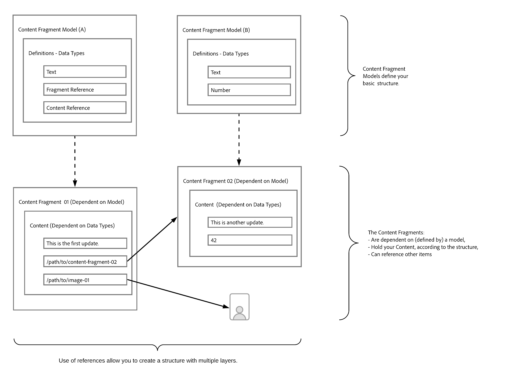

# Learn the Content Modeling Basics for Headless with AEM {#content-modeling-headless-basics}

## The Story so Far {#story-so-far}

At the beginning of the [AEM Headless Content Architect Journey](overview.md) the [Introduction](introduction.md) covered the basic concepts and terminology relevant to modeling content for headless.

This article builds on these so you understand how to model your content for your AEM headless project.

## Objective {#objective}

* **Audience**: Beginner
* **Objective**: Introduce the concepts of Content Modeling for Headless CMS.

## Content Modeling with Content Fragment Models {#architect-content-fragment-models}

Content (Data) Modeling is a set of established techniques, often used when developed relationship databases, so what does Content Modeling mean for AEM Headless?

### Why? {#why}

To ensure that your application can consistently and efficiently request and receive the required content from AEM, this content must be structured.

This means that your application knows in advance the form of response and therefore, how to process it. This is much easier than receiving free-form content, which has to be parsed to determine what it contains and therefore, how it can be used.

### Introduction to How? {#how}

AEM uses Content Fragments to provide the structures needed for Headless delivery of your content to your applications.

The structure of your content model is:

* realized by the definition of your Content Fragment Model,
* used as a basis of the Content Fragments used for your content generation.

>[!NOTE]
>
>The Content Fragment Models are also used as the basis of the AEM GraphQL Schemas, used for retrieving your content - more about that in the Developer Journey.

Requests for your content are made using the AEM GraphQL API, a customized implementation of the standard GraphQL API. The AEM GraphQL API allows applications to perform (complex) queries on your Content Fragments, with each query being according to a specific model type.

The content returned can then be used by your applications.

## Creating the Structure with Content Fragment Models {#create-structure-content-fragment-models}

Content Fragment Models provide various mechanisms that allow you to define the structure of your content.

A Content Fragment Model describes an entity.

>[!NOTE]
>Content Fragment functionality must be enabled in the Configuration Browser so that you can create new models.

>[!TIP]
>
>The model should be named so that the content author knows which model to select when creating a Content Fragment.

Within a model:

1. **Data Types** allow you to define the individual attributes.
   For example, define the field holding a teacher's name as **Text** and their years of service as **Number**.
1. The data types **Content Reference** and **Fragment Reference** allow you to create relationships to other content within AEM.
1. The **Fragment Reference** data type allows you to realize multiple levels of structure by nesting your Content Fragments (according to the model type). This is vital for your content modeling.

For example:

## Data Types {#data-types}

AEM provides the following data types for you to model your content:

* Single line text
* Multi line text
* Number
* Boolean
* Date and time
* Enumeration
* Tags
* Content Reference
* Fragment Reference
* JSON Object

>[!NOTE]
>
>Further details are available under Content Fragment Models - Data Types.

## References and Nested Content {#references-nested-content}

Two data types provide references to content outside a specific fragment:

* **Content Reference**
  This provides a simple reference to other content of any type.
  For example, you can reference an image at a specified location.

* **Fragment Reference**
  This provides references to other Content Fragments.
  This type of reference is used to create nested content, introducing the relationships needed to model your content.
  The data type can be configured to allow fragment authors to:
  * Edit the referenced fragment directly.
  * Create a new content fragment, based on the appropriate model

>[!NOTE]
>
>You can also create ad hoc references by using links within Text blocks.

## Levels of Structure (Nested Fragments) {#levels-of-structure-nested-fragments}

For content modeling the **Fragment Reference** data type allows you to create multiple levels of structure and relationships.

With this reference you can *connect* various Content Fragment Models to represent interrelationships. This allows the headless application to follow the connections and access the content as necessary.

>[!NOTE]
>
>This should be used with caution and the best practice can be defined as *nest as much as necessary, but as little as possible*.

Fragment References do just that - they allow you to reference another fragment. 

For example, you might have the following Content Fragment Models defined:

* City
* Company
* Person
* Awards

Seems pretty straightforward, but of course a Company has both a CEO and Employees....and these are all people, each defined as a Person.

And a Person can have an Award (or maybe two).

* My Company - Company
  * CEO - Person
  * Employee(s) - Person
    * Personal Award(s) - Award

And that's just for starters. Depending on the complexity, an Award could be Company-specific, or a Company could have its main office in a specific City.

Representing these interrelationships can be achieved with Fragment References, as they are understood by you (the architect), your content author and the headless applications.

## What's Next {#whats-next}

Now that you have learned the basics, the next step is to [Learn about Creating Content Fragment Models in AEM](model-structure.md). This will introduce and discuss the various references available, and how to create levels of structure with the Fragment References - a key part of modeling for headless.

## Additional Resources {#additional-resources}

* [Content Fragment Models](/help/assets/content-fragments/content-fragments-models.md)

  * [Content Fragment Models - Data Types](/help/assets/content-fragments/content-fragments-models.md#data-types)

* [Authoring Concepts](/help/sites-cloud/authoring/getting-started/concepts.md)

* [Basic Handling](/help/sites-cloud/authoring/getting-started/basic-handling.md) - this page is primarily based on the **Sites** console, but many/most features are also relevant for authoring **Content Fragments** under the **Assets** console.

* [Working with Content Fragments](/help/assets/content-fragments/content-fragments.md)
