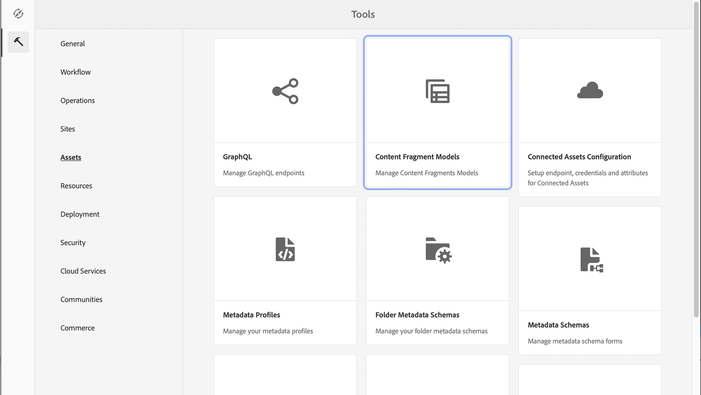

# Learn about Creating Content Fragment Models in AEM {#architect-headless-content-fragment-models}

## The Story so Far {#story-so-far}

At the beginning of the [AEM Headless Content Author Journey](overview.md) the [Content Modeling Basics for Headless with AEM](basics.md) covered the basic concepts and terminology relevant to authoring for headless.

This article builds on these so you understand how to create your own Content Fragment Models for your AEM headless project.

## Objective {#objective}

* **Audience**: Beginner
* **Objective**: the concepts and mechanics of modeling content for your Headless CMS using Content Fragments Models.

<!-- which persona does this? -->
<!-- and who allows the configuration on the folders? -->

<!--
## Enabling Content Fragment Models {#enabling-content-fragment-models}

At the very start you need to enable Content Fragment Models for your site, this is done in the Configuration Browser; under Tools -> General -> Configuration Browser. You can either select to configure the global entry, or create a new configuration. For example:

>[!NOTE]
>
>See Additional Resources - Content Fragments in the Configuration Browser
-->

## Creating Content Fragment Models {#creating-content-fragment-models}

Then the Content Fragments Models can be created and the structure defined. This can be done under Tools -> Assets -> Content Fragment Models. 

After selecting this you navigate to the location for your model and select **Create**. Here you can enter various key details.

The option **Enable model** is activated by default. This means that your model will be available for use (in creating Content Fragments) as soon as you have saved it. You can deactivate this if you want - there are opportunities later to enable (or disable) an existing model.

Confirm with **Create** and you can then **Open** your model to start defining the structure.

## Defining Content Fragment Models {#defining-content-fragment-models}

When you first open a new model you will see - a large blank space to the left, and a long list of **Data Types** at the right:

So - what's to be done?

You can drag instances of the **Data Types** onto the left space - you're already defining your model!

 

Once you add a data type you'll be required to define the **Properties** for that field. These depend on the type being used. For example:

 

You can add as many fields as you need. For example:

### Your Content Authors {#your-content-authors}

Your content authors do not see the actual Data Types and Properties that you've used to create your models. This means that you might have to provide help and information on how they complete specific fields. For basic information you can use the Field Label and Default Value, but more complex cases project specific documentation might need to be considered.

>[!NOTE]
>
>See Additional Resources - Content Fragment Models.

## Managing Content Fragment Models {#managing-content-fragment-models}

<!-- needs more details -->

Managing your Content Fragment Models involves:

* Enabling (or disabling) them - this makes them available for authors when creating Content Fragments.
* Deleting - deletion is always needed, but you need to be aware of deleting a model that is already used for Content Fragments, in particular fragments that are already published.

## Publishing {#publishing}

<!-- needs more details -->

Content fragment models need to be published when/before any dependent content fragments are published.

>[!NOTE]
>
>If an author tries to publish a content fragment for which the model has not yet been published, a selection list will indicate this and the model will be published with the fragment.

As soon as a model is published it is *locked* into a READ-ONLY mode on author. This aims to prevent changes that would result in errors to existing GraphQL schemas and queries, especially on the publish environment. It is indicated in the console by **Locked**. 

When the model is **Locked** (in READ-ONLY mode), you can see the contents and structure of models but you cannot edit them directly; though you can manage **Locked** models from either the console, or the model editor.

## What's Next {#whats-next}

Now that you have learned the basics, the next step is to start creating your own Content Fragment Models.

## Additional Resources {#additional-resources}

* [Authoring Concepts](/help/sites-cloud/authoring/getting-started/concepts.md)

* [Basic Handling](/help/sites-cloud/authoring/getting-started/basic-handling.md) - this page is primarily based on the **Sites** console, but many/most features are also relevant for navigating to, and taking action on, **Content Fragment Models** under the **Assets** console.

* [Working with Content Fragments](/help/assets/content-fragments/content-fragments.md)
 
  * [Content Fragment Models](/help/assets/content-fragments/content-fragments-models.md)

    * [Defining your Content Fragment Model](/help/assets/content-fragments/content-fragments-models.md#defining-your-content-fragment-model)

    * [Enabling or Disabling a Content Fragment Model](/help/assets/content-fragments/content-fragments-models.md#enabling-disabling-a-content-fragment-model)

    * [Allowing Content Fragment Models on your Assets Folder](/help/assets/content-fragments/content-fragments-models.md#allowing-content-fragment-models-assets-folder)

    * [Deleting a Content Fragment Model](/help/assets/content-fragments/content-fragments-models.md#deleting-a-content-fragment-model)

    * [Publishing a Content Fragment Model](/help/assets/content-fragments/content-fragments-models.md#publishing-a-content-fragment-model)

    * [Unpublishing a Content Fragment Model](/help/assets/content-fragments/content-fragments-models.md#unpublishing-a-content-fragment-model)

    * [Locked (Published) Content Fragment Models](/help/assets/content-fragments/content-fragments-models.md#locked-published-content-fragment-models)

* Getting Started Guides
  
  * [Creating Content Fragment Models Headless Quick Start Guide](/help/implementing/developing/headless/getting-started/create-content-model.md)
