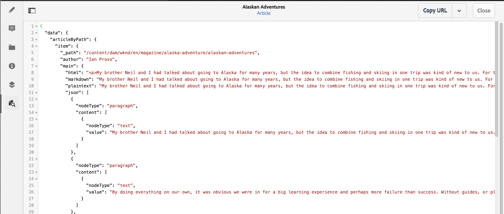

# How to Access Your Content via AEM Delivery APIs {#access-your-content}

In this part of the [AEM Headless Developer Journey,](overview.md) you can learn how to use GraphQL queries to access the content of your Content Fragments and feed it to your app (headless delivery).

## The Story So Far {#story-so-far}

In the previous document of the AEM headless journey, [How to Model Your Content](model-your-content.md) you learned the basics of content modeling in AEM, so you should now understand how to model your content structure, then realize that structure using AEM Content Fragment Models and Content Fragments:

* Recognize the concepts and terminology related to content modeling.
* Understand why content modeling is needed for Headless content delivery.
* Understand how to realize this structure using AEM Content Fragment Models (and author content with Content Fragments.
* Understand how to model your content; principles with basic samples.

This article builds on those fundamentals so you understand how to access your existing headless content in AEM using the AEM GraphQL API.

* **Audience**: Beginner
* **Objective**: Learn how to access the content of your Content Fragments using AEM GraphQL queries:
  * Introduce GraphQL and the AEM GraphQL API.
  * Dive into the details of the AEM GraphQL API.
  * Look at some sample queries to see how things work in practice.

## So You'd Like to Access Your Content? {#so-youd-like-to-access-your-content}

So...you've got all this content, neatly structured (in Content Fragments), and just waiting to feed your new app. Question is - how to get it there?

What you need is a way to target specific content, select what you need and return it to your app for further processing.

With Adobe Experience Manager (AEM), you can selectively access your Content Fragments, using the AEM GraphQL API, to return only the content that you need. This means you can realize headless delivery of structured content for use in your applications.

>[!NOTE]
>
>AEM GraphQL API is a customized implementation, based on the standard GraphQL API specification.

## GraphQL - An Introduction {#graphql-introduction}

GraphQL is an open-source specification that provides:

* a query language that enables you to select specific content from structured objects.
* a runtime to fulfill these queries with your structured content.

GraphQL is a *strongly* typed API. This means that *all* content must be clearly structured and organized by type, so that GraphQL *understands* what to access and how. The data fields are defined within GraphQL schemas, that define the structure of your content objects.

GraphQL endpoints then provide the paths that respond to the GraphQL queries.

All this means that your app can accurately, reliably and efficiently select the content that it needs - just what you need when used with AEM.

>[!NOTE]
>
>See *GraphQL*.org and *GraphQL*.com.

<!--
## AEM and GraphQL {#aem-graphql}

GraphQL is used in various locations in AEM; for example:

* Content Fragments
  * A customized API has been developed for this use-case (Headless Delivery to your app).
    * This is the AEM GraphQL API.
* Commerce
  * AEM Commerce consumes data from a Commerce platform via GraphQL.
  * There are GraphQL integrations between AEM and various third-party commerce solutions, used with the extension hooks provided by the CIF Core Components.
    * This does not use the AEM GraphQL API.

>[!NOTE]
>
>This step of the Headless Journey is only concerned with the AEM GraphQL API and Content Fragments.
-->

## AEM GraphQL API {#aem-graphql-api}

The AEM GraphQL API is a customized version based on the standard GraphQL API specification, specially configured to allow you to perform (complex) queries on your Content Fragments.

Content Fragments are used, as the content is structured according to Content Fragment Models. This fulfills a basic requirement of GraphQL.

* A Content Fragment Model is built up of one, or more, fields.
  * Each field is defined according to a Data Type.
* Content Fragment Models are used to generate the corresponding AEM GraphQL Schemas.

To actually access GraphQL for AEM (and the content) an endpoint is used to provide the access path.

The content returned, via the AEM GraphQL API, can then be used by your applications.

To help you directly input, and test queries, an implementation of the standard GraphiQL interface is also available for use with AEM GraphQL (this can be installed with AEM). It provides features such as syntax-highlighting, auto-complete, auto-suggest, together with a history and online documentation.

>[!NOTE]
>
>The AEM GraphQL API implementation is based on the GraphQL Java libraries.

<!--
### Use Cases for Author and Publish Environments {#use-cases-author-publish-environments}

The use cases for the AEM GraphQL API can depend on the type of AEMenvironment:

* Publish environment; used to: 
  * Query content for JS application (standard use-case)

* Author environment; used to: 
  * Query content for "content management purposes":
    * GraphQL in AEM is currently a read-only API.
    * The REST API can be used for CR(u)D operations.
-->

## Content Fragments for use with the AEM GraphQL API {#content-fragments-use-with-aem-graphql-api}

Content Fragments can be used as a basis for GraphQL for AEM schemas and queries as:

* They enable you to design, create, curate and publish page-independent content that can be delivered headlessly.
* They are based on a Content Fragment Model, which pre-defines the structure for the resulting fragment using a selection of data types.
* Additional layers of structure can be achieved with the Fragment Reference data type, available when defining a model.

### Content Fragment Models {#content-fragments-models}

These Content Fragment Models:

* Are used to generate the Schemas, once **Enabled**.
* Provide the data types and fields required for GraphQL. They ensure that your application only requests what is possible, and receives what is expected.
* The data type **Fragment References** can be used in your model to reference another Content Fragment, and so introduce additional levels of structure.

### Fragment References {#fragment-references}

The **Fragment Reference**:

* Is a specific data type available when defining a Content Fragment Model.
* References another fragment, dependent on a specific Content Fragment Model.
* Allows you to create, and then retrieve, structured data.

  * When defined as a **multifeed**, multiple sub-fragments can be referenced (retrieved) by the prime fragment.

### JSON Preview {#json-preview}

To help with designing and developing your Content Fragment Models, you can preview JSON output in the Content Fragment Editor.



<!--
## GraphQL Schema Generation from Content Fragments {#graphql-schema-generation-content-fragments}

GraphQL is a strongly typed API, which means that content must be clearly structured and organized by type. The GraphQL specification provides a series of guidelines on how to create a robust API for interrogating content on a certain instance. To do this, a client needs to fetch the Schema, which contains all the types necessary for a query. 

For Content Fragments, the GraphQL schemas (structure and types) are based on **Enabled** Content Fragment Models and their data types.

>[!CAUTION]
>
>All the GraphQL schemas (derived from Content Fragment Models that have been **Enabled**) are readable through the GraphQL endpoint.
>
>This means that you need to ensure that no sensitive content is available, to ensure that no sensitive data is exposed via GraphQL endpoints; for example, this includes information that could be present as field names in the model definition.

For example, if a user created a Content Fragment Model called `Article`, then AEM generates the object `article` that is of a type `ArticleModel`. The fields within this type correspond to the fields and data types defined in the model.

1. A Content Fragment Model:

   

1. The corresponding GraphQL schema (output from GraphiQL automatic documentation):
   

   This shows that the generated type `ArticleModel` contains several [fields](#fields). 
   
   * Three of them have been controlled by the user: `author`, `main` and `referencearticle`.

   * The other fields were added automatically by AEM, and represent helpful methods to provide information about a certain Content Fragment; in this example, `_path`, `_metadata`, `_variations`. These [helper fields](#helper-fields) are marked with a preceding `_` to distinguish between what has been defined by the user and what has been auto-generated.

1. After a user creates a Content Fragment based on the Article model, it can then be interrogated through GraphQL. For examples, see the Sample Queries.md#graphql-sample-queries) (based on a sample Content Fragment structure for use with GraphQL.

In GraphQL for AEM, the schema is flexible. This means that it is auto-generated each and every time a Content Fragment Model is created, updated or deleted. The data schema caches are also refreshed when you update a Content Fragment Model.

The Sites GraphQL service listens (in the background) for any modifications made to a Content Fragment Model. When updates are detected, only that part of the schema is regenerated. This optimization saves time and provides stability.

So for example, if you:

1. Install a package containing `Content-Fragment-Model-1` and `Content-Fragment-Model-2`:
 
   1. GraphQL types for `Model-1` and `Model-2` will be generated.

1. Then modify `Content-Fragment-Model-2`:

   1. Only the `Model-2` GraphQL type will get updated.

   1. Whereas `Model-1` will remain the same. 

>[!NOTE]
>
>This is important to note in case you want to do bulk updates on Content Fragment Models through the REST api, or otherwise.

The schema is served through the same endpoint as the GraphQL queries, with the client handling the fact that the schema is called with the extension `GQLschema`. For example, performing a simple `GET` request on `/content/cq:graphql/global/endpoint.GQLschema` will result in the output of the schema with the Content-type: `text/x-graphql-schema;charset=iso-8859-1`.

### Schema Generation - Unpublished Models {#schema-generation-unpublished-models}

When Content Fragments are nested it can happen that a parent Content Fragment Model is published, but a referenced model is not.

>[!NOTE]
>
>The AEM UI prevents this happening, but if publishing is made programmatically, or with content packages, it can occur.

When this happens, AEM generates an *incomplete* Schema for the parent Content Fragment Model. This means that the Fragment Reference, which is dependent on the unpublished model, is removed from the schema.

## AEM GraphQL Endpoints {#aem-graphql-endpoints}

An endpoint is the path used to access GraphQL for AEM. Using this path you (or your app) can:

* access the GraphQL schemas,
* send your GraphQL queries,
* receive the responses (to your GraphQL queries).

AEM allows for:

* A global endpoint - available for use by all sites.
* Endpoints for specific Sites configurations - that you can configure (in the Configuration Browser), specific to a specified site/project.

## Permissions {#permissions}

The permissions are those required for accessing Assets.

## The AEM GraphiQL Interface {#aem-graphiql-interface}

To help you directly input, and test queries, an implementation of the standard GraphiQL interface is available for use with AEM GraphQL. This can be installed with AEM.

>[!NOTE]
>
>GraphiQL is bound the global endpoint (and does not work with other endpoints for specific Sites configurations).

It provides features such as syntax-highlighting, auto-complete, auto-suggest, together with a history and online documentation.


-->

## Actually Using the AEM GraphQL API {#actually-using-aem-graphiql}

### Initial Setup {#initial-setup}

Before starting with queries on your content you need to:

* Enable your endpoint
  * Use Tools -> Assets -> GraphQL
  * [Enabling your GraphQL Endpoint](/help/sites-developing/headless/graphql-api/graphql-endpoint.md#enabling-graphql-endpoint)
  
* Access GraphiQL (if required)
  * [AEM GraphiQL interface](/help/sites-developing/headless/graphql-api/graphql-api-content-fragments.md#graphiql-interface)

### Sample Structure {#sample-structure}

To actually use the AEM GraphQL API in a query, we can use the two very basic Content Fragment Model structures:

* Company
  * Name - Text
  * CEO (Person) - Fragment Reference
  * Employees (Persons) - Fragment Reference(s)
* Person
  * Name - Text
  * First Name - Text

As you can see, the CEO and Employees fields, reference the Person fragments.

The fragment models will be used:

* when creating the content in the Content Fragment Editor
* to generate the GraphQL schemas that you will query

### Where to Test Your Queries {#where-to-test-your-queries}

The queries can be entered in the [GraphiQL interface](/help/sites-developing/headless/graphql-api/graphiql-ide.md), for example at:

* `http://localhost:4502/aem/graphiql.html`


### Getting Started with Queries {#getting-Started-with-queries}

A straightforward query is to return the name of all entries in the Company schema. Here you request a list of all company names:

```xml
query {
  companyList {
    items {
      name
    }
  }
}
```

A slightly more complex query is to select all persons that do not have a name of "Jobs". This will filter all persons for any that do not have the name Jobs. This is achieved with the EQUALS_NOT operator (there are many more):

```xml
query {
  personList(filter: {
    name: {
      _expressions: [
        {
          value: "Jobs"
          _operator: EQUALS_NOT
        }
      ]
    }
  }) {
    items {
      name
      firstName
    }
  }
}
```

You can also build up more complex queries. For example, query for all companies that have at least one employee with the name of "Smith". This query illustrates filtering for any person of name "Smith", returning information from across the nested fragments:

```xml
query {
  companyList(filter: {
    employees: {
      _match: {
        name: {
          _expressions: [
            {
              value: "Smith"
            }
          ]
        }
      }
    }
  }) {
    items {
      name
      ceo {
        name
        firstName
      }
      employees {
        name
        firstName
      }
    }
  }
}
```

<!-- need code / curl / cli examples-->

For the full details of using the AEM GraphQL API, together with configuring the necessary elements, you can reference:

* Learning to use GraphQL with AEM
* The Sample Content Fragment Structure
* Learning to use GraphQL with AEM - Sample Content and Queries

## What's Next {#whats-next}

Now that you have learned how to access and query your headless content using the AEM GraphQL API you can now [learn how to use the REST API to access and update the content of your Content Fragments](update-your-content.md).

## Additional Resources {#additional-resources}

* [GraphQL.org](https://graphql.org)
  * [Schemas](https://graphql.org/learn/schema/)
  * [Variables](https://graphql.org/learn/queries/#variables)
  * [GraphQL Java libraries](https://graphql.org/code/#java)
* [GraphiQL](https://graphql.org/learn/serving-over-http/#graphiql)
* [Learning to use GraphQL with AEM](/help/sites-developing/headless/graphql-api/graphql-api-content-fragments.md)
  * [Enabling your GraphQL Endpoint](/help/sites-developing/headless/graphql-api/graphql-endpoint.md#enabling-graphql-endpoint)
  * [Installing the AEM GraphiQL interface](/help/sites-developing/headless/graphql-api/graphql-api-content-fragments.md#installing-graphiql-interface)
* [The Sample Content Fragment Structure](/help/sites-developing/headless/graphql-api/content-fragments-graphql-samples.md#content-fragment-structure-graphql)
* [Learning to use GraphQL with AEM - Sample Content and Queries](/help/sites-developing/headless/graphql-api/content-fragments-graphql-samples.md)
  * [Sample Query - A Single Specific City Fragment](/help/sites-developing/headless/graphql-api/content-fragments-graphql-samples.md#sample-single-specific-city-fragment)
  * [Sample Query for Metadata - List the Metadata for Awards titled GB](/help/sites-developing/headless/graphql-api/content-fragments-graphql-samples.md#sample-metadata-awards-gb)
  * [Sample Query - All Cities with a Named Variation](/help/sites-developing/headless/graphql-api/content-fragments-graphql-samples.md#sample-cities-named-variation)
* [Enable Content Fragment Functionality in Configuration Browser](/help/assets/content-fragments/content-fragments-configuration-browser.md#enable-content-fragment-functionality-in-configuration-browser)
* [Working with Content Fragments](/help/assets/content-fragments/content-fragments.md)
  * [Content Fragment Models](/help/assets/content-fragments/content-fragments-models.md)
  * [JSON output](/help/assets/content-fragments/content-fragments-json-preview.md)
* [Understand Cross-Origin Resource Sharing (CORS)](https://experienceleague.adobe.com/docs/experience-manager-learn/foundation/security/understand-cross-origin-resource-sharing.html?lang=en#understand-cross-origin-resource-sharing-(cors))
* [Getting Started with AEM Headless](https://experienceleague.adobe.com/docs/experience-manager-learn/getting-started-with-aem-headless/graphql/overview.html) - A short video tutorial series giving an overview of using AEM's headless features, including content modeling and GraphQL.

<!--
* [Generating Access Tokens for Server Side APIs](/help/implementing/developing/introduction/generating-access-tokens-for-server-side-apis.md)
-->
