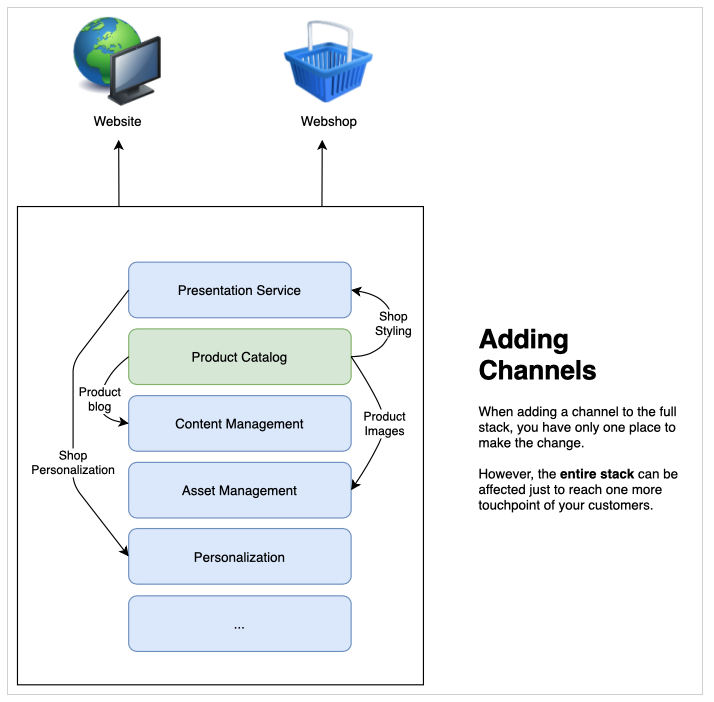
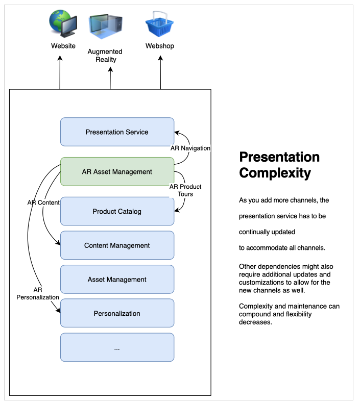
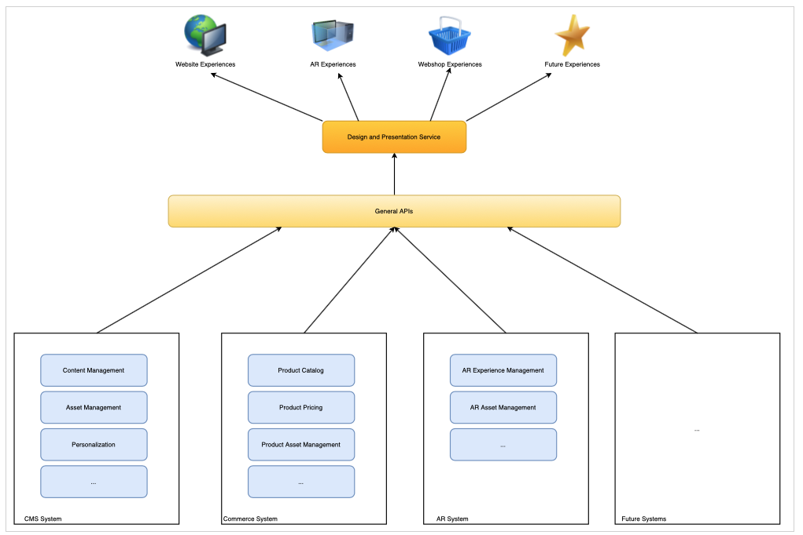

# Learn About CMS Headless Development {#learn-about}

In this part of the [AEM Headless Developer Journey,](overview.md) learn about headless technology and why you would use it.

## Objective {#objective}

This document helps you understand headless content delivery and why it should be used. After reading you should:

* Understand the basic concepts and terminology of headless content delivery
* Understand why and when headless is required
* Know at a high-level how headless concepts are used and how they interrelate

## Full-Stack Content Delivery {#full-stack}

Ever since the rise of easy-to-use, large-scale content management systems (CMSes), organizations have leveraged them as a central location to manage messaging, branding, and communications. Using the CMS as a central point for administering experiences improved efficiency by eliminating the need to duplicate tasks in disparate systems.

In a full-stack CMS, all of the functionality for manipulating your content is in the CMS. Features of the system make up different components of the CMS stack. The full-stack solution has many advantages.

* You have one system to maintain.
* Content is managed centrally.
* All services of the system are integrated.
* Content authoring is seamless.

So if you want to add a new channel or support new types of experiences, you can insert one (or more) new components into your stack and you only have one place to make your changes.

The complexity of the dependencies within the stack quickly become apparent as you see that other items in the stack may need to be adjusted to accommodate the changes.

## Limits of Full-Stack Delivery {#limits}

The full-stack approach inherently creates a silo where all experiences land in one system. Changes or additions to one component of the silo require changes to other components which can make changes time-intensive and costly.

This is particularly true of the presentation system, which in traditional setups, is often tightly bound to the CMS. Any new channel generally means an update to the presentation system, which can affect all other channels.

The limitations of this natural silo can become apparent as you spend more effort to coordinate changes across all components of your stack.

Users expect engagement no matter what the platform or touch point, requiring agility in how you deliver your experiences.  This multichannel approach is the standard of digital experiences and a full-stack approach can in certain circumstances prove inflexible.

## The Head in Headless {#the-head}

The head of any system is generally the output renderer of that system, typically in the form of a GUI or other graphical output.

A headless server for example is likely sitting in a rack in a server room somewhere and has no monitor attached. To access it you have to remotely connect into it. In this case, the monitor is the head as it takes care of rendering the output of the server. You as the consumer of the service, provide your own head (the monitor) when you connect remotely to it.

When we talk about a headless CMS, the CMS manages the content and continues to deliver it to consumers. However, by only delivering the **content** in a standardized fashion, a headless CMS omits the final output rendering, leaving the **presentation** of the content to the consuming service.

The consuming services, be they AR experiences, a webshop, mobile experiences, progressive web apps (PWAs), etc., take in content from the headless CMS and provide their own rendering. They take care of providing their own heads for your content.

Omitting the head simplifies the CMS by removing complexity. Doing this also shifts the responsibility of rendering the content to the services that actually need the content and are often better suited to such rendering.

## Decoupling {#decoupling}

Headless delivery is possible by exposing a set of robust and flexible application programming interfaces (APIs) that all of your experiences can tap into. The API serves as a common language between the services, binding them together at the content level through standardized content delivery, but allowing them the flexibility to implement their own solutions.

Headless is an example of decoupling your content from its presentation. Or in a more generic sense, decoupling the front end from the back end of your service stack. In a headless setup, the presentation system (the head) is decoupled from the content management (the tail). The two only interact through API calls.

This decoupling means that each consuming service (the front end) can build its experience based on the same content delivered over the APIs, ensuring content reuse and consistency. Consuming services can then implement their own presentation systems, allowing the content management stack (the back end) to easily scale horizontally.

## Technological Underpinnings {#technology}

A headless approach allows you to build a technology stack that can easily and quickly adapt to future digital experience demands.

APIs for CMSes in the past were usually REST-based. Representational state transfer (REST) provides resources as text in a stateless fashion. This allows the resources to be read and modified with a predefined set of operations. REST allowed for great interoperability between services on the web by ensuring stateless representation of the content.

There is still a need for robust REST APIs. However REST requests can be large and verbose. If you have multiple consumers making REST calls for all of your channels this verbosity compounds and performance can be affected.

Headless content delivery often makes use of GraphQL APIs. GraphQL allows for a similar stateless transfer, but allows for more targeted queries, reducing the total number of queries required, and improving performance. It is common to see solutions use a mixture of REST and GraphQL, essentially choosing the best tool for the job at hand.

Whatever your chosen API is, by defining a headless system based on common APIs, you can leverage the latest browser and other web technologies such as progressive web apps (PWA). APIs create a standard interface that is easily extensible and adaptable.

Typically, content is rendered on the client side. This normally means someone calls up your content on a mobile device, your CMS delivery the content, and then the mobile device (the client) is responsible for rendering the content that you served. If the device is old or otherwise slow, your digital experience is likewise slow.

Decoupling content from presentation means that there can be more control over such client-side performance concerns. Server-side rendering (SSR) transfers the responsibility of rendering the content from the client's browser to the server. This allows you as the provider of the content be able to offer a level of guaranteed performance to your audience if that is what is required.

## Organizational Challenges {#organization}

Headless opens up a world of flexibility for delivering your digital experiences. But this flexibility can also present its own challenge.

Having many different channels can mean that they each have their own presentation systems. Even though they all consume the same content through the same APIs, the experience can be different because of the different presentations. Concern and care must be given to ensuring the consistency of the customer experience.

By implementing careful design systems, sharing pattern libraries, and leveraging reusable design components as well as established, open client-side frameworks, consistent experiences can be ensured, but this must be planned.

## The Future is Headless and the Future is Now {#future}

Digital experiences will continue to define how brands interact with customers. What is exciting about headless design is the flexibility it give us to respond to evolving customer expectations.

It is impossible to predict the future, but headless gives you the agility to react to whatever the future brings.

## AEM and Headless {#aem-and-headless}

As you continue through this developer journey, you will learn how AEM supports headless delivery along side its full-stack delivery capabilities.

As an industry leader in digital experience management, Adobe realizes that the ideal solution to real-world challenges that experience creators face is rarely a binary choice. This is why AEM not only supports both models, but also uniquely allows the seamless hybrid combination of the two, blending the advantages of headless and full stack, to help you best serve the consumers of your content, wherever they are.

This journey focuses on the headless-only model of content delivery. However once you have this foundational knowledge, you can further explore how to leverage the power of both models.

## What's Next {#what-is-next}

Thanks for getting started on your AEM headless journey! Now that you read this document you should:

* Understand the basic concepts and terminology of headless content delivery.
* Understand why and when headless is required.
* Know at a high-level how headless concepts are used and how they interrelate.

Build on this knowledge and continue your AEM headless journey by next reviewing the document [Getting Started with AEM Headless as a Cloud Service](getting-started.md) where you will learn how to set up the necessary tools and how to begin thinking about how AEM approaches headless content delivery and its prerequisites.

## Additional Resources {#additional-resources}

While it is recommended that you move on to the next part of the headless development journey by reviewing the document [Getting Started with AEM Headless as a Cloud Service,](getting-started.md) the following are some additional, optional resources that do a deeper dive on some concepts mentioned in this document, but they are not required to continue on the headless journey.

* [An Introduction to the Architecture of Adobe Experience Manager as a Cloud Service](/help/overview/architecture.md) - Understand AEM as a Cloud Service's structure
* [AEM Headless Tutorials](https://experienceleague.adobe.com/docs/experience-manager-learn/getting-started-with-aem-headless/overview.html) - Use these hands-on tutorials to explore how to use the various options for delivering content to headless endpoints with AEM and chose what's right for you.
