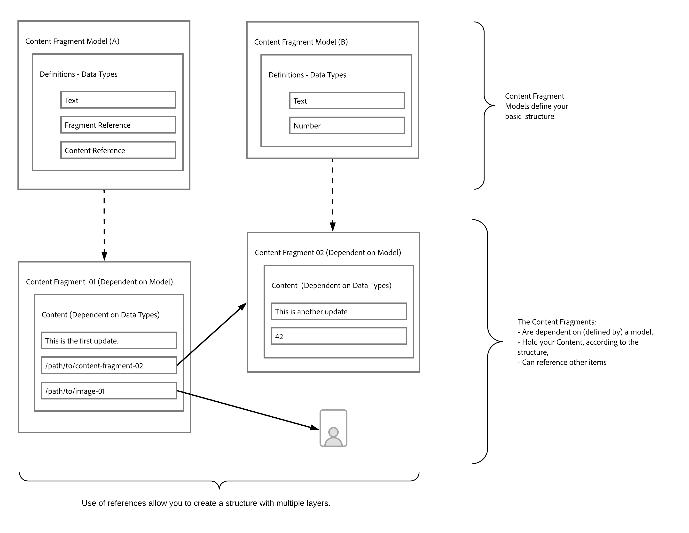
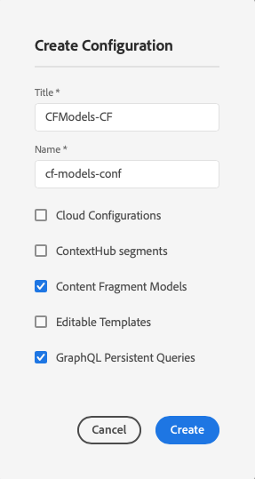
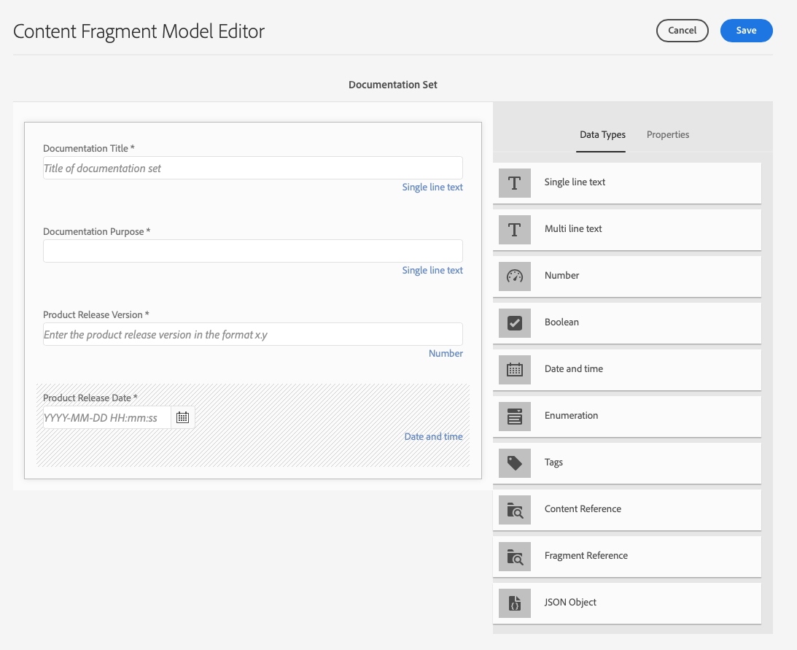
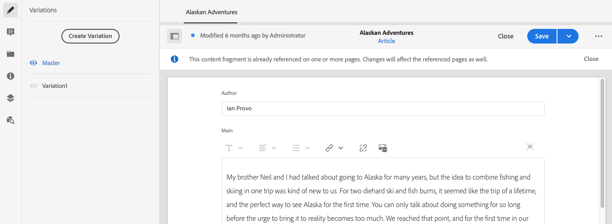

# How to Model Your Content {#model-your-content}

In this part of the [AEM Headless Developer Journey](overview.md), you can learn how to model your content structure. Then realize that structure for Adobe Experience Manager (AEM) using Content Fragments Models and Content Fragments, for reuse across channels.

## The Story So Far {#story-so-far}

At the beginning [Learn About CMS Headless Development](learn-about.md) covered headless content delivery and why it should be used. Then [Getting Started with AEM Headless](getting-started.md) described AEM Headless in the context of your own project.

In the previous document of the AEM headless journey, [Path to Your First Experience Using AEM Headless](path-to-first-experience.md), you then learned the steps needed to implement your first project. After reading it you should:

* Understand important planning considerations for designing your content
* Understand the steps to implement headless depending on your integration level requirements.
* Set up the necessary tools and AEM configurations.
* Know best practices to make your headless journey smooth, keep content generation efficient, and ensure content is delivered quickly.
  
This article builds on those fundamentals so you understand how to prepare your own AEM headless project.

## Objective {#objective}

* **Audience**: Beginner
* **Objective**: Learn how to model your content structure, then realize that structure using AEM Content Fragment Models and Content Fragments:
  * Introduce concepts and terminology related to data/content modeling.
  * Learn why content modeling is needed for Headless content delivery.
  * Learn how to realize this structure using AEM Content Fragment Models (and author content with Content Fragments).
  * Learn how to model your content; principles with basic samples.

>[!NOTE]
>
>Data Modeling is a very large field, as it is used when developing Relational Databases. There are many books, and online sources of information, available.
>
>We will only consider the aspects that are of interest when modeling data for use with AEM Headless.

## Content Modeling {#content-modeling}

*It's a big, bad world out there*.

Maybe, maybe not, but it's certainly a big ***complicated*** world out there and data modeling is used to define a simplified representation of a very (very) small sub-section, using the specific information that is needed for a certain purpose.

>[!NOTE]
>
>As AEM deals with content, we refer to Data Modeling as Content Modeling.

For example:

There are many Schools, but they all have various things in common:

* A Location
* A Head Teacher
* Many Teachers
* Many members of non-teaching staff
* Many pupils
* Many ex-teachers
* Many ex-pupils
* Many classrooms
* Many (many) books
* Many (many) pieces of equipment
* Many extra-curriculum activities
* and so on....

Even in such a small example the list can seem endless. But if you simply want your application to perform a simple task, you need to limit the information to the essentials.

For example, advertising special events for all schools in the area:

* School Name
* School Location
* Head Teacher
* Type of Event
* Date of Event
* Teacher Organizing the Event

### Concepts {#concepts}

What you want to describe are referred to as **Entities** - basically the "things" that we want to store information about.

The information that we want to store about them are the **Attributes** (properties), such as Name, and Qualifications for the teachers.

Then there are various **Relationships** between the entities. For example, usually a school only has one head teacher, and many teachers (and usually the head teacher is also a teacher).

The process of analyzing and defining this information, together with the relationships between them, is called **Content Modeling**.

### Basics {#basics}

Often you need to start by drawing up a **Conceptual Schema** that describes the entities and their relationships. Usually this is high-level (conceptual).

After this is stable you can translate the models into a **Logical Schema** that describes the entities, together with the attributes, and the relationships. At this level you should examine the definitions closely to eliminate duplication and optimize your design.

>[!NOTE]
>
>Sometimes these two steps are merged, often depending on the complexity of your scenario.

For example, do you need separate entities for `Head Teacher` and `Teacher`, or simply an additional attribute on the `Teacher` model?

### Ensuring data integrity {#data-integrity}

Data integrity is needed to guarantee the accuracy and consistency of your content, over its entire life-cycle. This includes ensuring that content authors can easily understand what to store where - so the following are vital:

* a clear structure
* a structure that is as concise as possible (without sacrificing accuracy)
* validation of individual fields
* where appropriate, restrict the content of specific fields to what is meaningful

### Eliminating data redundancy {#data-redundancy}

Data redundancy occurs when the same information is stored twice within the content structure. This should be avoided as it can lead to confusion when creating the content, and errors when querying; not to mention the misuse of storage space.

### Optimization and Performance {#optimization-and-performance}

By optimizing your structure you can improve the performance, both for content creation and querying.

Everything is a balancing act, but creating a structure that is too complex, or has too many levels, can:

* Be confusing for authors generating the content.

* Severely affect performance if the query has to access multiple nested (referenced) Content Fragments to retrieve the required content.

## Content Modeling for AEM Headless {#content-modeling-for-aem-headless}

Data Modeling is a set of established techniques, often used when developed relationship databases, so what does Content Modeling mean for AEM Headless?

### Why? {#why}

To ensure that your application can consistently and efficiently request and receive the required content from AEM, this content must be structured.

This means that your application knows in advance the form of response and therefore, how to process it. This is much easier than receiving free-form content, which has to be parsed to determine what it contains and therefore, how it can be used.

### Introduction to How? {#how}

AEM uses Content Fragments to provide the structures needed for Headless delivery of your content to your applications.

The structure of your content model is:

* realized by the definition of your Content Fragment Model,
* used as a basis of the Content Fragments used for your content generation.

>[!NOTE]
>
>The Content Fragment Models are also used as the basis of the AEM GraphQL Schemas, used for retrieving your content - more about that in a later session.

Requests for your content are made using the AEM GraphQL API, a customized implementation of the standard GraphQL API. The AEM GraphQL API allows you to perform (complex) queries on your Content Fragments, with each query being according to a specific model type.

The content returned can then be used by your applications.

## Creating the Structure with Content Fragment Models {#create-structure-content-fragment-models}

Content Fragment Models provide various mechanisms that allow you to define the structure of your content.

A Content Fragment Model describes an entity.

>[!NOTE]
>You must enable Content Fragment functionality in the Configuration Browser so that you can create new models.

>[!TIP]
>
>The model should be named so that the content author knows which model to select when creating a Content Fragment.

Within a model:

1. **Data Types** allow you to define the individual attributes.
   For example, define the field holding a teacher's name as **Text** and their years of service as **Number**.
1. The data types **Content Reference** and **Fragment Reference** allow you to create relationships to other content within AEM.
1. The **Fragment Reference** data type allows you to realize multiple levels of structure by nesting your Content Fragments (according to the model type). This is vital for your content modeling.

For example:

### Data Types {#data-types}

AEM provides the following data types for you to model your content:

* Single line text
* Multi line text
* Number
* Boolean
* Date and time
* Enumeration
* Tags
* Content Reference
* Fragment Reference
* JSON Object

### References and Nested Content {#references-nested-content}

Two data types provide references to content outside a specific fragment:

* **Content Reference**
  This provides a simple reference to other content of any type.
  For example, you can reference an image at a specified location.

* **Fragment Reference**
  This provides references to other Content Fragments.
  This type of reference is used to create nested content, introducing the relationships needed to model your content.
  The data type can be configured to allow fragment authors to:
  * Edit the referenced fragment directly.
  * Create a new content fragment, based on the appropriate model

### Creating Content Fragment Models {#creating-content-fragment-models}

At the very start you need to enable Content Fragment Models for your site, this is done in the Configuration Browser; under Tools -> General -> Configuration Browser. You can either select to configure the global entry, or create a new configuration. For example:

>[!NOTE]
>
>See Additional Resources - Content Fragments in the Configuration Browser

Then the Content Fragments Models can be created and the structure defined. This can be done under Tools -> Assets -> Content Fragment Models. For example:

>[!NOTE]
>
>See Additional Resources - Content Fragment Models.

## Using the Model to Author Content with Content Fragments {#use-content-to-author-content}

Content Fragments are always based on a Content Fragment Model. The model provides the structure, the fragment holds the content.

### Selecting the appropriate model {#select-model}

The first step to actually creating your content is to create a Content Fragment. This is done using Create -> Content Fragment in the required folder under Assets -> Files. The wizard will guide you through the steps.

A Content Fragment is based on a specific Content Fragment Model, that you select as the first step of the creation process.

### Creating, and editing, structured content {#create-edit-structured-content}

Once your fragment has been created, you can open it in the Content Fragment Editor. Here you can:

* Edit your content in either normal, or full-screen mode.
* Format your content as either Full Text, Plain Text or Markdown.
* Create and manage Variations of you content.
* Associate Content.
* Edit the Metadata.
* Show the Tree Structure.
* Preview the JSON representation.

### Creating Content Fragments {#creating-content-fragments}

After selecting the appropriate model, a Content Fragment is opened for editing in the Content Fragment Editor:

>[!NOTE]
>
>See Additional Resources - Working with Content Fragments.

## Getting Started with some Examples {#getting-started-examples}

<!--
tbc...
...and/or see the structures covered for the GraphQL samples...
...will those (ever) be delivered as an official sample package?
-->

For a basic structure as sample, see The Sample Content Fragment Structure.

## What's Next {#whats-next}

Now that you have learned how to model your structure, and create content dependent on that, the next step is to [Learn how to use GraphQL queries to access and retrieve your Content Fragments content](access-your-content.md). This will introduce and discuss GraphQL, then look at some sample queries to see how things work in practice.

## Additional Resources {#additional-resources}

* [Working with Content Fragments](/help/assets/content-fragments/content-fragments.md) - the lead-in page for Content Fragments
  * [Content Fragments in the Configuration Browser](/help/assets/content-fragments/content-fragments-configuration-browser.md) - enable Content Fragment functionality in the Configuration Browser
  * [Content Fragment Models](/help/assets/content-fragments/content-fragments-models.md) - creating and editing Content Fragment Models
  * [Managing Content Fragments](/help/assets/content-fragments/content-fragments-managing.md) - creating and authoring Content Fragments; this page will lead you to other detailed sections
* [AEM GraphQL Schemas](access-your-content.md) - how GraphQL realizes models
* [The Sample Content Fragment Structure](/help/sites-developing/headless/graphql-api/content-fragments-graphql-samples.md#content-fragment-structure-graphql)
* [Getting Started with AEM Headless](https://experienceleague.adobe.com/docs/experience-manager-learn/getting-started-with-aem-headless/graphql/overview.html) - A short video tutorial series giving an overview of using AEM's headless features, including content modeling and GraphQL
  * [GraphQL Modeling Basics](https://experienceleague.adobe.com/docs/experience-manager-learn/getting-started-with-aem-headless/graphql/video-series/modeling-basics.html) - Learn how to define and use Content Fragments in Adobe Experience Manager (AEM) for use with GraphQL.
