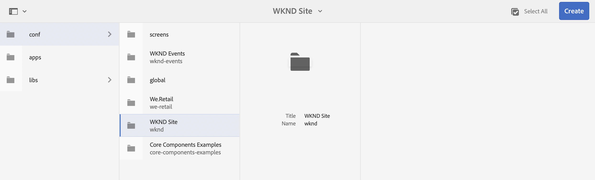
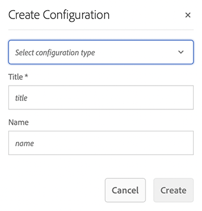
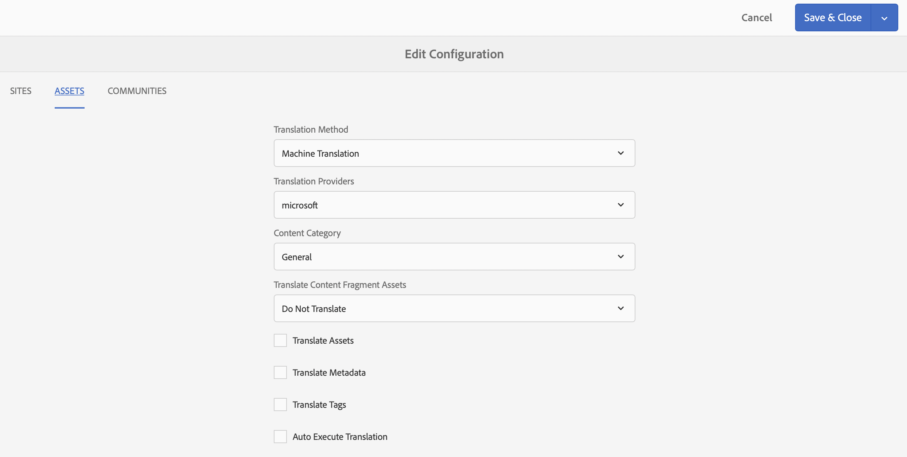
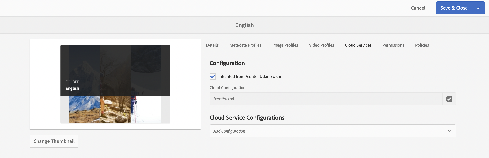

# Configure the Translation Connector {#configure-connector}

Learn how to connect AEM to a translation service.

## The Story So Far {#story-so-far}

In the previous document of the AEM headless translation journey, [Get started with AEM headless translation](learn-about.md) you learned how to organize your headless content and how AEM's translation tools work and you should now:

* Understand the importance of content structure to translation.
* Understand how AEM stores headless content.
* Be familiar with AEM's translation tools.

This article builds on those fundamentals so you can take the first configuration step and set up a translation service, which you will use later in the journey to translate your content.

## Objective {#objective}

This document helps you understand how to set up an AEM connector to your chosen translation service. After reading you should:

* Understand the important parameters of the Translation Integration Framework in AEM.
* Be able to set up your own connection to your translation service.

## The Translation Integration Framework {#tif}

AEM's Translation Integration Framework (TIF) integrates with third-party translation services to orchestrate the translation of AEM content. It involves three basic steps.

1. Connect to your translation service provider.
1. Create a Translation Integration Framework configuration.
1. Associate the configuration with your content.

The following sections describe these steps in more detail.

## Connecting to a Translation Service Provider {#connect-translation-provider}

The first step is to choose which translation service you wish to use. There are many choices for human and machine translation services available to AEM. Most providers offer a translator package to be installed. See the [Additional Resources](#additional-resources) section for a selection of options available.

>[!NOTE]
>
>The translation specialist is generally responsible for choosing which translation service to use, but the administrator typically is responsible for installing the required translation connector package.

For the purposes of this journey, we use the Microsoft Translator which AEM provides with a trial license out-of-the-box. See the [Additional Resources](#additional-resources) section for more information about this provider.

If you choose another provider your administrator must install the connector package as per the instructions provided by the translation service.

>[!NOTE]
>
>Using the out-of-the-box Microsoft Translator in AEM does not require additional setup and works as-is without additional connector configuration.
>
>If you choose to use the Microsoft Translator connector for testing purposes, you do not need to carry out the steps in the next two sections: [Creating a Translation Integration Configuration](#create-config) and [Associate the Configuration with Your Content.](#associate) However you are advised to read them so that you are familiar with the steps for when you need to configure your preferred connector.
>
>The trial license of the Microsoft Translator connector is not intended for production purposes and if you decide to license it, the system administrator must follow the steps detailed in the [Additional Resources](#additional-resources) section at the end of this document in order to configure that license.

## Creating a Translation Integration Configuration {#create-config}

After the connector package for your preferred translation service is installed, you must create a Translation Integration Framework configuration for that service. The configuration includes the following information:

* Which translation service provider to use
* Whether human or machine translation is to be performed
* Whether to translate other content that is associated with the Content Fragment such as tags

To create a new translation configuration:

1. In the global navigation menu, click or tap **Tools** -&gt; **Cloud Services** -&gt; **Translation Cloud Services**.
1. Navigate to where you wish to create the configuration in your content structure. This is often based on a particular project or can be global.
   * For example, in this case, a configuration could be made globally to apply to all content, or just for the WKND project.

   

1. Provide the following information in the fields and then click or tap **Create**.
   1. Select **Configuration Type** in the drop-down. Select **Translation Integration** from the list.
   1. Enter a **Title** for your configuration. The **Title** identifies the configuration in the **Cloud Services** console as well as in page property drop-down lists.
   1. Optionally, type a **Name** to use for the repository node that stores the configuration.

   

1. Tap or click **Create** and the **Edit Configuration** window appears where you can configure the configuration properties.

1. Remember that Content Fragments are stored as assets in AEM. Tap or click the **Assets** tab.



1. Provide the following information.

   1. **Translation Method** - Select **Machine Translation** or **Human Translation** depending on your translation provider. For the purposes of this journey we assume machine translation.
   1. **Translation Providers** - Select the connector you installed for your translation service from the list.
   1. **Content Category** - Select the most appropriate category to better target the translation (only for machine translation).
   1. **Translate Content Fragment Assets** - Check this to translate assets associated with Content Fragments.
   1. **Translate Assets** - Check this to translate the assets.
   1. **Translate Metadata** - Check this to translate asset metadata.
   1. **Translate Tags** - Check this to translate tags that are associated with the asset.
   1. **Auto-Execute Translation** - Check this property if you want translations to be automatically sent to your translation service.

1. Tap or click **Save &amp; Close**.

You have now configured the connector to your translation service.

## Associate the Configuration with Your Content {#associate}

AEM is a flexible and powerful tool and supports multiple, simultaneous translation services via multiple connectors and multiple configurations. Setting up such a configuration is beyond the scope of this journey. However this flexibility means that you must specify which connectors and configuration should be used to translate your content by associating ths configuration with your content.

To do this, navigate to the language root of your content. For our example purposes this is

```text
/content/dam/<your-project>/en
```

1. Go to the global navigation and go to **Navigation** -&gt; **Assets** -&gt; **Files**.
1. In the assets console, select the language root to configure and click or tap **Properties**.
1. Tap or click the **Cloud Services** tab.
1. Under **Cloud Service Configurations** in the **Add Configuration** dropdown, select your connector. It should appear in the dropdown when you have installed its package as [described previously.](#connect-translation-provider)
1. Under **Cloud Service Configurations** in the **Add Configuration** dropdown, also select your configuration.
1. Tap or click **Save &amp; Close**.



## What's Next {#what-is-next}

Now that you have completed this part of the headless translation journey you should:

* Understand the important parameters of the Translation Integration Framework in AEM.
* Be able to set up your own connection to your translation service.

Build on this knowledge and continue your AEM headless translation journey by next reviewing the document [Configure translation rules,](translation-rules.md) where you will learn how to define which content to translate.

## Additional Resources {#additional-resources}

While it is recommended that you move on to the next part of the headless translation journey by reviewing the document [Configure translation rules](translation-rules.md) the following are some additional, optional resources that do a deeper dive on some concepts mentioned in this document, but they are not required to continue on the headless journey.

* [Configuring the Translation Integration Framework](/help/sites-cloud/administering/translation/integration-framework.md) - Review a list of selected translation connectors and learn how to configure the Translation Integration Framework to integrate with third-party translation services.
* [Connecting to Microsoft Translator](/help/sites-cloud/administering/translation/connect-ms-translator.md) - AEM provides a trial Microsoft Translation account for testing purposes.
