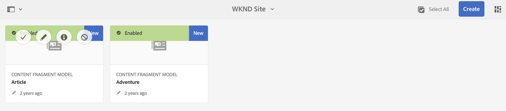
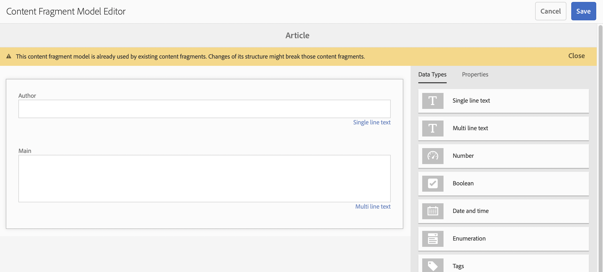
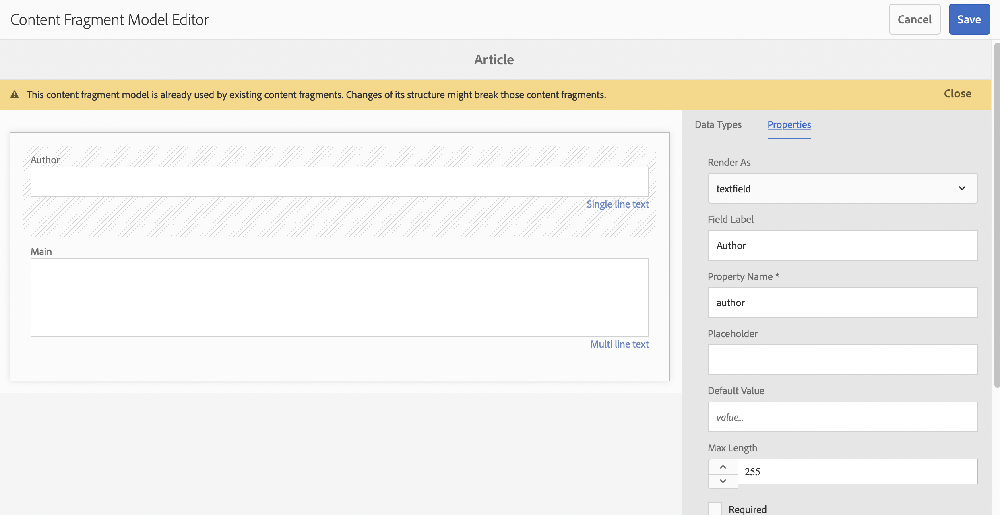

# Get Started with AEM Headless Translation {#getting-started}

Get to know how to organize your headless content and how AEM's translation tools work.

## The Story So Far {#story-so-far}

In the previous document of the AEM headless translation journey, [Learn about headless content and how to translate in AEM](learn-about.md) you learned the basic theory of what a headless CMS is and you should now:

* Understand the basic concepts of headless content delivery.
* Be familiar with how AEM supports headless and translation.

This article builds on those fundamentals so you understand how AEM stores and manages headless content and how you can use AEM's translation tools to translate that content.

## Objective {#objective}

This document helps you understand how to get started translating headless content in AEM. After reading you should:

* Understand the importance of content structure to translation.
* Understand how AEM stores headless content.
* Be familiar with AEM's translation tools.

## Requirements and Prerequisites {#requirements-prerequisites}

There are a number of requirements before you begin translating your headless AEM content.

### Knowledge {#knowledge}

* Experience translating content in a CMS
* Experience using the basic features of a large-scale CMS
* Have a working knowledge of AEM basic handling
* Understanding of the translation service you are using
* Have a basic understanding of the content you are translating

>[!TIP]
>
>If you are not familiar with using a large-scale CMS like AEM, consider reviewing the [Basic Handling](/help/sites-cloud/authoring/getting-started/basic-handling.md) documentation before proceeding. The Basic Handling documentation is not part of the journey, so please return to this page when complete.

### Tools {#tools}

* Sandbox access for testing translating your content
* Credentials to connect to your preferred translation service
* Be a member of the `project-administrators` group in AEM

## Structure is Key {#content-structure}

AEM's content, be it headless or traditional web pages, is driven by its structure. AEM imposes few requirements on the content structure, but careful consideration of your content hierarchy as part of the project planning can make translation much simpler.

>[!TIP]
>
>Plan for translation at the very beginning of the headless project. Work closely with the project manager and content architects early.
>
>An Internationalization Project Manager may be required as a separate persona whose responsibility it is to define what content should be translated and what not, and what translated content may be modified by regional or local content producers.

## How AEM Stores Headless Content {#headless-content-in-aem}

For the translation specialist, it is not important to understand in-depth how AEM manages headless content. However being familiar with the basic concepts and terminology will be helpful as you later use AEM's translation tools. Most importantly you need to understand your own content and how it is structured in order to effectively translate it.

### Content Models {#content-models}

In order for headless content to be delivered consistently across channels, regions, and languages, content must be highly structured. AEM uses Content Models to enforce this structure. Think of Content Models as a kind of template or pattern for creating headless content. Because every project has its own needs, every project defines its own Content Fragment Models. AEM has no fixed requirements or structure for such models.

The content architect works early in the project to define this structure. As the translation specialist, you should work closely with the content architect to understand and organize the content.

>[!NOTE]
>
>It is the responsibility of the content architect to define the Content Models. The translation specialist should only be familiar with their structure as outlined in the following steps.

Because the Content Models define the structure of your content, you need to know which fields of your models must be translated. Generally you work with the content architect to define this. To browse the fields of your content models, follow the steps below.

1. Navigate to **Tools** -&gt; **Assets** -&gt; **Content Fragment Models**.
1. Content Fragment Models are generally stored in a folder structure. Tap or click on the folder for your project.
1. The models are listed. Tap or click on the model to see the details.

1. The **Content Fragment Model Editor** opens.
   1. The left column contains the fields of the model. This column interests us.
   1. The right column contains the fields that can be added to the model. This column we can ignore.

1. Tap or click one of the fields of the model. AEM marks it and the details of that field are shown in the right column.


Take note of the field **Property Name** for all fields that must be translated. You will need this information later in the journey. These **Property Name**s are required to inform AEM which fields of your content must be translated.

>[!TIP]
>
>Generally the content architect provides the translation specialist with the **Property Name**s of all of the fields required for translation. These field names are needed for later in the journey. The prior steps are provided for the understanding of the translation specialist.

### Content Fragments {#content-fragments}

Content Models are used by the content authors to create the actual headless content. Content authors select which model to base their content on an then create Content Fragments. Content Fragments are instances of the models and represent actual content to be delivered headlessly.

If the Content Models are the patterns for the content, the Content Fragments are the actual content based on those patterns. The Content Fragments represent the content that must be translated.

Content Fragments are managed as assets in AEM as part of digital asset management (DAM). This is important since they are all located under the path `/content/dam`.

## Recommended Content Structure {#recommended-structure}

As previously recommended, work with your content architect to determine the appropriate content structure for your own project. However the following is a proven, simple, and intuitive structure which is quite effective.

Define a base folder for your project under `/content/dam`.

```text
/content/dam/<your-project>
```

The language in which your content is authored is called the language root. In our example it is English and it should be below this path.

```text
/content/dam/<your-project>/en
```

All project content that may need to be localized should be placed under the language root.

```text
/content/dam/<your-project>/en/<your-project-content>
```

Translations should be created as sibling folders alongside the language root with their folder name representing the ISO-2 language code of the language. For example, German would have the following path.

```text
/content/dam/<your-project>/de
```

>[!NOTE]
>
>The content architect generally is responsible for creating these language folders. If they are not created, AEM will not be able to later create translation jobs.

The final structure may look something like the following.

```text
/content
    |- dam
        |- your-project
            |- en
                |- some
                |- exciting
                |- headless
                |- content
            |- de
            |- fr
            |- it
            |- ...
        |- another-project
        |- ...
```

You should take note of the specific path of your content as it will be required later to configure your translation.

>[!NOTE]
>
>It is generally the responsibility of the content architect to define the content structure, but can collaborate with the translation specialist.
>
>It is detailed here for completeness.

## AEM Translation Tools {#translation-tools}

Now that you understand what Content Fragments are and the importance of content structure, we can look at how to translate this content. The translation tools in AEM are quite powerful, but are simple to understand at a high level.

* **Translation Connector** - The connector is the link between AEM and the translation service that you use.
* **Translation Rules** - Rules define what content under particular paths should be translated.
* **Translation Projects** - Translation projects gather content that should be addressed as a single translation effort and tracks the progress of the translation, interfacing with the connector to transmit the content to be translated and receive it back from the translation service.

You generally only set up your connector once for your instance and rules per headless project. Then you use translation projects to translate your content and keep its translations up to date on a continual basis.

## What's Next {#what-is-next}

Now that you have completed this part of the headless translation journey you should:

* Understand the importance of content structure to translation.
* Understand how AEM stores headless content.
* Be familiar with AEM's translation tools.

Build on this knowledge and continue your AEM headless translation journey by next reviewing the document [Configure the translation connector](configure-connector.md) where you will learn how to connect AEM to a translation service.|

## Additional Resources {#additional-resources}

While it is recommended that you move on to the next part of the headless translation journey by reviewing the document [Configure the translation connector](configure-connector.md) the following are some additional, optional resources that do a deeper dive on some concepts mentioned in this document, but they are not required to continue on the headless journey.

* [AEM Basic Handling](/help/sites-cloud/authoring/getting-started/basic-handling.md) - Learn the basics of the AEM UI to be able to comfortably navigate and perform essential tasks such as finding your content.
* [Identifying Content to Translate](/help/sites-cloud/administering/translation/rules.md) - Learn how translation rules identify content that needs translating.
* [Configuring the Translation Integration Framework](/help/sites-cloud/administering/translation/integration-framework.md) - Learn how to configure the Translation Integration Framework to integrate with third-party translation services.
* [Managing Translation Projects](/help/sites-cloud/administering/translation/managing-projects.md) - Learn how to create and manage both machine and human translation projects in AEM.
