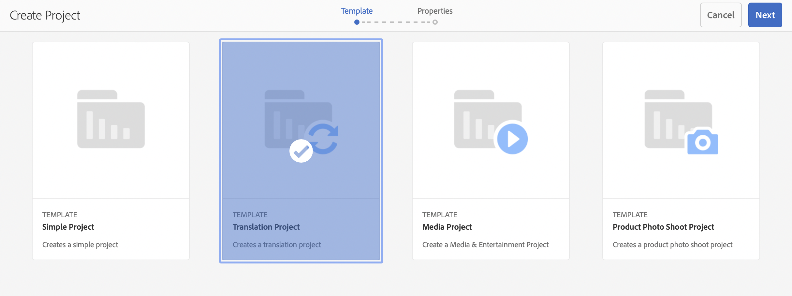
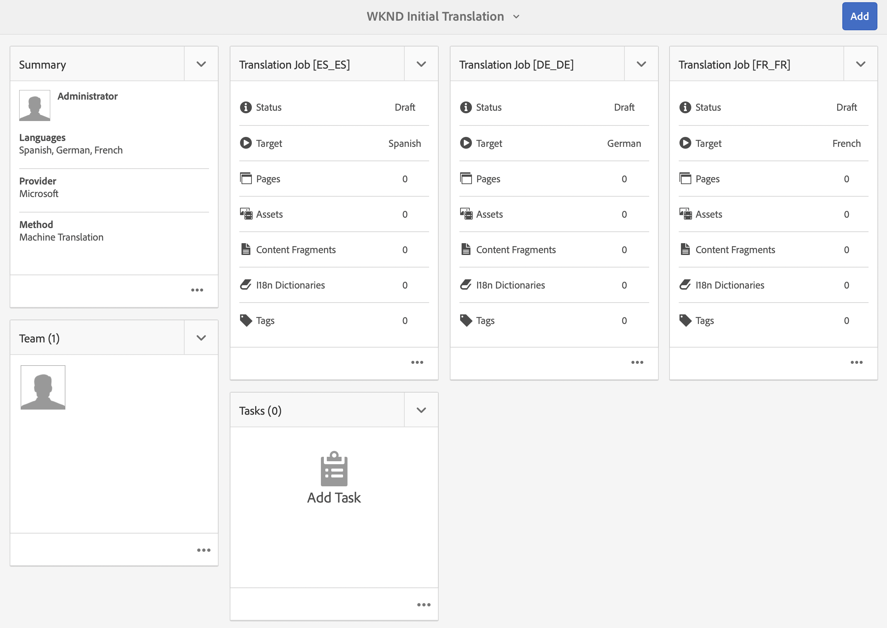
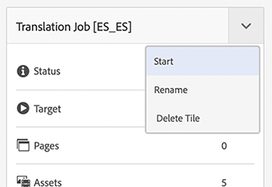
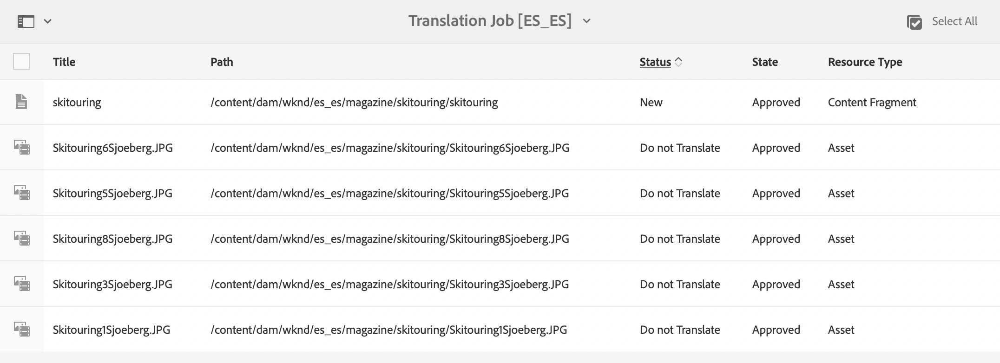
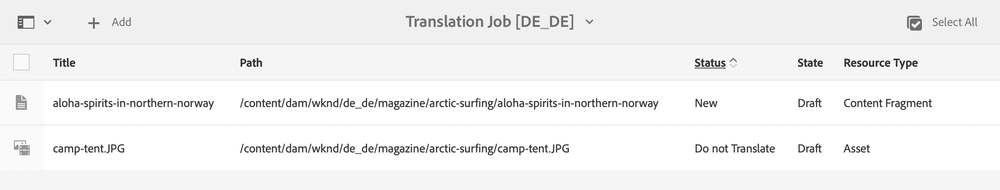

# Translate Content {#translate-content}

Use the translation connector and rules to translate your headless content.

## The Story So Far {#story-so-far}

In the previous document of the AEM headless translation journey, [Configure Translation Rules](translation-rules.md) you learned how to use AEM's translation rules to identify your translation content. You should now:

* Understand what the translation rules do.
* Be able to define your own translation rules.

Now that your connector and translations rules are set up, this article takes you through the next step of translating your headless content.

## Objective {#objective}

This document helps you understand how to use AEM's translation projects along with the connector and your translations rules to translate content. After reading this document you should:

* Understand what a translation project is.
* Be able to create new translation projects.
* Use translation projects to translate your headless content.

## Creating a Translation Project {#creating-translation-project}

Translation projects enable you to manage the translation of headless AEM content. A translation project gathers the content to be translated into other languages in one location for a central view of the translation effort.

When content is added to a translation project, a translation job is created for it. Jobs provide commands and status information that you use to manage the human translation and machine translation workflows that execute on the resources.

Translation projects can be created in two ways:

1. Select the language root of the content and have AEM automatically create the translation project based on the content path.
1. Create an empty project and manually select the content to add to the translation project

Both are valid approaches usually only differing based on the persona performing the translation:

* The translation project manager (TPM) often needs the flexibility of manually selecting the content to the translation project.
* If the content owner is also responsible for translation, letting AEM automatically create the project based on the selected content path is often easier.

Both approaches are explored in the following sections.

### Automatically Creating a Translation Project Based on Content Path {#automatically-creating}

For content owners who are also responsible for translation, it is often easier to have AEM automatically create the translation project automatically. To have AEM automatically create a translation project based on your content path:

1. Navigate to **Navigation** -&gt; **Assets** -&gt; **Files**. Remember that headless content in AEM is stored as assets known as Content Fragments.
1. Select the language root of your project. In this case we have selected `/content/dam/wknd/en`.
1. Tap or click the rail selector and show the **References** panel.
1. Tap or click on **Language Copies**.
1. Check the **Language Copies** checkbox.
1. Expand the section **Update Language Copies** at the bottom of the references panel.
1. In the **Project** dropdown, select **Create Translation Project(s)**.
1. Provide an appropriate title for your translation project.
1. Tap or click **Start**.


You receive a message that the project was created.

>[!NOTE]
>
>It is assumed that the necessary language structure for the translations languages has already been created as part of the [definition of your content structure.](getting-started.md#content-structure) This should be done in collaboration with the content architect.
>
>If the language folders are not created ahead of time, you will not be able to create language copies as described in the previous steps.

### Manually Creating a Translation Project by Selecting Your Content {#manually-creating}

For translation project managers, it is often necessary to manually select specific content to include in a translation project. To create such a manual translation project, you must start by creating an empty project and then select the content to add to it.

1. Navigate to **Navigation** -&gt; **Projects**.
1. Tap or click **Create** -&gt; **Folder** to create a folder for your projects.
   * This is optional, but helpful to organize your translation efforts.
1. In the **Create Project** window, add a **Title** for the folder and then tap or click **Create**.

   

1. Tap or click the folder to open the folder.
1. In your new project folder, tap or click **Create** -&gt; **Project**.
1. Projects are based on templates. Tap or click the **Translation Project** template to select it and then tap or click **Next**.

   

1. On the **Basic** tab, enter a name for your new project.

   

1. On the **Advanced** tab, use the **Target Language** dropdown to select the language(s) into which your content should be translated. Tap or click **Create**.

   

1. Tap or click **Open** in the confirmation dialog.

   

The project has been created, but contains no content to translate. The next section details how the project is structured and how to add content.

## Using a Translation Project {#using-translation-project}

Translation projects are designed to collect all of the content and tasks related to a translation effort in one place to make your translation simple and easy to manage.

To view the translation project:

1. Navigate to **Navigation** -&gt; **Projects**.
1. Tap or click the project that was created in the previous section.



The project is divided into multiple cards.

* **Summary** - This card shows the basic header information of the project including the owner, language, and translation provider.
* **Translation Job** - This card or these cards show(s) provide an overview of the actual translation job including the status, number of assets, etc. Generally there is one job per language with the ISO-2 language code appended to the job name.
* **Team** - This card shows the users who are collaborating on this translation project. This journey does not cover this topic.
* **Tasks** - Additional tasks associated with translating the content such as to do items or workflow items. This journey does not cover this topic.

How you use a translation project depends on how it was created: either automatically by AEM or manually.

### Using an Automatically Created Translation Project {#using-automatic-project}

When automatically creating the translation project, AEM evaluates the headless content under the path you selected  based on the translation rules that you previously defined. Based on that evaluation, it extracts the content that requires translation into a new translation project.

To see the detail of the headless content included in this project:

1. Tap or click on the ellipsis button at the bottom of the **Translation Job** card.
1. The **Translation Job** window lists all items in the job.

1. Tap or click a line to see the detail of that line, keeping in mind that one line may represent multiple content items to translate.
1. Tap or click the selection checkbox for a line item to see further options such as the option to delete it from the job or view it in the Content Fragments or Assets consoles.


Typically the content for the translation job starts in the **Draft** state as indicated by the **State** column in the **Translation Job** window.

To start the translation job, return to the translation project overview and tap or click the chevron button at the top of the **Translation Job** card and select **Start**.



AEM now communicates with your translation configuration and connector to send the content to the translation service. You can view the progress of the translation by returning to the **Translation Job** window and viewing the **State** column of the entries.



Machine translations automatically return with a state of **Approved**. Human translation allows for more interaction, but is beyond the scope of this journey.

### Using a Manually Created Translation Project {#using-manual-project}

When manually creating a translation project, AEM creates the necessary jobs, but does not automatically select any content to include. This allows the translation project manager the flexibility to pick-and-chose what content to translate.

To add content to a translation job:

1. Tap or click the ellipsis button at the bottom of one of the **Translation Job** cards.
1. See that the job contains no content. Tap or click the **Add** button at top of the window and then **Assets/Pages** from the drop-down.

   

1. A path browser opens allowing you to select specifically which content to add. Locate your content and tap or click to select.

   

1. Tap or click **Select** to add the selected content to the job.
1. In the **Translate** dialog, specify that you wish to **Create Language Copy**.

   

1. The content is now included in the job.

   

1. Tap or click the selection checkbox for a line item to see further options such as the option to delete it from the job or view it in the Content Fragments or Assets consoles.


1. Repeat these steps to include all required content in the job.

>[!TIP]
>
>The path browser is a powerful tool allowing you to search, filter, and navigate your content. Tap or click the **Content Only/Filters** button to toggle the side panel and reveal advanced filters such as **Modified Date** or **Translation Status**.
>
>You can learn more about the path browser in the [additional resources section.](#additional-resources)

You can use the prior steps to add the necessary content to all of the languages (jobs) for the project. Once you have selected all of the content, you can start the translation.

Typically the content for the translation job starts in the **Draft** state as indicated by the **State** column in the **Translation Job** window.

To start the translation job, return to the translation project overview and tap or click the chevron button at the top of the **Translation Job** card and select **Start**.


AEM now communicates with your translation configuration and connector to send the content to the translation service. You can view the progress of the translation by returning to the **Translation Job** window and viewing the **State** column of the entries.


Machine translations automatically return with a state of **Approved**. Human translation allows for more interaction, but is beyond the scope of this journey.

## Reviewing Translated Content {#reviewing}

[As previously seen,](#using-translation-project) machine translated content flows back into AEM with the status of **Approved** since the assumption is that because machine translation is being used, no human intervention is required. However it is of course still possible to review the translated content.

Simply go to the completed translation job and select a line item by tapping or clicking the checkbox. The icon **Reveal in Content Fragment** is shown in the tool bar.


Tap or click that icon to open the translated content fragment in its editor console to see the details of the translated content.


You can further modify the content fragment as necessary, providing you have the proper permission, but editing content fragments is beyond the scope of this journey. Please see the [Additional Resources](#additional-resources) section at the end of this document for more information on this topic.

The project's purpose is to collect all the resources related to a translation in one place for easy access and a clear overview. However as you can see by viewing the detail of a translated item, the translations themselves flow back into the asset folder of the translation language. In this example the folder is

```text
/content/dam/wknd/es
```

If you navigate to this folder via **Navigation** -&gt; **Files** -&gt; **Assets**, you see the translated content.


AEM's translation framework receives the translations from the translation connector and then automatically creates the content structure based on the language root and using the translations provided by the connector.

It is important to understand that this content is not published and therefore not available to your headless services. We will learn about this author-publish structure and see how to publish our translated content in the next step of the translation journey.

## Human Translation {#human-translation}

If your translation service provides human translation, the review process offers more options. For example, translations arrive back in the project with the status **Draft** and must be reviewed and approved or rejected manually.

Human translation is beyond the scope of this localization journey. Please see the [Additional Resources](#additional-resources) section at the end of this document for more information on this topic. However beyond the additional approval options, the workflow for human translations is the same as machine translations as described in this journey.

## What's Next {#what-is-next}

Now that you have completed this part of the headless translation journey you should:

* Understand what a translation project is.
* Be able to create new translation projects.
* Use translation projects to translate your headless content.

Build on this knowledge and continue your AEM headless translation journey by next reviewing the document [Publish translated content](publish-content.md) where you will learn how to publish your translated content and how to update those translations as your language root content changes.

## Additional Resources {#additional-resources}

While it is recommended that you move on to the next part of the headless translation journey by reviewing the document [Publish translated content,](publish-content.md) the following are some additional, optional resources that do a deeper dive on some concepts mentioned in this document, but they are not required to continue on the headless journey.

* [Managing Translation Projects](/help/sites-cloud/administering/translation/managing-projects.md) - Learn the details of translation projects and additional features such as human translation workflows and multi-language projects.
* [Authoring Environment and Tools](/help/sites-cloud/authoring/fundamentals/environment-tools.md##path-selection) - AEM provides various mechanisms for organizing and editing your content including a robust path browser.
