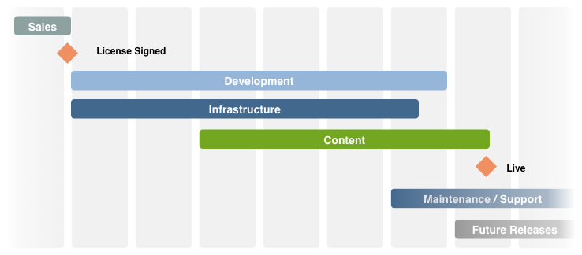
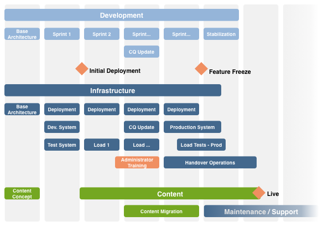

# The Checklist - Further Reference{#the-checklist-further-reference}

This page provides further details to elaborate on and/or augment the documents and principles covered by the [Managing Projects - Best Practices Checklist](/help/managing/best-practices.md).

## AEM - What are you going to use? {#aem-what-will-you-be-using}

>[!CAUTION]
>
>The lists in this sub-section are not exhaustive, but intended as an introduction.

### Features within AEM {#features-within-aem}

When implementing AEM (particularly for the first time), review the [capabilities and workflows of AEM](https://business.adobe.com/products/experience-manager/adobe-experience-manager.html) to be sure of which areas you want or need.

Consider the features of AEM that you are using, and the impact on your design; for example:

* [Commerce](/help/commerce/cif-classic/administering/ecommerce.md)
* [Screens](https://experienceleague.adobe.com/docs/experience-manager-screens/user-guide/aem-screens-introduction.html)
* [Assets](/help/assets/assets.md)
* [Tags](/help/sites-administering/tags.md)
* [Multi Site Management and Translation](/help/sites-administering/msm-and-translation.md)
* [Forms](/help/forms/home.md)
* [Communities](/help/communities/deploy-communities.md)

In addition check the [Release Notes](/help/release-notes/release-notes.md), for the various versions of AEM, to see when any new features were added.

### Integrations {#integrations}

AEM can be integrated with other Adobe products, or with third-party services, or both. These workflows can increase the power and functionality at your disposal.

See [Solutions Integration](/help/sites-administering/integration.md) for full information.

## Migrate or Upgrade? {#migrate-or-upgrade}

A major consideration is whether you want to either:

* Upgrade the existing installation in place.
* Migrate the content from the current system to a fresh, new installation.

When moving from a previous version to the current version, there are two options:

* Use the [Package Manager](/help/sites-administering/package-manager.md) to export all content and application code from the old system to the new one.
* [Upgrade](/help/sites-deploying/upgrade.md) the old system in-place. This method is usually the recommended choice.

## Basic Ground Rules {#basic-ground-rules}

As with any project, it is critical to establish ground-rules as soon as possible. These rules include:

>[!NOTE]
>
>These points are generic, the [Best Practices Checklist](/help/managing/best-practices.md) deals with specifics in relation to AEM.

* **Roles**

  Roles should be clearly defined and made known to everyone involved in the project. In addition, it is advisable to highlight:

    * Decision Makers
    * Points of Contact

* **Responsibilities**

    * For each role, a clear definition of the responsibilities related to your project helps prevent confusion.

* **Involvement**

  By involving interested parties as soon as possible, you can encourage them to become *stakeholders* in the project. Doing so increases their commitment to its success.

    * On the customer side, this role includes the authors who work with the system on a day-to-day basis
    * Within your own project team, this involvement also includes those people who are responsible for quality assurance. The more they understand the customer's requirements, the better they can plan the tests.

* **Paths of Communication**

    * Although paths of communication should not be formalized excessively, specific definitions should ensure that the key people are always informed and therefore kept up to date. Specific attention should be made to communication with external parties.

* **Processes**

  The defined processes depend on your individual project. Again, try to keep these processes simple, with consideration for:

    * Defining processes (and paths of communication) for interacting with any third-parties; for example, design agencies and third-party software suppliers among others.
    * Often the customer has their own Project Management and Reporting procedures and tools.

* **Tracking Tools**

  There are many tools available for tracking information on bugs, tasks, and other aspects of your project - see [Overview of Potential Tools](#overview-of-potential-tools) for more details.

    * The key point to note here is to keep only one copy of the information and share the information (and therefore access to the tool being used). This workflow eases maintenance and helps prevent discrepancies.

* **Scope**

  Clearly define what is to be covered by the project at various levels:

    * the individual releases (if an iterative release process is used, and regardless of whether they are delivered to customers or your internal test team).
    * the AEM project.
    * the entire project; including any third-party software, their impact on testing, organizational issues, and many others.
    * For certain aspects, it can also be useful to state what is *not* within the scope of the project. This idea can help prevent confusion and incorrect assumptions, though it should be limited to essential issues.

* **Reporting**

  Clearly define what information that you want reported, in what form, how often, and to whom.

* **Terminology**

    * Define any abbreviations and/or customer-specific terminology to be used.

* **Assumptions**

    * Define any assumptions being made.

This information can be defined within a Project Handbook; the use of a Wiki can also help ensure that ongoing changes are handled efficiently. Wherever these assumptions are defined, the key factors are that:

* Information is defined and maintained
* Information is clearly communicated to all people involved. Although standard Project Management practice, it cannot be repeated often enough that clear role definition and good communication can make, or break, a project.
* Only one version is kept of any information being tracked; for example, bug tracking and issue tracking.

## Key Performance Indicators and Target Metrics {#key-performance-indicators-and-target-metrics}

Organizations use Key Performance Indicators (KPIs) to evaluate their success at reaching targets. These indicators are measurable values that can be used to demonstrate how effectively specific objectives are being met.

These indicators can be:

* Business:

    * Used to measure key business objectives.
    * It is important to choose KPIs appropriate to your business/scenario with clear definitions of what they are, how they are measured, how they are used, and by whom.

* Performance:

    * Define how to measure the performance of the system.
    * Some examples include page load time, server response time, and database query performance.

Some, but not all, indicators can be based on the target metrics that you identify and define.

### Target Metrics {#target-metrics}

Metrics are used to define quantitative measurements for the quality of your website. They are basically a definition of the performance goals that you want to achieve and can be used to define your [KPIs (Key Performance Indicators)](#key-performance-indicators-and-target-metrics).

Many metrics can be defined, but often the ones you define cover your goals for performance and concurrency. In particular, factors which can be difficult to quantify, and are often prone to *emotional* assessment:

* "the website is *much too slow* today" - when does *slow* qualify?

* "everything *grinds to a halt* when my colleague logs in" - how many concurrent users can the system support?
* "when I search, the system *grinds to a halt* " - which search requests are impacting the system?
* "it takes *ages* to download the file" - what are acceptable download times (under normal network conditions)?

Target Metrics are defined at the start of a project to:

* indicate the expected dimensions of the website that you can offer
* indicate the minimum quality which you want to achieve
* define how these factors are measured
* be used as the basis for the [Key Performance Indicators](#key-performance-indicators-and-target-metrics)

As always care must be taken when defining the target metrics:

* if set too high they may be unattainable
* if set too low fluctuations may not be highlighted
* to ensure that they can be repeatedly and consistently measured
* to provide a balance across the different factors being measured
* certain metrics relate to a test environment, but some should reflect real-life scenarios as they must be measurable, and reproducible, on your production website
* prioritize the metrics according to their significance to the website
* limit the metrics to a set that can be monitored

During development of the project, they can be updated and tuned as appropriate. After the project has been successfully implemented, they can be used to help you control your installation and monitor/maintain the required levels of service for ongoing operation.

When used properly these metrics can provide a useful tool; when used irresponsibly they can be a time-wasting distraction. As always, understand what you are measuring, how you are measuring it and why.

>[!NOTE]
>
>This section discusses the basic principles and issues for consideration. Each installation is different, so the actual values to measured tend to differ.

### Everything rests on your Project Design {#everything-rests-on-your-project-design}

All measured metrics are affected by the design of your project. Conversely, many issues are best solved by design changes.

Therefore, define your target metrics *before* deciding on your design. Doing so lets you optimize your design based on these factors. After your project is developed, to  the basic design principles is challenging.

When you create the structure for the website, follow the recommended structure for AEM websites. Make sure you understand the following issues and/or principles:

* How to structure website content.
* How templates and components work.
* How does caching work?
* The impacts of personalized content.
* How the search function works.
* How you can use CSS and related technologies to create compact, non-redundant HTML code.

If you feel that your design does not follow the guidelines, or if you are unsure about some of the implications, clarify these issues. Do so  before you start either the programming phase or filling in the content.

### Infrastructure {#infrastructure}

To define or assess the infrastructure, it helps to define target values such as:

* visitors/day; both average and peak
* hits/day; both average and peak
* number of web-pages being made available
* volume of web-content

Depending on your situation, and the strategic significance of the website, defining infrastructure can help you assess and choose your infrastructure:

* number of servers
* number of AEM instances (author and publish)

### Performance {#performance}

There are several performance factors which can be evaluated:

* response times for individual pages, accounting for:

    * response times on an author environment
    * response times on the publish environment

* response times for search requests

This section can be read with [Performance Optimization](/help/sites-deploying/configuring-performance.md) that expands the technical details of actually measuring the performance.

#### Response times for individual pages {#response-times-for-individual-pages}

A key issue is the time that your website takes to respond to visitor requests.

Although this value varies for each request, an average target value can be defined. Once this value is proven to be both achievable and maintainable, it can be used to monitor the performance of the website and indicate the development of potential problems

Differing targets on author and publish environments

The response times that you are aiming for are different on the author and publish environments, reflecting the target audience:

* **Author Environment**

  This environment is used by authors entering, and updating content, so it must:

    * cater for a few users who generate a high number of requests when updating content pages and the individual elements on those pages
    * be as fast as possible to maximize their productivity for getting your content onto your website

* **Publish Environment**

  This environment contains content which you make available to your users:

    * speed is still vital, but is often slower than an author environment
    * additional performance enhancing mechanisms are often applied:

        * the content is cached
        * load-balancing is applied

#### Setting target response times {#setting-target-response-times}

How can you decide on achievable (average) response times? The question and answer is often a matter of experience:

* experience on your website
* experience with AEM
* recognizing complex pages which have above average response times (these pages should be individually optimized, if possible)

However, under controlled circumstances, the following guidelines can be applied:

* 70% of the requests for pages should respond in less than 100ms.
* 25% of the requests for pages should respond in less than 100ms-300ms.
* 4% of the requests for pages should respond in less than 300ms-500ms.
* 1% of the requests for pages should respond in less than 500ms-1000ms.
* No pages should respond slower than 1 second.

The above numbers assume the following conditions:

* measured on publish (no authoring environment and/or CFC overhead)
* measured on the server (no network overhead)
* not cached (no AEM-output cache, no Dispatcher cache)
* only for complex items with many dependencies (HTML, JS, PDF, ...)
* no other load on the system

There are several mechanisms that you can use to monitor the response times:

* **Monitoring response times with the AEM request.log**

  A good starting point for performance analysis is the request log. Among other information, you can see the response times of individual requests. See [Performance Optimization](/help/sites-deploying/configuring-performance.md) for more details.

* **Monitoring response times with HTML comments**

  HTML comments can be used to include response time information within the source of each page:

  `</body> </html>v <-- Page took 58 milliseconds to be rendered by the server --> Response times for search requests`

#### Search Requests {#search-requests}

Search requests can have a significant impact on your website, in terms of both the:

* Response time of the actual search

    * A fast search function is a quality goal for your website

* Impact on general performance

    * As a search function must scan (potentially large) sections of the content, or a specially extracted index, this ability can impact the performance of the entire system, if not optimized

Setting targets for search requests is, again, a matter of experience depending on:

* experience of AEM
* an assessment of how often search is used in comparison to other goals
* your persistence manager
* your search index
* the complexity of your search function; a basic search function that allows one search term to be input, is quicker than an advanced search that allows the user to build complex search statements using AND/OR/NOT.

These search requests should be planned and integrated from the very start of your project. Mechanisms available for monitoring include:

* **Monitoring search response times with the AEM request.log**

  Again the request.log can be used to monitor the response times for search requests; see [Performance Optimization](/help/sites-deploying/configuring-performance.md) for more details.

* **Programmed mechanisms for measuring search response times**

  To customize the information that you collect about search requests, and their performance, it is recommended that you include information collection in your project source code; see [Performance Optimization](/help/sites-deploying/configuring-performance.md) for more details.

### Concurrency {#concurrency}

Make your website available to some users and visitors, on both the author and publish environments. The numbers are often more than you used when testing, but also fluctuating and difficult to predict. Design your website for an average number of concurrent users and visitors without noticing a negative performance impact. Again, use the `request.log` to make concurrency tests. See [Performance Optimization](/help/sites-deploying/configuring-performance.md) for more details.

Targets for the number of concurrent users, depend on the environment type:

* **Author Environment**

    * Usually the number of concurrent users can be accurately estimated. You can know how many authors you have in total, though (probably) not all are active at the same time.

* **Publish Environment**

    * The publish environment is more challenging to predict, so you must select a target value. Again, it should be based on experience of your current website together with realistic expectations of your new website.
    * Special events (for example, when you publish new, popular content) may exceed expectations - or even capabilities (as sometimes reported in the press when tickets for certain events are made available for sale).

### Capacity and Volume {#capacity-and-volume}

Before discussing the related metrics, a quick definition of the terms:

* **Volume**

    * The amount of output that is processed and delivered by the system.

* **Capacity**

    * The system's ability to deliver the volume.
    * At each step, capacity and volume are measured differently, as shown in the table below. For best performance, make sure that the capacity matches the volume at each step, and that both capacity and volume are shared across all steps. For example, you may be able to compute the navigation on the client computer, or put it in the cache, instead of computing it on the server for every request.

* **Capacity and Volume**

  | What / Where  |Capacity  |Volume |
  |---|---|---|
  | Client |Computational power of the user's computer. |Complexity of the page layout. |
  | Network |Network bandwidth. |Size of the page (code, images, and so on). |
  | Dispatcher cache |Server memory of the Web server (main memory and hard drive). |Web server (main memory and hard drive). Number and size of the cached pages. |
  | Output cache |Server memory of the AEM server (main memory and hard drive). |Number and size of the pages in the output cache, the number of dependencies per page. The Dispatcher cache lowers this volume. |
  | Web Server |Computational power of the Web server. |Number of requests. Caching lowers this volume. |
  | Template |Computational power of the Web server. |Complexity of the templates. |
  | Repository |Performance of the repository. |Number of pages loaded from the repository. |

### Other Metrics {#other-metrics}

The preceding sections detail the main metrics to be defined.

Depending on your specific requirements, it might be useful for you to define additional metrics, either in isolation, or accounting for the above classifications.

However, it is preferable to have a small set of accurate, core metrics that function easily and reliably, rather than try to measure and define every aspect of your website. By its sheer nature, your website starts to change and evolve when it is handed over to your users.

## Security {#security}

Security is crucial and an ever-increasing challenge. It ***must*** be considered and planned from the earliest stages of your project.

The [Security Checklist](/help/sites-administering/security-checklist.md) details steps that you should take to ensure that your AEM installation is secure when deployed. Other security aspects are covered under [Security (when developing)](/help/sites-developing/security.md) and [User Administration and Security](/help/sites-administering/security.md).

## Parallel and Iterative Tasks {#parallel-and-iterative-tasks}

>[!NOTE]
>
>The following:
>
>* Offers an overview related to the *first* implementation of an AEM project.
>* Is intended as an abstract overview; see the [Project Checklist](/help/managing/best-practices.md) for specific phases/milestones/tasks.
>* Any time scales are theoretical.
>

For a new implementation of a standard AEM project, consider tasks such as:

* Handover from the Sales process.
* Implementation of the customer application (**Development**).
* Installation and configuration of the infrastructure (and related processes) on customer site (**Infrastructure**).
* Creation (or migration) of the content (**Content**).
* Handover to operations (**Maintenance/Support**).
* Follow up releases.

For all aspects it is recommended to use an iterative approach:

>[!NOTE]
>
>To allow for tuning, optimization, and user training under realistic conditions on the production environment, split the project-launch into **Soft Launch** (reduced availability, multiple iterations) and **Hard Launch** (full availability - Live).

>[!NOTE]
>
>See the [Project Checklist](/help/managing/best-practices.md) for examples of tasks which you should perform (or assess) during the life-cycle of your project.

Some points to note for each category are:

* **Development**

    * Define the base architecture first.
    * Use several iterations (sprints) for development:

        * First sprint equates to the first full development cycle.
        * First sprint results in the first deployment to your test environment.
        * Every sprint has a runable result.
        * Each sprint gets a customer signoff (minimum of structured test with feedback).

    * Plan for the eventuality of an update of the available AEM version during the project.
    * Plan for tests and optimization during sprints.
    * Plan for stabilization and optimization phases.
    * Create a log of items to be planned for further releases.
    * Plan for partner involvement and handover.

* **Infrastructure**

    * Define the base architecture first:

        * Define performance requirements.
        * Define performance goals (that is, clearly define expectations).
        * Define hardware and infrastructure architecture; including sizing.
        * Define deployment.

    * Use several iterations; for the first sprint and initial configuration prepare:

        * Development environment.
        * Development process.
        * Test environment.
        * Deployment process (including configuration management).

    * Plan for several load tests.
    * Plan for tests and optimization during sprints.
    * Plan for a stabilization and optimization phase.
    * Deploy to the production environment as early as possible (let the operations team setup the system to gain experience).
    * Use named users and defined roles as early as possible.
    * Plan for training (for example, administrator training).
    * Plan for handover to operations.

* **Content**

    * The base architecture:
        * Drives the content hierarchy.
        * Helps to define the content concept.
        * Defines MSM usage and layout.
        * Defines roles, groups, workflows, and permissions.
    * Consider whether offline page creation is useful.
    * Plan for the early creation of first pages and content (for use in tests and feedback).
    * Plan for the migration of existing content.
    * Plan for "in-sprint-migration" after refactoring.
    * Plan "content burndown" (sitemap for go-live content).

## Estimating Time and Effort {#estimating-time-and-effort}

Dependent on your resulting task list, you can then make initial estimates of time and effort for (high-level) task definitions. These estimates should include an indication of who (customer or partner) does what and when.

The following list shows standard approximations and inter-relationships of effort involved, and therefore costs:

>[!CAUTION]
>
>These figures can only be used for initial estimates. An experienced AEM developer must make the detailed analysis.

|  Phase |Effort  |
|---|---|
| Development |A rough estimation of 2 - 4 hours for each component node that covers all development requirements. |
| Developer Testing |15% of Development |
| Follow-up |10% of Development |
| Documentation |15% of Development |
| JavaDoc Documentation |10% of Development |
| Bug-fixing |15% of Development |
| Project Management |20% of project costs for ongoing Project Management and Governance |

Detailed planning can then relate available or required resources to deadlines and costs.

## Reference Architecture {#reference-architecture}

The reference architecture is given to provide a template solution for the AEM architecture. The reference architecture addresses problems commonly encountered for enterprise systems including scaling, reliability, and security.

The following site metrics should be defined:

| Classification |Definition  |
|---|---|
| Number of Internet sites |  |
| Number of intranet sites |  |
| Number of code bases (for example, if Internet and intranet differ) |  |
| Number of individual pages |  |
| Number of site visits / day |  |
| Number of page views / day |  |
| Volume (in GB) of data transfer / day |  |
| Number of concurrent users (Closed User Group) |  |
| Number of concurrent visitors (publish) |  |
| Number of concurrent authors |  |
| Number of registered authors |  |
| Number of page activations / working day |  |
| Number of page activations during deployment |  |

## Overview of Potential Tools {#overview-of-potential-tools}

The following list is provided to inform you of tools that can be used. It is intended as an introduction, not an extensive recommendation list, and should not deter you from using any other tools.

<table>
 <tbody>
  <tr>
   <td><strong>Product</strong></td>
   <td><strong>Description</strong></td>
  </tr>
  <tr>
   <td>AEM</td>
   <td>
AEM itself provides a range of mechanisms to help you monitor, test, investigate, and debug your application; including:

    <ul>
     <li><a href="/help/sites-developing/developer-mode.md">Developer Mode</a></li>
     <li>The <a href="/help/sites-developing/hobbes.md">Testing Console</a></li>
     <li><a href="/help/sites-administering/operations-dashboard.md">Operations Dashboard</a></li>
     <li><a href="/help/sites-authoring/content-insights.md">Content Insight</a></li>
     <li>The <a href="/help/sites-authoring/author-environment-tools.md#content-tree">Content Tree</a></li>
    </ul> </td>
  </tr>
  <tr>
   <td> </td>
   <td> </td>
  </tr>
  <tr>
   <td>Selenium</td>
   <td><a href="https://www.selenium.dev/">Selenium</a> is an Open Source test tool. The tests run direct in the browser - emulating how your users work.</td>
  </tr>
  <tr>
   <td>Microsoft&reg; Project</td>
   <td>A commonly used project management tool.</td>
  </tr>
  <tr>
   <td>Jira</td>
   <td><a href="https://www.atlassian.com/software/jira">Jira</a> is an Open Source tool for tracking and managing details of your software bugs. Workflows can be imposed onto the bug details as required.</td>
  </tr>
  <tr>
   <td>Git</td>
   <td><a href="https://git-scm.com/">Git</a> is a revision control software.</td>
  </tr>
  <tr>
   <td>Eclipse</td>
   <td>
Eclipse is an Open Source IDE, composed of various projects. It is focused on building an open development platform comprised of extensible frameworks, tools and runtimes for building, deploying and managing software across the lifecycle.
 
See <a href="/help/sites-developing/howto-projects-eclipse.md">How to Develop AEM Projects Using Eclipse</a> for more information.
 </td>
  </tr>
  <tr>
   <td>IntelliJ</td>
   <td>
A professional (and therefore liable to licensing costs) IDE offering a comprehensive range of features. 
 
See <a href="/help/sites-developing/ht-intellij.md">How to Develop AEM Projects using IntelliJ IDEA</a> for more information.
 </td>
  </tr>
  <tr>
   <td>Maven</td>
   <td><a href="https://maven.apache.org/">Maven</a> is a software project management and comprehension tool which can manage a project's build process (software and documentation).</td>
  </tr>
 </tbody>
</table>

## Further Reading {#further-reading}

In addition, the following sections are of particular interest:

* [Getting Started](/help/sites-deploying/deploy.md#getting-started)
* [Technical Requirements](/help/sites-deploying/technical-requirements.md)
* [Monitoring and Maintaining your Instance](/help/sites-deploying/monitoring-and-maintaining.md)

### Best Practices {#best-practices}

Adobe provides further Best Practices for all phases and audiences:

* [Deploying](/help/sites-deploying/best-practices.md)
* [Authoring](/help/sites-authoring/best-practices.md)
* [Administering](/help/sites-administering/administer-best-practices.md)
* [Developing](/help/sites-developing/best-practices.md)
* [Project Management](/help/managing/best-practices.md)
