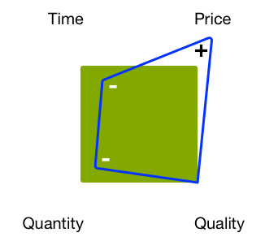

# Managing Projects - Best Practices Checklist{#managing-projects-best-practices-checklist}

Managing a project to implement Adobe Experience Manager (AEM) requires planning and understanding so that you are aware of the issues and (related) decisions that you must make, before and while implementing your project.

To help you, the best practices consist of:

* An [interactive checklist](/help/managing/best-practices-checklist.md) that lets you track and monitor your progress with these best practices.

    * Defines inputs and deliverables according to phase, milestone, and persona.
    * Provides automated overviews (quality, health, and completeness) to indicate progress and project-health.

* Documentation based on the [checklist](/help/managing/best-practices-checklist.md) that details the:

    * [Project Heartbeat](#projectheartbeat) analysis.
    * [Status by Role](#status-by-role) overview.
    * [Phases and Milestones](#phases-and-milestones).
    * [Key Persona](#persona) and their involvement at every (relevant) stage.
    * A [Glossary](/help/managing/best-practices-glossary.md) of the [Required Documents and Deliverables](#required-documents-and-deliverables).

* [Further reference](/help/managing/best-practices-further-reference.md) material to provide more details on specific areas.

## Project Heartbeat Dashboard {#project-heartbeat-dashboard}

The **Project Heartbeat** worksheet provides a graphical overview of critical metrics for your project:

* **Phase Quality**

    * Indicates the quality of the [Required Documents and Deliverables](#required-documents-and-deliverables) across the project.

* **Phase Health**

    * A high-level status indicator for your project; useful to highlight areas that may be at risk.

* **Phase Completeness**

    * At any point in time during the project this indicates how much has already been completed for each phase of your project.

## Status by Role {#status-by-role}

The **Status by Role** worksheet shows detailed breakdown of [**Health**, **Quality, and **Completeness**](#projectheartbeat) by **[Phase](#phases-and-milestones)** and **[Persona](#persona)**.

## Phases and Milestones {#phases-and-milestones}

The project plan is broken down into distinct (high level) phases.

Each phase contains its own milestones. For each [persona](#persona) (or role), the relevant milestones are listed, together with the documents that are required to produce the defined deliverables.

>[!NOTE]
>
>There is not a direct 1:1 relationship between the individual required documents and deliverables.

### Preparation {#preparation}

Preparation of your project forms the basis of the entire project. Define key requirements together with clear goals and expectations for the:

* **Business Rationale**

    * The fundamental reasons and justification for undertaking the project.

* **Scope and Schedule**

    * A basic scope, and rough schedule should be made available to define what is required, and within which time frame; if it helps clarify the situation, you can also define what lies outside the scope.

How you prepare, plan, and run your project and implement your solution is affected by the restrictions you are operating under. For example, fixed budget, fixed timeline, quantity of content, quality required.

As always, adjusting any of the factors impacts the others. For example, reducing the time, but requiring the same quality level will probably increase the price while reducing the quantity of content you can cater for. Budget is often a key factor so such relationships cannot be forgotten.

The Four Factors:

#### Milestones {#milestones}

* **Validation**

  In this phase, you must validate and confirm the goals for the project; for example:

    * What do you want to achieve/provide?
    * Who benefits?
    * What is the scope?

        * If it helps clarify the situation, you can also define what lies outside the scope.

    * How do you define success?
    * How do you measure success?
    * What are the requirements, business and technical?
    * Are there legacy systems to be replaced and if so, is there data to be migrated?
    * Who is involved?
    * How do you measure progress?
    * How often do you review progress during the life of the project?

* **Budget**

  Before you start any project you need a reliable, realistic estimation of what it costs to implement:

    * Use information from the validation milestone as a basis for the estimates.
    * Be realistic in your estimates.
    * Consider and respect any client guidelines, processes, or restrictions that the client is subject to.
    * Consider contingency and review processes if a review or refinement of the budget is required later on.
    * Remember that costs come in many forms such as purchases, use of resources, and fees, among others.

### Planning {#planning}

Planning your project consolidates the preparation. Here you should start converting the goals and expectations into a well-defined roadmap consisting of concrete tasks, bound by clear communication, with stringent reviews to measure progress.

#### Milestones {#milestones-1}

* **Handover**

  A clean handover ensures that the appropriate persona/groups are aware of their responsibilities within the project.

  Full details should be provided/generated to ensure they have a full understanding of all relevant aspects, including the roadmap, scope, goals, requirements, and KPIs.

* **Risk Assessment**

  To avoid unpleasant surprises, use risk assessment to identify and quantify any potential risks together with their impact and probability.

  This should be done early in the project life cycle to ensure that any vulnerabilities are identified and evaluated. Based on the findings you can report to your stakeholders on whether the full requirements can be implemented and, if necessary, whether it is possible to plan for appropriate actions to be taken and tracked.

* **Communication**

  Communication is always key to the success of any project. Communicate clearly and efficiently to ensure that everyone is:

    * Working towards the same basic goals
    * From the same information base
    * With the same channels

* **Kick Off**

  The Kick Off meeting is used to raise awareness that the project is starting. It is a good opportunity to:

    * Invite all interested parties (or at least group-representatives).
    * Present key facts about the project.
    * Answer questions.
    * Ensure that everyone has the same knowledge base.
    * Get commitment from everyone who will be involved - this will have to be earned.

        * By involving prime players (including prospective authors) at the very start of the project, you increase your chances of getting their commitment to the project.

### Development Preparation {#development-preparation}

Planning the development is key to ensure that your project is built on a solid design by a team that has the required knowledge.

#### Milestones {#milestones-2}

* **Development Team Staffed and Trained**

  Before starting on any project, you should ensure that your development team is appropriately staffed and that all team members are trained for the task in hand.

* **Content Architecture**

  The content architecture defines and describes the future architecture of the content; including:

    * The content tree; including assets
    * Basic structures; including campaigns, and so on.
    * Multisite and multi-language structures (MSM, Translation, and so on)
    * Supportive content (including tags and tagging concepts)
    * Caching and content reuse strategies

* **System Architecture**

  The system architecture defines the conceptual view of your system; including (among other information):

    * [System structure](/help/sites-deploying/recommended-deploys.md#deployment-scenarios) for all required environments
    * Subsystems
    * Third-party systems
    * Interfaces; hardware, software, and human interaction
    * Servers for each environment; see the [Technical Requirements](/help/sites-deploying/technical-requirements.md) and [Hardware Sizing Guidelines](/help/managing/hardware-sizing-guidelines.md)

    * Processes for each environment; for example, deployment and maintenance requirements
    * Maintenance activities (Datastore GC, TarPM optimization, and so on)
    * [Dispatcher](https://experienceleague.adobe.com/docs/experience-manager-dispatcher/using/dispatcher.html) caching
    * [Clustering](/help/sites-deploying/recommended-deploys.md#deployment-scenarios) Publish/Authorshare
    * Performance for the client-side (JS minify, concat, css sprites, total number of http requests, and others)

* **Application Architecture**

  The application architecture defines and describes the behavior of the proposed applications.

  It is focused on:

    * How they interact with each other and with users.
    * The data to be consumed and produced by applications, rather than their internal structure.

  The definitions should cover:

    * Basic code structure for the project
    * Code artifacts (bundles, packages, and so on)
    * Breakdowns of the templates/components and their relationships
    * High-level details of required customizations (specific overlays follow later)
    * Design of workflows required by the solution (for example, content creation, approval, publishing, transformations, imports, and exports)
    * Special consideration for any complex modules, such as MSM, Commerce, third-party integration

* **System Integration**

  System integration requires you to plan (then implement):

    * How all the subsystems and [solution integrations](/help/sites-administering/integration.md) are brought together to operate as one coherent system
    * How any third-party systems are integrated; together with any special considerations, such as offline/online, client-side/browser-side, or fallover handling when a third-party system is down

* **Test Concept**

  Before starting development, you should draw up an in-depth and comprehensive concept of all [testing](/help/sites-developing/planning.md) requirements for your project.

  This should include (among others):

    * Details of all tests to be performed
    * Preparation of any content required for those tests
    * Information of any test tools to be used
    * High-level indication of who will be involved in testing; especially groups outside the QA team
    * Details of test automation; for example, with Selenium or AEM Developer mode

* **Experience Design**

  Experience Design (XD) involves designing the user experience for your solution.

  The user experience should be analyzed and developed for both your authors and the final users of your website.

* **Support Setup**

  Before development, all support processes required to deploy, release, test, and report issues, should be set in place.

  See also the [Adobe Support Portal](https://experienceleague.adobe.com/?support-solution=General&support-tab=home#support).

### Operations Planning and Operations {#operations-planning-and-operations}

On a similar basis, the operations must be properly planned to ensure you have the environments that you require - for all stages of the project life cycle. You also need the appropriate processes for maintaining them.

#### Milestones {#milestones-3}

* **Permissions**

  You need to plan and then implement a Roles and Rights Concept for all users/groups that will use the solution.

  For example:

    * A list of roles (that is, groups) with `read`/ `write` access definitions for each

    * Definition of the use of privileges that impact the publish environment; for example, `replicate`
    * For users with minimal privileges, workflows should be defined
    * Users in the `editor` group should not have `admin` rights nor be part of the `administrators` group

  For more information, see [User Administration and Security](/help/sites-administering/security.md).

* **Monitoring and Maintenance**

  Monitoring and maintenance are key aspects of ensuring the smooth operation of your solution once it goes live. For this you need to define:

    * What needs monitoring
    * Maintenance tasks; both regular and for special cases

  See also [Monitoring and Maintenance](/help/sites-deploying/monitoring-and-maintaining.md) for more information.

* **Migration**

  Any content from the legacy system should be reviewed and validated for migration.

* **Recovery Plan**

  Ensure that you have a recovery plan in place. In an emergency situation, this must be available to secure the production use of AEM.. This should cover situations such as backup, restore, fallover, and others.

### Development {#development}

Development is a crucial phase that requires more than just coding.

#### Milestones {#milestones-4}

* **Development Environment**

  Plan and document your development environment, including:

    * Architecture
    * [Development tools](/help/sites-developing/dev-tools.md)

        * A typical environment consists of:

            * an issue tracking system; such as Jira
            * an IDE; such as Eclipse
            * a build management tool; such as Maven
            * a tool for continuous integration; such as Jenkins
            * a tool for version control; such as GIT/SVN
            * a build artifact repository manager; such as Archiva/Nexus

    * Third-party software integration/dependencies
    * [Solution integration/dependencies](/help/sites-administering/integration.md)
    * Deployment cadence

* **Test System**

  Plan and document your test environment, including:

    * Architecture
    * Dependencies on development builds; including nightly builds
    * The possibilities for, or limitations of, testing third-party software integration/dependencies
    * Testing tools
    * Automated testing strategy

* **Production System**

  Plan and document your production environment, including:

    * Architecture
    * Deployment cadence
    * Third-party software integration/dependencies
    * Security setup
    * Baseline performance verified by running the [Tough Day tests](/help/sites-developing/tough-day.md) on the production setup
    * Requirements for performance tests; see [Best Practices for Quality Assurance](/help/sites-deploying/configuring-performance.md#best-practices-for-quality-assurance)

* **Integration**

  Plan, document, and test all aspects of the system and [solution integration](/help/sites-administering/integration.md), including:

    * An automated testing strategy
    * Automated processes to [move applications from development to test, then production](/help/managing/enterprise-devops.md#code-movement)
    * Automated processes to [move content from production to test and development](/help/managing/enterprise-devops.md#content-movement)

* **Migration**

  Plan, document, and test all aspects of the content migration; including:

    * Content architecture
    * Migration strategy

* **Communication**

  Ensure that all team members and project persona are kept up-to-date, as necessary.

* **Documentation**

  Document the solution fully; including:

    * Operations Manual
    * Any customizations that may affect upgrades
    * Release notes

### Performance and Testing {#performance-and-testing}

Once the new application is available it must undergo stringent testing, both for functionality and [performance](/help/sites-deploying/configuring-performance.md).

>[!NOTE]
>
>Any testing team should be allowed to remain neutral and deliver the testing results.
>
>It is the responsibility of the Project Manager to assess any implications of the results and decide on appropriate action.

#### Milestones {#milestones-5}

* **End-User Acceptance Test**

  [User acceptance testing](/help/sites-developing/acceptance-signoff.md) (UAT) is crucial to ensure that:

    * The solution fulfills the user/customer requirements
    * The customer/users accept the solution (function, design, and performance)

  There should be a formalized checklist for customer handover; ideally automated and run on a nightly basis against a snapshot. The results should be sent to the project manager and development team

* **Performance and Load Tests**

  Performance and load tests are used to ensure that the solution meets the required performance levels, at average and peak loads.

  For more information about performance testing, see:

    * [Performance Testing](/help/sites-deploying/configuring-performance.md)
    * [How to plan and run testing](/help/sites-developing/planning.md)

    * [Basic Performance Guidelines](/help/sites-deploying/configuring-performance.md#basic-performance-guidelines)

  >[!NOTE]
  >
  >This process has to be continued during normal use of AEM, but these initial stages are the most crucial.

### Rollout {#rollout}

Rollout of your new application needs careful planning to ensure a smooth Go Live. This includes confirming a high level of security, training all prospective users and making multiple dry-runs to confirm that all issues have been dealt with.

#### Milestones {#milestones-6}

* **Preparation**

  Preparation and planning will help ensure a smooth rollout.

* **Training**

  Ensure that all involved staff have been trained.

  See [Adobe Experience Manager](https://training.adobe.com/training/courses.html#solution=adobeExperienceManager) in the course catalog.

* **Administrators Trained**

  Ensure that your solution administrators have:

    * Been trained
    * Received the appropriate training material
    * Received the appropriate documentation

* **Users Trained**

  Ensure that your authors have:

    * Been trained
    * Received the appropriate training material
    * Received the appropriate documentation; for example, the User Guide

* **Penetration Tests**

  Penetration tests simulate an attack on a computer system to identify potential security weaknesses.

* **Penetration/Security Tests**

  To ensure the security of your solution, perform specific penetration tests, together with a wider range of security tests.

  See the [Security Checklist](/help/sites-administering/security-checklist.md) for more details.

### Go Live {#go-live}

You want your Go Live to be as smooth as possible. Again, the final steps need to plan for clean execution.

#### Milestones {#milestones-7}

* **Preparation**

  Preparation and planning will help ensure a smooth Go Live.

* **Security**

  Confirm the security of your solution for both internal and external users and their content.

* **Fallback**

  Ensure that all systems, procedures, and mechanisms required for fallback are in place before going live.

* **Support**

  Ensure that support services are in-place and ready.

* **Transition**

  Plan and execute the transition to your production environment and users.

* **Roll Out**

  Prepare and execute your smoke tests.

## Persona {#persona}

The checklists are designed by persona. These are the roles with significant involved in the project life cycle.

There is also some [other persona](#other-persona) that are involved in specific tasks.

### Project Sponsor {#project-sponsor}

The project sponsor is:

* Responsible for providing/presenting the business case for the project.
* Key to shaping and defining the scope of the project; including:

    * the definition of, and criteria for, success
    * the main KPIs

* Provide the main milestones based on the client roadmap.

### Project Manager {#project-manager}

The project manager is:

* Responsible for the overall delivery of the project based on the requirements (for example, scope, KPIs, success criteria and definition) provided by the project sponsor.
* Responsible for defining the budget and resourcing the project based on that budget.
* The main point of communication for all persona involved in the project.

### Architect {#architect}

The solution architect:

* Is responsible for the high-level design of the solution and system.
* Helps define the implementation strategy for AEM. For example, whether to implement a clustered installation, or a cold standby, or when a content delivery network (CDN) is needed.
* Also define the AEM solution architecture based on the client requirements. This can include the concept for user roles (with related rights), the relationship between templates and components, or when to use multisite management.

### Business Analyst {#business-analyst}

The business analyst:

* Is primarily responsible for gathering and analyzing the high-level requirements, then transforming these into specifications:

    * for the project manager to use when planning the development
    * for the development team to work from during design and development.

* Works closely with the client to analyze the requirements. They match these against:

    * The definition of success.
    * The criteria for success.
    * KPIs (both business and performance based).

### Development Lead {#development-lead}

The development lead:

* Is responsible for the technical delivery of the project.
* Is responsible for selecting a development methodology that is compliant with client requirements.
* Draws up the development strategy:

    * ensuring that it is aligned with the business and performance KPIs
    * taking into account the success criteria and definition

* Works closely with the architect (especially when drawing up the development strategy for AEM) to define aspects such as the relationship between templates and components, the integration strategy for third-party applications and any specialized functionality.

### Quality Lead {#quality-lead}

The quality lead:

* Is responsible for the quality of the delivery; ensuring that it meets the criteria for success and any KPIs defined by the client.
* Defines the quality metrics, aligns with all stakeholders, draws up the testing plans and ensures that they are executed.
* Creates and delivers reports to project stakeholders.

### System Engineer {#system-engineer}

The system engineer:

* Is responsible for overseeing the project infrastructure.
* Is responsible for:

    * the setup of internal development and test environments
    * for matching those systems to the client systems

* Provides hardware recommendations, monitor the various implementations and provide operations support both prior to go live and afterwards.

### Security Lead {#security-lead}

The security lead:

* Is responsible for the overall security concept of the solution, ensuring that it is aligned with any requirements and policies from the client.
* Delivers a security concept, security operations and recommendations for any hardware-based security concepts; such as zones and firewalls.

### Other Persona {#other-persona}

* Stakeholders

    * People (often from the business) who have an interest (stake) in the success of the project. They often contribute to the budget.

* Legal

    * Legal advice is required when negotiating contracts.

* Trainers

    * Depending on the scale and nature of the project, specialized trainers can be used to develop and present training sessions for the relevant groups.

* Technical Writers

    * Depending on the scale and nature of the project, specialized technical writers can be used to write guidelines and manuals for specific groups. For example, a Maintenance manual for system administrators or a User Guide for the authors.

* System Administrators

    * Responsible for the ongoing operation of the system.

* Authors and End Users

    * The people who use the system to create and maintain your website content.

## Required Documents and Deliverables {#required-documents-and-deliverables}

The checklists cover the **Required Documents** and **Deliverables** for each milestone.

* There is no 1:1 relationship between these; for example, a group of required documents can result in a single deliverable.
* A deliverable from one persona can be a required document for another persona during the same milestone.

### Required Documents {#required-documents}

The **Required Documents** are needed by the appropriate persona when producing their deliverables.

For each **Required Document**, the persona should indicate:

* **Y/N**: whether it has been received.
* **1-3**: an indication of the quality of the received document.

### Deliverables {#deliverables}

For each milestone, the appropriate persona are responsible for delivering specific documents and therefore realizing their responsibilities for a specific milestone.

For each **Deliverable**, the persona must indicate:

* **Y/N**: whether it has been completed.

Deliverables are often used as **Required Documents** for either the current or a later milestone.

## Related Best Practices {#related-best-practices}

For best practices on deploying, administering, developing, or authoring, see the following:

* Other Best Practices and Guidelines related to Managing an AEM project:
    * [Hardware Sizing Guidelines](/help/managing/hardware-sizing-guidelines.md)
    * [Enterprise DevOps](/help/managing/enterprise-devops.md)
    * [SEO and URL Management Best Practices](/help/managing/seo-and-url-management.md)
    * [AEM and the Web Accessibility Guidelines](/help/managing/web-accessibility.md)
    * [General Data Protection Regulation](/help/managing/data-protection-and-privacy.md)* [Deploying and Maintaining best practices](/help/sites-deploying/best-practices.md)
* [Administering best practices](/help/sites-administering/administer-best-practices.md)
* [Developing best practices](/help/sites-developing/best-practices.md)
* [Authoring best practices](/help/sites-authoring/best-practices.md)

## Key Documentation Areas {#key-documentation-areas}

* AEM Documentation
  In addition, the following sections of AEM documentation are of particular interest (however, this list is not exhaustive):

    * [Security](/help/sites-developing/security.md)
    * [Recommended Deployments](/help/sites-deploying/recommended-deploys.md)
    * [Enterprise DevOps](/help/managing/enterprise-devops.md)
    * [Hardware sizing](/help/managing/hardware-sizing-guidelines.md)
    * Concepts of AEM:

        * [Developing - the basics](/help/sites-developing/the-basics.md)
        * [MSM concepts](/help/sites-administering/msm.md)
        * [HTML Template Language (HTL)](https://experienceleague.adobe.com/docs/experience-manager-htl/content/overview.html)

* Related Documentation

    * Adobe Experience Cloud - [Planning for the Adobe Experience Cloud](https://experienceleague.adobe.com/docs/core-services/interface/services/core-services.html)
