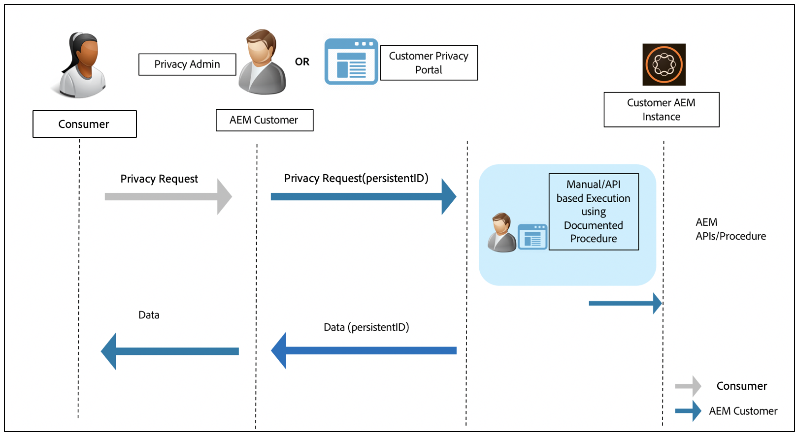

# Adobe Experience Manager Readiness for Data Protection and Data Privacy Regulations {#aem-readiness-for-data-protection-and-data-privacy-regulations}

>[!WARNING]
>
>The contents of this document do not constitute legal advice and are not meant as a substitute for legal advice. 
>
>Please consult your company's legal department for advice concerning Data Protection and Data Privacy regulations. 

>[!NOTE]
>
>For more information about Adobe's response to privacy issues, and what this means for you as an Adobe customer, see [Adobe's Privacy Center](https://www.adobe.com/privacy.html). 

Adobe is providing documentation and procedures (with APIs when available), for the customer privacy administrator or AEM administrator to handle data protection and data privacy requests and help our customers be compliant with these regulations. The procedures documented will allow customers to execute the regulatory requests manually or by calling into APIs, where available, from an external portal or service. 

>[!CAUTION]
>
>The details documented here are restricted to Adobe Experience Manager. 
>
>Data from another Adobe On-demand Service, together with any related privacy requests, will require actions to be taken on that service.
>
>For further information see [Adobe's Privacy Center](https://www.adobe.com/privacy.html).

## Introduction {#introduction}

Instances of Adobe Experience Manager, and the applications that run on them, are owned and operated by our customers.

As a consequence, data protection regulations, such as GDPR, CCPA, and others, are largely the responsibility of the customers.

As a very brief introduction, the regulations for data privacy and protection include new rules to be followed by the roles of:

* Business Entities (CCPA) and/or Data Controllers (GDPR) 

* Service Providers (CCPA) and/or Data Processors (GDPR) 

The main provisions in such regulations are:

1. Expanded definition of personal data to include all unique IDs; as in directly and indirectly identifiable data.

2. Strengthened consent requirements.

3. Increased focus on deletion rights (Data Erasure).

4. Opt-Out of Sale of Data.

For Adobe Experience Manager:

* The instances, and applications that run on them, are owned and operated by the customer. 

  * This effectively means that the customer manages the regulatory roles, including Business Entities and Service Provider, Data Controller, and Data Processor, amongst others. 

  * The Adobe Experience Platform Privacy Service will not be part of the workflow for AEM, as illustrated in the diagram below. 

* AEM includes documentation and procedures for the customer's privacy administrator and/or AEM administrator to execute the privacy regulation requests; either manually or through APIs, when available.

* No new service or UI has been added.

  * Instead procedures and APIs are documented for use by the customer UIs/portals that handle privacy regulation requests.

* AEM will not include any out-of-the-box tooling to support the privacy requests workflow. 

  * Adobe will provide documentation and procedures for the customer's privacy administrator and/or AEM administrator, enabling them to manually execute requests related to the privacy regulations.

Adobe is providing procedures for handling privacy requests related to Access, Delete and Opt-Out for Adobe Experience Manager. In some cases, there are APIs available that can be called from a customer developed portal or scripts to help with automation.

The following diagram illustrates what a privacy request workflow might look like (illustrated using Adobe Experience Manager 6.5):

## Adobe Experience Manager and Regulatory Readiness {#aem-and-regulatory-readiness}

Please see the sections below for regulatory documentation for product areas of AEM.

## AEM Foundation {#aem-foundation}

See [Handling Data Protection and Privacy Requests for the AEM Foundation](/help/sites-administering/handling-gdpr-requests-for-aem-platform.md).

## AEM Opting Into Aggregate Usage Statistics Collection {#aem-opting-into-aggregate-usage-statistics-collection}

See [Aggregated Usage Statistics Collection](/help/sites-deploying/opt-in-aggregated-usage-statistics.md).

## AEM Sites {#aem-sites}

See [AEM Sites - Data Protection and Privacy Readiness.](/help/sites-administering/gdpr-compliance-sites.md)

## AEM Commerce {#aem-commerce}

See [AEM Commerce - Data Protection and Privacy Readiness](/help/sites-administering/gdpr-compliance-commerce.md).

## AEM Mobile {#aem-mobile}

See [AEM Mobile - Data Protection and Privacy Readiness](/help/mobile/aem-mobile-gdpr-compliance.md).

## AEM Integration with Adobe Target & Adobe Analytics {#aem-integration-with-adobe-target-adobe-analytics}

These Adobe Experience Manager integrations are with data protection and privacy (for example, GDPR or CCPA) ready services. No personal data from Adobe Target or Adobe Analytics is stored in AEM in relation to the integrations.
For further information see:

* [Adobe Target - Privacy Overview](https://experienceleague.adobe.com/docs/target/using/implement-target/before-implement/privacy/privacy.html)  

* [Adobe Analytics Data Privacy Workflow](https://experienceleague.adobe.com/docs/analytics/admin/data-governance/an-gdpr-workflow.html)

## AEM Communities {#aem-communities}

AEM Communities bestows upon the data subjects right to their data portability, right to access, and right to be forgotten by means of [out-of-the-box APIs](/help/communities/user-ugc-management-service.md). These APIs enable bulk deletion and bulk export of user generated content, and disabling user accounts identified through their authorizable IDs. However, permanent deletion of user account is realizable through deletion of user node in CRXDE Lite, which addresses the need of easy Opt-out from the system.

Additionally, AEM Communities offers privacy by design owing to its Bulk Moderation console, which allows privileged members to find and delete the contributions and details of the users. The Members management console enables limiting to the point of banning a contributor. Moreover, it authorizes the data subjects to delete the contributions authored by them.

## AEM Forms {#aem-forms}

AEM Forms includes components and workflows that capture, process, and store data to orchestrate business processes and complete digital transactions. Different components use different data stores and allow integration with custom data stores as well. The following documentation explains procedures and guidelines for accessing and handling user data to support data protection and privacy (for example, GDPR or CCPA) workflows for a component.

* [Forms Portal](/help/forms/using/forms-portal-handling-user-data.md)
* [Correspondence Management](/help/forms/using/correspondence-management-handling-user-data.md)
* [Integration with Adobe Sign](/help/forms/using/integration-adobe-sign-handling-user-data.md)
* [Forms-centric workflows on OSGi](/help/forms/using/forms-workflow-osgi-handling-user-data.md)
* [Forms JEE workflows](/help/forms/using/forms-workflow-jee-handling-user-data.md) (AEM Forms JEE only)
* [Document Security](/help/forms/using/document-security-handling-user-data.md) (AEM Forms JEE only)
* [User Management](/help/forms/using/user-management-handling-user-data.md) (AEM Forms JEE only)
