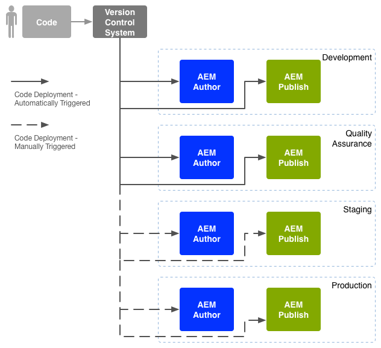
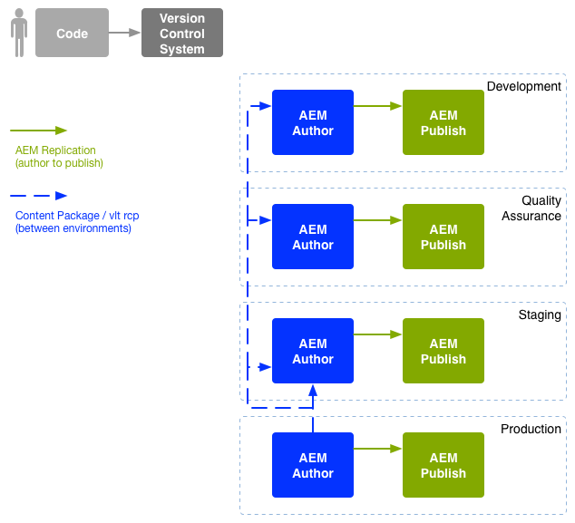

# Enterprise DevOps{#enterprise-devops}

DevOps covers the processes, methods, and communication required to:

* Ease the deployment of your software across the various environments.
* Simplify the collaboration between the development, testing, and deployment teams.

DevOps aims to avoid problems such as:

* Manual errors.
* Forgotten elements; for example, files, configuration details.
* Discrepancies; for example, between a developer's local environment and other environments.

## Environments {#environments}

An Adobe Experience Manager (AEM) deployment usually consists of multiple environments, used for different purposes on different levels:

* [Development](#development)
* [Quality Assurance](#quality-assurance)
* [Staging](#staging)
* [Production](#production-author-and-publish)

>[!NOTE]
>
>The production environment must have at least one author and one publish environment.
>
>It is recommended that all other environments also consist of an author and publish environment to reflect the production environment and enable early testing.

### Development {#development}

The developers are responsible for developing and customizing the proposed project (be it website, mobile applications, DAM implementation, and so on), with all the required functionality. They:

* develop and customize the necessary elements; for example, templates, components, workflows, applications
* realize the design
* develop the necessary services and scripts to implement the required functionality

The configuration of the [development](/help/sites-developing/best-practices.md) environment can depend on various factors, though it is comprised of:

* An integrated development system with version control to provide an integrated code-base. This is used to merge and consolidate code from the individual development environments used by each developer.
* A personal environment for each developer; usually resident on their local machine. At appropriate intervals the code is synchronized with the version control system

Depending on the scale of your system, the development environment can have both author and publish instances.

### Quality Assurance {#quality-assurance}

This environment is used by the quality assurance team to comprehensively [test](/help/sites-developing/test-plan.md) your new system; both design and function. It should have both author and publish environments, with suitable content, and provide all necessary services to enable a complete suite of tests.

### Staging {#staging}

The staging environment should be a mirror of the production environment - configuration, code, and content:

* It is used to test the scripts used to implement the actual deployment.
* It can be used for final tests (design, functionality, and interfaces) before deploying to the production environments.
* Although it is not always possible to have the staging environment identical to the production environment, it should be as close as possible to enable performance and load testing.

### Production - Author and Publish {#production-author-and-publish}

The production environment consists of the environments needed to actually [author and publish](/help/sites-authoring/author.md#concept-of-authoring-and-publishing) your implementation.

A production environment consists of at least one author instance and one publish instance:

* An [authoring](#author) instance for the input of content.
* A [publish](#publish) instance for content made available to your visitors/users.

Depending on the scale of the project, it often consists of several author instances, or several publish instances, or both. At a lower level, the repository may be clustered to several instances as well.

#### Author {#author}

Author instances are usually located behind the internal firewall. This is the environment where you, and your colleagues, will perform authoring tasks, such as:

* administrate the entire system
* input your content
* configure the layout and design of your content
* activate your content to the publish environment

Content that was activated is packaged and placed in the author environment's replication queue. The replication process then transports that content to the publish environment.

To reverse-replicate data generated in a publish environment back to the author environment, a replication listener in the author environment polls the publish environment and retrieve such content from the publish environment's reverse-replication outbox.

#### Publish {#publish}

A publish environment is in the Demilitarized Zone (DMZ). This is the environment where visitors access your content (for example, via a website or in the form of a mobile application) and interact with it; be it public, or within your intranet. A publish environment:

* holds content replicated from the author environment
* makes that content available to the visitors
* stores user data generated by your visitors, such as comments or other form submissions
* may be configured to add such user data to an outbox, for reverse-replication back to the author environment

The publish environment generates your content dynamically in real-time and the content can be personalized for each individual user.

## Code Movement {#code-movement}

Always propogate code from bottom to top:

* code is initially developed on the local and then integrated development environments
* followed by thorough testing on the QA environments
* then tested again on the staging environments
* only then should code be deployed to the production environments

The code (for example, customized web application functionality and design templates) is transferred by exporting and importing packages between the different content repositories. Where meaningful, this replication can be configured as an automatic process.

AEM Projects often trigger code deployment:

* Automatically: for transfer to the development and QA environments.
* Manually: deployments to the staging and production environments are done in a more controlled manner, often manual; though automation is possible, if necessary.

## Content Movement {#content-movement}

Content being created for production should **always** be authored on the production author instance.

Content should not follow code moving from lower environments to higher ones, as having authors create content on local machines or lower environments and then moving it to the production environment is not a good practice and likely to introduce errors and inconsistencies.

Production content should be moved from the production environment to the staging environment to ensure that the staging environment provides an efficient and accurate testing environment.

>[!NOTE]
>
>This does not mean that staging content must be continually synchronized with production, regular updates are sufficient, but especially before testing a new iteration of code. Content on the QA and development environments does not need to be updated as frequently, it should be a good representation of the production content.

Content can be transferred:

* Between the different environments - by exporting and importing packages.
* Between different instances - by directly replicating ([AEM replication](/help/sites-deploying/replication.md)), the content (using an HTTP, or HTTPS, connection).

