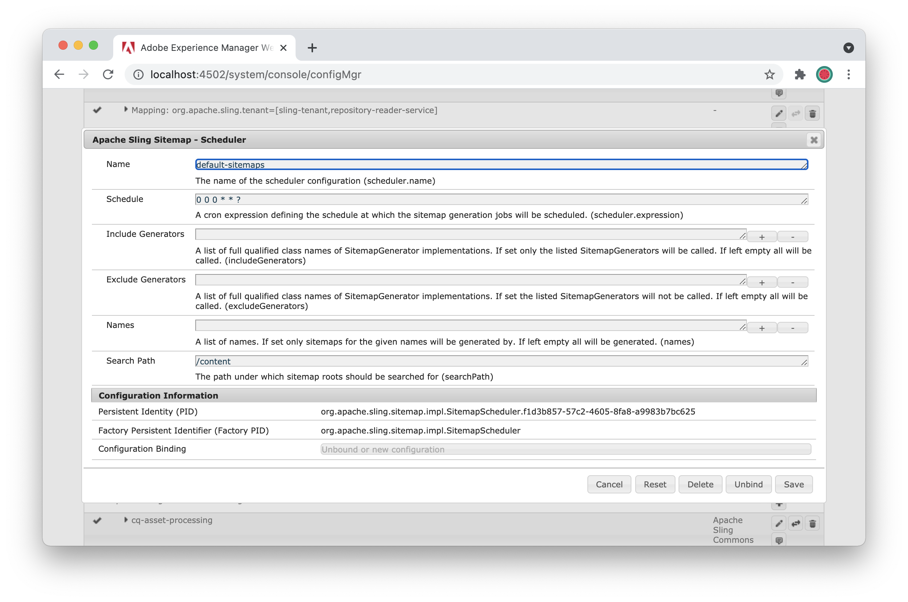
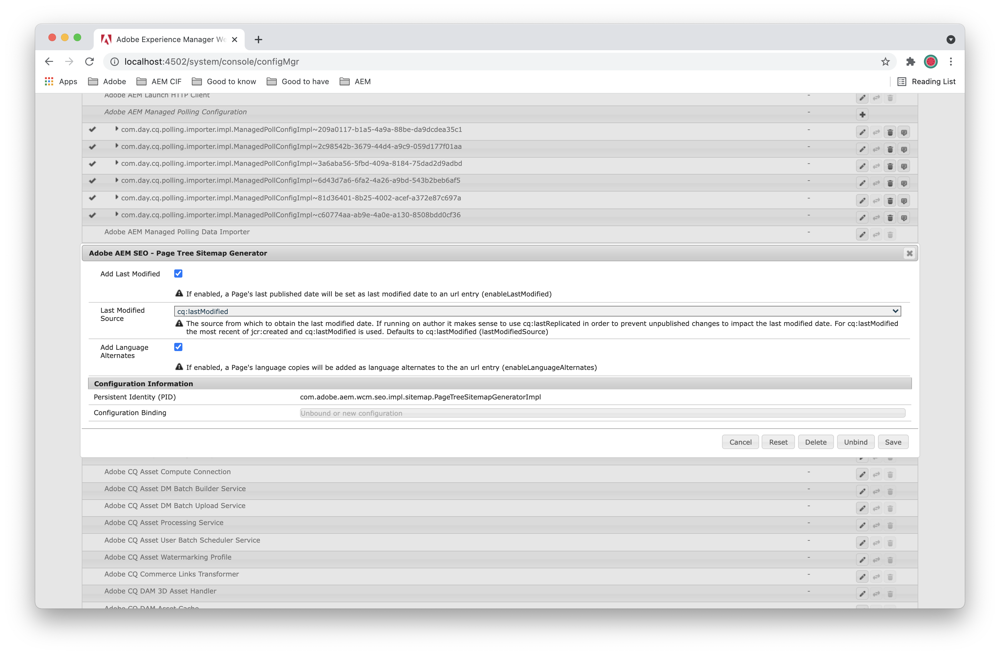

# SEO and URL Management Best Practices{#seo-and-url-management-best-practices}

SEO (Search Engine Optimization) has become a key concern for many marketers. As a result, SEO concerns must be addressed on many AEM Projects.

This document first describes some [SEO best practices](#seo-best-practices) and recommendations on an AEM implementation. Then, this document takes a deeper dive into some of the more [complex implementation steps](#aem-configurations) raised in the first section.

## SEO Best Practices {#seo-best-practices}

This section describes some general SEO best practices.

### URLs {#urls}

There are some accepted best practices with URLs.

In your AEM project, when evaluating your URLs, ask yourself the following:

"If a user saw this URL and none of the content on the page, could they describe this page?"

If the answer is yes, then it is likely that the URL works well for a search engine.

Here are some general tips on how to construct your URLs for SEO:

* Use hyphens to separate words.

    * Name pages using hyphens (-) as separators.
    * Avoid using camel case, underscores, and spaces.

* Avoid the use of query parameters when possible. When necessary, limit them to two or less.

    * Use the directory structure to indicate information architecture, when available.
    * If a directory structure is not an option, use Sling selectors in the URL rather than query strings. In addition to the SEO value that they provide, sling selectors also make pages cacheable for the Dispatcher.

* The more human-readable a URL is, the better. Having keywords present in the URL boosts value.

    * When using selectors on a page, selectors that provide semantic value are preferred.
    * If a human cannot read your URL, a search engine cannot either.
    * For example:
      `mybrand.com/products/product-detail.product-category.product-name.html`
      is preferred to `mybrand.com/products/product-detail.1234.html`

* Avoid subdomains whenever possible, because search engines treat them as different entities, fragmenting the SEO value of the site.

    * Instead use first-level sub paths. For example, instead of `es.mybrand.com/home.html`, use `www.mybrand.com/es/home.html`.

    * Plan your content hierarchy to match the way that the content is presented, according to this guideline.

* Keyword effectiveness in URLs decreases as the length of the URL and the position of the keyword increases. In other words, shorter is better.

    * Use URL shortening techniques and features provided by AEM to remove unnecessary URL pieces.
    * For example, `mybrand.com/en/myPage.html` is preferred to `mybrand.com/content/my-brand/en/myPage.html`.

* Use canonical URLs.

    * When a URL can be served from different paths or with different parameters or selectors, make sure to use a `rel=canonical` tag on the page.

    * Include canonical URLs in the code for the AEM template.

* Match URLs to page titles whenever possible.

    * Content authors should be encouraged to follow this practice.

* Support case insensitivity in URL requests.

    * Configure the Dispatcher to rewrite all inbound requests as lowercase letters.
    * Train content authors to create all pages using lowercase letters.

* Make sure that each page is only served from one protocol.

    * Sometimes sites will be served over `http` until a user reaches a page with, for example, a checkout or login form, at which point it switches to `https`. When linking from this page, if the user can return to `http` pages and access them through `https`, the search engine tracks them as two separate pages.

    * Google currently prefers `https` pages to `http` ones. They help to make everyone's life easier to serve the whole site over `https`.

### Server configuration {#server-configuration}

In terms of server configuration, you can take the following steps to ensure that only the correct content is being crawled:

* Use a `robots.txt` file to block crawling of any content that should not be indexed.

    * Block **all** crawling on test environments.

* When launching a new site with updated URLs, implement 301 redirects to ensure that your existing SEO ranking is not lost.
* Include a favicon for your site.
* To make it easier for search engines to crawl your content, implement an XML sitemap. Make sure to include a mobile sitemap for mobile and/or responsive sites.

## AEM Configurations {#aem-configurations}

This section describes the implementation steps to configure AEM with the following SEO recommendations.

### Using Sling selectors {#using-sling-selectors}

Previously, using query parameters was the accepted practice when building an enterprise web application.

The trend in recent years has been to remove parameters to make URLs more readable. On many platforms, this removal process involves implementing redirects on the web server or Content Delivery Network (CDN), but Sling makes process straightforward. Sling selectors:

* Improve URL readability.
* Let you cache your pages on the Dispatcher and improve security.
* Lets you address the content directly, rather than having a generic servlet that retrieves content. It grants you the benefits of ACLs that you apply to your repository and filters that you apply on the Dispatcher.

#### Using selectors for servlets {#using-selectors-for-servlets}

AEM provides us with two options when writing servlets:

* **bin** servlets
* **Sling** servlets

The following examples illustrate how to register servlets that follow both of these patterns and the benefit gained by using Sling servlets.

#### Bin servlets (one level down) {#bin-servlets-one-level-down}

**Bin** servlets follow the pattern that many developers are used to from J2EE programming. The servlet is registered at a specific path which, in AEM, is usually under `/bin`, and you extract the needed request parameters from the query string.

The SCR annotation for this type of servlet would look something like this:

```
@SlingServlet(paths = "/bin/myApp/myServlet", extensions = "json", methods = "GET")
```

You then extract the parameters from the query string via the `SlingHttpServletRequest` object that is included in the `doGet` method; for example:

```
String myParam = req.getParameter("myParam");

```

The resulting URL used would look something like this:

`https://www.mydomain.com/bin/myApp/myServlet.json?myParam=myValue`

There are a few points to be considered with this approach:

* The URL itself loses SEO value. Users accessing the site, including search engines, do not receive any semantic value from the URL, as the URL represents a programmatic path and not the content hierarchy.
* The presence of query parameters in the URL means that the Dispatcher cannot cache the response.
* If you want to secure this servlet, implement your own custom security logic in the servlet.
* The Dispatcher must be configured (carefully) to expose `/bin/myApp/myServlet`. Simply exposing `/bin` would allow access to certain servlets that should not be open to site visitors.

#### Sling servlets (one level down) {#sling-servlets-one-level-down}

**Sling** servlets let you register your servlet in the opposite manner. Rather than addressing a servlet and specifying the content you would like the servlet to render based on the query parameters, you address the content that you want. And you specify the servlet that should render the content based on Sling selectors.

The SCR annotation for this type of servlet would look something like this:

```
@SlingServlet(resourceTypes = "myBrand/components/pages/myPageType", selectors = "myRenderer", extensions = "json", methods="GET")

```

In this case, the resource that the URL addresses &ndash; an instance of the `myPageType` resource &ndash; is accessible in the servlet automatically. To access it, you call the following:

```
Resource myPage = req.getResource();
```

The resulting URL used would look something like this:

`https://www.mydomain.com/content/my-brand/my-page.myRenderer.json`

The benefits to this approach are:

* You can bake in the SEO value, gained by the semantics present in your site hierarchy and page name.
* Since no query parameters are present, the Dispatcher can cache the response. Also, any updates made to the addressed page invalidates this cache when the page is activated.
* All ACLs applied to `/content/my-brand/my-page` come into effect when a user tries to access this servlet.
* The Dispatcher is already configured to serve this content as a function of serving the website. No additional configuration is required.

### URL rewriting {#url-rewriting}

In AEM, all of your web pages are stored under `/content/my-brand/my-content`. While this location is useful from the perspective of repository data management, it is not necessarily how you want your customers to see your site. And, it may conflict with the SEO guidance to keep URLs as short as possible. Also, you may be serving multiple websites from the same AEM instance and from different domain names.

This section reviews the options available in AEM for managing these URLs and presenting them to users in a more readable and SEO-friendly manner.

#### Vanity URLs {#vanity-urls}

If an author wants a page to be accessible from a second location for promotional purposes, AEM's vanity URLs, defined on a page-by-page basis, might be useful. To add a vanity URL for a page, navigate to it in the **Sites** console and edit the page properties. At the bottom of the **Basic** tab, you see a section where vanity URLs can be added. Keep in mind that having the page accessible via more than one URL will fragment the SEO value of the page, so a canonical URL tag should be added to the page to avoid this issue.

#### Localized page names {#localized-page-names}

You may want to display localized page names to users of translated content. For example:

* Rather than having a Spanish-speaking user navigate to:
  `www.mydomain.com/es/home.html`

* It would be better for the URL to be:
  `www.mydomain.com/es/casa.html`.

The challenge with localizing the name of the page is that many of the localization tools available on the AEM platform rely on having the page names match across locales to keep the content synchronized.

The `sling:alias` property lets you have Adobe cake and eat it too. You can add `sling:alias` as a property to any resource to allow for an alias name for the resource. In the previous example, you would have the following:

* A page in the JCR at:
  `…/es/home`

* Then add a property to it:
  `sling:alias` = `casa`

This flow allows the AEM translation tools such as the multi-site manager to continue to maintain a relationship between:

* `/en/home`

* `/es/home`

While also allowing end users to interact with the page name in their native languages.

>[!NOTE]
>
>The `sling:alias` property can be set using the [Alias property when editing Page Properties](/help/sites-authoring/editing-page-properties.md#advanced).

#### /etc/map {#etc-map}

In a standard AEM installation:

* for the OSGi configuration
  **Apache Sling Resource Resolver Factory**
  ( `org.apache.sling.jcr.resource.internal.JcrResourceResolverFactoryImpl`)

* the property
  **Mapping Location** ( `resource.resolver.map.location`)

* defaults to `/etc/map`.

Mapping definitions can be added in this location to map inbound requests, rewrite URLs on pages in AEM, or both.

To create a mapping, create a `sling:Mapping` node in this location under `/http` or `/https`. Based on the `sling:match` and `sling:internalRedirect` properties that are set on this node, AEM will redirect all traffic for the matched URL to the value specified in the `internalRedirect` property.

While this approach is documented in the official AEM and Sling documentation, the regular expression support provided by this implementation is limited in scope when compared to the options that are available using the `SlingResourceResolver` directly. Also, implementing mappings in this way can lead to issues with Dispatcher cache invalidation.

Here is an example of how this issue occurs:

1. A user visits your website and requests `https://www.mydomain.com/my-page.html`
1. The Dispatcher forwards this request to the publish server.
1. Using `/etc/map`, the publish server resolves this request to `/content/my-brand/my-page` and renders the page.

1. The Dispatcher caches the response at `/my-page.html` and returns the response to the user.
1. A content author changes this page and activates it.
1. The Dispatcher flush agent sends an invalidation request for `/content/my-brand/my-page`**.** Because the Dispatcher does not have a page cached at this path, the old content remains cached and is stale.

There are ways to configure custom dispatch-flush rules that map the shorter URL to the longer URL for purposes of cache invalidation.

However, there is also a simpler way to manage this issue:

1. **SlingResourceResolver Rules**

   Using the web console (for example, localhost:4502/system/console/configMgr) you can configure the Sling Resource Resolver:

    * **Apache Sling Resource Resolver Factory**
      `(org.apache.sling.jcr.resource.internal.JcrResourceResolverFactoryImpl)`.

   Adobe recommends that you build out the mappings required to shorten URLs as regular expressions, then define these configurations under an OsgiConfignode, `config.publish` that is included in your build.

   Rather than defining your mappings in `/etc/map`, they can be assigned directly to the property **URL Mappings** ( `resource.resolver.mapping`):

   ```xml
   resource.resolver.mapping="[/content/my-brand/(.*)</$1]"
   ```

   In this simple example, you are removing `/content/my-brand/` from the beginning of any URL where it is present.

   It converts a URL:

    * from `/content/my-brand/my-page.html`
    * to just `/my-page.html`

   This conversion is in line with the recommended practice of keeping URLs as short as possible.

1. **Mapping URL Output on Pages**

   After you have defined your mappings in the Apache Sling Resource Resolver, use these mappings in your components to ensure that the URLs you output on your pages are short and tidy. You can accomplish this housekeeping by using the map function of the `ResourceResolver`.

   For example, if you were implementing a custom navigation component that lists out the children of the current page, you can use the mapping method like so:

   ```
   for (Page child : children) {
     String childUrl = resourceResolver.map(request, child.getPath());
     //Output the childUrl on the page here
   }

   ```

#### Apache HTTP Server mod_rewrite {#apache-http-server-mod-rewrite}

So far, you have implemented mappings together with the logic in your components to use these mappings when outputting URLs onto pages.

The final piece to the puzzle is handling these shortened URLs when they come in to the Dispatcher, which is where `mod_rewrite` comes into play. The biggest benefit to using `mod_rewrite` is that the URLs are mapped back to their long form *before* they are sent to the Dispatcher module. This flow means that the Dispatcher requests the long URL from the publish server and cache it accordingly. Therefore, any Dispatcher flush requests that come in from the publish server is able to successfully invalidate this content.

To implement these rules, you can add `RewriteRule` elements under your virtual host in the Apache HTTP Server configuration. If you want to expand the shortened URLs from the earlier example, you can implement a rule that looks like this:

```
<VirtualHost *:80>
  ServerName www.mydomain.com
  RewriteEngine on
  RewriteRule ^/(.*)$ /content/my-brand/$1 [PT,L]
  …
</VirtualHost>

```

### Canonical URL tags {#canonical-url-tags}

Canonical URL tags are link tags placed into the head of an HTML document to clarify how search engines should treat a page while indexing the content. The benefit they offer is to ensure that (different versions of) a page are indexed as the same even when the URL to the page may contain differences.

For example, if a site were to offer a printer-friendly version of a page, a search engine would potentially index this page separately from the regular version of the page. The canonical tag tells the search engine that they are the same.

Examples:

* `https://www.mydomain.com/my-brand/my-page.html`
* `https://www.mydomain.com/my-brand/my-page.print.html`

Both would apply the following tag to the head of the page:

```xml
<link rel="canonical" href="my-brand/my-page.html"/>

```

The `href` can be relative or absolute. The code should be included in the page markup to determine the canonical URL for the page and output this tag.

### Configuring the Dispatcher for case insensitivity {#configuring-the-dispatcher-for-case-insensitivity}

The best practice is to serve all pages using lowercase letters. However, you do not want a user to get a 404 when they access your website using uppercase letters in their URL. For this reason, Adobe recommends that you add a rewrite rule in the Apache HTTP Server configuration to map all incoming URLs to lowercase. Also, content authors must be trained to create their pages with lowercase names.

To configure Apache to force all inbound traffic to lowercase, add the following to the `vhost` config:

```xml
RewriteEngine On
RewriteMap lowercase int:tolower

```

Also, add the following to the top of the `htaccess` file:

```xml
RewriteCond $1 [A-Z]
RewriteRule ^(.*)$ /${lowercase:$1} [R=301,L]

```

### Implementing robots.txt to protect development environments {#implementing-robots-txt-to-protect-development-environments}

Search engines *should* check for the presence of a `robots.txt` file at your site root before crawling your site. While major search engines such as Google, Yahoo, or Bing all respect this file, some foreign search engines do not.

The simplest way to block access to your entire site is to place a file named `robots.txt` at the site root with the following content:

```xml
User-agent: *
Disallow: /
```

Alternately, on a live environment, you could choose to disallow certain paths that you do not want indexed.

The caveat with placing the `robots.txt` file at the site root is that Dispatcher flush requests may clear out this file. Also, URL mappings likely place the site root somewhere different from the `DOCROOT` as defined in the Apache HTTP Server configuration. For this reason, it is common to place this file on the author instance at the site root and replicate it to the publish instance.

### Building an XML sitemap on AEM {#building-an-xml-sitemap-on-aem}

Crawlers use XML sitemaps to better understand the structure of websites. While there is no guarantee that providing a sitemap leads to improved SEO rankings, it is an agreed-upon best practice. You can manually maintain an XML file on the web server to use as the sitemap. However, Adobe recommends that you generate the sitemap programmatically to ensure that as authors create content, the sitemap automatically reflects their changes.

AEM uses the [Apache Sling Sitemap module](https://github.com/apache/sling-org-apache-sling-sitemap) to generate XML sitemaps, which provides a wide range of options for developers and editors to keep a sites XML sitemap up to date. 

>[!NOTE]
>
>Available as product feature since Adobe Experience Manager Version 6.5.11.0.
> 
>For older versions, you can register a Sling Servlet yourself, to listen for a `sitemap.xml` call. Use the resource provided by way of the servlet API to look up the current page and its descendants to output a `sitemap.xml` file. 

The Apache Sling Sitemap module distinguishes between a top-level sitemap and a nested sitemap, both being generated for any resource that has the `sling:sitemapRoot` property set to `true`. In general, sitemaps are rendered using selectors at the path of the tree's top-level sitemap, which is the resource that has no other sitemap root ancestor. This top-level sitemap root also exposes the sitemap index, which normally is what a site owner would configure in the Search Engine's configuration portal or add to the site's `robots.txt`. 

For example, consider a site that defines a top-level sitemap root at `my-page` and a nested sitemap root at `my-page/news`, to generate a dedicated sitemap for pages in the news subtree. The resulting, relevant urls would be

* `https://www.mydomain.com/my-brand/my-page.sitemap-index.xml`
* `https://www.mydomain.com/my-brand/my-page.sitemap.xml`
* `https://www.mydomain.com/my-brand/my-page.sitemap.news-sitemap.html`

>[!NOTE]
>
>The selectors `sitemap` and `sitemap-index` may interfere with custom implementations. If you do not want to use the product feature, configure your own servlet serving these selectors with a `service.ranking` higher than 0. 

In the default configuration, the Page Properties Dialog provides an option to mark a Page as a sitemap root and so, as described above, generate a sitemap of itself and its descendants. This behavior is implemented by implementations of the `SitemapGenerator` interface and may be extended by adding alternative implementations. However, as the frequency on which to regenerate the XML sitemaps depends on the content authoring workflows and workloads, the product does not ship any `SitemapScheduler` configuration. As such, it makes the feature effectively opt-in. 

To enable the background job that generates the XML sitemaps a `SitemapScheduler` must be configured. To do so, create an OSGI configuration for the PID `org.apache.sling.sitemap.impl.SitemapScheduler`. The scheduler expression `0 0 0 * * ?` can be used as a starting point to regenerate all XML sitemaps once a day at midnight. 

 

The sitemap generation job can run on both author and publish tier instances. Usually, it is recommended to run the generation on publish tier instances, as proper canonical URLs can be generated only there (due to the Sling Resource Mapping rules commonly being present only on publish tier instances). However, it is possible to plug in a custom implementation of the externalization mechanism used to generate the canonical URLs by implementing the [SitemapLinkExternalizer](https://javadoc.io/doc/com.adobe.cq.wcm/com.adobe.aem.wcm.seo/latest/com/adobe/aem/wcm/seo/sitemap/externalizer/SitemapLinkExternalizer.html) interface. If a custom implementation is able to generate the canonical URLs of a sitemap on the author tier instances, the `SitemapScheduler` can be configured for the author run mode. And, the XML sitemap generation workload can be distributed across the instances of the author service cluster. In this scenario, caution must be spent on handling content that has not yet been published, has been modified, or is only visible to a restricted group of users. 

AEM Sites contains a default implementation of a `SitemapGenerator` that traverses a tree of pages to generate a sitemap. It is pre-configured to only output the canonical URLs of a site and any language alternatives if available. It can also be configured to include the last modified date of a page if needed. To do so, enable the _Add Last Modified_ option of the _Adobe AEM SEO - Page Tree Sitemap Generator_ Configuration and select a _Last Modified Source_. When the Sitemaps are generated on the publish tier, it is recommended to use the `cq:lastModified` date.



To limit the content of a sitemap, the following service interfaces can be implemented when needed:

* the [SitemapPageFilter](https://javadoc.io/doc/com.adobe.cq.wcm/com.adobe.aem.wcm.seo/latest/com/adobe/aem/wcm/seo/sitemap/SitemapPageFilter.html) can be implemented to hide pages from XML sitemaps generated by the AEM Sites specific sitemap generator
* a [SitemapProductFilter](https://javadoc.io/doc/com.adobe.commerce.cif/core-cif-components-core/latest/com/adobe/cq/commerce/core/components/services/sitemap/SitemapProductFilter.html) or [SitemapCategoryFilter](https://javadoc.io/doc/com.adobe.commerce.cif/core-cif-components-core/latest/com/adobe/cq/commerce/core/components/services/sitemap/SitemapCategoryFilter.html) can be implemented to filter out products or categories from XML sitemaps generated by the [Commerce Integration Frameworks](https://experienceleague.adobe.com/docs/experience-manager-cloud-service/content/content-and-commerce/home.html) specific sitemap generators

If the default implementations do not work on a particular use case, or if the extension points are not flexible enough, implement a custom `SitemapGenerator` to take full control of the content of a generated sitemap. The following example uses the default implementation's logic for AEM Sites. It uses the [ResourceTreeSitemapGenerator](https://javadoc.io/doc/org.apache.sling/org.apache.sling.sitemap/latest/org/apache/sling/sitemap/spi/generator/ResourceTreeSitemapGenerator.html) as a starting point to traverse a tree of pages:

```
import java.util.Optional;

import org.apache.sling.api.resource.Resource;
import org.apache.sling.sitemap.SitemapException;
import org.apache.sling.sitemap.builder.Sitemap;
import org.apache.sling.sitemap.builder.Url;
import org.apache.sling.sitemap.spi.common.SitemapLinkExternalizer;
import org.apache.sling.sitemap.spi.generator.ResourceTreeSitemapGenerator;
import org.apache.sling.sitemap.spi.generator.SitemapGenerator;
import org.jetbrains.annotations.NotNull;
import org.osgi.service.component.annotations.Component;
import org.osgi.service.component.annotations.Reference;
import org.slf4j.Logger;
import org.slf4j.LoggerFactory;

import com.adobe.aem.wcm.seo.sitemap.PageTreeSitemapGenerator;
import com.day.cq.wcm.api.Page;

@Component(
    service = SitemapGenerator.class,
    property = { "service.ranking:Integer=20" }
)
public class SitemapGeneratorImpl extends ResourceTreeSitemapGenerator {

    private static final Logger LOG = LoggerFactory.getLogger(SitemapGeneratorImpl.class);

    @Reference
    private SitemapLinkExternalizer externalizer;
    @Reference
    private PageTreeSitemapGenerator defaultGenerator;

    @Override
    protected void addResource(@NotNull String name, @NotNull Sitemap sitemap, Resource resource) throws SitemapException {
        Page page = resource.adaptTo(Page.class);
        if (page == null) {
            LOG.debug("Skipping resource at {}: not a page", resource.getPath());
            return;
        }
        String location = externalizer.externalize(resource);
        Url url = sitemap.addUrl(location + ".html");
        // add any additional content to the Url like lastmod, change frequency, etc
    }

    @Override
    protected final boolean shouldFollow(@NotNull Resource resource) {
        return super.shouldFollow(resource)
            && Optional.ofNullable(resource.adaptTo(Page.class)).map(this::shouldFollow).orElse(Boolean.TRUE);
    }

    private boolean shouldFollow(Page page) {
        // add additional conditions to stop traversing some pages
        return !defaultGenerator.isProtected(page);
    }

    @Override
    protected final boolean shouldInclude(@NotNull Resource resource) {
        return super.shouldInclude(resource)
            && Optional.ofNullable(resource.adaptTo(Page.class)).map(this::shouldInclude).orElse(Boolean.FALSE);
    }

    private boolean shouldInclude(Page page) {
        // add additional conditions to stop including some pages
        return defaultGenerator.isPublished(page)
            && !defaultGenerator.isNoIndex(page)
            && !defaultGenerator.isRedirect(page)
            && !defaultGenerator.isProtected(page);
    }
}
```

Furthermore, the functionality implemented for XML sitemaps can be used for different use cases as well, for example to add the canonical link or the language alternates to a page's head. See [SeoTags](https://javadoc.io/doc/com.adobe.cq.wcm/com.adobe.aem.wcm.seo/latest/com/adobe/aem/wcm/seo/SeoTags.html) interface for more information. 

### Creating 301 redirects for legacy URLs {#creating-redirects-for-legacy-urls}

When launching a site with a new structure, implementing and testing 301 redirects in Apache HTTP Server is important for two reasons:

* The legacy URLs have built up SEO value over time. By implementing a redirect, the search engine can apply this value to the new URL.
* Users of your site may have created bookmarks to these pages. By implementing redirects, you can be sure to direct the user to the page on the new site that most closely matches where they were trying to get on the old site.

Make sure to check the additional resources section that follows for instructions on implementing 301 redirects and a tool to test that your redirects are working as expected.

## Additional Resources {#additional-resources}

For more information, please see the following additional resources:

* [Resource Mapping](/help/sites-deploying/resource-mapping.md)
* [https://moz.com/blog/seo-cheat-sheet-anatomy-of-a-url](https://moz.com/blog/seo-cheat-sheet-anatomy-of-a-url)
* [https://moz.com/blog/15-seo-best-practices-for-structuring-urls](https://moz.com/blog/15-seo-best-practices-for-structuring-urls)
* [https://mysiteauditor.com/blog/top-10-most-important-seo-tips-for-url-optimization/](https://mysiteauditor.com/blog/top-10-most-important-seo-tips-for-url-optimization/)
* [https://sling.apache.org/documentation/the-sling-engine/servlets.html](https://sling.apache.org/documentation/the-sling-engine/servlets.html)
* [https://sling.apache.org/documentation/the-sling-engine/mappings-for-resource-resolution.html](https://sling.apache.org/documentation/the-sling-engine/mappings-for-resource-resolution.html)
* [https://httpd.apache.org/docs/current/mod/mod_rewrite.html](https://httpd.apache.org/docs/current/mod/mod_rewrite.html)
* [https://moz.com/blog/canonical-url-tag-the-most-important-advancement-in-seo-practices-since-sitemaps](https://moz.com/blog/canonical-url-tag-the-most-important-advancement-in-seo-practices-since-sitemaps)
* [https://www.robotstxt.org/robotstxt.html](https://www.robotstxt.org/robotstxt.html)
* [https://github.com/Adobe-Marketing-Cloud/tools/tree/master/dispatcher/redirectTester](https://github.com/Adobe-Marketing-Cloud/tools/tree/master/dispatcher/redirectTester)
* [https://adobe-consulting-services.github.io/](https://adobe-consulting-services.github.io/)
