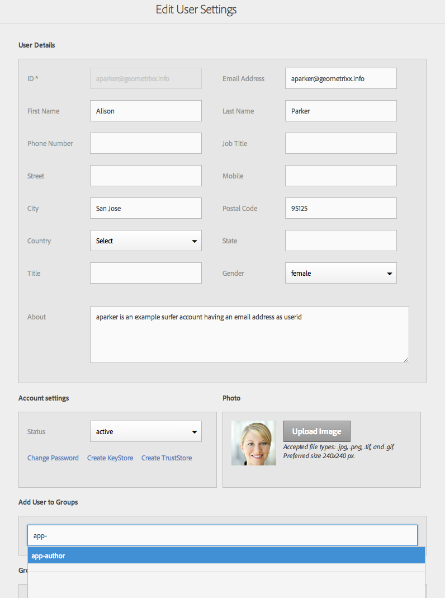

# Configure Your Users and User Groups {#configure-your-users-and-user-groups}

>[!NOTE]
>
>Adobe recommends using the SPA Editor for projects that require single page application framework-based client-side rendering (e.g. React). [Learn more](/help/sites-developing/spa-overview.md).

This chapter describes the user roles and how to configure your users and groups to support the authoring and management of your mobile apps.

## AEM Mobile Application Users and Group Administration {#aem-mobile-application-users-and-group-administration}

### AEM Mobile Application Content Authors (app-author group) {#aem-mobile-application-content-authors-app-author-group}

Members of the app-author group are responsible for authoring AEM mobile application content including, pages, text, images and videos.

#### Group configuration - app-authors {#group-configuration-app-authors}

1. Create a new user group called, 'app-authors':

   Navigate to the User Admin Console: [http://localhost:4502/libs/granite/security/content/groupadmin.html](http://localhost:4502/libs/granite/security/content/groupadmin.html)

   From within the user group console, select the '+' button to create a the group.

   Set the ID of this group to 'app-authors' to denote that it is a specific type of author user group specific to authoring mobile applications within AEM.

1. Add member to group: Authors

   

1. Now that you have created the app-authors User Group, you can add individual team members to this new group through the [User Admin console](http://localhost:4502/libs/granite/security/content/useradmin.md).

   

1. The following allows you to add to AEM's Content Authors Group:

   (Read) on

    * /app
    * /etc/clientlibs
    * /etc/designs
    * /etc/cloudservices/dps2015

### AEM Mobile Application Administrators Group (app-admins group) {#aem-mobile-application-administrators-group-app-admins-group}

Members of the app-admins group can author application content with the same permissions included with app-authors **AND** in addition are also responsible for:

* Staging, publishing and clearing application ContentSync OTA updates

>[!NOTE]
>
>Permissions determine availability of some user actions in the AEM App Command Center.
>
>You'll notice some options are not available for app-authors that are available for app-admins.

### Group configuration - app-admins {#group-configuration-app-admins}

1. Create a new group called app-admins.
1. Add the following groups to your new app-admins group:

    * content-authors
    * workflow-users

   

   >[!NOTE]
   >
   >workflow-users are required to remote build with PhoneGap Build service

1. Navigate to the [Permissions console](http://localhost:4502/useradmin) and add permissions to administer cloudservices

    * (Read, Modify, Create, Delete, Replicate) on /etc/cloudservices/mobileservices

1. On the same Permissions console, add permissions to stage, publish and clear app content updates;

    * (Read, Modify, Create, Delete, Replicate) on /etc/packages/mobileapp
    * (Read) on /var/contentsync

   >[!NOTE]
   >
   >Package replication is used to publish app updates from author instance to publish instance

   >[!CAUTION]
   >
   >/var/contentsync access is denied OOTB.
   >
   >Omitting the READ permission can result in empty update packages being built and replicated.

1. Add members to this group as needed
1. To Export Content or Upload

    * (Read) on /etc/contentsync to to access export templates
    * (Read) on /var to for path traversal on reads
    * (Read, Write, Modify, Delete) on /var/contentsync to write, read, and cleanup ContentSync cached export content

### Additional Resources {#additional-resources}

To understand more on the other two roles and responsibilities for creating an AEM Mobile On-Demand Services App, see the following resources:

* [Developing AEM Content for AEM Mobile On-Demand Services](/help/mobile/aem-mobile-on-demand.md)
* [Authoring AEM Content for AEM Mobile On-Demand Services App](/help/mobile/mobile-apps-ondemand.md)
