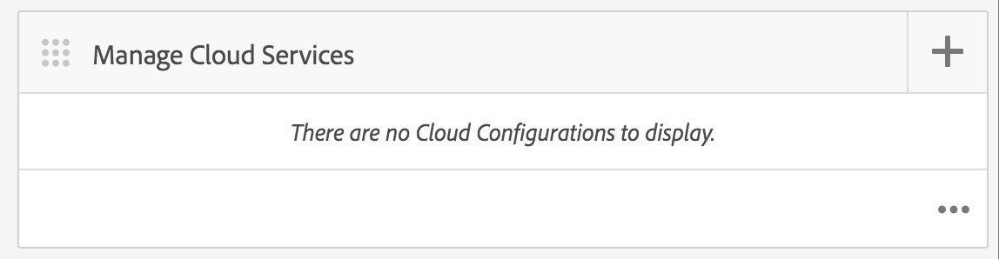
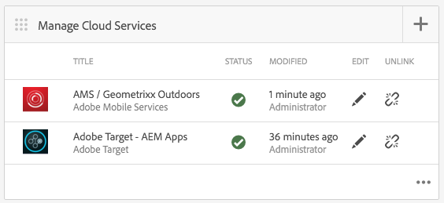

# Configuring Adobe Target Cloud Service {#configuring-adobe-target-cloud-service}

{{ue-over-mobile}}

>[!NOTE]
>
>This document is part of the [Getting Started with Adobe Experience Manager (AEM) Mobile](/help/mobile/getting-started-aem-mobile.md) Guide, a recommended starting point for AEM Mobile reference.

There are several steps that must come together before content authors can start to generate targeted content for mobile apps: There's getting the right set of permissions for users and groups, creating cloud services, configuring the application for the activity, and finally generating the content.

The assumption going forward is that the [AEM Mobile Hybrid Reference Application](https://github.com/Adobe-Marketing-Cloud-Apps/aem-mobile-hybrid-reference) has been successfully deployed and accessible by way of the AEM Mobile Dashboard.

## Permissions {#permissions}

Users that need access to the personalization console must be part of the `target-activity-authors` group. It is suggested that as part of the users and group setup that the target-activity-group should be added to the apps-admins group. By adding the target-activity-authors group, this allows users the ability to see the Personalization navigation menu entry.

Forgetting to add the users or groups that you want to have access to the personalization Admin Console to the target-activity-authors group prevents users from seeing the personalization console.

## Cloud Services {#cloud-services}

To get targeted content working for mobile applications, there are two services that must be configured: The Adobe Target Service and the Adobe Mobile Services service. The Adobe Target Service provides the engine for processing client requests and returning the personalized content. The Adobe Mobile Services service provides the connection between the Adobe services and the mobile application via the ADBMobileConfig.json file which is consumed by the AMS Cordova plugin. From the AEM Mobile Dashboard, you can configure your application by adding the two services.

## Adobe Target Cloud Service {#adobe-target-cloud-service}

From the AEM Mobile Dashboard, locate the Manage Cloud Services and click the + button.

From the Add Cloud Service wizard, select the "Adobe Target" cloud service card and click Next.

From the Select a Configuration drop-down, you can either create a configuration or select from an existing one. To create a configuration, select "Create Configuration" from the dropdown. Enter a title for the Target configuration. Enter your client code, email, and password that are associated with your Target account. If you do not know the values for these fields, contact the Adobe Target support. Click the "Verify" button to validate the credentials. Once verified, click the Submit button to create the cloud service.

The cloud service that gets created is automatically associated with the mobile application via the wizard. The cq:cloudserviceconfigs property value gets set on the jcr:content node of the apps group node. For the hybrid app sample it gets set on /content/mobileapps/hybrid-reference-app/jcr:content with the value pointing to the automatically generated framework node is at /etc/cloudservices/testandtarget/adobe-target---aem-apps/framework. The framework node has two properties set by default, gender and age. The framework is only used by AEM previewing and does not have any impact on the device.

After completion of the wizard, the Manage Cloud Service tile contains the Target cloud service, however it contains a warning about a missing Adobe Mobile Service account.

## Adobe Mobile Service {#adobe-mobile-service}

It is necessary to link an Adobe Mobile Services (AMS) account to the application as well, the AMS service provides the required ADBMobileConfig.json file which contains the Target client code information. Before creating an association with the AMS account, the AMS account must be modified by a user that has permissions to AMS.

### Client Code {#client-code}

To log in to the AMS services visit [https://mobilemarketing.adobe.com](https://mobilemarketing.adobe.com/), select the mobile application, and click the settings. Locate the SDK Target Options field and place the client code into the field and click Save.

Now that the client code has been associated with the mobile application, when the AMS cloud service is configured via the Adobe Mobile Dashboard the settings for the service settings will be delivered via the ADBMobileConfig.json file.

### Adobe Mobile Service Could Service {#adobe-mobile-service-could-service}

Now that AMS is configured, it is time to associate the mobile application in the Adobe Mobile Dashboard. From the AEM Mobile Dashboard, locate the Manage Cloud Services and click the + button.

Select the Adobe Mobile Services card and click Next.

From the Create or Select wizard step, select the Mobile Service drop-down, and select the Create Configuration entry. Provide a title, company, username, password, and select the appropriate data center. If you do not know these values, contact your Adobe Mobile Service administrator to obtain them. After all fields are filled out, click **Verify**. The verification process goes to AMS and verifies the credentials for the account, and upon successful validation, a list of Mobile Applications will be populated where you select the associated mobile application from the dropdown. Click the Submit button to complete the wizard. The process may take a bit of time to obtain the configuration data and any associated analytics with the application. After the process is complete, click **Done** from the modal to return back to the Adobe Mobile Dashboard.

Returning back to the Mobile Dashboard, the Manage Cloud Services tile contains the AMS cloud service. Also, the Analyze Metrics tile is populated with lifecycle reports.

## Target Content Sync Handlers {#target-content-sync-handlers}

To deliver content to the user's device, content is generated by rendering the offers which are created by AEM content authors. To handle the rendering of target offers, there is a new content sync handler that processes the offers. Using the Hybrid Reference Application as the sample, the en (english) content package contains the ContentSyncConfig with a [mobileappoffers](https://github.com/Adobe-Marketing-Cloud-Apps/aem-mobile-hybrid-reference/blob/master/aem-package/content-author/src/main/content/jcr_root/content/mobileapps/hybrid-reference-app/en/_jcr_content/pge-app/app-config-dev/targetOffers/.content.xml) handler. The next step is crucial for rendering offers to the device. The mobileappoffers handler has a path property that identifies the path to the personalization activity that is used for the application.

For example, if there is an activity at */content/campaigns/hybridref*, copy this path and paste it as the value to the *path* property of the mobileappoffers handler.

For the Hybrid Reference Application, there are two mobileappoffers handlers one for the dev and one for productions.

After the activities path is set in the mobileappoffers handler's path property, save the handler. The handler is now ready to start rendering offers for mobile devices.

### Render Mode {#render-mode}

The mobileappoffers handler is configured differently for publish and dev setups. For publish setups there is a property called *renderMode* with a value of *publish* set on the cq:ContentSyncConfig node. The mobileappoffers handler references the renderMode and, if set to publish, edits the mbox id that gets created. By default, mboxes that are created by AEM have an --author value appended to the mbox id. This identifies that the activity has not been published and should use the unpublished campaign for offer resolutions.

When content is staged via the Adobe Mobile Dashboard, staged content is considered production ready content and is rendered via the non-dev Content Sync Config. Rendering this way causes the --author to be removed from all mbox ids and expect a published activity to be available on the Target server. Before testing staged content, make sure that the activity is published.

## Creating Content {#creating-content}

Now that the cloud services have been created and the mobileappoffers handler has been configured, content authors can now start generating targeted experiences.
