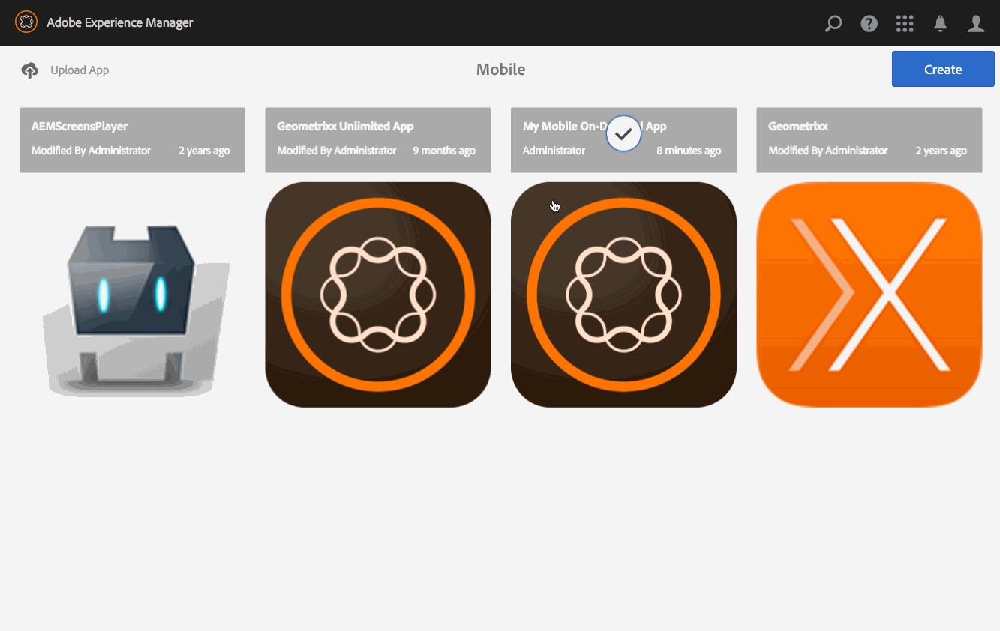

# Previewing with Preflight {#previewing-with-preflight}

This page explains Previewing with Preflight app.

>[!NOTE]
>
>Adobe recommends using the SPA Editor for projects that require single page application framework-based client-side rendering (e.g. React). [Learn more](/help/sites-developing/spa-overview.md).

The following actions are performed on the application as a whole.

With the Mobile On Demand Preflight app, you can view all projects to which you have access. Once you select a project, you can then preview the app contents, including browse pages and articles to get a sense of how the app looks and performs on various devices.

>[!NOTE]
>
>The Preflight app is similar to the PhoneGap Enterprise viewer in nature.

## Previewing with Preflight {#previewing-with-preflight-1}

1. From Mobile, choose your Mobile On-Demand app from the catalog.
1. Click the ellipsis (...) from the **Manage Articles** (or Banners/Collections) tile.
1. Select **Preflight** from the action bar.
1. Click **Activate Preflight** from the dialog.
1. You app will now be ready for preview on the Mobile On-Demand Preflight app.

>[!NOTE]
>
>The AEM Preflight app is used for previewing content and browse pages. To learn in-depth about Preflight App, click [here](https://helpx.adobe.com/digital-publishing-solution/help/aem-mobile-end-of-life-faq.html).
>

### Getting Ahead {#getting-ahead}

If you still need more information on authoring content, see the following resources to create and manage content in an AEM Mobile application:

* [AEM Mobile Application Dashboard](/help/mobile/mobile-apps-ondemand-application-dashboard.md)
* [Managing Content](/help/mobile/mobile-apps-ondemand-manage-content-ondemand.md)

## Additional Resources {#additional-resources}

To understand more on the other two roles and responsibilities for creating an AEM Mobile On-Demand Services App, see the following resources:

* [Developing AEM Content for AEM Mobile On-Demand Services](/help/mobile/aem-mobile-on-demand.md)
* [Authoring AEM Content for AEM Mobile On-Demand Services App](/help/mobile/mobile-apps-ondemand.md)
