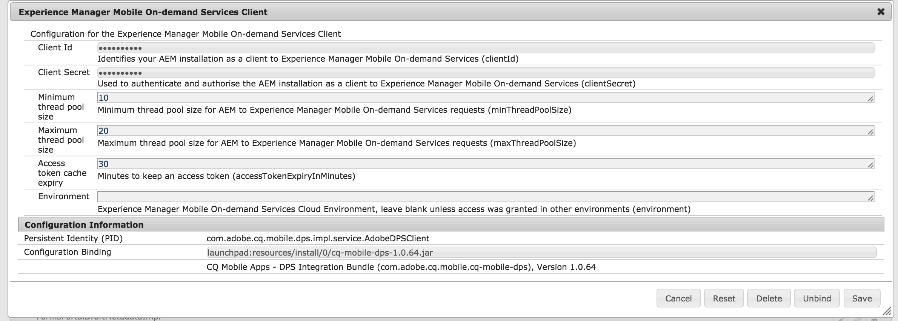

# AEM Mobile SetUp{#aem-mobile-setup}

>[!NOTE]
>
>Adobe recommends using the SPA Editor for projects that require single page application framework-based client-side rendering (e.g. React). [Learn more](/help/sites-developing/spa-overview.md).

>[!CAUTION]
>
>Existing AEM Mobile Apps customers migrating from AEM 6.2 or 6.3 to AEM 6.5 can continue to use AEM Mobile Apps by downloading a package from PackageShare. However, new installs of AEM 6.5 will not support AEM Mobile Apps functionality.

In order to use AEM to produce content for AEM Mobile apps, you must integrate the AEM instance with the cloud-based AEM Mobile On-Demand Services account and project(s).

Follow these steps for setting up AEM Mobile and thus allowing the user to create and manage the content within AEM.

## AEM Mobile Provisioning {#aem-mobile-provisioning}

To get started with AEM Mobile set up, you need to:

* **Request an API key**: To access the On-Demand Services API, you need to request an API key. To request the API key, complete the [PDF form](https://helpx.adobe.com/digital-publishing-solution/help/aem-mobile-end-of-life-faq.html). Send the completed form to Adobe Developer Support: [wwds@adobe.com](mailto:wwds@adobe.com)

* **Generate the Device ID and Device Token**: Once you have received your API key, you can generate the device id and device token. Go to `https://aex.aemmobile.adobe.com` and do the following:

  * Provide the API Key
  * Login with an Adobe ID that you have added to an AEM Mobile project with following permissions (see below steps to create project)

    * Administration &gt; Manage Projects and Users
    * Content &gt; Add & Edit Content, Delete Content, View Content, Publish Content

If all conditions are met, a Device ID and Device Token will be generated.

>[!NOTE]
>
>The Adobe ID needed should be granted access on a AEM Mobile Project. See [Account Administration for AEM Mobile](https://helpx.adobe.com/digital-publishing-solution/help/aem-mobile-end-of-life-faq.html) in Online Help.

## Creating Projects for AEM Mobile {#creating-projects-for-aem-mobile}

When you create a project, you specify settings for any platform you're targeting: iOS, Android, Windows, and Desktop Web Viewer. Many of the project settings you specify affect the behavior of the app.

Creating a project requires signing in to the On-Demand Services portal using an Adobe ID that has a Master Admin role. Editing a project requires either a Master Admin role or a user role with a **Manage Projects and Users** permission.

>[!NOTE]
>
>To learn more about Creating Projects in AEM Mobile, click [here](https://helpx.adobe.com/digital-publishing-solution/help/creating-projects.html).

## Configuring an AEM Mobile Connector {#configuring-an-aem-mobile-connector}

AEM set up involves the following steps for connector configuration. Once the AEM Mobile connector configuration is complete, the user can set up user groups and permissions.

The AEM Mobile On-Demand connector is used to bind AEM Mobile managed content with Adobe Experience Manager Mobile's On-Demand services. This enables content authors to create and manage material for mobile applications using AEM's tools while using AEM Mobile's On-Demand services for easy distribution of mobile content.

>[!NOTE]
>
>This is a one time step to setup the AEM instance.

### Configuring AEM Mobile On-Demand Services Client {#configuring-aem-mobile-on-demand-services-client}

You must complete the configuration steps in order for the AEM Mobile integrations to function correctly.

1. Go to OSGI service configuration

    1. AEM &gt; Tools &gt; Operations &gt; Web Console
    1. Scroll or search for ***Experience Manager Mobile On-demand Services Client (was Adobe Digital Publishing Solution Client)***

1. Edit ***Experience Manager Mobile On-demand Services Client***

    1. **(Mandatory)** Enter required fields:

        1. Client ID.
        1. Client Secret.

    1. **(Optional)** Edit existing values.

1. Save the changes.
1. Here is an example configuration:

### Configuring AEM Mobile On-Demand Services CloudService {#configuring-aem-mobile-on-demand-services-cloudservice}

1. Go to Cloud Services

    1. AEM &gt; Tools &gt; Deployment&gt; [CloudServices](http://localhost:4502/libs/cq/core/content/tools/cloudservices.html). Scroll or search for ***Adobe Experience Manager Mobile On-demand Services***

1. Select ***Configure now*** or ***Show Configurations*** and select the add new configuration icon

1. Create a new configuration

    1. Enter a Title and Name
    1. Enter Device Id
    1. Enter Device Token
    1. Select ***Test Device Configuration*** to validate entered values
    1. Select Ok

## Adding AEM Mobile User Roles and Assigning Permissions {#adding-aem-mobile-user-roles-and-assigning-permissions}

After creating a project you should create roles and grant access to users. Only Master Admins can create and edit roles. When you create a role, you enable capabilities (or permissions) for whichever users are assigned those permissions. For example, you can create one role that includes permissions for app building and another role that includes permissions for creating and publishing content.

In AEM Mobile app development, three different roles exist:

* Administrator
* Developer
* Author

For more information on creating roles with different permissions such as for app building or for creating and publishing content, click [Creating User Roles and Granting Access](https://helpx.adobe.com/digital-publishing-solution/help/account-admin-dps.html) in AEM Mobile Help.

>[!NOTE]
>
>Managing app content requires a collective effort from developers, content authors and administrators. Authors manipulate pages, which are in turn based on templates and components generated by app developers. Finally, administrators strategically publish the updated app content. Setting up AEM Groups and Permissions defines their roles in the app Dashboard or Control Center.
>
>For more information on AEM Mobile Dashboard, click [here](/help/mobile/mobile-apps-ondemand-application-dashboard.md).

Once you are done creating roles with different permissions such as for app building or for creating and publishing content, see [**Configure your User and User Groups**](/help/mobile/aem-mobile-configure-users.md) to configure your users and groups to support the authoring and mangement of your mobile apps.

### Additional Resources {#additional-resources}

To understand more on the other two roles and responsibilities for creating an AEM Mobile On-Demand Services App, see the following resources:

* [Developing AEM Content for AEM Mobile On-Demand Services](/help/mobile/aem-mobile-on-demand.md)
* [Authoring AEM Content for AEM Mobile On-Demand Services App](/help/mobile/mobile-apps-ondemand.md)

>[!NOTE]
>
>To preview the app contents, including browse pages and articles, see [Previewing with Preflight](/help/mobile/aem-mobile-manage-ondemand-services.md).
