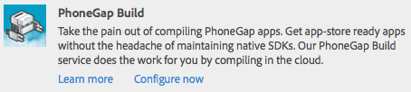

# Building Mobile Applications{#building-mobile-applications}

>[!NOTE]
>
>Adobe recommends using the SPA Editor for projects that require single page application framework-based client-side rendering (for example, React). [Learn more](/help/sites-developing/spa-overview.md).

Build your application to install to a device or simulator for testing or for publishing to app stores. You can build applications locally using the PhoneGap Command Line Interface, or in the cloud using PhoneGap Build.

A complete step-by-step article on how to build a mobile application using code available from GitHub is available [here](https://helpx.adobe.com/experience-manager/using/aem62_mobile.html).

## Moving the Application to the Publish Instance {#moving-the-application-to-the-publish-instance}

Move application files to the publish instance so that you can provide content updates to the installed instances of the mobile application, and to build the application using the published content. Applications consist of two node branches in the repository:

* `/content/phonegap/apps/<application name>`: The web pages that authors create and activate.
* `/content/phonegap/content/<application name>`: Application configuration files and Content Sync configurations.

>[!NOTE]
>
>If you do not move the application files to the publish instance, content authors cannot update the Content Sync cache.

You only need to move the files in the `/content/phonegap/content/<application name>` branch to the publish instance. The files in the `/content/phonegap/apps/<application name>` branch are moved when the author activates the pages.

AEM provides two methods for moving bulk content to the publish instance:

* [Use the Activate Tree command](/help/sites-authoring/publishing-pages.md) on the replication console.
* [Create a package](/help/sites-administering/package-manager.md) that contains the content and replicate the package.

For example, a mobile application named phonegapapp is created. The following node must be moved to the publish instance: /content/phonegap/content/phonegapapp.

**Tip:** To move a package from the author instance to the publish instance, use the Replicate command on the package.


## Building Using the PhoneGap Command Line Interface {#building-using-the-phonegap-command-line-interface}

Compile the PhoneGap application on your computer using the PhoneGap Command-line Interface (CLI). To include the AEM content into your application, AEM creates a ZIP file that contains the content of your mobile application, Content Sync configurations, and other required assets. Download the ZIP file and include it in your build.

### Preparing Your Build Environment {#preparing-your-build-environment}

To build using the PhoneGap CLI, you need to install Node.js and the PhoneGap client utility. You require an internet connection to perform the following procedure.

1. Download and install [Node.js](https://nodejs.org/en).
1. Open a terminal or command prompt and enter the following node command to install the PhoneGap utility:

   ```shell
   npm install -g phonegap
   ```

   On a UNIX&reg; or Linux&reg; system, you may need to prefix the command with `sudo`.

   The terminal shows the results of a series of HTTP GET commands. When the installation is successful, the terminal shows where the libraries are installed similar to the following example:

   ```xml
   /usr/local/bin/phonegap -> /usr/local/lib/node_modules/phonegap/bin/phonegap.js
   phonegap@3.3.0-0.19.6 /usr/local/lib/node_modules/phonegap
   ├── pluralize@0.0.4
   ├── colors@0.6.0-1
   ├── semver@1.1.0
   ├── qrcode-terminal@0.9.4
   ├── shelljs@0.1.4
   ├── optimist@0.6.0 (...)
   ├── prompt@0.2.11 (...)
   ├── phonegap-build@0.8.4 (...)
   ├── connect-phonegap@0.8.1 (...)
   └── cordova@3.3.0-0.1.1 (...)
   ```

1. (Optional) Obtain the SDK for the mobile platform that you are targeting:

    * To build apps for the iOS platform, install the latest version of [Xcode](https://developer.apple.com/xcode/).
    * To build Android&trade; apps, install the [Android&trade; SDK](https://developer.android.com/).

### Downloading the Content ZIP File {#downloading-the-content-zip-file}

Move the content of your mobile application to your file system.

1. On the Mobile Applications page, select your application.
1. (Optional) To build the application for complete installations, on the toolbar, click Clear Cache icon.

   

   >[!NOTE]
   >
   >The cache holds content updates for installed applications. Clearing the cache voids all cached updates.

1. On the toolbar, click or tap the Download CLI Assets icon.

   

1. After you have saved the ZIP file, click Close on the Success dialog.
1. Extract the contents of the ZIP file.

### Using the PhoneGap CLI to Build {#using-the-phonegap-cli-to-build}

Use the PhoneGap CLI to compile and install the application. For information about how to use the PhoneGap CLI, see the PhoneGap Command-line Interface (`https://docs.phonegap.com/en/3.0.0/guide_cli_index.md.html`) documentation.

1. Open a terminal or command prompt and change the current directory to the downloaded application ZIP file. For example, the following changes the directory to the ng-app-cli.1392137825303.zip file:

   ```shell
   cd ~/Downloads/ng-app-cli.1392137825303
   ```

1. Enter the phonegap command for the platform that you are targeting. For example, the following command builds the app for Android&trade;:

   ```shell
   phonegap build android
   ```

## Building Using PhoneGap Build {#building-using-phonegap-build}

Use the PhoneGap cloud service to build your app. To perform this procedure, you must first create a PhoneGap Build configuration.

### Connecting to PhoneGap Build {#connecting-to-phonegap-build}

Create a PhoneGap Build configuration so that you can use the PhoneGap Build services from within AEM. Provide the user name and password of the PhoneGap Build account that you will use to build your mobile applications.

1. Open the Tools page. ([http://localhost:4502/tools.html](http://localhost:4502/tools.html)).
1. In the CQ Operations area, click Cloud Services.
1. Click the Configure Now link for PhoneGap Build.

   

1. In the Create Configuration dialog box, type a value for the Title property. By default, the value of the Name property is derived from the title, however you can enter a name. Click Create.
1. In the PhoneGap Build Configuration dialog, type your PhoneGap Build user name and password, and then click OK.

### Using PhoneGap Build {#using-phonegap-build}

Send your application resources to PhoneGap Build for compiling for the various mobile platforms.

1. On the Mobile Applications page, open your mobile application. ([http://localhost:4502/mobile.html/content/phonegap](http://localhost:4502/mobile.html/content/phonegap))
1. (Optional) To build the application for complete installations, select the application and click the Clear Cache icon.

   

   >[!NOTE]
   >
   >The cache holds content updates for installed applications. Clearing the cache voids all cached updates.

1. Select the splash page, and then click the Build Remote icon.

   

   **Note:** The Beta version of AEM Beta does not create an Inbox notification when the build successfuly completes.

1. In the Success dialog box, click PhoneGap Build to open the Adobe PhoneGap Build page at `https://build.phonegap.com/apps`. If you are waiting for your app to appear, you can check the PhoneGap Build Status at `https://status.build.phonegap.com/`.

   For information about installing the build, see the [PhoneGap Build Documentation](https://github.com/phonegap/phonegap-docs/tree/master/docs/4-phonegap-build).

   >[!NOTE]
   >
   >Free PhoneGap Build accounts are allowed one private application. PhoneGap builds fail if you are building an additional private application.

### The Next Steps {#the-next-steps}

The next step after the building process is learning about the [Structure of an app](/help/mobile/phonegap-structure-an-app.md).
