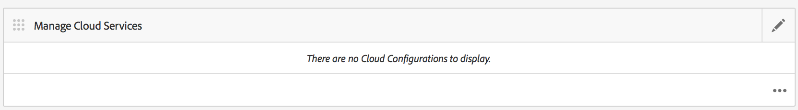
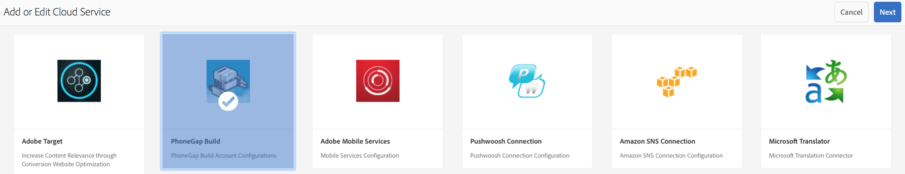
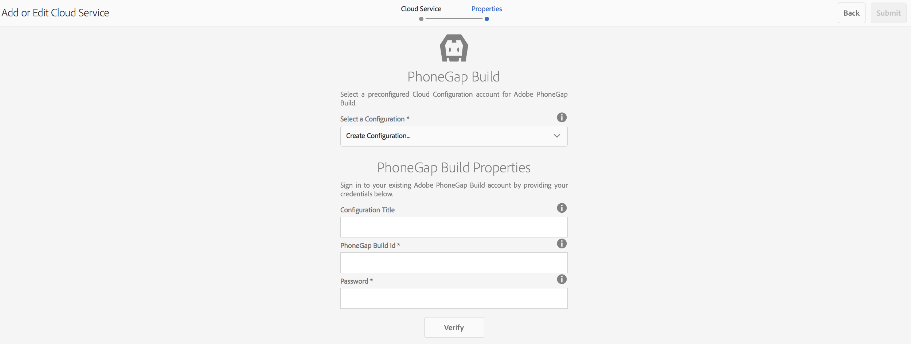
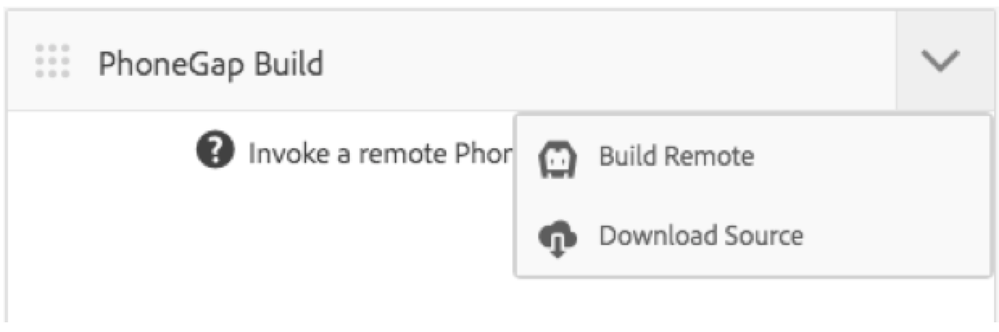

# Configure your Adobe PhoneGap Build Cloud Service {#configure-your-adobe-phonegap-build-cloud-service}

{{ue-over-mobile}}

The **PhoneGap Build Tile** on the application dashboard lets you build and distribute your PhoneGap mobile application through the Adobe PhoneGap Build Service.

All supported platforms defined within the **Manage App** tile are built with PhoneGap Build when pushing a remote build with the **PhoneGap Build** Tile.

You can push a remote build to `https://build.phonegap.com` or download the source to build locally with PhoneGap CLI at `https://docs.phonegap.com/references/phonegap-cli/`.


## Configuring the Cloud Service {#configuring-the-cloud-service}

To take advantage of PhoneGap Build, you must configure the AEM PhoneGap Build Cloud Service with your PhoneGap Build account information.

If you do not currently have an account, navigate to `https://build.phonegap.com` and sign up! If you have an Adobe Creative Cloud membership, you may have support for up to 25 private apps (non-open source apps).

Once you have verified your PhoneGap Build account is active, navigate to your AEM Cloud Management Console, specifically the [PhoneGap Build Cloud Service](http://localhost:4502/etc/cloudservices/phonegap-build.html) (http://localhost:4502/etc/cloudservices/phonegap-build.html).

Use the **Manage Cloud Services** tile to configure a new cloud service configuration.

### Using Manage Cloud Services tile {#using-manage-cloud-services-tile}

Before starting to build your app using **PhoneGap Build** tile, you must configure your cloud services, using the **Manage Cloud Services** tile from the AEM Mobile dashboard.

To configure cloud services for your app, follow the steps below:

1. Click the top-right corner of the **Manage Cloud Services** tile.

   

1. Choose **PhoneGap Build** option from the **Add or Edit Cloud Service** screen.

   Click **Next**.

   

1. Enter your credentials so you can create a cloud configuration.

   Once it is verified, click **Submit**. This configured cloud configuration now displays in the **Manage Cloud Services** tile.

   

### Building your Application with PhoneGap Build {#building-your-application-with-phonegap-build}

Once you have configured the cloud services, you can build your application with **PhoneGap Build** tile. Click the top-right corner so you can choose from the **Build Remote** or **Download Source** options.



To invoke a remote build with Adobe PhoneGap Build, click **Build Remote**.

>[!NOTE]
>
>If the build fails for any reason (red iOS icon below indicates that platform failed), you can hover over the icon to get the error message. Alternatively, you can click the triple dot, '...' at the bottom of the tile to navigate directly to `https://build.phonegap.com` (you must authenticate) and watch and manage your build directly.

### Building your application with PhoneGap CLI {#building-your-application-with-phonegap-cli}

PhoneGap provides a command-line interface to build your application locally.

Compile the PhoneGap application on your computer using the PhoneGap Command-Line Interface (CLI). To include the AEM content into your application, AEM creates a ZIP file that contains the content of your mobile application, Content Sync configurations, and other required assets. Download the ZIP file and include it in your build.

To take advantage of PhoneGap's CLI, you must set up your local environment to include:

1. Platform SDK (iOS, Android&trade;, WindowsPhone, ...) and,
1. PhoneGap CLI

You can read more here at `https://docs.phonegap.com/references/phonegap-cli/`.

Once you have installed the pre-requisites, give it a simple test by creating a simple app and getting it running either in your simulator or better yet on your device, from a terminal try:

```xml
phonegap create myApp
cd myApp
phonegap run ios (or android, ...)
```

>[!NOTE]
>
>Add --emulate at the end of this line if you do not want to run it on your connected device.

Once you have verified that the above works, use the **PhoneGap Build** Tile to **Download Source**. Save and unzip the file onto your local system. Once that is done:

* navigate to that saved file (folder)
* run 'phonegap run ios' (or android, and so on)

### Additional Resources {#additional-resources}

To learn about the roles and responsibilities of an Author and Developer, see the resources below:

* [Developing for Adobe PhoneGap Enterprise with AEM](/help/mobile/developing-in-phonegap.md)
* [Authoring for Adobe PhoneGap Enterprise in AEM](/help/mobile/phonegap.md)
