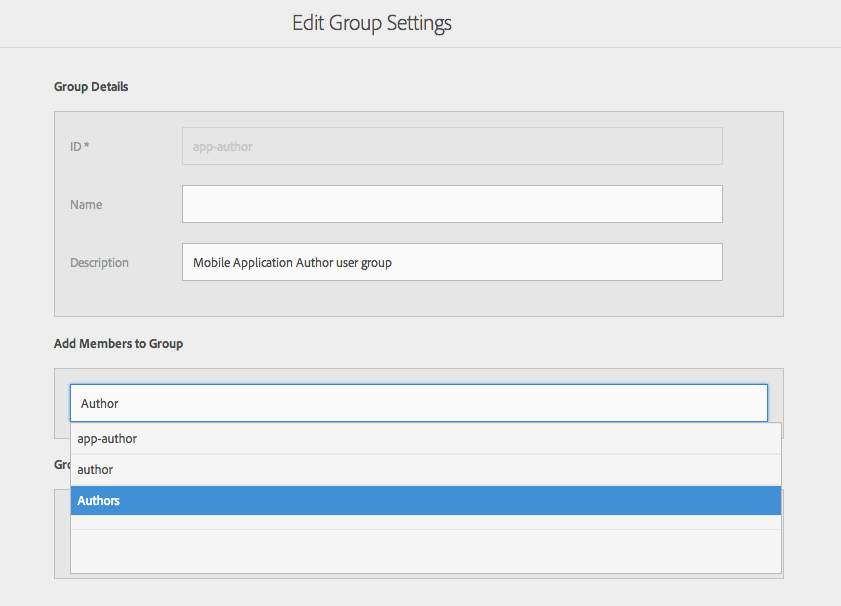
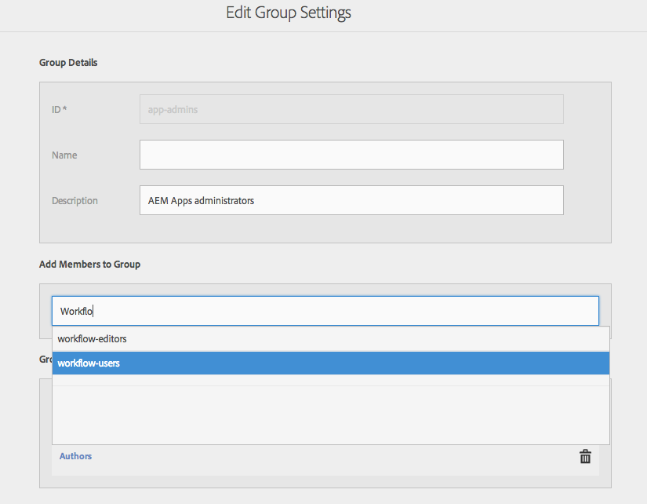
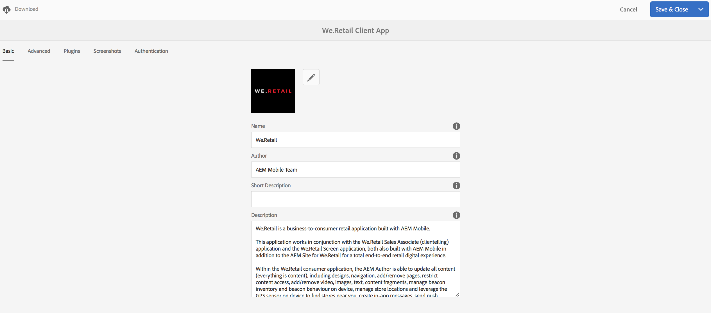

# Configure Your Users and User Groups {#configure-your-users-and-user-groups}

>[!NOTE]
>
>Adobe recommends using the SPA Editor for projects that require single page application framework-based client-side rendering (e.g. React). [Learn more](/help/sites-developing/spa-overview.md).

This chapter describes the user roles and how to configure your users and groups to support the authoring and mangement of your mobile apps.

## AEM Mobile Application Users and Group Administration {#aem-mobile-application-users-and-group-administration}

To help organize and manage the permission model for AEM Apps, the following two groups are available:

* app-admins for App Admins
* app-authors for App Authors

### AEM Mobile Application Content Authors (app-author group) {#aem-mobile-application-content-authors-app-author-group}

Members of the app-author group are responsible for authoring AEM mobile application content including, pages, text, images and videos.

#### Group configuration - app-authors {#group-configuration-app-authors}

1. Create a new user group called, 'app-authors':

   Navigate to the User Admin Console: [http://localhost:4502/libs/granite/security/content/groupadmin.html](http://localhost:4502/libs/granite/security/content/groupadmin.html)

   From within the user group console, select the '+' button to create a the group.

   Set the ID of this group to 'app-authors' to denote that it is a specific type of author user group specific to authoring mobile applications within AEM.

1. Add member to group: Authors

   

   Add app-authors to the Authors group

1. Now that you have created the app-authors User Group, you can add individual team members to this new group through the [User Admin console](http://localhost:4502/libs/granite/security/content/useradmin.md).

   

   Edit user groups

1. Navigate to the [Permissions console](http://localhost:4502/useradmin) and add permissions to administer cloudservices

    * (Read) on /etc/cloudservices

   >[!NOTE]
   >
   >App Authors extends the default content-authors (Authors) group from AEM thereby inheriting the ability to create content under /content/phonegap

### AEM Mobile Application Administrators Group (app-admins group) {#aem-mobile-application-administrators-group-app-admins-group}

Members of the app-admins group can author application content with the same permissions included with app-authors **AND** in addition are also responsible for:

* Configuring PhoneGap Build and Adobe Mobile Services cloud services in AEM
* Staging, publishing and clearing application Content Sync OTA updates

>[!NOTE]
>
>Permissions determine availability of some user actions in the AEM App Command Center.
>
>You'll notice some options are not available for app-authors that are available for app-admins.

#### Group configuration - app-admins {#group-configuration-app-admins}

1. Create a new group called app-admins.
1. Add the following groups to your new app-admins group:

    * content-authors
    * workflow-users

   

1. Navigate to the [Permissions console](http://localhost:4502/useradmin) and add permissions to administer cloudservices

    * (Read, Modify, Create, Delete, Replicate) on /etc/cloudservices/mobileservices
    * (Read, Modify, Create, Delete, Replicate) on /etc/cloudservices/phonegap-build

1. On the same Permissions console, add permissions to stage, publish and clear app content updates

    * (Read, Modify, Create, Delete, Replicate) on /etc/packages/mobileapp
    * (Read) on /var/contentsync

   >[!NOTE]
   >
   >Package replication is used to publish app updates from author instance to publish instance

   >[!CAUTION]
   >
   >/var/contentsync access is denied OOTB.
   >
   >Omitting the READ permission can result in empty update packages being built and replicated.

1. Add members to this group as needed

## Dashboard Tile Permissions {#dashboard-tile-permissions}

Dashboard tiles may expose different actions based on the permissions that the user has. The following describes what actions are available for each tile.

In addition to these permissions, an action can also be shown/hidden based on how the current app is configured. For example, there is no point exposing the 'Remote Build' action, if a PhoneGap cloud configuration has not been assigned to the app. These will be listed below under '**Configuration Condition**' sections.

### Manage App Tile {#manage-app-tile}

The tile currently has no actions that require permissions, however the details page for the application has the following actions:

* *Edit* for app-author and app-admin (UI Trigger - jcr:write - on /content/phonegap/{suffix})
* *Download* for app-author and app-admin (UI Trigger - on /content/phonegap/{suffix})

The image below shows the Download and Edit options for an app:

