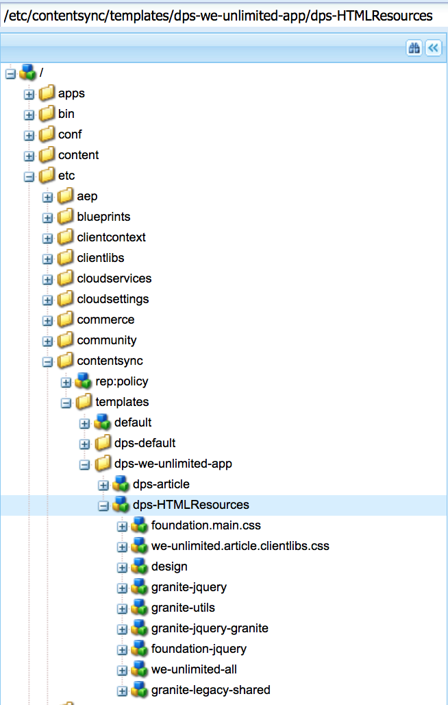

# Creating Shared Resources Export Configuration{#creating-shared-resources-export-configuration}

{{ue-over-mobile}}

>[!CAUTION]
>
>**Prerequisite**:
>
>Before learning about creating and modifying shared resources, see [Content Sync](/help/mobile/mobile-ondemand-contentsync.md) to understand the basic concepts.

Adobe Experience Manager (AEM) Mobile users use Content Sync to export live content to static content for use in Mobile Apps and this export occurs when content is uploaded to Mobile On-Demand Services from AEM Mobile.

The property ***dps-exportTemplate*** mentioned in table above, defines the path to the app's export configs. Set this property to create and modify shared resources.

The following resources describe exporting shared resources from AEM for upload to AEM Mobile.

Shared HTML Resources let articles share HTML resources that would otherwise be duplicated for all articles, and can include icons, fonts, JavaScript, and css.

The Content Sync configuration found at **&lt;dps-exportTemplate&gt;/dps-HTMLResources&gt;** should be configured to export all the content an article required for property static rendering on device.

>[!CAUTION]
>
>You can perform the steps below to view sample shared resources, only if you have:
>
>* installed the sample content
>* running AEM instance
>* no configured custom context or a different port
>

To view sample shared resource, see the steps below:

1. Open CRXDE Lite on your AEM server.
1. Browse to this path *[/etc/contentsync/templates/dps-we-unlimited-app/dps-HTMLResources](http://localhost:4502/crx/de/index.jsp#/etc/contentsync/templates/dps-we-unlimited-app/dps-HTMLResources)*, to view the sample shared resources.

   You can view all the properties required for creating your shared resources as shown in the figure below:

   

>[!NOTE]
>
>Shared resources should be uploaded or exported to AEM Mobile On-Demand Services when any of the shared resources change.
