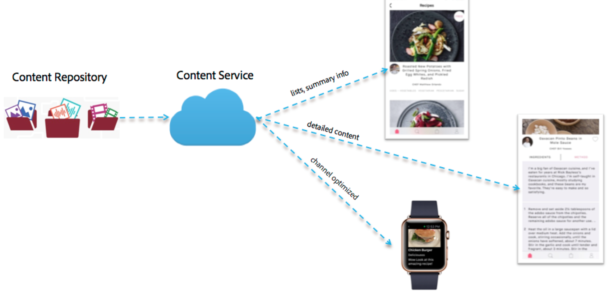
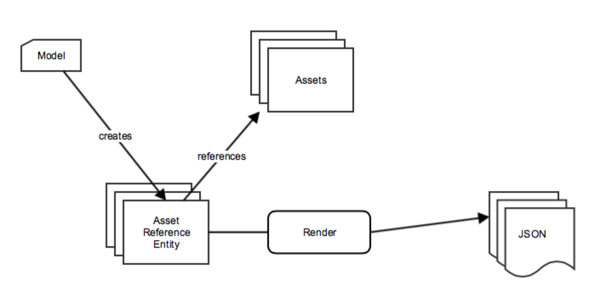
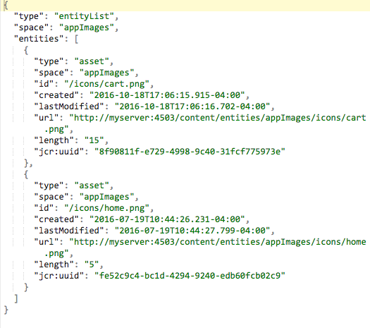
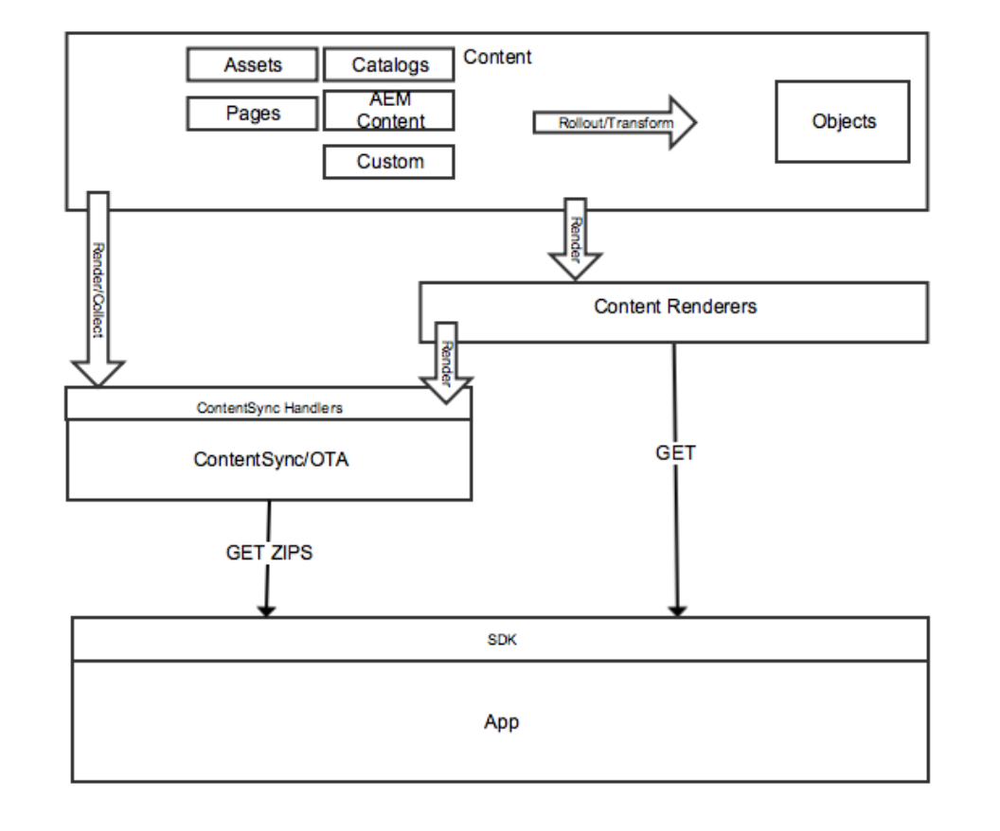

# Content Delivery{#content-delivery}

{{ue-over-mobile}}

Mobile Apps should be able to use all content in AEM as needed to deliver the targeted app experience.

This includes using assets, site content, CaaS content (over-the-air) content, and custom content that may have its own structure.

>[!NOTE]
>
>**Over-the-Air Content** can come from any of the above by way of ContentSync handlers. It can be used to batch package and delivery by way of zips and maintain updates or those packages.

There are three main types of material that Content Services deliver:

1. **Assets**
1. **Packaged HTML content (HTML/CSS/JS)**
1. **Channel independent content**

## Assets {#assets}

Asset collections are AEM constructs that contain references to other collections.

An Asset collection can be exposed through Content Services. Calling an asset collection in a request returns an object that is a list of the assets - including their URLs. Assets are accessed via a URL. The URL is provided in an object. For example:

* A page entity returns the JSON (page object) that includes an image reference. The image reference is a URL that is used to get the asset binary for the image.
* A request for a list of assets in a folder returns the JSON with details about all the entities in that folder. That list is an object. The JSON has URL references that are use to get the asset binary for each asset in that folder.

### Asset Optimization {#asset-optimization}

A key value of Content Services is the ability to return assets that are optimized for the device. This reduces local device storage needs and improves app performance.

Asset optimization is a server-side function, based on information supplied in the API request. Wherever possible, the asset renditions should be cached so similar requests do not require regeneration of the asset rendition.

### Assets Workflow {#assets-workflow}

The asset workflow is as follows:

1. Asset Reference available in AEM out-of-the-box
1. Create an Asset Reference Entity given its model
1. Edit entity

    1. Pick an asset or asset collection
    1. Customize JSON rendering

The following diagram shows the **Assets Reference Workflow**:

### Managing Assets {#managing-assets}

Content Services provide access to AEM-managed assets that may not be referenced through other AEM content.

#### Existing Managed Assets {#existing-managed-assets}

A user of AEM Sites and Assets is using AEM Assets to manage all of their digital material for all channels. They are developing a native mobile app and must use several assets that are managed by AEM Assets. For example, logos, background images, and button icons.

Currently these are spread around the Assets repository. The files that the app must reference are in the following:

* /content/dam/geometrixx-outdoors/brand/logo_light.png
* /content/dam/geometrixx-outdoors/brand/logo_dark.png
* /content/dam/geometrixx-outdoors/styles/backgrounds/grey_blue.jpg
* /content/dam/geometrixx-outdoors/brand/icons/app/cart.png
* /content/dam/geometrixx-outdoors/brand/icons/app/home.png

#### Accessing CS Asset Entities {#accessing-cs-asset-entities}

Let's put aside the steps of how the page is made available through the API for now (it is covered by the AEM UI description) and assume it has been done. Asset entities have been created and added to the "appImages" space. Additional folders were created under the space for organization purposes. So the asset entities are stored in the AEM JCR as:

* /content/entities/appImages/logos/logo_light
* /content/entities/appImages/logos/logo_dark
* /content/entities/appImages/bkgnd/grey_blue
* /content/entities/appImages/icons/cart
* /content/entities/appImages/icons/home

#### Getting a list of available asset entities {#getting-a-list-of-available-asset-entities}

An app developer can get a list of what assets are available, by retrieving the asset entities. The Content Services space endpoint can provide that information through the web service API SDK.

The result would be an object in a JSON format that would provide a list of the assets in the "icons" folder.

#### Getting an Image {#getting-an-image}

The JSON provides a URL for each image generated by Content Services to the image.

To get the binary for the "cart" image, the client library is used once again.

## Packaged HTML Content {#packaged-html-content}

HTML content is needed for customers that must maintain the layout of content. This is useful for native applications that are using a web container - such as a Cordova webview - to display the content.

AEM Content Services provides HTML content to the mobile app by way of the API. Customers wanting to expose AEM content as HTML can create an HTML page entity that points to the AEM content source.

The following options are considered:

* **Zip file:** To have the best chance at displaying properly on the device, the page's referenced material&ndash;css, JavaScript, assets, and so on&ndash;are included in a single compressed file with the response. The references in the HTML page can be adjusted to use a relative path to these files.
* **Streaming:** Getting a manifest of the required files from AEM. Then use that manifest to request all the files (HTML, CSS, JS, and so on) with subsequent requests.

## Channel Independent Content {#channel-independent-content}

Channel independent content is a way of exposing AEM content constructs - such as pages - without worrying about layout, components, or other channel-specific information.

These content entities are generated using a content model to translate the AEM structures into a JSON format. Resulting JSON data contains information about the content's data that is decoupled from the AEM repository. This includes returning metadata and AEM reference links to assets and the relationships between content structures - including entity hierarchy.

### Managing Channel Independent Content {#managing-channel-independent-content}

Content can get to the app in several ways.

1. GET content ZIPS by way of AEM Over-the-Air

    * Content Sync handlers can update the zip package directly or by calling existing content renderers

        * Platform Handlers
        * AEM Handlers
        * Custom Handlers

1. GET content directly by way of content renderers

    * Out-of-the-box Default Sling Renderers
    * AEM Mobile/Content Services Content Renderers
    * Custom Renders
