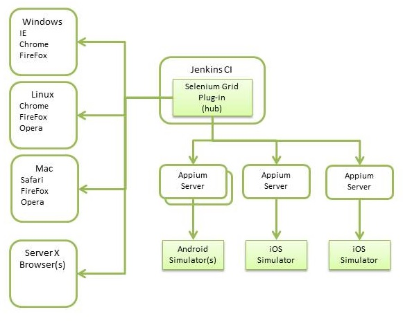

# Testing Mobile Apps{#testing-mobile-apps}

>[!NOTE]
>
>Adobe recommends using the SPA Editor for projects that require single page application framework-based client-side rendering (e.g. React). [Learn more](/help/sites-developing/spa-overview.md).

Given the wide range of devices on the market and devices being released, testing your Apps has become extremely important. This is an area where functionality and usability may garner low reviews on an app store, but a single defect can result in your app being uninstalled. Careful attention has to be made in your testing plans and quality assurance. The following link covers many of the topics that need to be addressed in general, such as, identify your environment, define test cases, types of testing, assumptions, customer involvement, etc. Also discussed are tools to help in the testing effort. Internal tools, like [Hobbes](/help/sites-developing/hobbes.md), can help with web-based UI testing. [Tough Day](/help/sites-developing/tough-day.md) can stress your instances with a simulated load. If your testing environment already has experience with 3rd-party tools, like Selenium, these too can be used.

When developing a mobile app, there are many new concerns specific to devices that have to be addressed along with those of traditional testing.

* Functional - Are all requirements met by your app?
* Usability - Is the app easy to use and understand by your customer?
* Performance - What happens during a spike in usage? Are the app elements, like swipes and carousels, quick and don't detract away from the experience?
* Failure or Interrupts - What happens when there is an incoming call or notification while your app is running? What happens if there is a network outage or power off?
* Installation and Updates - How is the install experience? How are updates pushed out?
* Technical - Is your app consuming too much power from a device?
* Localization - Are all areas in your app translated?
* Certification - Has your app been certified? Can customers trust that it follows all data privacy legal requirements?

These questions should be answered during your automated and manual testing.

## Automated testing {#automated-testing}

Some degree of automated testing should be performed to cover the variety of screen sizes, memory constraints, input methods, and operating systems. Not only does it cover much of the test cases, but it can speed up regression testing when new features or devices are introduced. Ideally, your automation tools should reduce or limit duplication of effort. Use tools or frameworks so that your testing effort is applicable across all platforms. The following chart shows a simplified structure of a testing environment for both web-based UI testing and mobile app testing. The left side of the chart shows a series of Selenium nodes with browsers. SeleniumGrid can farm out common, web-based UI tests to any of these nodes. The Selenium hub can also connect to Appium for cross-platform app testing. Only shown are simulators, but you can incorporate adb, for Android, and Xcode utilities for iOS devices. Links are provided later in this document where you can find specific details for the tools mentioned.

## Manual testing {#manual-testing}

In addition to automated testing, your app should go through a cycle of manual testing. Customers running the app on a real device cannot be duplicated by a script. Here too, you have many options. You can use a platform, such as HockeyApp, to define who has access and gather feedback. Or, you can outsource the whole process to a service like UTest, ElusiveStars, or Testin. If you have a group of internal testers, but lack variation of devices, there are cloud services where you can perform manual testing on their pool of devices. One such service that provides this is SauceLabs. You can also build apps remotely to PhoneGap Enterprise and install on local devices as a level of acceptance testing or demoing. See the PhoneGap (`https://phonegap.com/`) website for their latest features and documentation. Whatever the approach, manual testing should;

* hit a large target of testers,
* test against a large pool of devices (ideally real devices, but simulators/emulators if real devices are not available),
* provide informative feedback:

  * crash reports,
  * analytics/tracking,
  * usability,
  * areas of attention,
  * performance,
  * data/power consumption, etc.

## Tools {#tools}

There is a wide range of tools available for testing mobile apps. The choice of ones to use will be based on your specific situation: features, price, support, coverage, etc. The following is just a small description of some of the tools and services available.

**Selenium**

* Framework that includes an API for test scripts to feed WebDriver and control various browsers.
* You can use this in conjunction with Appium for testing on real devices.
* SeleniumGrid directs tests across nodes for parallel testing.
* Selenium IDE help reduce test case writing.

For more information see [https://www.seleniumhq.org/](https://www.seleniumhq.org/).

**Testdroid**

* A cloud-based testing service with continuous integration hooks and real device testing.
* Includes an App Crawler that checks device compatibility, analyzes logs, traverses views, takes screenshots, and monitors performance.

For more information see [https://testdroid.com/](https://testdroid.com/).

**Appium**

* Appium is a popular cross platform framework for automating mobile tests.
* Additionally, an inspector is included with record abilities to help code test cases.

For more information see [https://appium.io/](https://appium.io/).

**SauceLabs**

* SauceLabs provides cloud-based testing and integrates with continuous integration.
* Tests run in their cloud environment automatically or you can start a particular device or platform and perform manual testing to help debug issues.

For more information see [https://saucelabs.com/](https://saucelabs.com/).

**AppTestNow**

* An outsourcing service that will test your mobile apps.
* Includes a large pool of devices and offer a wide range of types of testing: performance, quality, functional, certification, localization, data consumption, etc.

For more information see [https://www.apptestnow.com](https://www.apptestnow.com/).

**HockeyApp**

* HockeyApp falls under the manual testing where the mobile app is pushed out to a personal app store where testers can download and try it out.

For more information see [https://hockeyapp.net/features/](https://hockeyapp.net/features/).

**Jenkins**

* Although not a testing tool, Jenkins is a continuous integration framework providing the backbone for automated tests. Numerous 3rd-party plugins are available to extend functionality. One example, the SeleniumGrid plugin provides an UI to help manage the Selenium hub and nodes.

For more information see [https://jenkins-ci.org/](https://jenkins-ci.org/) and [https://wiki.jenkins-ci.org/display/JENKINS/Plugins](https://wiki.jenkins-ci.org/display/JENKINS/Plugins).
